# 🗣️ Language Development

> [!abstract] TL;DR
> Human children acquire language with remarkable speed and universality — babbling by 6 months, first words by 12 months, two-word sentences by 24 months, and near-adult grammar by 5 years. The process involves biological preparation (a sensitive period, specialized neural systems), environmental input (child-directed speech, joint attention), and active construction (overgeneralization as evidence of rule learning). The **critical period** for language is among the most consequential developmental windows, with the Genie case providing tragic natural evidence for its limits.

## Intuition — analogy FIRST

Language acquisition is like tuning in a radio station.

A newborn can detect and distinguish every sound (phoneme) in every human language — they are sensitive to the entire radio spectrum. By 12 months, they have "committed" to the frequencies of their native language — their perceptual system has tuned in to the relevant stations and is becoming less sensitive to others. This is why Japanese adults struggle to distinguish English /r/ and /l/ (similar in Japanese) while their 6-month-old Japanese selves could.

This narrowing isn't a loss — it's a feature. By specializing in the native language's phoneme set, the child gains tremendous processing efficiency for that language. But it means the window for acquiring a language as a native speaker narrows with age — and for the rarest sounds (certain clicks, tones), narrows earlier than others.

---

## How It Works

```mermaid
graph LR
    Birth["Birth\nAll phonemes distinguishable\nPrefers mother's voice\nResponsive to prosody"] --> Coo["0-6 months\nCooing\nResponsive to phonemes\nTurn-taking in 'conversations'"]
    Coo --> Bab["6-8 months\nCanonical babbling\n'ba-ba-ga-da'\nUniversal (including deaf infants)"]
    Bab --> Jarg["9-12 months\nJargon + native language\nphonemes reinforced\nWord comprehension begins"]
    Jarg --> Word["12 months\nFirst words\n(holophrases)\n'mama' 'up' 'ball'"]
    Word --> Two["18-24 months\nVocabulary explosion\nTwo-word stage\n'Daddy go' 'More milk'"]
    Two --> Sent["2-3 years\nMulti-word sentences\nOvergeneralization begins\n'I goed' 'My foots'"]
    Sent --> Gram["3-5 years\nComplex grammar\nQuestions, negatives\nConversational ability"]
    Gram --> Full["5-7 years\nNear-adult grammar\nMetalinguistic awareness"]

    style Birth fill:#6b7280,color:#fff
    style Word fill:#4a9eff,color:#fff
    style Two fill:#059669,color:#fff
    style Full fill:#7c3aed,color:#fff
```

## Key Concepts / Details

### Pre-Linguistic Communication

**Neonates**: prefer mother's voice (learned prenatally); show head-turning preference for native language melody; recognize stories read repeatedly in the womb.

**Joint attention** (by 9–12 months): infant and caregiver attend to the same object together; caregiver names it → word-object mapping begins. Joint attention predicts vocabulary size. Autism spectrum disorder involves joint attention deficits that contribute to language delay.

**Pointing**: **declarative pointing** (sharing attention: "Look!") emerges ~9–12 months. A uniquely human precursor to language that predicts vocabulary development. Chimpanzees don't point declaratively.

### Phonological Development

**Universal phoneme sensitivity**: young infants (0–6 months) can discriminate phoneme contrasts from any language. By 6–8 months: **perceptual narrowing** begins — sensitivity to native-language contrasts sharpens while sensitivity to non-native contrasts declines.

**Kuhl's "neural commitment" theory**: early auditory experience commits neural circuits to native language phoneme categories. Once committed, reorganization requires much greater input.

**Clinical implications**: children with ear infections (otitis media) during the phonological sensitive period show later speech perception difficulties — temporary hearing loss during a critical window has permanent effects.

### Semantic Development: Word Learning

**Fast mapping**: after one or two exposures, children can form a rough representation of a new word and its meaning. By 18 months, children add ~9 new words per day.

**Vocabulary explosion**: between 16–24 months, vocabulary rapidly accelerates (also called the naming explosion). Coincides with understanding that "everything has a name."

**Word learning constraints** (pragmatic principles children apply):
- **Whole object assumption**: new words apply to whole objects, not parts or properties
- **Mutual exclusivity**: assume objects have only one name — a second label must apply to a different object
- **Taxonomic constraint**: new words extend to other members of the same category, not thematically related objects

**Overextension**: applying a word too broadly ("dog" for all four-legged animals). Evidence of category learning.

**Underextension**: applying a word too narrowly ("bottle" only for own bottle). Both patterns reflect the child actively constructing word meanings.

### Syntactic Development (Grammar Acquisition)

**Two-word stage** (~18–24 months): "telegraphic speech" — content words without function words. Semantic relations already complex: "Daddy go" (agent + action), "More milk" (recurrence), "Allgone cookie" (disappearance).

**Overgeneralization** (~2.5–4 years): over-application of grammatical rules — "goed," "mouses," "mans." This is evidence of rule abstraction — children are not merely imitating but applying learned patterns. Interestingly, children often *regress* from a correct form ("went") to an overgeneralized form ("goed") as they learn the past-tense rule.

**U-shaped learning**: performance improves → declines (when rule learned and overapplied) → improves again (when exceptions memorized). A fingerprint of rule-based learning.

**Grammatical morphemes** (Brown, 1973): children acquire grammatical morphemes (progressive "-ing," plural "-s," past tense "-ed") in a consistent order across children — suggesting biological constraints on acquisition order.

### The Critical Period for Language

**Lenneberg's critical period hypothesis** (1967): there is a biologically determined window, ending around puberty, during which language acquisition is facilitated. After this period, native-like acquisition is rarely achieved.

**Evidence**:

| Evidence | Finding |
|---|---|
| **Genie** (discovered at 13; isolated since 20 months) | Developed vocabulary but never acquired grammar | Critical period for syntax missed |
| **Second language accent** | Near-native accent only if L2 acquisition begins before ~7 years | Phonological critical period earlier than syntax |
| **Cochlear implant timing** | Earlier implantation → better speech perception outcomes | Auditory critical period in infancy |
| **Late ASL learners** | ASL learned from birth → native competence; learned at 10 → non-native grammar | Critical period for signed language |

**The Genie case** (1970): Genie, discovered at 13 after extreme language deprivation, learned many words but never acquired normal syntax — supporting a critical period for grammar specifically.

**Sensitive vs. critical period**: modern view is "sensitive" rather than "critical" — there is a window of maximal ease and efficiency, not an absolute cutoff. Adults can learn languages; they simply rarely achieve native-like accent and grammar.

### Child-Directed Speech (Motherese/Parentese)

Across cultures, caregivers modify speech when addressing infants: **child-directed speech** (CDS) is higher-pitched, slower, more exaggerated intonation, simpler vocabulary, and more repetition.

CDS is not a cultural invention — it appears across all studied cultures. Its functions:
- Captures and holds infant attention
- Highlights prosodic boundaries (phrase structure)
- Simplifies the learning problem
- Facilitates phoneme discrimination

**Evidence**: amount of CDS predicts vocabulary size at 2 years (Hart & Risley, 1995). The "30 million word gap" between high- and low-SES children by age 3 predicts academic achievement throughout schooling.

## Real-World Notes

- **Bilingual development**: bilingual children develop both languages simultaneously, often showing initial mixing (code-switching) but by 3–4 years can separate them. Bilingualism does not cause language delay; apparent delays are artifacts of measuring only one language. Advantages: enhanced executive function, delayed dementia onset.
- **Reading development**: learning to read builds on phonological awareness (ability to hear and manipulate sounds in words). Phonemic awareness is the single strongest predictor of reading acquisition. Dyslexia involves phonological processing deficits, not visual reversals.
- **Language deprivation in education**: deaf children not exposed to accessible language (speech AND sign) before age 5 show permanent language and cognitive deficits — an argument for early sign language exposure regardless of oral/sign orientation.
- **Second language instruction**: grammar instruction in classroom L2 learning is most effective when combined with communicative input. Adults benefit more from explicit instruction than children, who rely more on implicit acquisition.

## Common Pitfalls

- **"Young children are language learning sponges, adults cannot really learn languages"** — adults can achieve functional fluency; the native-like accent is harder, but motivated adults acquire languages successfully. The critical period affects ease and specific outcomes, not possibility.
- **"Bilingualism confuses children"** — well-studied myth; bilingual children show normal or superior development. The concern conflates bilingual children's slightly smaller vocabulary per language with total vocabulary deficits (total vocabulary is equivalent or larger).

## Related Concepts

- [[_MOC_Developmental_Psychology|↑ Section MOC]]
- [[Language_and_Thought]] — Cognitive psychology of language; Sapir-Whorf; adult language processing
- [[Piagets_Cognitive_Development]] — Cognitive stage as context for language milestones; Piaget vs. Vygotsky on language's role
- [[Biological_Basis_of_Behavior]] — Broca's area, Wernicke's area, and the neural architecture of language
- [[Lifespan_Development]] — Language continues to develop through adolescence and adulthood

## Review Questions

1. A 2.5-year-old has recently started saying "goed" and "mouses" even though her parents never modeled these forms. Explain what this overgeneralization tells us about how grammar is acquired, and why it represents *progress* rather than regression.
2. Describe three pieces of evidence for a critical period in language acquisition, and explain what each piece specifically constrains (phonology, syntax, or both).
3. Hart and Risley found a "30 million word gap" between high- and low-SES children. What specific features of child-directed speech account for this gap's effect on vocabulary and later academic achievement?

## Sources

- Roger Brown, *A First Language* (1973)
- Lenneberg, E.H. (1967). *Biological Foundations of Language*
- Hart, B. & Risley, T.R. (1995). *Meaningful Differences in the Everyday Experience of Young American Children*
- Kuhl, P.K. et al. (2003). "Foreign-language experience in infancy." *PNAS*

#psychology #developmental-psychology #language-development #critical-period
