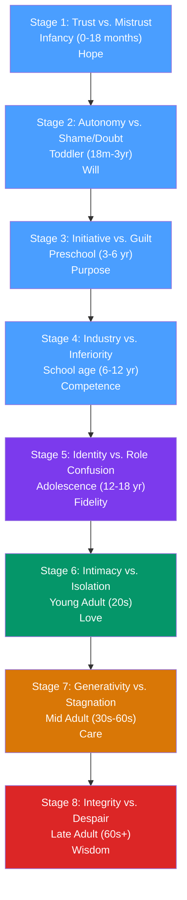

# 🌱 Lifespan Development

> [!abstract] TL;DR
> Lifespan developmental psychology examines change and stability from conception through death. Erik Erikson's eight psychosocial stages propose that each life phase presents a central **developmental crisis** whose resolution shapes psychological health. Adolescence brings the pivotal identity crisis; midlife involves generativity vs. stagnation; late adulthood requires integrating one's life into a coherent whole. Vygotsky, Bronfenbrenner's ecological systems theory, and resilience research round out the framework.

## Intuition — analogy FIRST

Think of lifespan development as a relay race with eight legs.

Each runner (developmental stage) carries a baton (the quality from successfully resolving the previous crisis) and faces their own terrain (unique challenges of that life period). Drop the baton or fail to navigate the terrain, and the next runner starts at a disadvantage — but recovery is possible at any stage with the right support.

A child who doesn't develop basic trust (Stage 1) begins the race with a heavier burden — but the race is long, and skilled coaching (therapists, secure partners, good institutions) can provide second chances. The race doesn't end at 18; Erikson's genius was recognizing that development continues through the 70s and beyond.

---

## How It Works — Erikson's Eight Stages

## Key Concepts / Details

### Erikson's Eight Psychosocial Stages

| Stage | Age | Conflict | Virtue | Positive Resolution |
|---|---|---|---|---|
| 1 | 0–18 months | Trust vs. Mistrust | Hope | Consistent caregiving → world is safe and predictable |
| 2 | 18m–3 years | Autonomy vs. Shame/Doubt | Will | Autonomy in toilet training, exploration → confidence in self-control |
| 3 | 3–6 years | Initiative vs. Guilt | Purpose | Encouraged exploration and play → capacity to take initiative |
| 4 | 6–12 years | Industry vs. Inferiority | Competence | Success in school/social tasks → belief in ability to achieve |
| 5 | 12–18 years | Identity vs. Role Confusion | Fidelity | Exploring roles → coherent sense of self and values |
| 6 | 20s | Intimacy vs. Isolation | Love | Secure identity → capacity for genuine intimate relationship |
| 7 | 30s–60s | Generativity vs. Stagnation | Care | Contributing to next generation → sense of purpose beyond self |
| 8 | 65+ | Integrity vs. Despair | Wisdom | Life review → acceptance of life as meaningful; facing death |

**Stage 5: Identity vs. Role Confusion** — Erikson's most influential contribution. James Marcia (1966) expanded it into four identity statuses:

| Status | Exploration | Commitment | Description |
|---|---|---|---|
| **Identity achievement** | Yes | Yes | Explored alternatives, made commitments |
| **Moratorium** | Yes (active) | No | Actively exploring, not yet committed |
| **Foreclosure** | No | Yes | Committed without exploration (parental values adopted wholesale) |
| **Identity diffusion** | No | No | No exploration, no commitment; disengaged |

Moratorium → identity achievement is the healthy sequence. Foreclosure avoids crisis but may produce brittle identity. Diffusion is associated with poor outcomes.

**Stage 7: Generativity vs. Stagnation** — contributing to society, next generation, or meaningful work vs. feeling useless and disconnected. Not only parenting — mentoring, creative work, community involvement all support generativity. Generativity predicts life satisfaction and psychological well-being in midlife (McAdams, de St. Aubin).

**Stage 8: Integrity vs. Despair** — reviewing one's life. Integrity emerges when you can look back and accept your life — including its mistakes and unlived possibilities — as having been meaningful. Despair arises when the life feels wasted or meaningless, and death looms.

### Bronfenbrenner's Ecological Systems Theory

Urie Bronfenbrenner emphasized that development occurs within nested social systems:

| System | Description | Examples |
|---|---|---|
| **Microsystem** | Immediate environment (direct interactions) | Family, classroom, peer group |
| **Mesosystem** | Connections between microsystems | Parent-teacher relationship |
| **Exosystem** | Indirect settings that affect the child | Parent's workplace, community resources |
| **Macrosystem** | Cultural values, laws, economic systems | Individualism vs. collectivism; poverty |
| **Chronosystem** | Change over time (historical events, life transitions) | 9/11 during adolescence; COVID during childhood |

Development cannot be understood without understanding the systems the person is embedded in — a child's behavior in school is shaped by everything from their breakfast (microsystem) to their parents' job security (exosystem) to cultural expectations about education (macrosystem).

### Temperament and Personality Development

**Thomas and Chess (1977)** identified temperament dimensions that appear in infancy and show moderate stability:
- **Easy** (~40%): regular, adapts easily, positive mood
- **Difficult** (~10%): irregular, slow to adapt, negative mood
- **Slow-to-warm-up** (~15%): low activity, slow adaptation, mild negativity
- ~35%: mixed/unclassified

Temperament × parenting = development. The **goodness of fit** between child temperament and parental response predicts outcomes — not temperament alone.

**The Big Five in development**: personality traits (OCEAN: Openness, Conscientiousness, Extraversion, Agreeableness, Neuroticism) show moderate heritability (~40–60%) and moderate stability from childhood into adulthood. Conscientiousness increases from adolescence to midlife; agreeableness and emotional stability increase into late adulthood.

### Adolescence

The period of biological (puberty), cognitive (formal operations), and social (identity formation) change:

- **Storm and stress** (Hall, 1904): adolescence as inherently tumultuous — overstated; most adolescents navigate this period without major psychological disruption
- **Risk taking**: prefrontal cortex matures into mid-20s; limbic system (emotional/reward) matures earlier → adolescent risk-taking reflects this temporal mismatch
- **Peer relationships**: socialization focus shifts from family to peers; peer conformity peaks around age 14–15

### Midlife and Late Adulthood

**"Midlife crisis"**: classic cultural narrative; empirical support is weak. Some experience significant reassessment around 40s; most do not experience a "crisis." Life satisfaction follows a U-shaped curve — high in youth, lower in middle age, rising again in late adulthood.

**Selective optimization with compensation (SOC)** (Baltes): successful aging involves:
- **Selection**: focus on fewer, more valued goals
- **Optimization**: invest more resources in chosen goals
- **Compensation**: use alternative means when primary strategies fail

**Socioemotional selectivity theory** (Carstensen): as people perceive less remaining time, they prioritize emotionally meaningful relationships over information-seeking. Older adults show a "positivity effect" — better recall of positive over negative information.

**Physical aging**: working memory capacity declines; processing speed declines; crystallized intelligence (knowledge and vocabulary) remains stable or increases. Brain shows neuroplasticity throughout life but new neuron generation (neurogenesis) is limited to hippocampus.

## Real-World Notes

- **Career development**: Erikson's Stage 7 (generativity) maps directly onto career meaning-making. Workers who find meaning in mentoring and contribution are more satisfied and productive. See [[Organizational_Psychology]].
- **Adolescent risk behavior**: the prefrontal-limbic temporal mismatch predicts why peer presence dramatically increases risk-taking in adolescents — social/emotional salience of peer approval engages limbic before prefrontal can modulate.
- **Retirement**: forced retirement can trigger integrity vs. despair crisis prematurely; active engagement, social roles, and meaningful activity predict successful late-life development.
- **Resilience**: multiple longitudinal studies (Kauai study, Werner & Smith) show that even severely disadvantaged children can show positive development given protective factors: one warm relationship, self-efficacy, cognitive ability, strong community.

## Common Pitfalls

- **Stage theories are rigid schedules** — Erikson's stages are not strict age-bound sequences; they represent themes that recur throughout life. The "identity crisis" doesn't end at 18; intimacy issues don't begin at 20.
- **"Development ends at adulthood"** — pre-Erikson and pre-Baltes psychology focused on childhood as the period of development. Lifespan developmental psychology shows change and growth continue through late life.
- **Overgeneralizing "midlife crisis"** — this is an empirically weak concept that applies to a minority. The cultural narrative has outpaced the evidence.

## Related Concepts

- [[_MOC_Developmental_Psychology|↑ Section MOC]]
- [[Attachment_Theory]] — Erikson's Stage 1 (trust vs. mistrust) is the psychosocial version of secure vs. insecure attachment
- [[Piagets_Cognitive_Development]] — Cognitive stages provide the cognitive infrastructure for psychosocial developments
- [[Moral_Development]] — Moral development continues through all of Erikson's stages
- [[Happiness_and_Wellbeing]] — Life satisfaction, generativity, and integrity map onto wellbeing research
- [[Organizational_Psychology]] — Career as a developmental arc; generativity in the workplace

## Review Questions

1. Describe Erikson's Stage 7 (Generativity vs. Stagnation) and explain how it differs from simply "having children." Give three examples of generativity that don't involve parenting.
2. Marcia identified four identity statuses. Which combination of exploration and commitment characterizes each status, and what does research say about the outcomes associated with each?
3. Using Baltes's SOC model, describe how a 75-year-old concert pianist might continue to maintain high performance despite physical and cognitive changes.

## Sources

- Erik Erikson, *Childhood and Society* (1950); *Identity: Youth and Crisis* (1968)
- Bronfenbrenner, U. (1979). *The Ecology of Human Development*
- Marcia, J.E. (1966). "Development and validation of ego-identity status." *JPSP*, 3(5), 551–558
- Baltes, P.B. & Baltes, M.M. (1990). "Psychological perspectives on successful aging." In *Successful Aging*

#psychology #developmental-psychology #lifespan #erikson #adult-development
