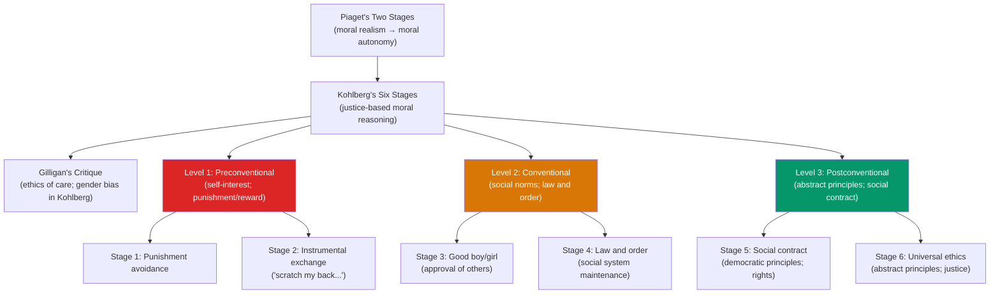

# ⚖️ Moral Development

> [!abstract] TL;DR
> Moral development describes how people come to understand right and wrong. Piaget identified a shift from heteronomous morality (rules are fixed and violations are judged by outcomes) to autonomous morality (rules are social contracts judged by intentions). Kohlberg proposed six stages across three levels based on moral reasoning about dilemmas. Gilligan's care-based critique expanded Kohlberg's justice orientation. Modern moral psychology (Haidt) suggests moral judgments are primarily intuitive — reasoning post-hoc justifies intuitions rather than driving them.

## Intuition — analogy FIRST

Consider three people asked whether it's wrong to steal.

**Person A (Kohlberg Level 1)**: "Yes — you'll get caught and punished." Morality is avoiding punishment and getting rewards. The wrongness is about consequences *to oneself*.

**Person B (Kohlberg Level 2)**: "Yes — rules say so, and good people follow rules. Society depends on them." Morality is about social order, roles, and convention.

**Person C (Kohlberg Level 3)**: "It depends. Stealing bread to feed a starving child seems morally different from stealing luxury goods for profit. What are the principles at stake?" Morality involves abstract principles that can override specific rules.

But **Haidt** would add: all three of these people probably already *felt* the answer in their gut before they reasoned it. The reasoning described above was post-hoc justification of a prior intuition, not the causal path to the judgment. The lawyer inside us defends the verdict; the judge isn't actually our reasoning faculty.

---

## How It Works

## Key Concepts / Details

### Piaget's Moral Development

Piaget (1932) observed children playing marbles and telling moral stories to identify two stages:

**Stage 1: Heteronomous Morality** ("Moral Realism") — ages ~4–7:
- Rules are fixed, sacred, and external (imposed by authorities)
- **Immanent justice**: punishment follows transgression automatically
- **Outcome-based judgment**: a child who broke 12 cups accidentally is "more naughty" than one who broke 1 cup on purpose
- Cannot take perpetrator's intentions into account

**Stage 2: Autonomous Morality** ("Moral Relativism") — ages ~8+:
- Rules are social agreements; they can be changed if people agree
- **Intention-based judgment**: the intentional act is worse than the accidental one
- Understands that punishment is not automatic or proportional
- Can consider multiple perspectives

**Transition mechanism**: cooperative peer interaction (not adult instruction) — children confronting each other's different rule interpretations leads to moral autonomy.

### Kohlberg's Six Stages

Lawrence Kohlberg (1958) used **moral dilemmas** — the most famous is the **Heinz dilemma**:

*"Heinz's wife is dying of a disease. A pharmacist has the only drug that can save her but charges $2,000 — 10× the drug's cost. Heinz can only raise $1,000. Should Heinz steal the drug?"*

The answer (yes/no) doesn't determine the stage — the **reasoning** does.

| Level | Stage | Moral Reasoning | Heinz Example |
|---|---|---|---|
| **Preconventional** | 1: Punishment-obedience | Avoid punishment; obey power | "He shouldn't steal — he'll go to jail" |
| **Preconventional** | 2: Instrumental exchange | Serve own interests; fair exchange | "He should steal — he loves her and needs her" |
| **Conventional** | 3: Good boy/girl | Gain approval; meet social expectations | "He should steal — a good husband would do this" |
| **Conventional** | 4: Law and order | Uphold laws and social order | "He shouldn't steal — laws exist for a reason" |
| **Postconventional** | 5: Social contract | Rights-based; social utility | "He should steal — the right to life supersedes property law" |
| **Postconventional** | 6: Universal ethics | Abstract principles; civil disobedience justified | "He should steal — the principle of preserving life is universal" |

**Development**: most adults reach Stage 3–4; Stage 5 is rare; Stage 6 is theoretical. Sequential order is invariant; no skipping. Cultural universality is moderate — justice-based reasoning is cross-cultural; specific stage content varies.

**Limitations**:
- Most moral reasoning is about social relationships, not justice dilemmas
- Stage 4–5 reasoning does not always predict moral behavior
- The relationship between moral reasoning and moral action is weak (~r = .3)

### Gilligan's Critique: Ethics of Care

Carol Gilligan (1982, *In a Different Voice*) argued that Kohlberg's theory was male-biased:
- Kohlberg's original sample was all-male
- Justice orientation (rights, rules, autonomy) dominated his framework
- Women were more likely to reason from an **ethics of care** — emphasis on relationships, context, responsibilities, and avoiding harm
- Women scored lower in Kohlberg's system not because they were less developed but because his system didn't capture their moral framework

**Care ethics key features**:
- Moral decisions are contextual, not abstract
- Relationships and responsibilities take priority over rules
- The particular matters more than the universal
- Vulnerability and interdependence are central, not independence

**Current assessment**: Gilligan's critique brought important expansion; but meta-analyses find small or no gender differences in Kohlberg scoring. Care reasoning and justice reasoning are complementary moral orientations, not gendered alternatives.

### Haidt's Social Intuitionist Model

Jonathan Haidt (2001) proposed a fundamental challenge to stage theories: **moral judgments are primarily intuitive, not reasoned**.

**The core argument**:
1. Moral judgments happen instantly and automatically (like perceptual judgments)
2. Reasoning is post-hoc rationalization — we justify what we already feel
3. Reason changes minds mainly by triggering new intuitions in others through social communication, not by direct logical persuasion

**Evidence**: "Dumbfounding" studies — people are presented with harmless-but-disgusting scenarios (eating a dog that died naturally; siblings having consensual sex once). Participants judge these as "wrong" but cannot articulate why when pressed — they are "morally dumbfounded." This shouldn't happen if reasoning were primary.

**Moral Foundations Theory** (Haidt & Graham): six moral "foundations" (taste receptors):

| Foundation | Virtue | Vice | Cultural emphasis |
|---|---|---|---|
| Care/harm | Kindness | Cruelty | Universal; highest in liberals |
| Fairness/reciprocity | Justice | Cheating | Universal |
| Loyalty/betrayal | Loyalty | Disloyalty | Higher in conservatives |
| Authority/subversion | Respect | Disrespect | Higher in conservatives |
| Sanctity/degradation | Purity | Degradation | Higher in conservatives |
| Liberty/oppression | Freedom | Tyranny | Both sides (different foci) |

**Political divide**: liberals rely primarily on Care and Fairness; conservatives rely more equally on all six — explaining why liberals struggle to understand conservative moral reactions to authority/purity violations.

## Real-World Notes

- **Legal system**: intent-based justice (Kohlberg's transition) is embedded in criminal law — "mens rea" (guilty mind) is required for most crimes. Piaget's heteronomous stage corresponds to strict liability.
- **Corporate ethics**: most organizations operate at Kohlberg Stage 4 (compliance with rules and laws). Genuine ethical culture requires Stage 5 (principled reasoning beyond compliance).
- **Political polarization**: Moral Foundations Theory explains why political opponents often have genuinely different moral frameworks, not just different information. Bipartisan communication must engage multiple foundations.
- **Parenting and moral education**: Gilligan's critique suggests relationships and care are as important to moral development as rule-following and reasoning. Empathy development is an equal partner to moral reasoning.

## Common Pitfalls

- **"Higher Kohlberg stage = better moral behavior"** — Kohlberg measures reasoning quality, not behavioral virtue. White-collar criminals often reason at high stages while behaving at Stage 1.
- **"Moral intuitions are just emotions and can be dismissed"** — Haidt's research suggests intuitions are the primary moral processing system and are often tracking real moral concerns; dismissing them loses information.
- **Universality claims**: while the stage sequence appears cross-culturally universal, the content of moral reasoning (what counts as harm, what duties apply to whom) is culturally shaped.

## Related Concepts

- [[_MOC_Developmental_Psychology|↑ Section MOC]]
- [[Piagets_Cognitive_Development]] — Piaget's moral stages are directly connected to his cognitive stages
- [[Social_Influence_and_Conformity]] — Kohlberg Level 2 (conventional) is moral conformity to social norms
- [[Prosocial_Behavior]] — Moral motivation and prosocial behavior; empathy as moral motivator
- [[Lifespan_Development]] — Moral development continues through adolescence and beyond
- [[Cognitive_Biases]] — Moral dumbfounding as evidence for the primacy of intuition over reason

## Review Questions

1. A 5-year-old judges a child who accidentally broke 15 cups as "naughtier" than one who intentionally broke 1 cup. A 10-year-old judges the opposite. What Piagetian moral concept explains this difference, and what cognitive development enables the transition?
2. Using the Heinz dilemma, write two different moral justifications for *stealing the drug* that represent Kohlberg Stage 3 and Stage 5 reasoning. What is different about the two justifications?
3. Haidt argues that moral reasoning is "post-hoc rationalization." If this is true, what are the practical implications for ethics training in organizations? What would change about how you design the training?

## Sources

- Jean Piaget, *The Moral Judgment of the Child* (1932)
- Lawrence Kohlberg, *The Philosophy of Moral Development* (1981)
- Carol Gilligan, *In a Different Voice* (1982)
- Haidt, J. (2001). "The emotional dog and its rational tail." *Psychological Review*, 108(4), 814–834

#psychology #developmental-psychology #moral-development #kohlberg #gilligan
