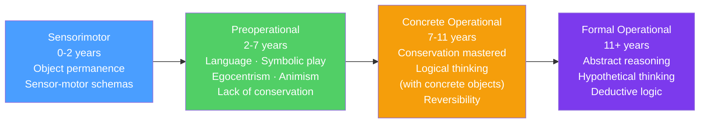

# 🧒 Piaget's Cognitive Development

> [!abstract] TL;DR
> Jean Piaget proposed that children's thinking develops through four qualitatively distinct stages — not a gradual accumulation of knowledge but radical reorganizations of cognitive structure. Children actively construct knowledge through **assimilation** (fitting new experience into existing schemas) and **accommodation** (revising schemas when experience doesn't fit). Vygotsky's competing theory emphasizes social and cultural transmission over individual discovery, introducing the concept of the **Zone of Proximal Development** as the critical learning space.

## Intuition — analogy FIRST

Imagine building with LEGO blocks at different ages.

A **toddler** (sensorimotor) manipulates the blocks physically — stacking, mouthing, throwing. She knows blocks through actions, not mental representations. If you hide a block under a cup, it might as well not exist.

A **preschooler** (preoperational) can talk about blocks and build imaginatively, but thinks the tall, narrow tower is "more" than the wide, flat one — even if they use the same number of blocks. Appearances dominate.

A **school-age child** (concrete operational) knows the towers have the same blocks — conservation is mastered. But she needs the actual blocks in front of her; abstract reasoning is still difficult.

A **teenager** (formal operational) can reason about hypothetical block arrangements she's never seen: "If we had blocks in four dimensions, what configurations would be stable?" Abstract and hypothetical thinking is now possible.

The key insight: these are not just different amounts of knowledge — they are different *types* of thinking, each built on the foundations of the previous stage.

---

## How It Works — The Four Stages

## Key Concepts / Details

### Core Mechanisms: How Development Happens

**Schema**: a mental framework or structure for organizing and interpreting information. A baby's grasping schema; a teenager's schema for "fairness."

**Assimilation**: incorporate new experience into an existing schema. A toddler sees a horse and says "dog" — the horse is assimilated into the "four-legged animal" schema.

**Accommodation**: modify an existing schema when experience doesn't fit. Learning that horses ≠ dogs requires creating a new "horse" schema or expanding the category.

**Equilibration**: the drive to achieve balance between assimilation and accommodation — the motivational engine of cognitive development.

**Disequilibrium**: cognitive conflict that arises when existing schemas fail to explain new experience. This discomfort drives accommodation and stage transitions. (Implication for education: productive struggle — not too easy, not overwhelming — triggers development.)

### Stage 1: Sensorimotor (0–2 years)

Infants know the world through actions and sensations, not mental representations.

Key achievement: **object permanence** — understanding that objects continue to exist when out of sight.
- Before ~8 months: when an object is hidden, infants stop searching ("out of sight, out of mind")
- By 12 months: search for hidden objects; A-not-B error still occurs
- By 18–24 months: full object permanence achieved

**Piaget's key claim**: infants lack mental representations until late in this stage.
**Critique**: Renée Baillargeon's looking-time paradigm shows infants as young as 3.5 months show surprise when physical laws are violated — suggesting earlier representation than Piaget believed.

### Stage 2: Preoperational (2–7 years)

Children use language and symbols but lack logical operations.

| Feature | Description | Classic Test |
|---|---|---|
| **Egocentrism** | Difficulty taking others' perspectives | Three mountains task — child describes view as their own view |
| **Animism** | Attribute life/intentions to inanimate objects | "The sun is angry today" |
| **Centration** | Focus on one dimension at a time | Focus on height of water, ignore width |
| **Lack of conservation** | Appearance changes = quantity changes | Poured water looks like "more" in tall glass |
| **Irreversibility** | Can't mentally reverse operations | Can't see that pouring back would restore original |
| **Transductive reasoning** | A caused B because both happened together | "I was bad, so Daddy got sick" |

**Theory of mind**: by age 4, children understand that others have beliefs that may differ from reality (false belief task). Before 4: children assume others know what they know.

**False belief task** (Wimmer & Perner, 1983): Maxi puts chocolate in box A, leaves. Mother moves chocolate to box B. Where will Maxi look? Children under 4 say "box B" — they cannot represent Maxi's false belief.

### Stage 3: Concrete Operational (7–11 years)

Logical thinking develops, but is tied to concrete, observable objects.

Key achievements:
- **Conservation**: quantity remains the same despite appearance changes
- **Reversibility**: mental operations can be undone
- **Decentration**: consider multiple dimensions simultaneously
- **Seriation**: arrange objects in order by a dimension
- **Classification**: sort objects into categories and subcategories

**Limitation**: can solve problems with concrete objects; struggles with purely abstract or hypothetical reasoning. "All X are Y; all Y are Z; therefore...?" — difficult without concrete referents.

### Stage 4: Formal Operational (11+ years)

Abstract, systematic, and hypothetical reasoning becomes possible.

- **Hypothetico-deductive reasoning**: generate hypotheses and test them systematically
- **Abstract reasoning**: reason about concepts without concrete referents
- **Propositional reasoning**: evaluate logical validity independent of content
- **Systematic problem solving**: approach problems by considering all possible combinations

**Not universal**: full formal operations are not achieved by all adults and may be domain-specific. Adults reason better in domains of expertise.

### Critique and Legacy

**Underestimation of infants**: Baillargeon and others showed competencies emerge earlier than Piaget believed, suggesting his methods (verbal responses, motor tasks) underestimated young children.

**Overemphasis on individual discovery**: Piaget saw the child as a "lone scientist." Culture, language, and social interaction are far more important than Piaget acknowledged.

**Stage rigidity**: development is more continuous and domain-specific than Piaget's stage model suggests. There is no single cognitive transition; different domains develop at different rates.

### Vygotsky's Social-Cultural Theory

Lev Vygotsky (1896–1934) offered a counterpoint:

**Zone of Proximal Development (ZPD)**: the gap between what a child can do independently and what they can do with guidance. The ZPD is the optimal learning zone — where a skilled partner's support (scaffolding) allows the child to reach the next developmental level.

| Concept | Vygotsky | Piaget |
|---|---|---|
| Role of social interaction | Central — cognitive development is social in origin | Secondary — development precedes learning |
| Role of language | Language drives thought development | Thought precedes language |
| Role of culture | Culture determines cognitive content and tools | Universal stages transcend culture |
| Optimal teaching | In the ZPD, with scaffolding | Allow discovery; wait for readiness |

**Scaffolding**: temporary support that enables a child to accomplish tasks they couldn't alone, gradually withdrawn as competence develops. Good tutors and teachers scaffold within the ZPD.

**Private speech**: children narrating their own activities aloud. Piaget called this "egocentric speech" (non-communicative). Vygotsky correctly identified it as thinking aloud — precursor to inner speech. Children with more private speech perform better on difficult tasks.

## Real-World Notes

- **Classroom instruction**: Piaget → do not expect formal operational reasoning from elementary school children; use concrete materials and direct experience. Vygotsky → pair novices with more capable partners; design challenges slightly beyond current ability.
- **Video and screen media**: by 18–24 months children can learn from video, but before that "video deficit" — they learn better from live interaction (relates to representational capacity).
- **Moral education**: conservation of moral principles (rules persist across contexts) mirrors concrete operations; abstract moral reasoning mirrors formal operations. Kohlberg built directly on Piaget. See [[Moral_Development]].
- **Assessment**: theory of mind development (false belief task success at 4) is delayed in autism spectrum disorder — not inability to understand mental states, but different developmental timing.

## Common Pitfalls

- **"Piaget's stages have firm age cutoffs"** — ages are approximate, vary by domain, culture, and individual. Use them as rough guides, not diagnostic thresholds.
- **"Formal operations = adult cognition"** — many adults fail formal operations tasks outside their expertise domains. Formal operations are not universal adult achievements.
- **Piaget vs. Vygotsky as exclusive alternatives** — modern developmental psychology integrates both: children are active constructors *and* social learners. The question is the balance.

## Related Concepts

- [[_MOC_Developmental_Psychology|↑ Section MOC]]
- [[Language_Development]] — Language development intersects with and supports cognitive stage transitions
- [[Moral_Development]] — Kohlberg built his moral stage theory on Piagetian foundations
- [[Lifespan_Development]] — Erikson's stages continue the developmental arc beyond childhood
- [[Memory_Systems]] — Children's memory develops alongside cognitive stages; source monitoring and working memory improve through childhood
- [[Attachment_Theory]] — Security of attachment affects willingness to explore (basis for cognitive development)

## Review Questions

1. A 5-year-old insists that a tall, narrow glass has "more juice" than a short, wide glass, even after watching juice poured between them. What Piagetian concept explains this, and what is the underlying mechanism?
2. Compare Piaget's and Vygotsky's views on the role of language in cognitive development. What is private speech, and why did they interpret it so differently?
3. Baillargeon's research shows infants as young as 3.5 months show surprise when a ball passes through a solid object. What does this challenge in Piaget's theory, and what methodological insight makes this research possible?

## Sources

- Jean Piaget, *The Psychology of Intelligence* (1950)
- Lev Vygotsky, *Mind in Society* (1978)
- Baillargeon, R. (1987). "Object permanence in 3.5- and 4.5-month-old infants." *Developmental Psychology*
- Wimmer, H. & Perner, J. (1983). "Beliefs about beliefs." *Cognition*, 13, 103–128

#psychology #developmental-psychology #piaget #cognitive-development #vygotsky
