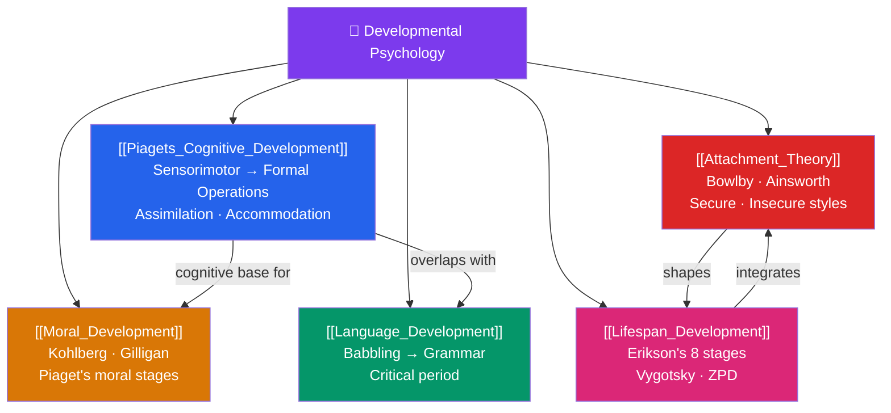

# 🗺️ Developmental Psychology — Map of Content

> [!abstract] What This Section Covers
> Developmental psychology studies change and continuity across the lifespan. Five notes trace the major developmental arcs: **Piaget's cognitive development** (the four stages through which thinking matures), **attachment theory** (how early bonds shape relationship patterns across life), **language development** (from babbling to complex syntax), **moral development** (Kohlberg and Gilligan on how moral reasoning evolves), and **lifespan development** (Erikson's eight stages, Vygotsky's social learning, and the arc from infancy through late adulthood). Together they answer: how does the mind grow, and how do early experiences ripple through a lifetime?

## Concept Map

## Learning Path

1. [[Piagets_Cognitive_Development]] — Four stages of cognitive growth; assimilation and accommodation; Vygotsky as counterpoint.
2. [[Attachment_Theory]] — Bowlby's theory; Ainsworth's Strange Situation; adult attachment styles.
3. [[Language_Development]] — Milestones from babbling to complex grammar; critical period; bilingualism.
4. [[Moral_Development]] — Piaget's two-stage model; Kohlberg's six stages; Gilligan's ethics of care critique.
5. [[Lifespan_Development]] — Erikson's eight psychosocial stages; nature-nurture interaction; aging.

## All Notes at a Glance

| Note | Difficulty | What You'll Learn |
|------|------------|-------------------|
| [[Piagets_Cognitive_Development]] | Intermediate | Four stages, object permanence, egocentrism, conservation, formal operations, Vygotsky's ZPD |
| [[Attachment_Theory]] | Intermediate | Bowlby's evolutionary theory, Ainsworth's styles, internal working models, adult attachment, consequences of early deprivation |
| [[Language_Development]] | Intermediate | Universal milestones, critical period, nature vs. nurture debate, bilingualism, reading development |
| [[Moral_Development]] | Intermediate | Piaget's heteronomous/autonomous stages, Kohlberg's 6 stages, Gilligan's care critique, moral foundations |
| [[Lifespan_Development]] | Intermediate | Erikson's 8 crises, Vygotsky/ZPD, temperament, adult development, successful aging |

## Key Questions This Section Answers

- At what age can children genuinely understand that their perspective differs from another person's?
- Why do children adopted after age 3 sometimes struggle with secure attachment regardless of the quality of care they receive?
- Is there truly a critical period for language — and what happens when children miss it?
- Do we reason our way to moral conclusions, or do moral intuitions come first?
- What are the developmental tasks of middle age and late adulthood according to Erikson?

## Related Sections

- [[_MOC_Psychology_Master|↑ Psychology Master MOC]]
- [[_MOC_Psychology_Foundations|← Foundations]] — Biological basis provides the substrate
- [[_MOC_Social_Psychology|→ Social Psychology]] — Socialization and moral development connect here
- [[_MOC_Clinical_Applied|→ Clinical & Applied]] — Attachment disruptions are central to many clinical presentations

#MOC #Psychology #DevelopmentalPsychology
