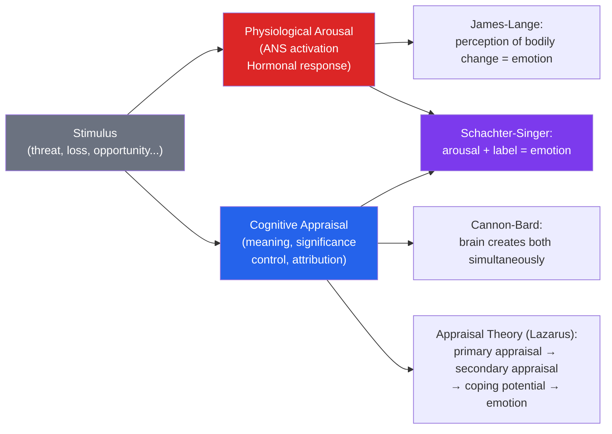

# 😊 Emotion Theories

> [!abstract] TL;DR
> Emotions are complex, multi-component responses involving physiological arousal, subjective experience, cognitive appraisal, and behavioral impulse. The central question — do we feel afraid because our heart races, or does our heart race because we feel afraid? — has generated four major theories. Modern consensus: emotion involves parallel biological and cognitive processes, with appraisal (evaluation of personal significance) as the key cognitive determinant. Paul Ekman identified six universal basic emotions; dimensional approaches map all emotions on valence and arousal axes.

## Intuition — analogy FIRST

Imagine receiving an unexpected phone call from a number you don't recognize.

Your heart rate increases slightly (physiological arousal). Then:
- If your brain appraises it as "probably a spam call" → mild annoyance or indifference
- If your brain appraises it as "might be the hospital calling about my parent" → anxiety or dread
- If your brain appraises it as "might be the job offer I've been waiting for" → excitement

The same physiological arousal pattern produces entirely different emotions depending on **cognitive appraisal** — your evaluation of what the arousal means and what caused it. This is why the same physical state (racing heart) is "fear" before a dangerous situation and "excitement" before an audition. Schachter and Singer's two-factor theory captured this: arousal is the fuel; appraisal provides the label.

---

## How It Works

## Key Concepts / Details

### The Four Major Theories

**1. James-Lange Theory (1884)**
William James and Carl Lange independently proposed: emotional experience IS the perception of bodily changes.

"We do not tremble because we are afraid — we are afraid because we tremble."

Sequence: stimulus → physiological response → perception of that response → emotion.

**Support**: embodied cognition research (holding a pencil in teeth induces smile muscles → cartoons rated funnier); facial feedback hypothesis.
**Criticism**: people with spinal cord injuries can still feel emotions even with reduced bodily feedback; physiological responses are too similar across emotions to distinguish fear, anger, disgust by physiology alone.

**2. Cannon-Bard Theory (1927)**
Walter Cannon challenged James-Lange: the thalamus simultaneously sends signals to both cortex (emotion experience) and body (physiological response). The two are parallel and independent.

**Key arguments**:
- Artificial physiological arousal (epinephrine injection) doesn't automatically create emotion
- Visceral responses are too slow to cause immediate emotional experience
- Same physiological patterns occur in many different emotional states

**3. Schachter-Singer Two-Factor Theory (1962)**

Emotion = physiological arousal + cognitive label

**Classic experiment**: participants given epinephrine (physiological arousal) were either:
- Told what to expect (arousal is explained)
- Told nothing/misinformed (arousal is unexplained)

Then exposed to a euphoric or angry confederate.

Participants with unexplained arousal adopted the emotion of the confederate — they labeled their arousal with the available contextual cue. "Misattribution of arousal" — arousal is a raw material; context provides the emotional label.

**Applications**:
- **Suspension bridge effect** (Dutton & Aron, 1974): men on a high, scary bridge rated a woman more attractive than men on a stable bridge — misattributed fear arousal as attraction
- Explains why exciting first dates are more likely to create romantic feelings than calm coffee dates

**4. Cognitive Appraisal Theory (Lazarus, 1966)**

Emotion is determined by how we **appraise** a situation:

| Appraisal | Question | Associated Emotion |
|---|---|---|
| **Primary appraisal** | Is this situation relevant to my goals? Is it positive, threatening, or irrelevant? | Sets emotional direction |
| **Secondary appraisal** | Can I cope with it? What are my resources? | Modifies emotion intensity |

**Specific appraisal patterns**:
- Anger: someone else caused harm to me and could have done otherwise
- Guilt: I caused harm through my actions
- Fear: uncertain, uncontrollable threat
- Sadness: irreversible loss
- Pride: I achieved something of value
- Joy: progress toward goal

**Lazarus vs. Zajonc debate**: Can emotion occur without appraisal? Zajonc (1984) showed rapid, pre-cognitive emotional responses (mere exposure effect, subliminal conditioning). Lazarus: all emotion involves some cognitive appraisal, even if rapid and unconscious. Modern consensus: both fast pre-cognitive affective reactions and slower appraisal-based emotions exist.

### Basic Emotions and Cultural Universality

**Ekman's six basic emotions** (1972): anger, fear, disgust, happiness, sadness, surprise — associated with universal facial expressions recognizable across cultures, including isolated preliterate societies.

**Evidence**: Fore tribe of New Guinea (no contact with Western media) correctly matched facial expressions to emotional scenarios.

**Criticisms (Lisa Feldman Barrett)**:
- Facial expressions show more variability than Ekman's work implied
- Context heavily determines what expression "means"
- Cross-cultural recognition rates are above chance but far from perfect
- The "basic emotion" categories may be Western impositions

**Dimensional approaches** (Valence × Arousal):
All emotional states can be located in a 2D space:
- **Valence**: positive (happy) ↔ negative (unhappy)
- **Arousal**: high (excited) ↔ low (calm)

| Quadrant | Examples |
|---|---|
| High arousal, positive | Excited, elated, energized |
| High arousal, negative | Anxious, angry, afraid |
| Low arousal, positive | Calm, content, relaxed |
| Low arousal, negative | Depressed, bored, lethargic |

### Emotional Regulation

**Gross's process model**: emotion regulation strategies vary in effectiveness and cost:

| Strategy | When Applied | Effectiveness | Cost |
|---|---|---|---|
| **Situation selection** | Before stimulus | High | Requires foresight |
| **Situation modification** | During situation | High | Requires resources |
| **Attentional deployment** | During stimulus | Moderate | Can increase rumination |
| **Cognitive reappraisal** | Before/during response | High | Moderate effort |
| **Expressive suppression** | After response | Low (masks, doesn't reduce) | Social and health costs |

**Key finding**: cognitive reappraisal (changing how you think about the situation) reduces emotional intensity without the costs of suppression. Suppression maintains behavior but leaves physiological and cognitive arousal intact — and impairs memory formation.

**Emotion regulation development**: children develop emotion regulation capacity through warm caregiver support; emotion dysregulation in adults often traces to early disrupted attachment. See [[Attachment_Theory]].

### Emotion and Cognition

- **Mood-congruent memory**: current mood biases recall toward mood-consistent memories
- **Affect heuristic**: overall emotional feeling toward an object influences risk and benefit assessments
- **Somatic marker hypothesis** (Damasio): body feelings are used as cognitive shortcuts in decision-making — damage to vmPFC (which processes these signals) produces poor real-world decisions even with intact reasoning (Iowa Gambling Task)
- **Emotional intelligence** (Mayer & Salovey): ability to perceive, use, understand, and manage emotion; distinct from general intelligence

## Real-World Notes

- **Design and UX**: Hooked users are emotionally engaged. Understanding valence and arousal in product experiences helps design for the intended emotional response — trust (low arousal, positive) vs. excitement (high arousal, positive).
- **Negotiation**: misattribution of arousal can be used constructively — meetings in engaging environments generate more creative arousal. The room you choose for a difficult conversation affects the emotional tone.
- **Therapy**: cognitive reappraisal is the core mechanism of cognitive restructuring in CBT. Teaching clients to reappraise ("this is an opportunity, not a catastrophe") is a primary skill. See [[Cognitive_Behavioral_Therapy]].
- **Leadership**: emotional labor (managing displayed emotions for professional purposes) is psychologically costly, especially when it requires suppressing genuine felt emotion. Surface acting predicts burnout; deep acting (genuinely reappraising the situation) is healthier.

## Common Pitfalls

- **"Emotions are just feelings"** — emotions involve physiological, cognitive, behavioral, and experiential components; reducing them to "just" feelings ignores most of the phenomenon.
- **"Negative emotions should be suppressed"** — suppression maintains behavior at high psychological cost. Emotion acceptance and reappraisal are more effective. Mindfulness teaches to observe emotions without suppression.
- **The universal basic emotion story** — Ekman's universality is real but weaker than originally claimed. Cultural context shapes emotional experience, expression, and recognition.

## Related Concepts

- [[_MOC_Motivation_Emotion|↑ Section MOC]]
- [[Biological_Basis_of_Behavior]] — Amygdala, prefrontal cortex, and the neural architecture of emotion
- [[Stress_and_Coping]] — Appraisal of a situation as threatening is the gateway to the stress response
- [[Happiness_and_Wellbeing]] — Positive emotions in PERMA; Fredrickson's broaden-and-build theory
- [[Cognitive_Biases]] — Affect heuristic; mood-congruent cognition
- [[Cognitive_Behavioral_Therapy]] — Cognitive reappraisal as a therapeutic technique

## Review Questions

1. A person injects a drug that increases heart rate and experiences euphoria when placed in an exciting context but anxiety in a threatening context. Which emotion theory does this support, and what is the key mechanism?
2. Compare James-Lange and Cannon-Bard theories on the relationship between physiological response and emotional experience. What experimental evidence weakens the James-Lange position?
3. Gross's process model says that cognitive reappraisal is more effective than expressive suppression for emotion regulation. Explain the psychological mechanism that makes suppression costly.

## Sources

- James, W. (1884). "What is an emotion?" *Mind*, 9, 188–205
- Schachter, S. & Singer, J.E. (1962). "Cognitive, social, and physiological determinants of emotional state." *Psychological Review*
- Lazarus, R.S. (1991). *Emotion and Adaptation*. Oxford University Press
- Gross, J.J. (1998). "The emerging field of emotion regulation." *Review of General Psychology*

#psychology #emotion #emotion-theories #james-lange #appraisal-theory
