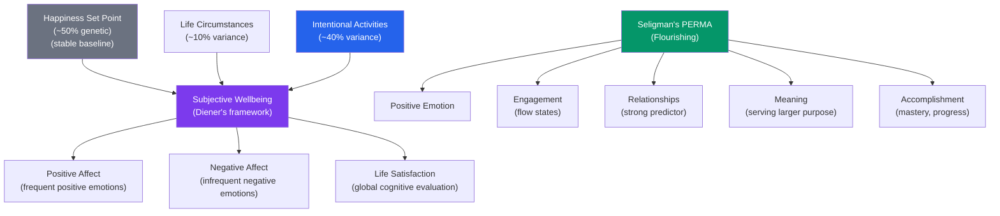

# 😊 Happiness and Wellbeing

> [!abstract] TL;DR
> Happiness — or more precisely, **subjective wellbeing (SWB)** — consists of frequent positive affect, infrequent negative affect, and life satisfaction. Research has overturned common assumptions: income beyond ~$75K (or higher in expensive cities) adds little to emotional wellbeing; we adapt to most changes (hedonic adaptation); and what we think will make us happy (money, fame, material goods) largely doesn't. What does predict happiness: strong relationships, meaningful work, autonomy, engagement, and prosocial behavior. Seligman's PERMA framework operationalizes flourishing for research and practice.

## Intuition — analogy FIRST

Imagine a treadmill you can never get off.

You get a raise → feel happier → but that becomes your new baseline → you need another raise to feel as happy as before. You move to a bigger house → delight → then just "home." You win an award → pride → then it's just your past. This is **hedonic adaptation** (also called the hedonic treadmill) — the tendency to return to a roughly stable happiness set point after positive or negative events.

The uncomfortable implication: most of what we strive for (wealth, status, possessions) provides a temporary boost that fades. The comfortable implication: most tragedies also adapt — people who become quadriplegic report similar life satisfaction within 2–3 years to before the accident (Brickman et al., 1978). And a few things don't adapt well — relationships, health, autonomy. These are worth prioritizing.

---

## How It Works

## Key Concepts / Details

### Measuring Wellbeing

**Subjective Wellbeing (SWB)** (Diener):
- **Positive affect**: frequency of pleasant emotions (joy, interest, pride)
- **Negative affect**: infrequency of unpleasant emotions (sadness, anxiety, anger)
- **Life satisfaction**: global cognitive evaluation of one's life as a whole

**Eudaimonic wellbeing** (vs. hedonic): Aristotle's distinction between pleasure (hedonic) and flourishing through virtue and meaning (eudaimonic). Seligman's PERMA includes both.

**Measuring happiness**: self-report satisfaction scales (SWLS — Satisfaction with Life Scale), ecological momentary assessment (ESM — random beeping during day to capture real-time affect), and biological markers (cortisol, immune function, longevity).

### The Happiness Set Point

**Twin studies**: ~50% of variance in subjective wellbeing is heritable. Identical twins show far more similar happiness levels than fraternal twins, even when raised apart.

**Set point theory** (Lykken & Tellegen, 1996): each person has a genetically influenced happiness set point around which they fluctuate. Life circumstances shift happiness temporarily, but set point is restored.

**Lottery winners and accident victims** (Brickman, Coates & Janoff-Bulman, 1978): lottery winners were not happier than non-winners 1 year later; paraplegics reported higher positive affect than expected. Adaptation is powerful.

**Important caveats**:
- Set point is a *range*, not a fixed number — interventions can shift the baseline
- Chronic stressors (poverty, relationship conflict, chronic illness) can pull happiness *below* the set point persistently
- The 50% figure is for variance in a particular population; it doesn't mean circumstances can't move you up or down

### What Actually Predicts Happiness

**Strong predictors**:

| Predictor | Strength | Notes |
|---|---|---|
| **Social relationships** (quality) | Very strong | Loneliness rivals smoking in mortality risk |
| **Autonomy** | Strong | Control over one's life; self-determination |
| **Purpose and meaning** | Strong | Contributing to something larger; eudaimonic |
| **Physical health** | Strong | Especially chronic pain/illness |
| **Engagement in activities** | Strong | Flow states; absorption in meaningful tasks |
| **Trait emotional stability** | Strong (heritable) | Neuroticism is the strongest personality predictor |

**Weak or zero predictors** (contrary to intuition):

| Predictor | Reality |
|---|---|
| **Income above ~$75K/year** | Diminishing returns rapidly; emotional wellbeing plateaus (contested: higher recent figure ~$100K+; different aspects of wellbeing) |
| **Fame and status** | Adapts quickly; often increases anxiety |
| **Material possessions** | Adapts completely; experiences >> possessions |
| **Climate/geography** | People consistently overestimate climate effects on happiness |
| **Marriage** | Average temporary boost; returns to set point |
| **Having children** | Mixed evidence; day-to-day affect often lower; sense of meaning higher |

### Kahneman's Distinctions

Daniel Kahneman distinguishes:
- **Experiencing self**: real-time emotional experience during events
- **Remembering self**: retrospective evaluation of events (what we actually report and base decisions on)

**Peak-end rule**: we evaluate past experiences based on the most intense moment (peak) and the ending — not the total duration. A procedure with 7 minutes of pain followed by 3 minutes of mild discomfort is remembered as *less* bad than one with 7 minutes of pain alone (more total pain, but the ending was less intense).

**Duration neglect**: subjective memory of an experience's badness/goodness does not scale with its duration.

**Implication**: to make people happier, you may need to engineer *memories* of experiences, not just the experiences themselves. The last impression matters disproportionately.

### Hedonic Adaptation

Most events people expect to dramatically change their happiness do not produce lasting change:

| Event | Predicted impact | Actual impact after ~1 year |
|---|---|---|
| Getting a raise | Large positive | Small; quickly adapted |
| Winning lottery | Massive positive | Returns to set point |
| Losing a limb | Massive negative | Substantial recovery |
| Divorce | Large negative | Moderate; adapts |
| Getting married | Large positive | Temporary boost; returns |

**What adapts slowly**: chronic noise exposure, long commutes, and repetitive daily routines all show slow adaptation — meaning they continue to affect wellbeing. Relationships also show slower adaptation when maintained and growing.

**Preventing adaptation**: variety, savoring, gratitude, and avoiding habituation extend positive experiences. Spending money on experiences (concerts, travel, meals with friends) rather than possessions provides more durable happiness — experiences are harder to compare and adapt to.

### Seligman's PERMA Model

Martin Seligman's (2011) framework for **flourishing** (well-being beyond just happiness):

| Element | Description | Examples |
|---|---|---|
| **P**ositive Emotion | Feeling good; hedonic wellbeing | Joy, gratitude, inspiration, awe, love |
| **E**ngagement | Absorption in activities; flow | Deep work, sports, creative projects |
| **R**elationships | Positive relationships with others | Close friendships, romantic partnerships |
| **M**eaning | Belonging to and serving something larger | Faith, cause, organization, family |
| **A**ccomplishment | Pursuing success and mastery | Goals, achievements, competence-building |

**Flow** (Csikszentmihalyi): state of complete absorption in an optimally challenging activity — challenge perfectly matched to skill, clear goals, immediate feedback. Associated with strong wellbeing and intrinsic motivation. Often occurs in work; paradoxically, leisure time shows lower flow than work.

### The Broaden-and-Build Theory (Fredrickson)

Positive emotions **broaden** the momentary thought-action repertoire (increased creativity, flexibility, perspective-taking) and **build** lasting personal resources (social bonds, cognitive flexibility, physical strength, resilience).

Negative emotions narrow attention and behavior (fight-or-flight). Positive emotions widen it — a functional difference with long-term resource-building consequences.

**Positivity ratio**: Fredrickson originally proposed a 3:1 positive-to-negative emotion ratio for flourishing. The specific ratio is disputed (Wagenmakers et al. replicated the math errors), but the qualitative principle — more positive emotion than negative correlates with flourishing — is well-supported.

## Real-World Notes

- **Organizational wellbeing programs**: meditation, gratitude journaling, and exercise all show moderate effects on wellbeing. But structural factors (autonomy, workload, relationships with managers) have larger effects than individual wellness activities.
- **Consumer behavior**: the experience-material goods distinction is used in marketing — "Don't buy a vacation package, buy the experience of exploring a new culture." Travel brands and entertainment sell experiences, not products.
- **The "happiness trap" in clinical settings**: directly pursuing happiness often backfires (the "ironic process" — trying not to think about something makes you think about it more). ACT (Acceptance and Commitment Therapy) aims for values-aligned living, not happiness maximization. See [[Cognitive_Behavioral_Therapy]].
- **Architecture and urban design**: long commutes (poor adaptation), access to green space, and social design of neighborhoods all affect population wellbeing — policy-level implications of wellbeing research.

## Common Pitfalls

- **"More money = more happiness"** — income effects are real up to a moderate threshold (covering basic needs + some comfort) but diminish rapidly. Above that threshold, how you spend matters more than how much you earn.
- **"Happiness is a destination"** — the treadmill model shows happiness is maintained through ongoing engagement, not achieved and held. It's a process, not a state.
- **"Positive psychology says only be positive"** — Seligman has explicitly rejected this; negative emotions are functional, sometimes necessary. PERMA includes all emotions; it's about *predominance* of positive experience, not forced positivity.

## Related Concepts

- [[_MOC_Motivation_Emotion|↑ Section MOC]]
- [[Positive_Psychology]] — The broader field that developed from this research
- [[Stress_and_Coping]] — Chronic stress is the primary drain on wellbeing; coping moderates its effects
- [[Theories_of_Motivation]] — SDT's three needs (autonomy, competence, relatedness) predict wellbeing
- [[Maslows_Hierarchy]] — Upper levels map onto eudaimonic wellbeing
- [[Prosocial_Behavior]] — Helping others consistently predicts happiness (the "helper's high")

## Review Questions

1. Explain hedonic adaptation and give three life examples. What does research suggest about which types of events adapt most quickly, and why?
2. Kahneman distinguishes the experiencing self from the remembering self. How does the peak-end rule explain why a colonoscopy study (Redelmeier & Kahneman, 1996) found that adding a final uncomfortable-but-milder minute improved patient evaluations?
3. Using Fredrickson's broaden-and-build theory, explain how an organizational leader could use this model to improve team performance over a year-long project — not just morale.

## Sources

- Diener, E. (1984). "Subjective well-being." *Psychological Bulletin*, 95(3), 542–575
- Kahneman, D. (1999). "Objective happiness." In D. Kahneman et al. (Eds.), *Well-Being: The Foundations of Hedonic Psychology*
- Seligman, M.E.P. (2011). *Flourish*. Free Press
- Fredrickson, B.L. (2001). "The role of positive emotions in positive psychology." *American Psychologist*, 56(3), 218–226

#psychology #wellbeing #happiness #PERMA #hedonic-adaptation
