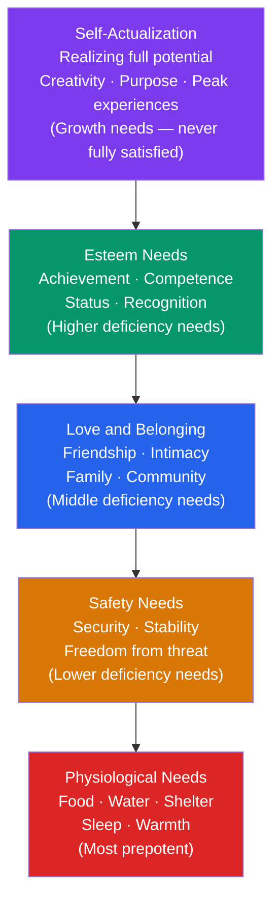

# 🔺 Maslow's Hierarchy of Needs

> [!abstract] TL;DR
> Abraham Maslow proposed that human needs form a five-level hierarchy from physiological survival through safety, love/belonging, esteem, to self-actualization. The key claim: lower needs must be substantially satisfied before higher needs become motivating. The hierarchy captures important truths about the priority of basic needs, but the strict ordering and automatic prepotency are not well-supported empirically. Its greatest contribution is shifting psychology's attention from pathology to human potential.

## Intuition — analogy FIRST

Imagine trying to write a great novel while starving.

The creative impulse (self-actualization) doesn't vanish — artists in poverty create extraordinary work. But the cognitive and emotional resources available for creative pursuit are partially consumed by survival concerns. Maslow's insight is that human beings have a *structure* to their needs, not just a list of them.

Think of it as a building under construction. You can start framing the upper floors before the foundation is completely finished — but the foundation work always has priority. A cracking foundation will eventually demand attention no matter how beautiful the upper floors are. Similarly, unmet safety needs create psychological "noise" that competes with higher pursuits, even if the upper floors are actively being worked on.

The caveat: the pyramid model overstates the rigidity. Humans pursue meaning even in concentration camps (Frankl). The hierarchy describes *tendencies*, not locks.

---

## How It Works

## Key Concepts / Details

### The Five Levels

**Level 1: Physiological Needs** (most prepotent)
Food, water, air, shelter, sleep, homeostasis. When unmet, these dominate behavior — a hungry person is obsessed with food. Once met, they cease to be motivating.

**Level 2: Safety Needs**
Physical safety (freedom from violence, disease), economic security, predictability and order. Explains why humans respond so strongly to job insecurity, political instability, and health threats — these activate the safety layer.

**Level 3: Love and Belonging Needs**
Friendship, intimacy, family, sense of community and belonging. Maslow placed the modern epidemic of loneliness — one of the strongest mortality risk factors — at this level. Social media can satisfy surface belonging while leaving deep belonging unmet.

**Level 4: Esteem Needs**
**Lower esteem**: the desire for respect, status, recognition, and reputation from others.
**Higher esteem**: self-respect, competence, mastery, independence, achievement.

Maslow valued higher esteem (self-respect based on genuine achievement) over lower esteem (status) as more sustainable.

**Level 5: Self-Actualization**
"What a man can be, he must be." The need to realize one's full potential — creativity, problem-solving, spontaneity, authentic self-expression, peak experiences.

Self-actualization is a **growth need** (also called B-need, Being need) rather than a **deficiency need** (D-need). Deficiency needs decrease motivation when satisfied; growth needs intensify when partially met. Self-actualization can never be fully satisfied — the more you pursue it, the more you want it.

### Characteristics of Self-Actualizing People (Maslow's Case Studies)

Maslow studied exemplars (Abraham Lincoln, Albert Einstein, Eleanor Roosevelt, Frederick Douglass) and identified common traits:

| Characteristic | Description |
|---|---|
| Accurate perception of reality | See people and situations clearly; tolerate ambiguity |
| Acceptance | Accept self and others as they are |
| Spontaneity | Natural, undefensive expression |
| Problem-centered | Focused on problems outside themselves |
| Autonomy | Independent of culture and environment |
| Peak experiences | Moments of transcendent insight, beauty, joy |
| Deep interpersonal relationships | Fewer but deeper; profound empathy |
| Democratic character | Egalitarian; learn from anyone |
| Philosophical humor | Playful, non-hostile humor |
| Creativeness | Original, unconventional approaches |

**Methodological caveat**: Maslow selected his exemplars based on his theory — this is severe confirmation bias. His list of self-actualizing traits may describe his cultural ideal rather than a universal human pinnacle.

### Later Additions — The Extended Hierarchy

Maslow later (1969) added:
- **Cognitive needs** (knowledge, understanding) — between esteem and self-actualization
- **Aesthetic needs** (beauty, order) — between cognitive and self-actualization
- **Transcendence** — beyond self-actualization; helping others achieve their peak potential

Some frameworks use an 8-level hierarchy including these additions.

### Research Evidence: What Holds Up?

| Claim | Evidence |
|---|---|
| Basic/deficiency needs are prioritized under deprivation | Strong (consistent with deprivation research and physiological regulation) |
| Strict hierarchical ordering (lower must be met before higher) | Weak — people pursue meaning and beauty even in poverty |
| Self-actualization as universal pinnacle | Contested — cultures emphasize collective, relational, and spiritual peaks that don't fit individualistic self-actualization |
| The specific five-level structure | Moderate — two-level (deficiency/growth) has better empirical support than five distinct levels |

**Tay & Diener (2011)** survey of 123 nations: basic needs satisfaction associated with positive emotions; social/esteem with positive emotions (not just absence of negative); and self-actualization with meaning independent of positive affect. Partial support — but no strict ordering.

**Cross-cultural challenges**: "Self-actualization" is deeply individualistic. In collectivist cultures, the highest need may be group harmony, contribution to family/community, or spiritual transcendence — not individual peak experiences.

### Maslow vs. Alternative Theories

| Theory | Key Difference from Maslow |
|---|---|
| **Self-Determination Theory** (Deci & Ryan) | Replaces hierarchy with three universal needs (autonomy, competence, relatedness) that are not strictly ordered and apply across cultures |
| **ERG Theory** (Alderfer, 1969) | Compresses into three needs (Existence, Relatedness, Growth); allows simultaneous pursuit; frustration-regression |
| **McClelland's needs** | Three learned needs (achievement, power, affiliation) varying between individuals — no universal hierarchy |

## Real-World Notes

- **Organizational management**: Herzberg's two-factor theory (hygiene factors vs. motivators) is the workplace application of Maslow: physiological/safety needs are "hygiene factors" (their absence demotivates; their presence doesn't actively motivate). Esteem/actualization are "motivators." Implication: adequate pay and safe conditions are prerequisites, but intrinsic job factors (recognition, growth) drive engagement. See [[Organizational_Psychology]].
- **Marketing**: Maslow's hierarchy shapes brand positioning — Maslow explains why premium brands don't just sell products but sell esteem and self-actualization. Luxury goods are esteem-level; adventure experiences are actualization-level.
- **UX design**: safety needs include psychological safety (trust in the product, privacy, data security). Belonging needs include social features and community. The product experience should address the relevant need level for the target user.
- **Positive psychology**: Seligman's PERMA (Positive emotion, Engagement, Relationships, Meaning, Achievement) can be read as an empirically grounded operationalization of the upper hierarchy levels. See [[Positive_Psychology]].

## Common Pitfalls

- **"The hierarchy is strictly ordered"** — the prepotency principle (lower needs block higher) is the least-supported aspect of the theory. Humans routinely sacrifice safety for belonging or esteem.
- **"Self-actualization is the only valid life goal"** — this reflects Maslow's mid-20th-century American individualism. The theory has been criticized for ignoring valid collectivist and spiritual life-goals.
- **Taking the pyramid literally** — the visual pyramid implies that most people are at the bottom and few at the top. Maslow intended it as a motivational priority system, not a description of where people "are."

## Related Concepts

- [[_MOC_Motivation_Emotion|↑ Section MOC]]
- [[Theories_of_Motivation]] — SDT and other frameworks provide evidence-based alternatives and refinements
- [[Happiness_and_Wellbeing]] — Maslow's upper levels connect to positive psychology's wellbeing frameworks
- [[Positive_Psychology]] — Seligman built on Maslow's humanistic tradition with empirical methods
- [[Organizational_Psychology]] — Herzberg, McGregor (Theory X/Y), and job design all build on Maslow
- [[Lifespan_Development]] — Erikson's generativity (Stage 7) maps onto the upper hierarchy levels

## Review Questions

1. What is the difference between "deficiency needs" and "growth needs" in Maslow's theory? Why does Maslow argue self-actualization can never be fully satisfied?
2. Tay and Diener's cross-national study found that basic needs satisfaction predicts positive affect, but meaning/self-actualization contribute independently regardless of lower-need satisfaction. What aspect of Maslow's theory does this support, and what does it challenge?
3. A company wants to motivate employees beyond their salary using Maslow's framework. Identify what needs above physiological/safety they should target, and give a specific program for each level.

## Sources

- Abraham Maslow, "A Theory of Human Motivation." *Psychological Review*, 50(4), 370–396 (1943)
- Abraham Maslow, *Motivation and Personality* (1954; 3rd ed. 1987)
- Tay, L. & Diener, E. (2011). "Needs and subjective well-being around the world." *JPSP*, 101(2), 354–365
- Alderfer, C.P. (1969). "An empirical test of a new theory of human needs." *Organizational Behavior and Human Performance*

#psychology #motivation #maslow #hierarchy-of-needs #self-actualization
