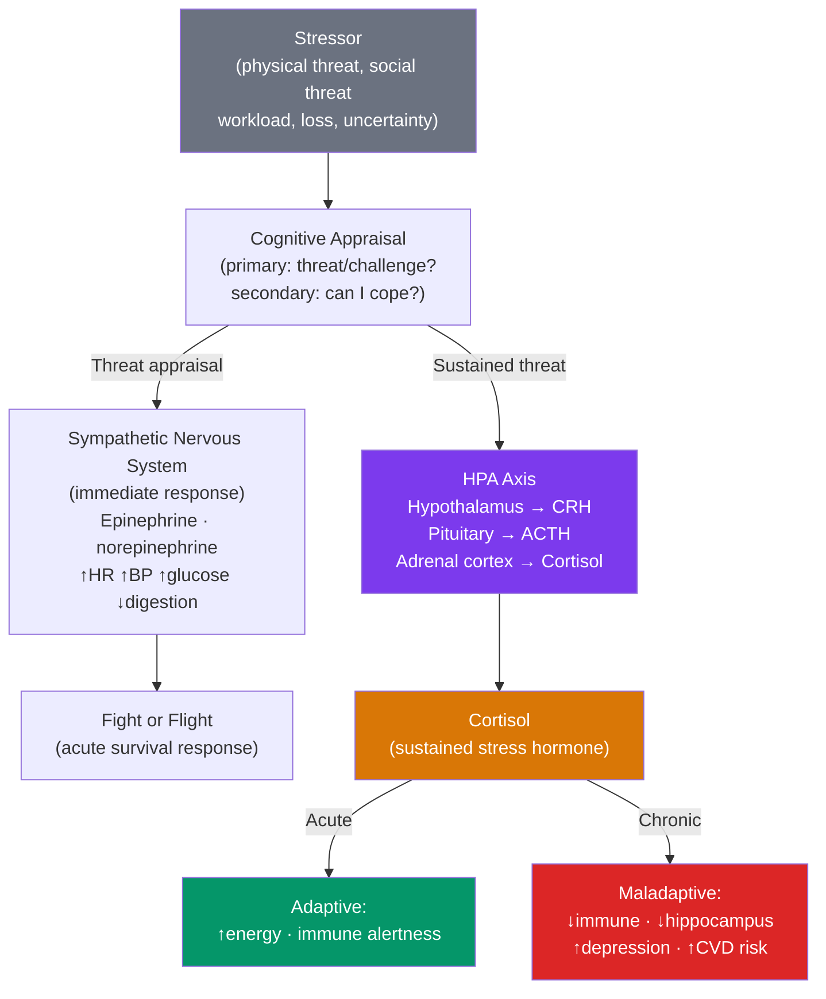

# 😰 Stress and Coping

> [!abstract] TL;DR
> Stress is the process by which we perceive and respond to events appraised as challenging or threatening. Selye's **General Adaptation Syndrome** describes the body's three-stage response: alarm, resistance, exhaustion. The **HPA axis** (hypothalamus-pituitary-adrenal) is the central biological pathway: cortisol mobilizes energy but impairs immune function, memory formation, and emotional regulation when chronically elevated. Coping strategies divide into **problem-focused** (address the stressor) and **emotion-focused** (manage the emotional response); effectiveness depends on whether the situation is controllable.

## Intuition — analogy FIRST

Imagine your body is a company facing a crisis.

An acute stressor (a tiger approaching) is like a sudden urgent client demand. The company goes into emergency mode: non-essential projects paused, all resources redirected to the crisis, performance temporarily spikes. When the crisis passes, normal operations resume and the emergency costs are manageable.

Chronic stress is like the company in permanent emergency mode for months. The "non-essential" projects shelved (immune surveillance, memory consolidation, reproductive function, digestion, long-term planning) stay shelved indefinitely. The sustained cortisol floods essential systems. The performance boost from emergency mode now becomes degraded performance — the company is burning out its staff, neglecting maintenance, and accumulating hidden damage that will manifest as serious failures down the road.

This is why chronic psychological stress causes physical illness — it's not metaphorical; it's biological. The stress response was designed for short-term emergencies, not chronic modern life conditions.

---

## How It Works

## Key Concepts / Details

### Selye's General Adaptation Syndrome (GAS)

Hans Selye (1936) described the body's non-specific response to any stressor:

| Phase | Description | Duration | Biological state |
|---|---|---|---|
| **Alarm reaction** | Immediate activation; resources mobilized (fight or flight) | Minutes to hours | SNS activation; epinephrine/norepinephrine surge |
| **Resistance** | Body adapts to cope with sustained threat; appears normal but resources depleted | Days to weeks | HPA axis active; cortisol sustained; adaptation ongoing |
| **Exhaustion** | Resources depleted; vulnerability to illness and breakdown | Weeks to months | Cortisol receptors downregulate; immunosuppression; organ damage |

**Key insight**: the stress response is non-specific — the same physiological pattern whether the stressor is physical (infection, injury), psychological (work pressure), or social (relationship conflict). The body can't distinguish "real" danger from imagined.

### The HPA Axis — Biology of Stress

The **Hypothalamic-Pituitary-Adrenal (HPA) axis** is the endocrine cascade of the stress response:

1. **Hypothalamus** releases CRH (corticotropin-releasing hormone)
2. **Pituitary gland** releases ACTH (adrenocorticotropic hormone)
3. **Adrenal cortex** releases **cortisol**

**Acute cortisol functions** (adaptive):
- Mobilizes glucose from liver
- Enhances immune alertness (brief enhancement)
- Consolidates emotionally significant memories (amygdala enhancement)
- Suppresses non-essential functions (digestion, reproduction)

**Chronic cortisol consequences** (maladaptive):
- **Immunosuppression**: increased susceptibility to infection and slower wound healing
- **Hippocampal damage**: cortisol is neurotoxic to hippocampal neurons — impairs memory formation and can cause volumetric loss (seen in PTSD and major depression)
- **Cardiovascular effects**: sustained elevated BP, atherosclerosis
- **Metabolic effects**: central obesity, insulin resistance, increased type 2 diabetes risk
- **Mental health**: sustained cortisol elevation predicts depression onset; disrupts serotonin and dopamine systems

**The SAM axis**: Sympatho-Adrenal-Medullary axis provides the immediate response (epinephrine from adrenal medulla); HPA provides the sustained response. Both are activated together but on different timescales.

### Cognitive Appraisal Model (Lazarus & Folkman, 1984)

Not objective characteristics of a situation but our **appraisal** of it determines the stress response:

**Primary appraisal**: "Is this relevant to my well-being? Is it threatening, harmful, or challenging?"
- **Threat**: anticipate harm
- **Harm/loss**: actual damage already occurred
- **Challenge**: opportunity for growth (positive stress — eustress)
- **Irrelevant**: no emotional response

**Secondary appraisal**: "What can I do about it? Do I have the resources to cope?"
- High controllability + adequate resources → challenge appraisal → positive stress
- Low controllability + inadequate resources → threat appraisal → distress

**Implications**: the same objective situation (job loss) can be a threat (no resources, catastrophic appraisal) or a challenge (savings, growth opportunity, social support). Cognitive reappraisal interventions (CBT, mindfulness) operate at this level. See [[Cognitive_Behavioral_Therapy]].

### Types of Stressors

| Type | Examples | Notes |
|---|---|---|
| **Acute** | Car accident, emergency, sudden loss | Manageable if time-limited; can be adaptive |
| **Chronic** | Poverty, relationship conflict, job insecurity | Most damaging to health |
| **Significant life events** | Divorce, death, job change, moving | Holmes & Rahe Social Readjustment Scale |
| **Daily hassles** | Traffic, minor conflicts, frustrations | Cumulatively predict health better than major events |
| **Ambient stressors** | Noise, crowding, pollution | Often below conscious awareness but chronically activating |
| **Catastrophic** | Natural disasters, war, sexual assault | Risk factor for PTSD |

**Control and predictability**: two factors that dramatically modulate stress response:
- **Lack of control** over a stressor amplifies its impact (Seligman's learned helplessness — dogs given inescapable shocks became passively accepting of controllable ones)
- **Unpredictability** increases stress over equivalent predictable stressors — you can't allocate "downtime" if relief timing is unknown

### Coping Strategies

Lazarus & Folkman's (1984) framework:

**Problem-focused coping** (manage the stressor):
- Active problem solving; planning; information seeking; resource mobilization
- Most effective when the stressor is controllable

**Emotion-focused coping** (manage the emotional response):
- Seeking social support; reappraisal; acceptance; mindfulness; exercise; humor
- Most effective when the stressor is uncontrollable

**Avoidance coping** (avoid thinking about the stressor):
- Denial; behavioral disengagement; substance use
- Short-term relief with long-term costs

**Matching hypothesis**: coping effectiveness depends on fit between strategy and situational controllability. Problem-focused coping for a controllable stressor → effective. Problem-focused coping for an uncontrollable stressor (terminal diagnosis) → frustration and poorer outcomes; acceptance coping → better.

### Social Support — The Best Buffer

Extensive research shows social support is among the strongest modulators of stress response:

| Type of Social Support | Description |
|---|---|
| **Instrumental** | Tangible assistance (help with tasks, money, childcare) |
| **Informational** | Advice, guidance, resources |
| **Emotional** | Empathy, care, reassurance |
| **Companionship** | Sense of belonging, shared activities |

**Why social support helps biologically**: social bonding activates oxytocin, which downregulates cortisol. Social threat (rejection, conflict) activates the same brain pain circuits as physical pain.

**Buffering hypothesis**: social support moderates the relationship between stress and illness — it cushions the blow of stressors. **Main effect hypothesis**: social support improves health regardless of stress level — belonging is intrinsically beneficial.

### Resilience

**Resilience**: the ability to adapt positively in the face of adversity. Not the absence of stress response, but the ability to recover.

**Predictors of resilience**:
- Secure attachment history
- Social support
- Sense of personal control / self-efficacy
- Meaning-making capacity
- Cognitive flexibility (reappraisal ability)

**Post-traumatic growth** (Tedeschi & Calhoun): some individuals show *improvements* in functioning after trauma — deeper relationships, new possibilities, personal strength, spiritual development, appreciation for life. Distinct from simple resilience. Not universal, not inevitable.

## Real-World Notes

- **Workplace stress**: chronic job demands with low control and low support (Karasek's demand-control model) predict cardiovascular disease, depression, and burnout. Remote work increases autonomy (reducing demand-control stress) but may reduce social support.
- **Burnout** (Maslach, 1976): emotional exhaustion, depersonalization, and reduced personal accomplishment — distinct from depression but overlapping. Linked to high chronic stress with insufficient recovery.
- **Organizational interventions**: job control (autonomy), workload reduction, social support at work, clear expectations, and recognition are the evidence-based levers. Individual stress management (yoga, mindfulness) is insufficient without systemic change.
- **Sleep as recovery**: sleep is the primary physiological stress-recovery mechanism. Cortisol naturally declines during the first half of sleep; disrupted sleep maintains elevated cortisol. See [[States_of_Consciousness]].

## Common Pitfalls

- **"Stress is always harmful"** — acute, moderate stress (eustress) enhances performance, promotes growth, and builds resilience. Kelly McGonigal's work: people who believe stress is harmful show worse outcomes than people who believe it is challenging and manageable.
- **"Coping is individual"** — emphasizing individual coping skills in organizational settings can blame victims for systemic stressors. A manager can't "yoga your way out" of a 60-hour workweek with an abusive boss.
- **"Social support means more contacts"** — quality (emotional responsiveness, trust) matters more than quantity. Large weak-tie networks provide less stress buffering than a few strong, trusted relationships.

## Related Concepts

- [[_MOC_Motivation_Emotion|↑ Section MOC]]
- [[Biological_Basis_of_Behavior]] — HPA axis, cortisol, and the neuroendocrine stress system
- [[Emotion_Theories]] — Appraisal is the gateway to both emotion and stress response
- [[States_of_Consciousness]] — Sleep disruption and stress are bidirectionally related
- [[Happiness_and_Wellbeing]] — Chronic stress is the most powerful predictor of reduced wellbeing
- [[Psychological_Disorders_Overview]] — Anxiety disorders, PTSD, and major depression all involve dysregulated stress responses
- [[Cognitive_Behavioral_Therapy]] — CBT addresses cognitive appraisals that amplify stress responses

## Review Questions

1. Describe Selye's General Adaptation Syndrome and explain why the exhaustion phase produces illness even when the original stressor was not physically threatening.
2. Using Lazarus and Folkman's matching hypothesis, explain why problem-focused coping is more effective than acceptance coping for a solvable work deadline problem, but less effective than acceptance coping for a terminal diagnosis.
3. Seligman's learned helplessness research showed that dogs exposed to inescapable shocks later didn't try to escape when escape was possible. How does this model translate to human stress and depression, and what does it predict about the importance of control in stressor design?

## Sources

- Lazarus, R.S. & Folkman, S. (1984). *Stress, Appraisal, and Coping*. Springer
- Selye, H. (1936). "A syndrome produced by diverse nocuous agents." *Nature*, 138, 32
- Sapolsky, R.M. (1994). *Why Zebras Don't Get Ulcers*. Freeman
- Seligman, M.E.P. (1975). *Helplessness: On Depression, Development, and Death*

#psychology #stress #coping #HPA-axis #general-adaptation-syndrome
