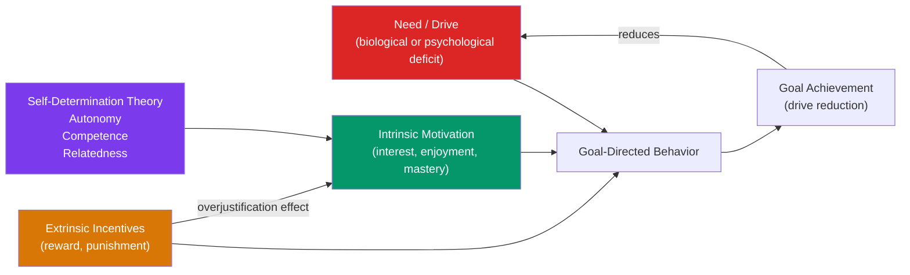

# 🔥 Theories of Motivation

> [!abstract] TL;DR
> Motivation is the process that initiates, directs, and sustains goal-oriented behavior. Major theories evolved from simple physiological drives (Hull's drive reduction) through arousal and incentive theories to the rich, humanistic frameworks of self-determination theory (SDT). The most practical finding: **intrinsic motivation** (doing something for its own sake) is more powerful and sustainable than **extrinsic motivation** (external rewards), and external rewards can *undermine* intrinsic motivation when applied to already-interesting activities (the overjustification effect).

## Intuition — analogy FIRST

Imagine two employees working on the same project.

**Employee A** was interested in the project from the start — the problem is genuinely interesting, she feels competent working on it, and she chose to take it on. She works late not because anyone told her to, but because she's absorbed.

**Employee B** was assigned the project. He's doing it for his performance bonus. He works the required hours, produces adequate work, and thinks carefully about the reward contingency — how much effort yields how much bonus.

Now offer Employee A a large bonus tied directly to her project performance. Research consistently shows this can *reduce* her motivation. The reward converts an intrinsically motivated activity into an extrinsically motivated one — and when the reward is removed or feels controlling, motivation collapses. This is the overjustification effect, and it has profound implications for management, education, and parenting.

---

## How It Works



## Key Concepts / Details

### Historical Progression of Motivation Theories

**1. Instinct Theory** (McDougall, early 1900s):
Behavior driven by innate, unlearned instincts (aggression, reproduction, curiosity). **Problem**: an expanding list of instincts explained nothing — it just renamed behaviors. Replaced by drive theory.

**2. Drive Reduction Theory** (Hull, 1943):
Biological needs (hunger, thirst, pain) create internal tension states (drives). Behavior reduces drives and restores homeostasis. **Primary drives**: biological needs. **Secondary drives**: learned associations with primary drives (money → food).

**Strengths**: explains homeostatic behaviors. **Weaknesses**: people seek stimulation (curiosity, novelty) even when no biological need is present. Doesn't explain playing a video game for 6 hours.

**3. Arousal Theory**:
People seek an optimal level of arousal — neither too bored (under-arousal) nor too stressed (over-arousal).

**Yerkes-Dodson Law (1908)**: performance is best at moderate arousal levels. Optimal arousal is lower for complex tasks, higher for simple tasks.

```
Performance
     ↑
     |        /\
     |       /  \
     |      /    \
     |     /      \
     +----+--------+---→ Arousal
        Low    Mod    High
```

**Sensation seeking** (Zuckerman): individual differences in optimal arousal level — high sensation seekers actively pursue intense experiences.

**4. Incentive Theory**:
External stimuli (incentives) pull behavior toward goals. Reverses the push of drive theory. Explains why we eat when not hungry (the smell of fresh bread pulls behavior). Dopamine system is the neural substrate of incentive salience — the "wanting" system.

**Berridge's distinction**: the **wanting** system (dopamine) and the **liking** system (opioids) are separable. Addiction involves hyperactivated wanting with normal or reduced liking — explaining compulsive pursuit of diminishing pleasure.

**5. Cognitive Theories**:
Expectancy-value theory (Vroom, 1964): motivation = expectancy (can I do it?) × instrumentality (will it lead to reward?) × valence (do I want the reward?). Applied in organizational settings (see [[Organizational_Psychology]]).

**Goal-setting theory** (Locke & Latham): **SMART goals** (Specific, Measurable, Achievable, Relevant, Time-bound) consistently outperform "do your best" instructions. Specific, difficult goals produce best performance (within a range where the person believes they can succeed).

### Self-Determination Theory (Deci & Ryan, 1985)

SDT is the most empirically developed motivational theory. It proposes three innate psychological needs:

| Need | Description | When Satisfied |
|---|---|---|
| **Autonomy** | Feeling of volitional causation; acting from one's values | Choices given; rationale provided; pressure reduced |
| **Competence** | Feeling effective and capable | Optimal challenge; feedback; reducing failures |
| **Relatedness** | Feeling connected to others who care | Warm relationships; belonging; responsiveness |

When these needs are met, people are **autonomously motivated** (intrinsic regulation → integrated regulation). When blocked, people are **controlled** (external regulation → introjected regulation) or **amotivated**.

**The self-determination continuum**:
```
Amotivation → External → Introjected → Identified → Integrated → Intrinsic
(no motivation)  (reward/punishment)  (guilt/pride)  (personal value)  (part of self)  (enjoyment)
←————————————————————————————Autonomous———————————————————————————————→
```

**Applications of SDT**:
- **Education**: autonomy-supportive teachers produce higher intrinsic motivation, deeper learning, and greater wellbeing in students
- **Healthcare**: SDT-based interventions for medication adherence, exercise, and diet change use autonomy support and skill-building rather than instructions and fear
- **Management**: self-determination theory is the evidence base for intrinsic motivation in the workplace

### Intrinsic vs. Extrinsic Motivation

**Intrinsic motivation**: doing an activity for its inherent satisfaction — interest, challenge, fun.
**Extrinsic motivation**: doing an activity for external outcomes — pay, grades, praise, threat of punishment.

**Overjustification effect** (Deci, 1971; Lepper, 1973): introducing external, controlling rewards for an already intrinsically motivating activity can decrease subsequent intrinsic motivation.

**Classic experiment** (Lepper, Greene & Nisbett, 1973): preschoolers who enjoyed drawing were offered a "Good Player Award" for drawing. After the reward period, these children drew *less* than children who received no reward or unexpected rewards. The controlling reward undermined intrinsic interest.

**When rewards don't undermine**:
- Unexpected rewards (don't set up reward expectancy)
- Informational positive feedback ("you did that really well" → competence) vs. controlling praise ("good boy/girl" → compliance)
- Rewards for tasks that were not initially intrinsically interesting
- Task-noncontingent rewards (showing up, not performance quality)

**Implications for education and management**: autonomy support and informational feedback maintain intrinsic motivation better than grade-for-performance or bonus-for-output systems for creative, complex, or inherently interesting work.

### Other Important Motivational Frameworks

**Achievement motivation** (McClelland): need for achievement (nAch), power (nPow), and affiliation (nAff). High nAch individuals set moderately challenging goals, attribute success to effort, and persist.

**Growth mindset vs. fixed mindset** (Dweck, 2006):
- **Fixed mindset**: intelligence/talent is fixed; failure reveals inadequacy → avoidance of challenge
- **Growth mindset**: intelligence/talent is developable; failure is feedback → approach toward challenge

Growth mindset interventions have shown moderate positive effects on academic achievement, particularly for disadvantaged students. Not a magic bullet — requires accompanying structural change.

## Real-World Notes

- **Management**: "Pay for performance" works well for routine, algorithmic tasks (piece-rate work) but undermines intrinsic motivation for creative, complex, and conceptual work (Pink's *Drive* summarizes the evidence). Recognition, autonomy, and meaningful purpose are stronger motivators for knowledge workers.
- **Parenting**: "What do you want to be when you grow up?" (goal orientation) vs. "What are you excited about learning?" (interest orientation) shapes children's motivation profiles. Autonomy support from parents predicts academic intrinsic motivation.
- **UX and gamification**: points, badges, and leaderboards can increase initial engagement (extrinsic motivation) but may undermine longer-term intrinsic interest for inherently enjoyable activities. Design matters: competence-supporting feedback > status-signaling rewards.

## Common Pitfalls

- **"Money doesn't motivate"** — money motivates when it satisfies competence (recognition of value) and provides resources for autonomy. It fails as the *sole* motivator for complex work. The best performers often need above-market pay to feel fairly treated, *plus* the intrinsic motivators.
- **"Just set ambitious goals"** — very difficult goals increase performance *only* when people believe they can be achieved. Impossible goals produce demotivation. The challenge-skill balance of the Yerkes-Dodson law applies.
- **Overgeneralizing the overjustification effect** — the effect is strongest for: controlling rewards, already-interesting activities, and contingent (performance-based) rather than unexpected rewards.

## Related Concepts

- [[_MOC_Motivation_Emotion|↑ Section MOC]]
- [[Maslows_Hierarchy]] — Needs-based motivational theory; how deficiency and growth needs differ
- [[Emotion_Theories]] — Emotions are closely intertwined with motivation (the "motor" for behavior)
- [[Organizational_Psychology]] — Motivation at work; expectancy theory; job design; self-determination
- [[Happiness_and_Wellbeing]] — Intrinsic motivation and need satisfaction predict subjective wellbeing

## Review Questions

1. A manager implements a monthly performance bonus for a team of software engineers. Six months later, she notices engineers are less likely to volunteer for interesting but non-bonus projects. Use the overjustification effect to explain what happened and suggest a more effective incentive structure.
2. Explain the Yerkes-Dodson Law. Why would you apply it differently before an employee's routine data entry task versus a complex creative pitch?
3. According to Self-Determination Theory, what are the three psychological needs, and what is the difference between "identified" and "integrated" regulation on the self-determination continuum?

## Sources

- Deci, E.L. & Ryan, R.M. (1985). *Intrinsic Motivation and Self-Determination in Human Behavior*
- Lepper, M.R., Greene, D. & Nisbett, R.E. (1973). "Undermining children's intrinsic interest with extrinsic rewards." *JPSP*, 28, 129–137
- Locke, E.A. & Latham, G.P. (2002). "Building a practically useful theory of goal setting." *American Psychologist*
- Daniel Pink, *Drive: The Surprising Truth About What Motivates Us* (2009)

#psychology #motivation #intrinsic-motivation #self-determination-theory
