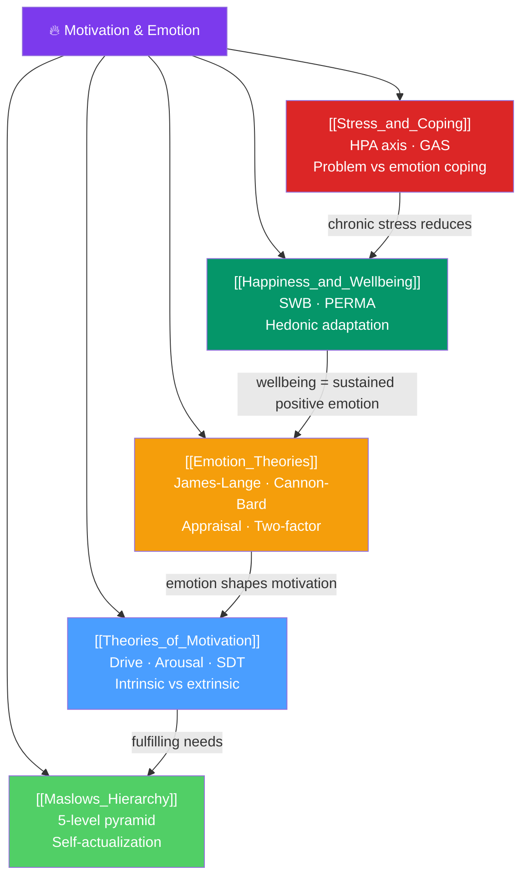

# 🗺️ Motivation and Emotion — Map of Content

> [!abstract] What This Section Covers
> Motivation and emotion are the engines of behavior — they explain *why* people act, persist, and feel as they do. Five notes cover: **theories of motivation** (the historical progression from drives to self-determination), **Maslow's hierarchy** (the most famous motivational model and its research status), **emotion theories** (James-Lange, Cannon-Bard, appraisal, and Schachter-Singer's two-factor), **stress and coping** (the physiology of stress and evidence-based coping strategies), and **happiness and wellbeing** (what actually predicts subjective wellbeing and flourishing). Together they answer: what drives humans, and what makes life feel worth living?

## Concept Map

## Learning Path

1. [[Theories_of_Motivation]] — The progression from drive reduction to self-determination theory; intrinsic vs. extrinsic motivation.
2. [[Maslows_Hierarchy]] — The five-level hierarchy; research evidence for and against; self-actualization.
3. [[Emotion_Theories]] — What emotions are, where they come from, and how culture shapes them.
4. [[Stress_and_Coping]] — The biology of stress, General Adaptation Syndrome, and evidence-based coping.
5. [[Happiness_and_Wellbeing]] — Hedonic adaptation, the set point theory, PERMA, and what actually makes people happy.

## All Notes at a Glance

| Note | Difficulty | What You'll Learn |
|------|------------|-------------------|
| [[Theories_of_Motivation]] | Beginner → Intermediate | Drive reduction, arousal theory, intrinsic/extrinsic, SDT, goal-setting theory |
| [[Maslows_Hierarchy]] | Beginner | Five levels, deficiency vs. growth needs, research evidence, cross-cultural challenges |
| [[Emotion_Theories]] | Intermediate | James-Lange, Cannon-Bard, Schachter-Singer two-factor, appraisal, discrete vs. dimensional |
| [[Stress_and_Coping]] | Intermediate | Stressors, GAS, HPA axis, cortisol effects, problem vs. emotion-focused coping, resilience |
| [[Happiness_and_Wellbeing]] | Beginner → Intermediate | SWB components, hedonic adaptation, set point, PERMA, what actually predicts happiness |

## Key Questions This Section Answers

- When does external reward undermine intrinsic motivation (overjustification effect)?
- What is the empirical evidence for Maslow's hierarchy? Are the levels really ordered?
- Do emotions cause physiological arousal, or does arousal cause emotion?
- Why does chronic stress impair immune function and memory?
- Why doesn't winning the lottery make people permanently happier?

## Related Sections

- [[_MOC_Psychology_Master|↑ Psychology Master MOC]]
- [[_MOC_Cognitive_Psychology|← Cognitive Psychology]] — Emotion affects attention, memory, and decisions
- [[_MOC_Clinical_Applied|→ Clinical & Applied]] — Stress and unhappiness underlie most clinical presentations

#MOC #Psychology #MotivationEmotion
