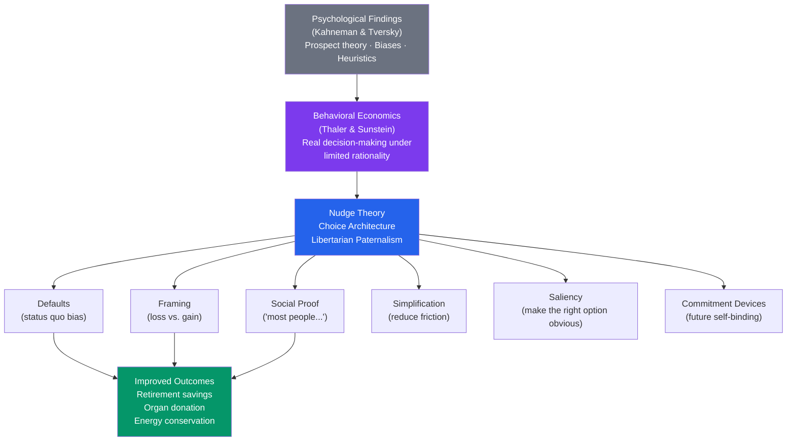

# 📊 Behavioral Economics and Psychology

> [!abstract] TL;DR
> Behavioral economics applies psychological insights — especially Kahneman and Tversky's findings on cognitive biases and prospect theory — to economic decision-making. Where standard economics assumes rational agents maximizing expected utility, behavioral economics documents how people actually decide: under cognitive limitations, loss aversion, status quo bias, and social influence. **Nudge theory** (Thaler and Sunstein) uses "choice architecture" to steer people toward better decisions without restricting their freedom — preserving libertarian choice while exploiting psychological tendencies for social good.

## Intuition — analogy FIRST

Standard economics assumes humans are like chess computers — they evaluate all options, calculate expected values, and choose the maximum.

Behavioral economics revealed that humans are more like chess players who haven't slept in 40 hours, are playing for something personally meaningful, are aware that other people are watching, and keep thinking about that terrible move they made 3 hours ago. The players *try* to be rational but are operating under cognitive and emotional constraints that systematically distort judgment.

The nudge insight: if you know *how* people's judgment gets distorted, you can design environments that work *with* those distortions rather than against them. You don't lecture tired chess players about better strategy — you design the tournament rules so the environmental defaults favor better play. "Default to enrollment; let people opt out" exploits status quo bias for retirement savings without removing anyone's freedom to choose.

---

## How It Works

## Key Concepts / Details

### Foundations: Psychology → Economics

**Standard economic model (homo economicus)**:
- Stable, well-defined preferences
- Maximizes expected utility
- Processes information completely and accurately
- Unaffected by irrelevant framing
- Discounts future rewards exponentially

**Behavioral economics violations**:
- Preferences are **reference-dependent** (prospect theory)
- People **satisfice**, not optimize (bounded rationality)
- **Attention is limited** — context and framing matter enormously
- **Hyperbolic discounting** — disproportionate preference for now over later
- **Social norms** influence economic behavior strongly

### Prospect Theory in Application (See also [[Problem_Solving_and_Decision_Making]])

**Loss aversion in practice**:
- People work harder to avoid losing $10 than to gain $10
- Investors hold losing stocks too long (avoiding realizing a loss) and sell winning stocks too early
- Contract framing: "Keep $300" vs "Lose $300 of $1000" — same outcome, very different emotional weight
- Marketing: "Don't miss out" outperforms "Take advantage of" for many segments

**Reference point manipulation**:
- The original price tag creates a reference point; a discount feels like a "gain from" a higher baseline
- "Normally $200, today $120" feels better than "Price: $120" even if the $200 was never real
- Salary negotiations: whoever anchors first has an advantage; the anchor is a reference point

**Status quo bias applied**:
- **Organ donation**: opt-in countries (USA, UK) have ~15% registration rates; opt-out countries (Austria, France) have ~90%+ — same freedom, different default, dramatically different outcomes
- **Retirement savings (Save More Tomorrow — SMarT)**: Thaler and Benartzi's program commits employees to automatically increase savings rate with each raise — precommitment to the future self. Enrollment doubled savings rates.
- **Cafeteria food placement**: positioning healthy food at eye level and first increases its selection by 25–35%

### Nudge Theory (Thaler & Sunstein, 2008)

**Definition**: any aspect of the choice architecture that alters people's behavior in a predictable way without forbidding any options or significantly changing their economic incentives.

**Libertarian paternalism**: preserve freedom of choice (libertarian) while steering choices toward better outcomes (paternalism). "A nudge is not a mandate."

**Core nudge techniques**:

| Technique | Psychological Mechanism | Example |
|---|---|---|
| **Defaults** | Status quo bias; loss aversion | Auto-enroll in retirement; opt-out organ donation |
| **Simplification** | Cognitive load reduction | Simple disclosure forms vs. 30-page legal documents |
| **Social norms** | Descriptive social proof | "90% of your neighbors pay their taxes on time" (HMRC) |
| **Salience** | Attentional effects | Calorie counts at point of purchase |
| **Framing** | Loss aversion; reference points | "You will lose $150 by not insulating" vs. "You will save $150" |
| **Pre-commitment** | Present bias; commitment devices | SMarT; commitment contracts for health behaviors |
| **Feedback** | Information availability | Smart meters showing energy use vs. neighbors |
| **Implementation intentions** | If-then planning reduces intention-action gap | "When will you get the vaccine? Where?" |

### Mental Accounting (Thaler, 1985)

People divide money into separate mental accounts and apply different rules to each:
- **Fungibility violation**: $100 found on the street feels different from $100 earned
- **Household income** treated as more "spendable" than savings even at same opportunity cost
- **Sunk cost preservation**: keeping tickets to a bad concert because "I already paid" — money is mentally un-fungible
- **Bonus spending**: year-end bonuses spent more freely than equivalent regular salary

**Applications**:
- Tax refunds are windfall money (mental account) → marketed spending opportunity vs. equivalent of overpaying withholding
- Gift cards create a spending mental account; people spend down to the card amount differently than if they had cash

### The Planning Fallacy

Systematic underestimation of time, costs, and risks of future actions (Kahneman & Tversky, 1979):
- Project managers consistently underestimate timelines by 25–50%
- Renovations, software projects, and infrastructure all routinely exceed budget
- **Inside view**: focus on project-specific details → optimism
- **Outside view (reference class forecasting)**: focus on the distribution of outcomes for similar projects → more accurate but less motivating

**Fix**: de-biasing via reference class forecasting (look at base rates for similar projects), pre-mortems, and explicit pessimism adjustment.

### Behavioral Economics and Policy

**EAST framework** (UK Behavioural Insights Team):
- **Easy**: simplify the process; reduce friction
- **Attractive**: make it personally relevant; salient
- **Social**: social proof; social norms
- **Timely**: well-timed interventions; implementation intentions

**Real-world policy applications**:

| Domain | Nudge | Impact |
|---|---|---|
| Retirement savings | Auto-enrollment with opt-out | US participation +80% in nudged plans |
| Organ donation | Opt-out defaults | +30 percentage points participation |
| Tax compliance | "9 out of 10 people in your area pay on time" | +15% compliance in UK trials |
| Energy conservation | Home energy report + neighbor comparison | 2–3% reduction in consumption |
| Healthy eating | Traffic light nutrition labels | Shift toward healthier choices |
| COVID vaccination | Text message with specific time slot | Higher uptake than general invitation |

### Ethical Concerns

**Manipulation concern**: nudges exploit cognitive biases without explicit informed consent. Is this paternalistic even if the outcome is good?

**Counter-arguments**:
- Choices must have a default anyway; the question is not whether to design the default, but how
- Nudges preserve freedom to opt out — stronger than mandates
- Full transparency is possible ("we auto-enroll at 6% because research shows this improves retirement outcomes; here's how to change it")

**Anti-nudges**: the same techniques are used commercially to exploit consumers (dark patterns in UX design, auto-renewals, pre-ticked checkboxes for upsells). Regulation increasingly targets dark patterns.

## Real-World Notes

- **UX dark patterns**: pre-ticked boxes, hidden unsubscribe, difficulty finding the "cancel" button — all exploit cognitive biases against user interests. GDPR and FTC regulation increasingly targets these.
- **Financial products**: credit card default minimum payments exploit present bias; 0% introductory rates exploit optimism and planning fallacy.
- **Healthcare**: pill boxes, reminders, simplified dosing instructions, and removing friction from medication refills all apply nudge principles to medication adherence.
- **Climate policy**: carbon taxes (price signal) combined with social norms ("your neighborhood reduced emissions by X") and default green energy enrollment are more effective than any single approach.

## Common Pitfalls

- **"Nudges are silver bullets"** — effect sizes are real but often modest (2–5%). They complement, not replace, structural changes (price signals, regulations).
- **"Nudging is always good"** — the same techniques can be used to exploit as to help. The ethics depend on whether the nudge aligns with the person's own long-term interests.
- **"Irrationality means randomness"** — behavioral economics shows systematic irrationality. Errors are predictable, which makes them designable around.

## Related Concepts

- [[_MOC_Clinical_Applied|↑ Section MOC]]
- [[Cognitive_Biases]] — The psychological findings that behavioral economics applies
- [[Problem_Solving_and_Decision_Making]] — Dual-process theory and prospect theory; the theoretical foundations
- [[Organizational_Psychology]] — Nudge architecture in organizations (default policies, incentive design)
- [[Attitudes_and_Persuasion]] — Cialdini's principles overlap substantially with nudge techniques
- Cross-vault: [[Game_Theory]] — Behavioral game theory extends standard game theory with realistic psychological assumptions

## Review Questions

1. A government wants to increase organ donation rates. Compare two approaches: (a) a public education campaign about the importance of donation, and (b) switching from opt-in to opt-out registration. Which does behavioral economics predict will be more effective, and why?
2. Thaler's mental accounting concept explains why people respond differently to a "tax rebate" check vs. equivalent reduced withholding each month. Describe the mental accounting mechanism involved and how a policymaker might exploit this to encourage saving.
3. "Nudges are paternalistic manipulation that should be banned." How would Thaler and Sunstein respond to this charge? Are they right? Give a counterargument.

## Sources

- Kahneman, D. & Tversky, A. (1979). "Prospect Theory." *Econometrica*, 47(2)
- Thaler, R.H. & Sunstein, C.R. (2008). *Nudge*. Yale University Press
- Thaler, R.H. & Benartzi, S. (2004). "Save More Tomorrow." *JPE*, 112(S1)
- Behavioural Insights Team, *Annual Report* (2017) — UK EAST framework

#psychology #behavioral-economics #nudge #prospect-theory #choice-architecture
