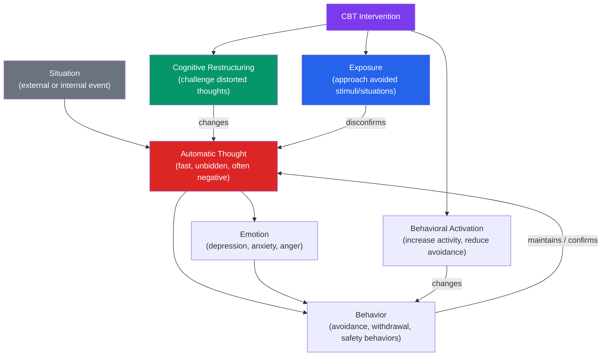

# 🧠 Cognitive Behavioral Therapy

> [!abstract] TL;DR
> CBT is the most extensively validated psychotherapy, demonstrated effective across anxiety disorders, depression, eating disorders, PTSD, OCD, and more. It is based on Beck's cognitive model: psychological distress is maintained by maladaptive thinking patterns (cognitive distortions) that can be identified, challenged, and changed. The behavioral component uses evidence-based techniques (exposure, behavioral activation, behavioral experiments) to directly modify behavior and test beliefs. Modern CBT has evolved into a family of therapies including DBT, ACT, and mindfulness-based approaches.

## Intuition — analogy FIRST

Imagine a computer running faulty antivirus software.

The software (automatic thought patterns) scans every new experience and flags false threats constantly. "Someone didn't say good morning → they hate me." "I made a mistake → I'm incompetent." "I'm feeling anxious → something terrible is about to happen." The computer slows down, avoids running certain programs (social situations, challenging tasks), and gradually its capabilities shrink.

CBT is like hiring a software engineer to audit the antivirus code. First, you identify exactly what the faulty rules are (cognitive assessment). Then you test them against reality (behavioral experiments). You reprogram the rules that are clearly wrong (cognitive restructuring). And you run the programs the computer was avoiding to rebuild capability (behavioral activation, exposure).

The key insight: thoughts are not facts. The goal is not "positive thinking" but **accurate thinking** — and developing the skill to examine automatic thoughts rather than accept them uncritically.

---

## How It Works

## Key Concepts / Details

### Beck's Cognitive Model

Aaron Beck (1960s) developed cognitive therapy while treating depressed patients. He noticed they had a stream of **automatic thoughts** — unbidden, often negative, and accepted as facts without examination.

**The cognitive triad of depression**:
1. Negative view of self ("I am worthless")
2. Negative view of the world ("Everything is hopeless and unfair")
3. Negative view of the future ("Things will never get better")

**Cognitive levels**:
- **Automatic thoughts**: immediate, spontaneous, specific ("I'm going to fail this presentation")
- **Intermediate beliefs**: rules and assumptions ("I must be perfect to be worthwhile"; "If I fail, everyone will abandon me")
- **Core beliefs (schemas)**: deep, globally held beliefs about self, world, others ("I am unlovable"; "The world is dangerous"; "Others are untrustworthy")

Deeper levels are more fundamental, more stable, and harder to change — but also the source of patterns across situations.

### Ellis's Rational Emotive Behavior Therapy (REBT)

Albert Ellis developed REBT independently and contributed the **ABC model**:

| Letter | Element | Example |
|---|---|---|
| **A** | Activating event | Received critical feedback at work |
| **B** | Belief (rational or irrational) | "This means I'm a failure and nobody respects me" |
| **C** | Consequence (emotion + behavior) | Depression; avoided speaking in next meeting |

**Rational Disputation (D)**: challenge irrational beliefs → **E**ffective new belief → **F**eel different

Ellis emphasized **irrational beliefs**: musterbation ("I *must* be loved by everyone"), awfulizing ("It would be *awful* if I failed"), low frustration tolerance, and global self-rating.

### Cognitive Distortions (Beck and Burns)

Systematic errors in thinking that maintain emotional disorders:

| Distortion | Description | Example |
|---|---|---|
| **All-or-nothing thinking** | Black/white, no middle ground | "If I'm not perfect, I'm a complete failure" |
| **Catastrophizing** | Predict worst possible outcome | "If I panic in public, it will be absolutely unbearable" |
| **Mind reading** | Assume you know others' thoughts | "She didn't reply — she must be angry with me" |
| **Fortune telling** | Predict negative future | "I know I'll mess up the interview" |
| **Emotional reasoning** | Feelings = facts | "I feel stupid, therefore I must be stupid" |
| **Should statements** | Rigid demands on self/others | "I should always be productive" |
| **Personalization** | Blame self for external events | "My team failed because of me" |
| **Mental filter** | Focus on one negative, ignore positives | Dwelling on one mistake in an otherwise good performance |
| **Overgeneralization** | One event → broad pattern | "I failed once → I always fail" |
| **Labeling** | Attach global negative label | "I'm an idiot" vs. "I made a mistake" |
| **Minimization/magnification** | Shrink positives, enlarge negatives | "Anyone could have done that" / "One mistake ruins everything" |

### Core CBT Techniques

**Thought records (dysfunctional thought record)**:
1. Identify the situation
2. Note the automatic thought
3. Note the emotion and its intensity (0–100%)
4. Identify supporting evidence
5. Identify contradicting evidence
6. Develop a balanced, alternative thought
7. Re-rate emotion intensity

**Behavioral experiments**: real-world tests of negative predictions. "If I contribute in the meeting, people will laugh at me." Design an experiment: contribute a comment, observe actual response. Most negative predictions are disconfirmed.

**Exposure therapy** (for anxiety disorders): systematic, graduated confrontation with feared stimuli. Two mechanisms:
- **Habituation**: repeated non-reinforced exposure decreases conditioned fear response
- **Inhibitory learning** (modern view): new, non-threatening associations formed alongside fear memory; retrieval depends on context

**Behavioral activation** (for depression): schedule pleasurable and meaningful activities, beginning regardless of motivation. "Act the way you want to feel." Activation counteracts avoidance and withdrawal — key maintaining factors in depression.

**Problem solving therapy**: structured approach to real-world problems (identify problem, generate solutions, evaluate, implement, review).

**Relaxation and physiological techniques**: progressive muscle relaxation, diaphragmatic breathing, paced respiration — reduce physiological arousal that maintains anxiety.

### Evidence Base

CBT is the most extensively validated psychotherapy:

| Disorder | Effect Size vs. Control | Notes |
|---|---|---|
| **Major Depression** | d ≈ 0.8 | Equivalent to medication; more durable |
| **GAD** | d ≈ 0.8–1.0 | Superior to supportive therapy |
| **Panic Disorder** | d ≈ 1.0–1.5 | Among most effective; brief treatment often sufficient |
| **Social Anxiety** | d ≈ 0.8 | Exposure + cognitive restructuring key |
| **PTSD** | d ≈ 1.0–1.4 | Prolonged Exposure and CPT both evidence-based |
| **OCD** | d ≈ 1.0–1.5 | ERP (Exposure with Response Prevention) = gold standard |
| **Bulimia** | Response rate ~50–60% | CBT-E is first-line |

**Durability**: CBT effects persist longer than medication effects after treatment ends — learning new cognitive and behavioral skills provides protection against relapse.

**Delivery**: increasingly effective via internet-delivered CBT (iCBT), apps, and self-help materials — dramatically expanding access.

### The CBT Family — Extensions

| Therapy | Developer | Key Addition |
|---|---|---|
| **DBT** (Dialectical Behavior Therapy) | Marsha Linehan | Distress tolerance, emotion regulation, interpersonal effectiveness, mindfulness — for BPD |
| **ACT** (Acceptance and Commitment Therapy) | Steven Hayes | Psychological flexibility; defusion; committed action toward values — don't fight thoughts, change your relationship with them |
| **MBCT** (Mindfulness-Based Cognitive Therapy) | Segal, Williams, Teasdale | Mindfulness + CBT for depression relapse prevention |
| **CFT** (Compassion-Focused Therapy) | Paul Gilbert | Self-compassion; threat regulation; for shame-heavy presentations |
| **Schema Therapy** | Jeffrey Young | Deep-seated schemas from childhood; mode work for personality disorders |

## Real-World Notes

- **Self-help applications**: CBT principles are accessible without a therapist through workbooks (*Feeling Good* by Burns; *Overcoming* series) and apps (Woebot, MoodKit). Apps show moderate effects for mild-moderate depression/anxiety.
- **Business coaching**: cognitive restructuring, thought records, and behavioral experiments are directly applicable in executive coaching to address performance anxiety, imposter syndrome, and decision-making patterns.
- **Design applications**: CBT for health behavior change (smoking cessation, dietary change, exercise) uses the same cognitive model — identify maintaining thoughts ("I've already failed so I may as well eat the cake"), restructure them, plan behavioral activation.
- **Organizational psychology**: CBT-informed communication training addresses cognitive distortions in interpersonal conflict — "mind reading" ("my manager is out to get me") and catastrophizing ("if I give honest feedback, my team will hate me").

## Common Pitfalls

- **"CBT means positive thinking"** — CBT aims for *accurate* thinking, not positive. The goal is to identify distortions and find a more balanced, evidence-based view.
- **"CBT ignores emotions"** — CBT works extensively with emotions; the cognitive model says that changing thoughts changes emotions. The behavioral arm directly regulates emotion through activation and exposure.
- **"CBT only works for mild problems"** — CBT (and its derivatives like DBT) is effective for severe disorders including PTSD, BPD, and treatment-resistant depression.

## Related Concepts

- [[_MOC_Clinical_Applied|↑ Section MOC]]
- [[Psychological_Disorders_Overview]] — The disorders CBT is the primary treatment for
- [[Cognitive_Biases]] — Cognitive distortions in CBT are the clinical form of cognitive biases in cognitive psychology
- [[Emotion_Theories]] — Cognitive reappraisal is the CBT mechanism applied to emotion regulation
- [[Positive_Psychology]] — ACT and positive psychology share values-based action orientation
- [[Stress_and_Coping]] — CBT addresses the cognitive appraisals that amplify stress responses

## Review Questions

1. Trace Beck's cognitive triad of depression through an example: a student gets a C on an exam. Show how each element of the triad (self, world, future) would generate a specific automatic thought, and describe the cognitive distortion involved.
2. A person with social anxiety predicts that speaking up in a meeting will result in people thinking they are stupid. Design a behavioral experiment that would test this prediction. What would you predict actually happens, and how does this challenge the original automatic thought?
3. What is the difference between CBT and ACT in terms of how they approach automatic thoughts? Why might ACT be more appropriate than standard CBT for a patient with chronic pain who cannot actually make the pain go away?

## Sources

- Aaron Beck, *Cognitive Therapy and the Emotional Disorders* (1976)
- Burns, D.D. (1980). *Feeling Good: The New Mood Therapy*. William Morrow
- Clark, D.M. & Fairburn, C.G. (1997). *Science and Practice of Cognitive Behaviour Therapy*. Oxford
- Hayes, S.C. et al. (1999). *Acceptance and Commitment Therapy*. Guilford

#psychology #clinical-psychology #CBT #cognitive-behavioral-therapy #beck
