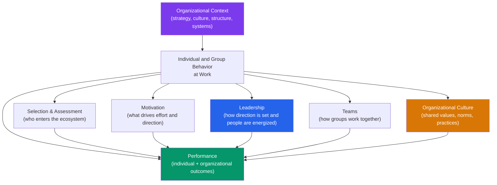

# 🏢 Organizational Psychology

> [!abstract] TL;DR
> Organizational psychology (I-O psychology) applies psychological science to work and organizations — how to select, develop, motivate, and lead people effectively. Key domains: job design and motivation, leadership theory, team dynamics, organizational culture, performance management, and selection. Evidence-based insights consistently challenge management intuitions: money is not the primary motivator for complex work, performance reviews as typically practiced are counterproductive, and cultural fit matters as much as technical skills.

## Intuition — analogy FIRST

Think of an organization as an ecosystem.

The formal structure (org chart, job descriptions, policies) is like the geography of the ecosystem — the rivers and mountains. But the actual behavior of the organisms (employees) is determined by the full ecology: the quality of food available (resources, development opportunities), the social dynamics (team culture, trust), the predator-prey relationships (competitive dynamics, power), the climate (leadership tone, psychological safety), and the species history (organizational culture, rituals).

You cannot change outcomes in an ecosystem by changing only the geography. You change outcomes by understanding and thoughtfully redesigning the full ecology. That's what organizational psychology does — it uses rigorous science to understand and improve the full human ecosystem of work.

---

## How It Works

## Key Concepts / Details

### Job Design and Motivation

**Hackman & Oldham's Job Characteristics Model (1976)**:

Five core job dimensions → three critical psychological states → outcomes:

| Job Dimension | Psychological State | Outcomes |
|---|---|---|
| **Skill variety** | Meaningfulness of work | High intrinsic motivation |
| **Task identity** (whole piece) | Meaningfulness | High performance quality |
| **Task significance** | Meaningfulness | High job satisfaction |
| **Autonomy** | Responsibility for outcomes | Low absenteeism and turnover |
| **Feedback** | Knowledge of results | High-quality decision-making |

**Motivating Potential Score (MPS)**: (skill variety + task identity + task significance)/3 × autonomy × feedback

High-MPS jobs produce higher intrinsic motivation, satisfaction, and performance — especially for people high in "growth need strength" (desire for challenge and development).

**Job crafting** (Wrzesniewski & Dutton, 2001): employees proactively reshape job tasks, relationships, and meaning cognitions to align with their strengths and interests. Predicts engagement, wellbeing, and performance.

### Motivation at Work

**Theory X vs. Theory Y** (McGregor, 1960):
- **Theory X**: people inherently dislike work; must be controlled, directed, and threatened. Leads to micromanagement, close supervision.
- **Theory Y**: people can enjoy work; intrinsic motivation is possible; self-direction and creativity are underutilized resources. Leads to autonomy, participation, and development.

Evidence strongly supports Theory Y assumptions for complex, creative work — consistent with SDT (see [[Theories_of_Motivation]]).

**Herzberg's Two-Factor Theory**:
- **Hygiene factors** (absence causes dissatisfaction; presence doesn't motivate): pay, job security, working conditions, supervision quality
- **Motivators** (presence causes satisfaction and motivation): achievement, recognition, the work itself, responsibility, advancement

**Implication**: you must address hygiene factors to prevent dissatisfaction, but adding more hygiene doesn't create motivation. Only motivators (intrinsic factors) create genuine engagement. Consistent with SDT and Maslow.

**Expectancy Theory (Vroom, 1964)**:
Motivation = Expectancy × Instrumentality × Valence
- **Expectancy**: Can I perform the behavior if I try? (belief in capability)
- **Instrumentality**: Will the behavior lead to the outcome? (trust in contingency)
- **Valence**: Do I value the outcome? (value of the reward)

**Break any link → zero motivation**: a talented person who doesn't believe they'll get the promotion regardless of performance has zero instrumentality → zero motivation for the promotion.

### Leadership Theory

**Trait approach**: early theories identified leader traits (intelligence, extraversion, dominance, integrity). Meta-analysis: leader traits account for ~30% of variance in leadership effectiveness — necessary but insufficient.

**Behavioral approaches** (Ohio State, Michigan studies): two independent dimensions of leadership behavior:
- **Task/initiating structure**: defining roles, assigning tasks, organizing work
- **Consideration/relationship orientation**: showing concern for followers, building trust, supporting

**Situational Leadership** (Hersey & Blanchard): optimal style depends on follower development level:

| Follower Level | Directive Behavior | Supportive Behavior | Style |
|---|---|---|---|
| Low competence, high commitment | High | Low | Telling/Directing |
| Some competence, low commitment | High | High | Selling/Coaching |
| Moderate-high competence, variable | Low | High | Participating/Supporting |
| High competence, high commitment | Low | Low | Delegating |

**Transformational vs. Transactional Leadership** (Bass, 1985):

| | Transformational | Transactional |
|---|---|---|
| Mechanism | Inspire intrinsic motivation; articulate vision | Contingent reward/punishment; manage exceptions |
| Impact on followers | Intrinsically motivated; go beyond role requirements | Comply with requirements |
| Cultural effect | Creates shared purpose; culture change | Maintains current culture |
| Evidence | Strong positive effects on performance, satisfaction, OCB | Moderate positive effects |

**4 I's of Transformational Leadership**:
1. **Idealized influence** (charisma)
2. **Inspirational motivation** (compelling vision)
3. **Intellectual stimulation** (encourage questioning)
4. **Individualized consideration** (mentor each follower)

**Psychological safety** (Edmondson, 1999): team members' belief that it is safe to take interpersonal risks (speak up, disagree, report errors) without fear of punishment or humiliation. Google's Project Aristotle found psychological safety was the single strongest predictor of team performance across 180 teams.

### Organizational Culture

**Schein's Model of Organizational Culture** (1985):

| Level | Description | Visibility |
|---|---|---|
| **Artifacts** | Visible structures, processes, behaviors | Visible but hard to decipher |
| **Espoused values** | Stated strategies, goals, philosophies | Somewhat visible |
| **Basic underlying assumptions** | Unconscious, taken-for-granted beliefs | Invisible; must be inferred |

Culture change is difficult precisely because basic assumptions are invisible and taken as reality, not as values.

**Strong vs. weak cultures**: strong cultures (high consensus, high intensity) produce more predictable behavior and can drive performance — but also amplify dysfunctional norms (toxic strong cultures are worse than weak ones).

### Performance Management

**Problems with annual performance reviews**:
- Leniency bias: 60%+ of performance variance is explained by the rater, not the ratee — what you think of someone biases all your ratings
- Halo effect: one positive attribute colors overall assessment
- Recency bias: recent events dominate annual recall
- Forced ranking produces coercive competition and undermines collaboration

**Evidence-based PM practices**:
- Frequent, ongoing feedback vs. annual review
- Behavioral anchored rating scales (BARS) reduce subjectivity
- 360-degree feedback (multiple raters) for development (not compensation)
- Separate development conversations from compensation conversations
- Focus on goals, learning, and growth rather than judgment

### Selection and Assessment

**Validity of selection methods** (Schmidt & Hunter meta-analysis):

| Method | Predictive Validity (r with job performance) |
|---|---|
| Structured interview | .51 |
| Work sample test | .54 |
| Cognitive ability test | .51 |
| Unstructured interview | .38 |
| Reference checks | .26 |
| Years of education | .10 |

**Key finding**: unstructured interviews (which most organizations use) are less valid than structured ones. Bias — recency, halo, confirmation — contaminates unstructured evaluation. Structured interviews with pre-defined questions and behavioral anchors dramatically improve prediction.

**Realistic Job Preview (RJP)**: providing honest information about both positive and negative aspects of a job reduces turnover by setting realistic expectations.

## Real-World Notes

- **Remote work**: reduces commuting stress (wellbeing ↑) but risks isolation (relatedness need unmet), blurred boundaries (work-life imbalance), and weakened culture. Hybrid models emerging as a balance.
- **Burnout prevention** (Maslach's model): burnout has three components — exhaustion, cynicism, inefficacy. Intervene at the organizational level (workload, control, reward, community, fairness, values) not just the individual level.
- **Diversity and inclusion**: diverse teams perform better on creative problem-solving — but only when inclusion is high (psychological safety to contribute diverse perspectives). Diversity without inclusion = performance drag.
- **Manager quality**: the most consistent predictor of employee engagement, retention, and wellbeing is the quality of the immediate manager — not company brand, pay, or culture broadly. "People don't leave companies; they leave managers."

## Common Pitfalls

- **"Culture eats strategy"** — common but oversimplified. Culture and strategy need to be aligned; neither alone is sufficient.
- **"Pay people well and they'll perform"** — pay is a hygiene factor for knowledge workers. Below-market pay causes dissatisfaction; market pay is necessary but not motivating. See Herzberg.
- **"Annual performance reviews are objective"** — they are heavily contaminated by rater characteristics, recency bias, and organizational politics. They are not adequate for either development or compensation decisions without structural safeguards.

## Related Concepts

- [[_MOC_Clinical_Applied|↑ Section MOC]]
- [[Theories_of_Motivation]] — SDT, expectancy theory, and intrinsic motivation are the theoretical foundations
- [[Group_Dynamics]] — Team dynamics, groupthink, and social facilitation all operate in organizations
- [[Behavioral_Economics_Psychology]] — Nudge architecture in HR policy; default enrollment; choice design
- [[Positive_Psychology]] — PsyCap, job crafting, strengths-based management
- [[Social_Influence_and_Conformity]] — Obedience, authority, and ethical culture in organizations
- [[Attachment_Theory]] — Leader-follower relationships have attachment-like properties

## Review Questions

1. Using the Job Characteristics Model, explain why a customer service representative answering scripted calls all day is likely to show low intrinsic motivation. Redesign the job using each of the five core dimensions to increase its motivating potential.
2. Edmondson found that the best teams at Google were not the ones with the smartest people, but those with the highest psychological safety. What is psychological safety, and what specific leader behaviors create or destroy it?
3. A meta-analysis shows that structured interviews are far more predictive of job performance than unstructured ones. Why do most organizations still use unstructured interviews, and what biases contaminate the unstructured format?

## Sources

- Hackman, J.R. & Oldham, G.R. (1976). "Motivation through the design of work." *Organizational Behavior and Human Performance*
- Edmondson, A. (1999). "Psychological safety and learning behavior in work teams." *ASQ*
- Bass, B.M. (1985). *Leadership and Performance Beyond Expectations*. Free Press
- Schmidt, F.L. & Hunter, J.E. (1998). "The validity and utility of selection methods in personnel psychology." *Psychological Bulletin*

#psychology #organizational-psychology #I-O-psychology #leadership #motivation #job-design
