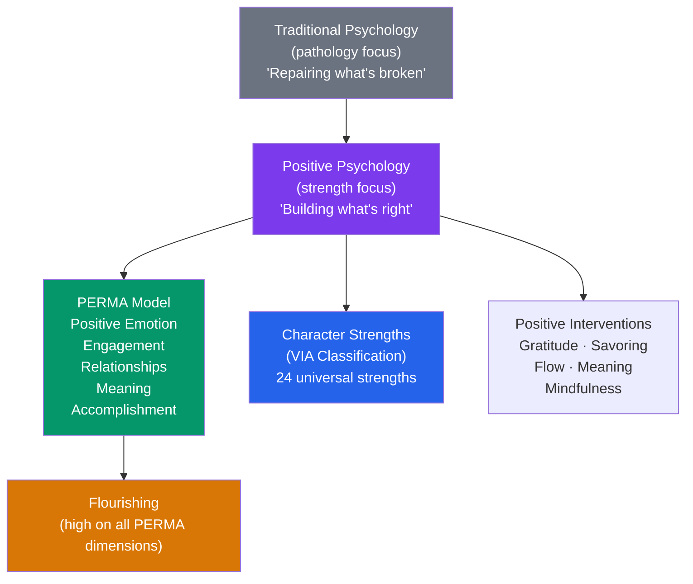

# 🌟 Positive Psychology

> [!abstract] TL;DR
> Positive psychology is the scientific study of what makes life worth living — strengths, virtues, wellbeing, and flourishing rather than just diagnosing and treating pathology. Founded by Martin Seligman in 1998, it has produced empirically-supported interventions: gratitude practices, strengths use, meaning cultivation, and flow optimization. It extends Maslow's humanistic tradition with rigorous experimental methods, correcting psychology's historic negative bias without abandoning scientific standards.

## Intuition — analogy FIRST

Traditional psychology studied what goes wrong with the human mind — it was like a medical field entirely focused on disease. A patient was "healthy" if they weren't sick.

Positive psychology asked: is "not depressed" the same as "flourishing"? Can we study not just the *absence* of suffering but the *presence* of joy, meaning, and human excellence?

Think of it as the difference between studying soil that produces no crops (what's wrong with it?) versus studying what makes extraordinarily fertile soil (what's right with it?). Both are valuable. Psychology had decades of pathology research and very little rigorous science about what makes people thrive.

Seligman's provocation: "I can make you less miserable. But making you happy requires a completely different science."

---

## How It Works

## Key Concepts / Details

### Seligman's Three Orientations to Life (Pre-PERMA)

Early Seligman (2002) proposed three pathways to the "good life":
1. **Pleasant life**: maximize positive emotion
2. **Engaged life**: find and use signature strengths (flow)
3. **Meaningful life**: belong to and serve something larger than yourself

He found that **meaning and engagement** predicted life satisfaction more than positive emotion alone — and that happiness alone (hedonic) is insufficient for deep flourishing. This led to PERMA.

### PERMA Framework

**P — Positive Emotion**: broaden-and-build; not just happiness but joy, gratitude, serenity, interest, hope, pride, awe, inspiration, love. (Fredrickson's broaden-and-build theory supports this pillar.)

**E — Engagement**: flow states — complete absorption in optimally challenging activity. Csikszentmihalyi's flow requires: clear goals, immediate feedback, challenge/skill balance. When in flow, self-consciousness disappears, time distorts.

**R — Relationships**: "other people matter." Close, authentic relationships are the single strongest predictor of wellbeing (Harvard Study of Adult Development, 80+ years). Even brief positive social interactions contribute.

**M — Meaning**: belonging to and serving something larger than yourself. Religion, cause, family, organization, art. Viktor Frankl's logotherapy (developed in Auschwitz): humans can endure almost anything if they have *why* — but meaninglessness is lethal.

**A — Accomplishment**: pursuing achievement, mastery, and competence for their own sake. Not just for external rewards — the satisfaction of doing something difficult well. Growth mindset orientation.

### Character Strengths — VIA Classification

Peterson and Seligman (2004) developed the **VIA (Values in Action)** classification of 24 character strengths organized under 6 virtues, based on cross-cultural philosophical analysis:

| Virtue | Character Strengths |
|---|---|
| **Wisdom** | Creativity, Curiosity, Judgment, Love of learning, Perspective |
| **Courage** | Bravery, Perseverance, Honesty, Zest |
| **Humanity** | Love, Kindness, Social intelligence |
| **Justice** | Teamwork, Fairness, Leadership |
| **Temperance** | Forgiveness, Humility, Prudence, Self-regulation |
| **Transcendence** | Appreciation of beauty, Gratitude, Hope, Humor, Spirituality |

**Signature strengths**: the top 3–5 strengths that feel most authentic, energizing, and essential to identity. Using signature strengths in novel ways is one of the most replicable positive psychology interventions.

**Research findings on strengths use**:
- Using signature strengths predicts higher wellbeing, engagement, and goal achievement
- Strengths use buffers against depression and stress
- Building strengths is more effective for wellbeing than fixing weaknesses (controversial — domain dependent)
- Cross-cultural universality of the 24 strengths has been demonstrated across 75+ countries

### Evidence-Based Positive Interventions

**Gratitude interventions**:
- **Three good things**: each day, write down 3 good things that happened and their causes. Effect size d ≈ 0.4–0.5 for wellbeing; effects persist for 6 months.
- **Gratitude letter and visit**: write a letter of gratitude to someone who helped you, then visit and read it aloud. Large immediate effect; effects substantial 1 month later (Seligman et al., 2005).

**Strengths use**: identify signature strengths (VIA-IS) and use one in a new way daily for one week. Sustained wellbeing increases for up to 6 months.

**Best possible self**: write about your life going as well as possible in all areas. Increases optimism; effects moderate.

**Mindfulness**: reduces stress, anxiety, and depression; increases positive affect and self-compassion. See [[States_of_Consciousness]].

**Meaning-based interventions**: identifying life purpose, journaling about meaning, values clarification.

**Savoring**: deliberately attending to and appreciating positive experiences rather than rushing through them. Bryant & Veroff: sharing with others, sensory-perceptual sharpening, and temporal awareness all enhance savoring.

**Social connection**: spending $20 prosocially (on others) rather than on self produces higher wellbeing across cultures.

### Criticism and Limitations

| Criticism | Response |
|---|---|
| **"Toxic positivity"** — forced positive thinking ignores real suffering | Genuine positive psychology acknowledges negative emotions; ACT and meaning-based approaches work with suffering |
| **Replication crisis** — some positive interventions (gratitude, best possible self) show modest effect sizes and poor replication | The field has strengthened its methodology; effect sizes are real but modest (~d = 0.3–0.5) |
| **Culture-bound** — PERMA and individualistic strengths framework may not apply cross-culturally | Some evidence for cross-cultural universality; cultural adaptation needed |
| **Selection bias** — interventions work better for already-high wellbeing individuals | Fair; positive psychology complements rather than replaces clinical treatment for disorder |
| **Neglects structural factors** — individual happiness interventions don't address poverty, discrimination, etc. | A legitimate critique; individual-level and policy-level approaches both necessary |

### Positive Psychology in Organizations

**HERO qualities** (Luthans): Hope, Efficacy, Resilience, and Optimism — collectively called **Psychological Capital (PsyCap)**. Trainable, predicts job performance, job satisfaction, and retention.

**Positive organizational scholarship (Cameron, Dutton)**: studying optimal functioning in organizations — thriving, resilience, positive energy. Organizations with high positive energy networks show higher financial performance.

**Job crafting**: employees proactively reframe, redesign, and develop their work to align with strengths and values. Predicts engagement and wellbeing. See [[Organizational_Psychology]].

## Real-World Notes

- **Education**: strengths-based teaching (identify and develop what students are good at) produces better engagement and achievement than purely remediation-focused approaches.
- **Coaching**: most executive coaching uses positive psychology frameworks — strengths, values clarification, goal setting toward a positive vision rather than fixing deficits.
- **Product design**: designing for flow (challenge/skill balance, clear goals, feedback) creates products people engage deeply with rather than superficially.
- **Healthcare**: positive emotions predict faster recovery from surgery, better medication adherence, stronger immune function, and longer life expectancy. Not just "feeling good" — a health outcome.

## Common Pitfalls

- **"Positive psychology = happiness hacking"** — serious positive psychology is empirically rigorous and includes meaning, engagement, and relationships — not just pleasant feelings.
- **"Weakness improvement is unimportant"** — strengths-first doesn't mean ignore weaknesses. In technical domains (surgery, engineering), weakness improvement is critical; in leadership and interpersonal domains, strengths development often yields higher ROI.
- **"Gratitude journaling works for everyone"** — some individuals (particularly those with depression or trauma) find gratitude exercises aversive. Clinical judgment required; not a universal prescription.

## Related Concepts

- [[_MOC_Clinical_Applied|↑ Section MOC]]
- [[Happiness_and_Wellbeing]] — The research base positive psychology draws on
- [[Theories_of_Motivation]] — Intrinsic motivation, SDT, and flourishing are deeply connected
- [[Cognitive_Behavioral_Therapy]] — Positive psychology approaches (ACT, MBCT) extend the CBT tradition
- [[Organizational_Psychology]] — PsyCap, job crafting, and strengths-based management
- [[Maslows_Hierarchy]] — Positive psychology is the empirical successor to Maslow's humanistic tradition

## Review Questions

1. What is the difference between the "pleasant life," the "engaged life," and the "meaningful life" in Seligman's early framework? Why did Seligman conclude that happiness alone (pleasant life) was insufficient, and how did this lead to PERMA?
2. Design a 4-week wellbeing program for a team of 20 knowledge workers using three different evidence-based positive interventions. Specify what evidence supports each intervention and what you would measure to evaluate success.
3. What are the four components of Luthans's Psychological Capital (PsyCap), and how does each of them differ from fixed trait personality measures in terms of trainability?

## Sources

- Martin Seligman, *Authentic Happiness* (2002); *Flourish* (2011)
- Seligman, M.E.P. et al. (2005). "Positive psychology progress." *American Psychologist*, 60(5), 410–421
- Peterson, C. & Seligman, M.E.P. (2004). *Character Strengths and Virtues*. APA Press
- Luthans, F. et al. (2007). *Psychological Capital*. Oxford University Press

#psychology #positive-psychology #PERMA #character-strengths #VIA #flourishing
