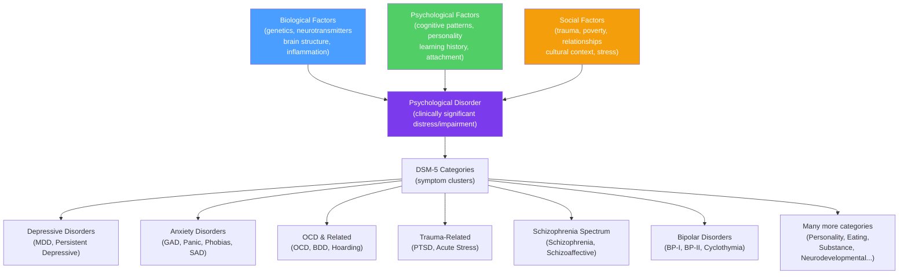

# 🏥 Psychological Disorders Overview

> [!abstract] TL;DR
> A psychological disorder is a clinically significant disturbance in cognition, emotion regulation, or behavior that causes distress or impairment. The DSM-5 organizes ~300 disorders into 20+ categories based on symptom clusters, not etiology. The **biopsychosocial model** recognizes that all disorders emerge from the interaction of biological vulnerability, psychological factors, and social context. Understanding disorder categories is necessary for treatment planning; the stigma associated with mental illness remains a significant barrier to care.

## Intuition — analogy FIRST

A medical diagnosis for a broken bone is clear — X-ray shows the fracture, the bone is the unit of analysis. Psychological disorders are more like chronic pain — real, disabling, and requiring treatment, but without a single biomarker or clear boundary between "healthy" and "disordered."

The DSM-5 is best understood as a **clinical consensus document** — a shared vocabulary that enables practitioners to communicate and researchers to study. Like the ICD medical codes for physical diseases, it defines categories by symptom clusters that tend to co-occur, respond to similar treatments, and follow similar courses. It does not claim these are natural kinds (carved at nature's joints), and it does not explain *causes* — depression listed in the DSM is not a cause but a description.

The "disorder" label requires three elements: **clinically significant** symptoms (not normal variation), **distress or impairment** (the person is suffering or unable to function), and **not explainable by normal development or culture** (grief is not depression; culture-specific behavior is not delusion).

---

## How It Works

## Key Concepts / Details

### Defining Psychological Disorders

**DSM-5 definition**: a syndrome characterized by clinically significant disturbance in an individual's cognition, emotion regulation, or behavior that reflects a dysfunction in the psychological, biological, or developmental processes underlying mental functioning.

**The 4 D's (informal framework)**:
- **Deviance**: behavior that differs significantly from cultural norms
- **Dysfunction**: impairs ability to work, study, or maintain relationships
- **Distress**: significant subjective suffering
- **Danger**: potential harm to self or others

All four are not always required; cultural relativity complicates "deviance."

### The Biopsychosocial Model

**Biological diathesis**: genetic predisposition, neurochemical imbalances, brain structure anomalies. Example: serotonin transporter gene variant predicts depression risk, especially under stress (5-HTTLPR).

**Psychological factors**: maladaptive thinking patterns, emotion regulation deficits, low self-efficacy, attachment styles.

**Social factors**: childhood adversity (ACEs — Adverse Childhood Experiences), poverty, discrimination, social isolation, relationship conflict, cultural factors.

**Diathesis-stress model**: a biological vulnerability (diathesis) is activated by environmental stressors to produce disorder. A person with high genetic risk may develop depression only under severe stress; a person with low genetic risk may only develop it under extreme circumstances.

### Major DSM-5 Disorder Categories

**Depressive Disorders**:
- **Major Depressive Disorder (MDD)**: ≥5 symptoms for ≥2 weeks including depressed mood or anhedonia; most common mental disorder worldwide
- **Persistent Depressive Disorder (PDD)**: less severe but chronic (≥2 years)

| Symptom Domain | Key Symptoms |
|---|---|
| Mood | Depressed mood, tearfulness, emptiness |
| Motivation | Anhedonia (inability to feel pleasure), loss of interest |
| Cognitive | Poor concentration, worthlessness, guilt, hopelessness |
| Somatic | Fatigue, sleep disturbance, appetite change, psychomotor changes |
| Severe | Suicidal ideation or behavior |

**Anxiety Disorders**:
- **Generalized Anxiety Disorder (GAD)**: excessive, uncontrollable worry about multiple topics; physiological tension
- **Panic Disorder**: recurrent unexpected panic attacks + anticipatory anxiety about future attacks
- **Social Anxiety Disorder (SAD)**: marked fear of social situations involving evaluation; extremely common (~13% lifetime)
- **Specific Phobias**: intense fear of specific objects/situations; highly treatable (exposure therapy)
- **Agoraphobia**: fear of situations where escape might be difficult

**OCD and Related Disorders**:
- **OCD**: obsessions (intrusive, distressing thoughts) + compulsions (repetitive behaviors to neutralize anxiety). Distinct neural circuitry (cortico-striato-thalamo-cortical loops)
- **Body Dysmorphic Disorder (BDD)**: preoccupation with perceived defects in physical appearance
- **Hoarding Disorder**: persistent difficulty discarding possessions

**Trauma- and Stressor-Related Disorders**:
- **PTSD**: following trauma exposure, develops intrusion symptoms (flashbacks, nightmares), avoidance, negative cognition/mood changes, and hyperarousal lasting ≥1 month
- **Acute Stress Disorder**: similar presentation lasting 3 days–1 month post-trauma
- **Adjustment Disorder**: emotional/behavioral symptoms in response to identifiable stressor, disproportionate to the stressor's magnitude

**Schizophrenia Spectrum**:
- **Positive symptoms**: hallucinations (typically auditory), delusions, disorganized thinking/speech/behavior
- **Negative symptoms**: flat affect, alogia (reduced speech), avolition, anhedonia, asociality
- Lifetime prevalence ~1%; significant disability; dopamine excess in mesolimbic system underlies positive symptoms

**Bipolar Disorders**:
- **Bipolar I**: ≥1 manic episode (elevated/irritable mood + increased energy for ≥1 week; often with depressive episodes)
- **Bipolar II**: hypomanic (less severe) + depressive episodes; often misdiagnosed as unipolar depression
- **Cyclothymia**: milder cycling over ≥2 years

**Personality Disorders** (enduring patterns of inner experience and behavior):

| Cluster | Disorders | Key Feature |
|---|---|---|
| A (Odd/eccentric) | Paranoid, Schizoid, Schizotypal | Social detachment, unusual perceptions |
| B (Dramatic/emotional) | Antisocial, Borderline, Histrionic, Narcissistic | Impulsivity, emotional dysregulation |
| C (Anxious/fearful) | Avoidant, Dependent, Obsessive-Compulsive | Anxiety and inhibition |

**Borderline Personality Disorder (BPD)**: emotional dysregulation, unstable relationships, identity disturbance, impulsivity, suicidal behavior. Strongly linked to childhood trauma and disorganized attachment. DBT (Dialectical Behavior Therapy) is the evidence-based treatment.

**Neurodevelopmental Disorders**:
- **ADHD**: attention deficit/hyperactivity — inattention, hyperactivity, impulsivity; dopamine/norepinephrine dysregulation in prefrontal circuits
- **Autism Spectrum Disorder (ASD)**: persistent deficits in social communication; restricted, repetitive behaviors; highly heterogeneous spectrum
- **Specific Learning Disorders**: dyslexia, dyscalculia — specific academic skill deficits with adequate intelligence

**Substance-Related Disorders**: characterized by tolerance, withdrawal, and loss of control. Addiction involves hijacking of the dopamine reward system — wanting (dopamine-driven) continues despite reduced liking.

**Eating Disorders**:
- **Anorexia Nervosa**: restriction of food intake → significantly low body weight; intense fear of weight gain; highest mortality of any psychiatric disorder
- **Bulimia Nervosa**: recurrent binge eating followed by compensatory behaviors (purging, excessive exercise)
- **Binge Eating Disorder**: recurrent binge eating without compensatory behaviors; most prevalent eating disorder

### Limitations of the DSM

| Limitation | Description |
|---|---|
| **Categorical vs. dimensional** | DSM creates discrete categories; psychopathology is continuous. HiTOP (Hierarchical Taxonomy of Psychopathology) proposes a dimensional alternative |
| **Comorbidity problem** | ~50% of people with one disorder have another; suggests the category system cuts nature badly |
| **No etiology** | DSM is purely descriptive; same syndrome can have different causes requiring different treatments |
| **Cultural bias** | Developed in Western, primarily American context; some syndromes are culturally specific |
| **Medicalization of normal experience** | Critics argue criteria have been broadened to include normal grief, shyness, etc. |

### Prevalence and Burden

- ~50% of people will meet criteria for a diagnosable mental disorder at some point in their lifetime
- ~25% at any given time
- Mental disorders account for ~13% of global disease burden
- **Treatment gap**: ~55–75% of people with mental disorders in low-income countries receive no treatment; ~35–50% in high-income countries

## Real-World Notes

- **Workplace**: anxiety and depression cost economies trillions in lost productivity. WHO estimates $1 trillion/year. Return on investment for workplace mental health programs is ~4:1.
- **Criminal justice**: ~20% of U.S. prison inmates have serious mental illness; jails are the largest psychiatric facilities in many cities. Mental health courts divert appropriate cases to treatment.
- **Physical health**: depression and anxiety increase cardiovascular disease risk, impair immune function, and reduce adherence to medical treatment. Treating depression improves physical health outcomes.
- **Stigma reduction**: contact-based interventions (stories of people with mental illness) are the most effective anti-stigma approach; educational campaigns alone are weaker.

## Common Pitfalls

- **"A diagnosis = a life sentence"** — most disorders are episodic; many fully remit with treatment. MDD has ~50% remission rate with first-line treatment.
- **"Medication is always the answer"** — for many disorders (anxiety, mild-moderate depression), psychotherapy is equivalent or superior to medication, with more durable results. For severe conditions (bipolar, schizophrenia), medication is essential but insufficient alone.
- **"Psychopathology is about weakness"** — disorders are biopsychosocial phenomena; they are not character flaws.

## Related Concepts

- [[_MOC_Clinical_Applied|↑ Section MOC]]
- [[Cognitive_Behavioral_Therapy]] — Primary evidence-based treatment for most anxiety and depressive disorders
- [[Stress_and_Coping]] — Chronic stress and poor coping as risk factors for disorder development
- [[Biological_Basis_of_Behavior]] — Neurological and neurochemical underpinnings of major disorders
- [[Attachment_Theory]] — Early attachment disruptions as risk factors for personality disorders and mood disorders
- [[Positive_Psychology]] — The complementary paradigm: understanding flourishing, not just disorder

## Review Questions

1. Explain the diathesis-stress model. How would you apply it to understand why two siblings with the same genetic risk for depression might have very different outcomes?
2. What are the key differences between OCD's neural substrate (cortico-striato-thalamo-cortical loops) and the fear circuitry involved in anxiety disorders (amygdala-based)? What treatment implications follow from this difference?
3. A pharmaceutical company claims its new antidepressant is "treating the chemical imbalance of depression." Using your knowledge of the biopsychosocial model and neuroscience, explain why this framing is incomplete.

## Sources

- American Psychiatric Association, *Diagnostic and Statistical Manual of Mental Disorders*, 5th ed. (DSM-5) (2013)
- Thomas Insel & Remi Quirion (2005). "Psychiatry as a clinical neuroscience discipline." *JAMA*
- World Health Organization, *World Mental Health Report* (2022)
- Wakefield, J.C. (1992). "The concept of mental disorder." *American Psychologist*, 47(3), 373–388

#psychology #clinical-psychology #psychological-disorders #DSM-5 #biopsychosocial
