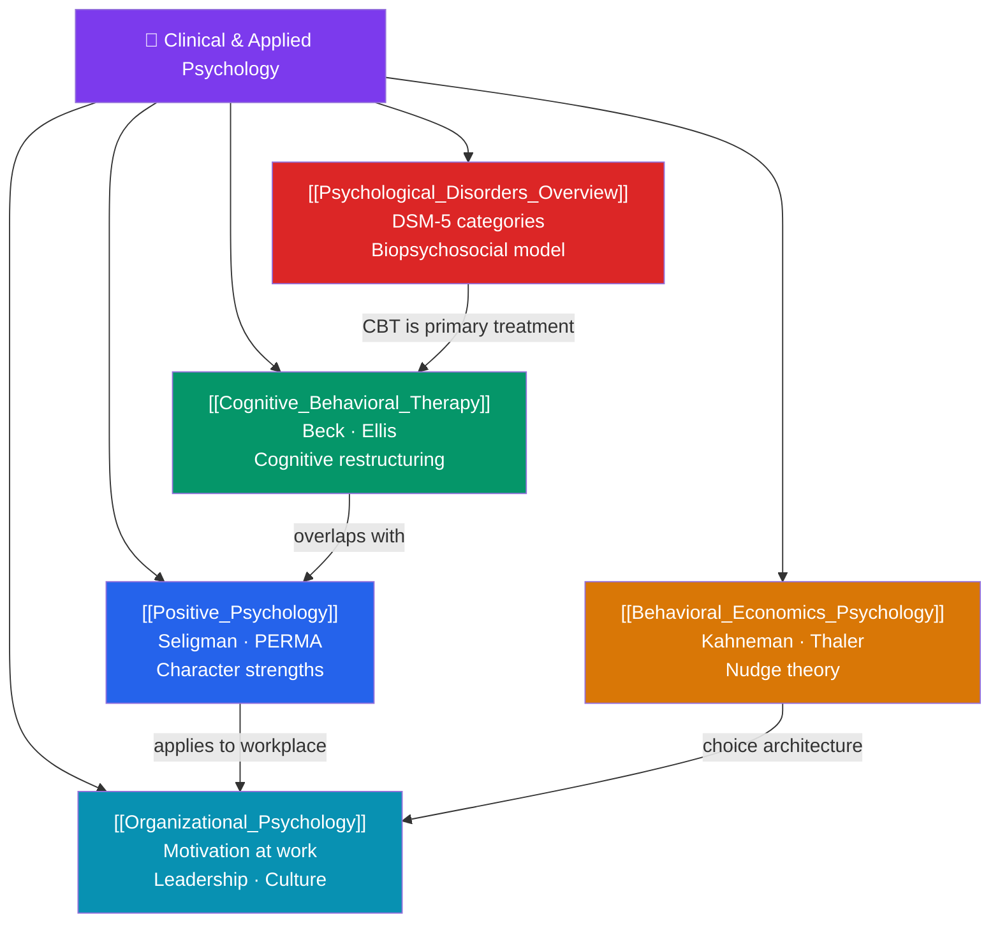

# 🗺️ Clinical and Applied Psychology — Map of Content

> [!abstract] What This Section Covers
> The applied face of psychology — where research meets practice. Five notes cover the major domains: **psychological disorders** (DSM-5 overview and the biopsychosocial model), **cognitive behavioral therapy** (the most evidence-based psychotherapy), **positive psychology** (Seligman's shift from pathology to flourishing), **behavioral economics** (Kahneman and Thaler's application of psychological insights to economic decisions), and **organizational psychology** (motivation, leadership, and culture in the workplace). Together they show how psychological science is translated into clinical treatment, policy, product design, and organizational effectiveness.

## Concept Map

## Learning Path

1. [[Psychological_Disorders_Overview]] — DSM-5 categories, the biopsychosocial model, and the major disorder families.
2. [[Cognitive_Behavioral_Therapy]] — How CBT works, Beck's cognitive model, core techniques, and evidence base.
3. [[Positive_Psychology]] — What flourishing means; character strengths; interventions that work.
4. [[Behavioral_Economics_Psychology]] — Prospect theory in action; nudge theory; policy applications.
5. [[Organizational_Psychology]] — Motivation, leadership, culture, and performance in organizations.

## All Notes at a Glance

| Note | Difficulty | What You'll Learn |
|------|------------|-------------------|
| [[Psychological_Disorders_Overview]] | Intermediate | DSM-5 structure, major disorder categories, biopsychosocial model, stigma |
| [[Cognitive_Behavioral_Therapy]] | Intermediate | Beck's cognitive model, ABC model, cognitive distortions, behavioral experiments, evidence base |
| [[Positive_Psychology]] | Beginner → Intermediate | Character strengths (VIA), gratitude, flow, meaning, interventions that work |
| [[Behavioral_Economics_Psychology]] | Intermediate → Advanced | Prospect theory, nudge theory, choice architecture, policy applications, libertarian paternalism |
| [[Organizational_Psychology]] | Intermediate | Job design, motivation, leadership styles, organizational culture, teamwork |

## Key Questions This Section Answers

- How does the DSM-5 classify mental disorders, and what are its major limitations?
- Why is CBT the "gold standard" for anxiety and depression — what mechanism produces change?
- What are character strengths, and how can they be developed?
- How do nudges work without restricting choice, and are they ethically justifiable?
- What evidence supports the claim that happy workers are more productive?

## Related Sections

- [[_MOC_Psychology_Master|↑ Psychology Master MOC]]
- [[_MOC_Cognitive_Psychology|← Cognitive Psychology]] — Cognitive biases underlie both CBT targets and behavioral economics
- [[_MOC_Motivation_Emotion|← Motivation & Emotion]] — Wellbeing and stress underlie clinical presentations
- Cross-vault: [[Game_Theory]] (strategic decisions), [[Microeconomics]] (rational actor model vs. behavioral reality)

#MOC #Psychology #ClinicalPsychology #AppliedPsychology
