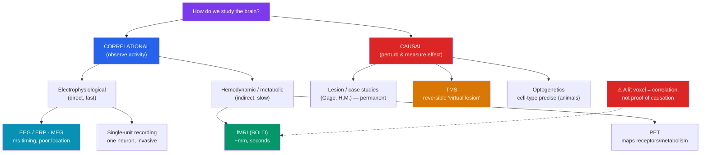

# 🔬 Methods in Neuroscience

> [!abstract] TL;DR
> Every method for studying the brain trades off **spatial resolution** (where), **temporal resolution** (when), and — most importantly — whether it reveals **correlation or causation**. **EEG/ERP** and **MEG** read electrical activity with millisecond timing but blurry location; **fMRI and PET** map blood-flow and metabolism with millimeter precision but sluggish, indirect timing; **single-unit recording** captures individual neurons. These are largely *correlational* — they show a region is *active during* a task, not that it *causes* the behavior. To establish causation you must perturb the brain: **lesion studies** (natural, like **Phineas Gage** and **H.M.**), reversible **TMS**, and, in animals, cell-type-precise **optogenetics**. A recurring warning: a lit-up voxel on an fMRI is a *correlation*, not proof that the region drives the behavior.

## Intuition — analogy FIRST

Think of the brain as a stadium full of fans, and neuroscience methods as different ways to figure out what the crowd is doing without going inside.

Stand outside with a microphone against the wall and you hear the roar rise and fall instantly — you know *when* something happens but not *where* in the stands: that's **EEG**, fast but spatially vague. Fly a thermal camera overhead and you get a crisp map of which sections are packed and warm — great *where*, but heat lags the action by seconds: that's **fMRI**, precise in space but slow and indirect. Lower a tiny microphone next to one specific seat and you catch one fan's every word: that's **single-unit recording**.

But here's the catch that haunts the whole field: all of these only *watch*. Seeing a section cheer during a goal doesn't prove that section *scored* it — maybe they're just reacting. To prove a section actually matters, you have to *intervene*: ask everyone in it to leave and see if the game changes (a **lesion**), briefly jam their section for a few minutes (**TMS**), or — in animals — install a switch that turns exactly one type of fan on and off with light (**optogenetics**). Watching gives you correlation; only interfering gives you cause.

---

## How It Works — Resolution and Causal Power

## Key Concepts / Details

### The Core Trade-off: Space vs. Time vs. Cause

No single method does everything. Choosing one means accepting a trade-off:

| Method | Spatial res. | Temporal res. | Signal measured | Causal? |
|--------|-------------|---------------|-----------------|---------|
| **EEG / ERP** | Poor (cm) | Excellent (ms) | Scalp electrical (postsynaptic potentials) | Correlational |
| **MEG** | Moderate | Excellent (ms) | Magnetic fields from currents | Correlational |
| **fMRI (BOLD)** | Good (~1 mm) | Poor (~1–6 s) | Blood-oxygen (metabolic proxy) | Correlational |
| **PET** | Moderate | Poor (min) | Radiotracer — metabolism/receptors | Correlational |
| **Single-unit** | Excellent (1 neuron) | Excellent (ms) | Action potentials | Correlational |
| **Lesion / case** | Variable | — | Deficit after loss of tissue | **Causal** |
| **TMS** | Moderate | Good | Behavior after magnetic pulse | **Causal** |
| **Optogenetics** | Excellent (cell type) | Excellent (ms) | Behavior after light control | **Causal** |

### EEG and ERP

**Electroencephalography (EEG)** records summed electrical activity from scalp electrodes, reflecting synchronized postsynaptic potentials of cortical neurons (see [[Neurons_and_Neural_Communication]]). Its strength is **millisecond** temporal resolution; its weakness is poor spatial localization (the skull smears the signal, creating the "inverse problem"). Averaging EEG time-locked to a stimulus yields an **event-related potential (ERP)** — reliable waveform components (e.g., the **P300** for attention/surprise, the **N400** for semantic anomaly) used to track the *timing* of cognitive stages. EEG is cheap, portable, and the mainstay of sleep and epilepsy research.

### fMRI and PET

**Functional MRI** infers activity from the **BOLD signal** (Blood-Oxygen-Level-Dependent) — active regions consume oxygen, triggering an overshoot of oxygenated blood that alters the magnetic signal. It offers excellent (~millimeter) spatial resolution but sluggish, **indirect** timing (the hemodynamic response peaks ~4–6 s *after* neural activity). fMRI is the workhorse of human cognitive neuroscience.

**PET (Positron Emission Tomography)** injects a radioactive tracer to image metabolism, blood flow, or — uniquely — **specific neurotransmitter receptors and drug binding**, making it invaluable for [[Neurotransmitters_and_Psychopharmacology|psychopharmacology]] (e.g., mapping dopamine receptor occupancy). Its cost is radiation exposure and poor temporal resolution.

### TMS — Reversible Causation in Humans

**Transcranial Magnetic Stimulation** uses a rapidly changing magnetic field to induce currents in a targeted cortical patch, transiently disrupting (or exciting) it. Because the disruption is **temporary and reversible**, TMS creates a "**virtual lesion**" — if knocking out region X impairs task Y *right now*, X is *causally* involved. It bridges the gap between correlational imaging and permanent lesions, and repetitive TMS (rTMS) is an FDA-approved **treatment for depression**.

### Lesion and Case Studies

Historically the first window into function: correlate a deficit with the damaged region. Because damage *removes* a part and behavior changes, lesions support **causal** inference (with caveats — damage is rarely clean, and other regions may reorganize; see [[Neuroplasticity]]).
- **Phineas Gage (1848)** — an explosion drove a tamping iron through his frontal lobe; he survived but his personality and social judgment changed profoundly — early evidence that the **frontal cortex** governs executive and social control.
- **Patient H.M. (Henry Molaison)** — bilateral medial-temporal (hippocampal) removal for epilepsy left him unable to form **new explicit memories** while sparing skill learning and old memories — dissociating memory *formation* from *storage* and from procedural memory.
- **Broca** and **Wernicke** localized speech production and comprehension from patients with focal aphasias.

Animal lesion work (controlled and precise) complements these natural human "experiments of nature."

### Single-Unit Recording

A microelectrode placed beside (or inside) a single neuron records its action potentials, giving unmatched cellular and temporal precision. **Hubel and Wiesel** used it to discover orientation-selective cells in the visual cortex (Nobel Prize); **O'Keefe** identified hippocampal **place cells** that fire at specific locations (Nobel Prize, with the Mosers' grid cells). Because it is invasive, it is mostly used in animals, though intracranial recording occurs in human epilepsy surgery.

### Optogenetics — Precision Causation

The 21st-century breakthrough: insert light-sensitive ion-channel genes (e.g., **channelrhodopsin**) into *specific cell types*, then switch those neurons on or off with pulses of light delivered by fiber optic. **Optogenetics** achieves both **millisecond timing and cell-type specificity**, letting researchers demonstrate that activating a defined population *causes* a behavior (e.g., triggering or erasing a fear memory in mice). It is the gold standard for causal circuit dissection in animals but is not (yet) used routinely in humans.

> [!warning] Correlation ≠ Causation in Neuroimaging
> An fMRI showing the amygdala "lights up" during fear tells you the region is *active during* fear, not that it *produces* fear, nor that it is *necessary* or *sufficient*. **Reverse inference** — concluding a person feels fear because the amygdala is active — is a classic fallacy, since most regions participate in many functions. Establishing causation requires perturbation (lesion, TMS, optogenetics), not imaging alone.

## Real-World Notes

- **Clinical diagnosis**: EEG is standard for epilepsy and sleep staging; structural MRI locates tumors and strokes; PET detects Alzheimer's-related amyloid and metabolic decline.
- **Treatment**: rTMS treats medication-resistant depression; **deep brain stimulation** (implanted electrodes) treats Parkinson's tremor and OCD by directly perturbing circuits.
- **Brain–computer interfaces**: single-unit and intracranial recording let paralyzed patients control cursors and prosthetics — decoding motor cortex spikes into commands.
- **The reproducibility caution**: an infamous study "found" brain activity in a *dead salmon* using sloppy fMRI statistics — a landmark reminder to correct for multiple comparisons across thousands of voxels.

## Common Pitfalls

- **Reverse inference.** Inferring a mental state from a region's activation ignores that regions are multifunctional. Activation supports, but does not prove, a specific cognitive interpretation.
- **Treating fMRI as fast or direct.** BOLD is a slow, indirect *metabolic proxy* lagging neural activity by seconds — it cannot resolve the millisecond order of cognitive events (that's EEG/MEG's job).
- **Assuming a lesion "localizes" a function cleanly.** Damage is messy, the brain reorganizes, and a deficit shows a region is *involved*, not that it is the sole seat of the function.
- **Forgetting the space–time–cause trilemma.** No method maximizes all three; strong claims usually require *converging evidence* from multiple methods.

## Related Concepts

- [[_MOC_Biological_Psychology|↑ Section MOC]]
- [[Neurons_and_Neural_Communication]] — The action potentials and postsynaptic potentials these tools detect
- [[The_Human_Brain]] — The structures and localization these methods were used to map
- [[Neuroplasticity]] — Structural MRI and animal recording that measure plastic change
- [[Neurotransmitters_and_Psychopharmacology]] — PET imaging of receptors and drug binding
- Cross-vault: [[_MOC_AI_ML_Master]] — Artificial neural networks are inspired by these recordings, and machine-learning decoders now read out fMRI and single-unit data

## Review Questions

1. You need to determine the *precise millisecond timing* of when the brain detects a semantic error in a sentence. Which method would you choose and why — and why would fMRI be a poor choice for this specific question?
2. Explain why lesion studies, TMS, and optogenetics can support *causal* claims about brain function while EEG and fMRI generally cannot. What does TMS's reversibility add over a permanent lesion?
3. A headline reports that "the brain's love center lights up when people see their partner" based on fMRI. Identify the inferential fallacy involved and describe what additional evidence would be needed to support a causal claim.

## Sources

- Poldrack, R.A. (2006). "Can cognitive processes be inferred from neuroimaging data?" *Trends in Cognitive Sciences*, 10(2), 59–63.
- Boyden, E.S., Zhang, F., Bamberg, E., Nagel, G., & Deisseroth, K. (2005). "Millisecond-timescale, genetically targeted optical control of neural activity." *Nature Neuroscience*, 8(9), 1263–1268.
- Logothetis, N.K. (2008). "What we can do and what we cannot do with fMRI." *Nature*, 453(7197), 869–878.
- Bennett, C.M. et al. (2009). "Neural correlates of interspecies perspective taking in the post-mortem Atlantic salmon." (dead-salmon poster) — cautionary multiple-comparisons demonstration.

#psychology #biological-psychology #neuroscience #methods #neuroimaging #fmri
