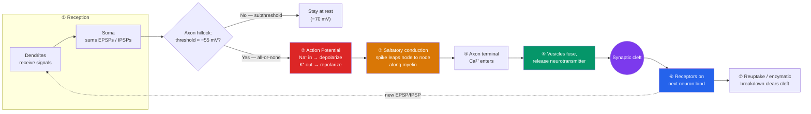

# ⚡ Neurons and Neural Communication

> [!abstract] TL;DR
> The neuron is the brain's signaling unit. It receives inputs on its **dendrites**, integrates them in the **soma**, and — if the summed input crosses a threshold at the axon hillock — fires an **action potential**: a self-propagating, all-or-none electrical spike driven by voltage-gated Na⁺ and K⁺ channels. **Myelin** wraps the axon so the spike leaps between nodes (saltatory conduction), traveling far faster. The signal is *electrical within* a neuron but *chemical between* neurons: the spike triggers vesicles to release **neurotransmitters** across the **synapse**, where they bind receptors on the next cell, and are then cleared by **reuptake** or enzymatic breakdown. **Glial cells** insulate, feed, and prune these connections. Communication is therefore a repeating loop of electrical spike → chemical message → new electrical response.

## Intuition — analogy FIRST

Think of a neuron as a person in a bucket brigade passing water to put out a fire, where the "bucket" is a message.

Each person (neuron) has many hands reaching out to receive water from the people before them — those are the **dendrites**. The person's body decides whether they've received *enough* water to bother turning around — that's the **soma** summing its inputs. Once they commit, they run the full length of a long hallway (the **axon**) at a fixed sprint — they don't run faster for a bigger fire; it's all-or-nothing, one full trip per decision. To move quickly they don't touch every floorboard; they leap between stepping-stones spaced down the hall — that leaping is **saltatory conduction** across gaps in the **myelin** insulation.

Here's the twist: the people never actually hand the bucket over. At the end of the hall there's a small gap (the **synapse**). The runner *throws* the water across as a splash of droplets (**neurotransmitters**); the next person's hands (receptors) catch what they can, and a mop crew immediately cleans up whatever lands on the floor (**reuptake**). Every "hand-off" is really a throw-and-catch across a gap — which is exactly why the brain can be so precisely tuned, and exactly where drugs get their leverage.

---

## How It Works — From Input to Chemical Output

## Key Concepts / Details

### Neuron Structure

A neuron is specialized for receiving, integrating, and transmitting information.

- **Dendrites** — branching fibers that receive signals from other neurons; the more branches and spines, the more inputs a neuron can integrate.
- **Soma (cell body)** — houses the nucleus; sums all incoming excitatory and inhibitory signals.
- **Axon hillock** — the "decision point" where the summed potential is compared to threshold; the action potential is initiated here.
- **Axon** — the transmitting cable; can be under a millimeter or (for a motor neuron running to the foot) over a meter long.
- **Myelin sheath** — fatty insulation formed by glial cells, broken by gaps called **nodes of Ranvier**.
- **Axon terminals (terminal buttons)** — the output ends that release neurotransmitter onto the next cell.

| Part | Role | One-line function |
|------|------|-------------------|
| Dendrites | Input | Collect signals from other neurons |
| Soma | Integration | Sum EPSPs and IPSPs |
| Axon hillock | Trigger | Compare to threshold, fire or not |
| Axon | Conduction | Carry the spike outward |
| Myelin / nodes | Speed | Enable saltatory conduction |
| Terminals | Output | Release neurotransmitter |

### The Resting Potential

At rest, the neuron holds its interior at about **−70 mV** relative to the outside — it is **polarized**. Two forces maintain this:
- **Selective permeability**: the membrane leaks K⁺ out more readily than it lets Na⁺ in.
- **The sodium–potassium pump (Na⁺/K⁺-ATPase)**: actively pumps 3 Na⁺ out for every 2 K⁺ in, burning ATP to keep Na⁺ high outside and K⁺ high inside.
The result is both an electrical gradient and a concentration gradient — stored potential energy poised to be released.

### The Action Potential

When excitatory input pushes the axon hillock past threshold (**≈ −55 mV**), a stereotyped sequence fires:

1. **Depolarization** — voltage-gated **Na⁺ channels** snap open; Na⁺ rushes in, driving the interior sharply positive (to about **+40 mV**).
2. **Repolarization** — Na⁺ channels inactivate and voltage-gated **K⁺ channels** open; K⁺ flows out, restoring negativity.
3. **Hyperpolarization (undershoot)** — K⁺ channels close slowly, briefly dipping below rest.
4. **Return to rest** — the Na⁺/K⁺ pump restores the original gradients.

Two defining properties:
- **All-or-none law**: every action potential is the same size. A stronger stimulus does not make a bigger spike — it produces spikes **more frequently** (rate coding).
- **Refractory period**: during the **absolute** refractory period, inactivated Na⁺ channels make a second spike impossible, capping maximum firing rate and forcing the spike to travel **one direction** (no backfiring). The **relative** refractory period follows, needing stronger-than-usual input.

### Saltatory Conduction

In myelinated axons the current can only regenerate at the unmyelinated **nodes of Ranvier**, so the action potential appears to "jump" from node to node. This **saltatory conduction** (Latin *saltare*, to leap) makes signaling both faster (up to ~120 m/s) and more energy-efficient. Demyelinating disease such as **multiple sclerosis** strips this insulation, slowing or blocking conduction and producing the disorder's motor and sensory deficits.

### Synaptic Transmission

The **synapse** is the junction between a presynaptic terminal and a postsynaptic cell, separated by the **synaptic cleft** (~20 nm). Chemical transmission proceeds:

1. The action potential reaches the terminal and opens voltage-gated **Ca²⁺ channels**.
2. Ca²⁺ influx triggers **synaptic vesicles** to fuse with the membrane and release neurotransmitter by **exocytosis**.
3. Neurotransmitter diffuses across the cleft and binds **receptors** on the postsynaptic membrane.
4. Binding opens ion channels, producing a graded **postsynaptic potential**:
   - **EPSP** (excitatory) — depolarizing, nudges the next neuron toward firing (e.g., glutamate).
   - **IPSP** (inhibitory) — hyperpolarizing, pushes it away from firing (e.g., GABA).
5. The signal is terminated by **reuptake** (transporters pump the transmitter back into the terminal), **enzymatic degradation** (e.g., acetylcholinesterase breaking down ACh), or diffusion away.

The postsynaptic neuron performs **spatial** (many synapses at once) and **temporal** (rapid succession) **summation** of EPSPs and IPSPs — this integration at the soma is what determines whether the *next* action potential fires. See [[Neurotransmitters_and_Psychopharmacology]] for how specific transmitters and drugs exploit each of these steps.

### Glial Cells

Long dismissed as mere "glue," glia roughly match or outnumber neurons and are active partners:

| Glial cell | Location | Function |
|------------|----------|----------|
| **Oligodendrocytes** | CNS | Myelinate axons (one cell wraps many) |
| **Schwann cells** | PNS | Myelinate axons (one cell wraps one segment) |
| **Astrocytes** | CNS | Feed neurons, regulate the blood–brain barrier, recycle transmitter, modulate synapses |
| **Microglia** | CNS | Immune defense and **synaptic pruning** |

Astrocytes and microglia actively shape which synapses survive — a direct bridge to [[Neuroplasticity]].

## Real-World Notes

- **Local anesthetics** (lidocaine, novocaine) block voltage-gated Na⁺ channels, preventing action potentials so pain signals never reach the brain.
- **Neurotoxins map the machinery**: tetrodotoxin (pufferfish) blocks Na⁺ channels; botulinum toxin (Botox) blocks ACh vesicle release, paralyzing muscle — the same mechanism used cosmetically and to treat spasticity.
- **Multiple sclerosis** is the classic demyelination case study — showing how much conduction depends on intact myelin, not just the neuron.
- **Rate coding in perception**: because spikes are all-or-none, the nervous system encodes intensity (a loud sound, a bright light) as *firing rate* and *number of neurons recruited*, not spike size — a principle exploited by [[Methods_in_Neuroscience|single-unit recording]].

## Common Pitfalls

- **"A bigger stimulus makes a bigger action potential."** No — the all-or-none law means spike amplitude is fixed; intensity is coded by frequency and population size.
- **Confusing the resting potential's cause.** The −70 mV is maintained by *selective permeability plus* the Na⁺/K⁺ pump, not the pump alone; the pump sets up the gradients that leak channels then exploit.
- **Thinking the synapse is a physical touch.** Chemical synapses have a real gap; the signal is a released chemical, which is precisely why reuptake and receptors exist (and why drugs work).
- **Treating glia as passive.** Astrocytes and microglia actively regulate transmission and prune synapses; they are not inert scaffolding.

## Related Concepts

- [[_MOC_Biological_Psychology|↑ Section MOC]]
- [[The_Human_Brain]] — How billions of these neurons wire into functional structures
- [[Neurotransmitters_and_Psychopharmacology]] — The specific chemicals released at step ⑤ and the drugs that hijack them
- [[Neuroplasticity]] — How repeated firing physically strengthens the synapses described here
- [[Methods_in_Neuroscience]] — EEG and single-unit recording measure these very potentials
- Cross-vault: [[_MOC_AI_ML_Master]] — Artificial neurons abstract this cell into a weighted sum plus activation function

## Review Questions

1. A stimulus doubles in intensity. Explain, using the all-or-none law, how the neuron nonetheless communicates "stronger" to the rest of the nervous system.
2. Walk through the ionic events of an action potential from threshold to hyperpolarization, naming which channel opens at each stage and the direction each ion moves. Why does the absolute refractory period guarantee one-way propagation?
3. Trace a signal across a chemical synapse from the arrival of the action potential at the terminal to the clearing of the cleft. At which two steps could a drug act to *prolong* a neurotransmitter's effect?

## Sources

- Kandel, E.R., Schwartz, J.H., & Jessell, T.M. (2021). *Principles of Neural Science* (6th ed.). McGraw-Hill.
- Purves, D. et al. (2018). *Neuroscience* (6th ed.). Oxford University Press / Sinauer.
- Bear, M.F., Connors, B.W., & Paradiso, M.A. (2020). *Neuroscience: Exploring the Brain* (4th ed.). Wolters Kluwer.
- Hodgkin, A.L. & Huxley, A.F. (1952). "A quantitative description of membrane current." *Journal of Physiology*, 117(4), 500–544.

#psychology #biological-psychology #neuroscience #neurons #action-potential #synapse
