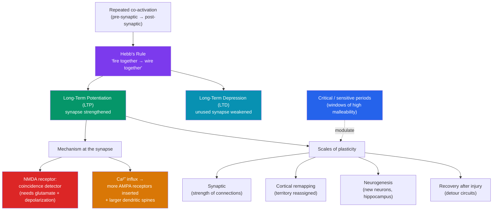

# 🌱 Neuroplasticity

> [!abstract] TL;DR
> Neuroplasticity is the brain's lifelong capacity to physically rewire itself. At the cellular level, **synaptic plasticity** strengthens or weakens connections based on use: **long-term potentiation (LTP)** durably strengthens synapses that fire together — the biological embodiment of **Hebb's rule**, "neurons that fire together wire together" — while long-term depression (LTD) weakens the unused. Beyond single synapses, **experience-dependent plasticity** remaps whole cortical territories, the brain can grow new neurons through **neurogenesis** (notably in the hippocampus), and there are **critical/sensitive periods** in development when circuits are especially malleable. Plasticity also drives **recovery after injury**, as surviving tissue takes over lost functions. Plasticity is double-edged: it underlies learning, memory, and rehabilitation, but also addiction, chronic pain, and maladaptive habits.

## Intuition — analogy FIRST

Think of the brain as a vast landscape of grass crossed by walking paths.

Every time you take a route between two points, you tread the grass down a little. Walk it once and the trail fades by tomorrow. Walk it every day and it hardens into a clear dirt path — easy, automatic, the default way to go. Routes nobody uses grow over and disappear. The paths aren't carved by a planner; they're carved by **traffic**. That is **Hebbian learning**: the connections you use repeatedly get physically reinforced (**LTP**); the ones you neglect fade (**LTD**).

The landscape isn't equally moldable forever. When the ground is fresh and soft — early childhood — a single season of traffic can carve a highway; this is a **critical period**. Later the soil hardens, but it never fully sets: even in adulthood, sustained traffic still wears new paths, just more slowly. And if a landslide wipes out a region (a **stroke**), travelers don't give up — they beat new detour paths through the surviving terrain, which is exactly how rehabilitation reclaims lost function. The catch: the landscape can't tell a *helpful* path from a *harmful* one. The same mechanism that masters a violin also entrenches an addiction.

---

## How It Works — Hebbian Strengthening and Its Scales

## Key Concepts / Details

### Synaptic Plasticity and Hebb's Rule

The core insight came from **Donald Hebb** (1949): if neuron A repeatedly helps fire neuron B, the connection between them strengthens. The popular gloss — "**neurons that fire together wire together**" — captures **associative** and **use-dependent** change. Its two directions:
- **Long-Term Potentiation (LTP)** — a lasting *increase* in synaptic strength after high-frequency, coincident activity.
- **Long-Term Depression (LTD)** — a lasting *decrease* when inputs are weak or uncorrelated; essential for pruning and for not saturating every synapse.

### Long-Term Potentiation (LTP)

First demonstrated by **Bliss and Lømo (1973)** in the rabbit hippocampus, LTP is the leading cellular model of learning and memory. The classic mechanism at glutamate synapses:
1. The **NMDA receptor** acts as a **coincidence detector**: it opens only when glutamate is bound *and* the postsynaptic cell is already depolarized (which expels a Mg²⁺ plug from the channel).
2. This dual condition lets **Ca²⁺** flood in, triggering a cascade that **inserts more AMPA receptors** into the postsynaptic membrane and enlarges the **dendritic spine**.
3. The synapse is now *more responsive to the same input* — a physical memory trace. LTP shows **specificity** (only active synapses strengthen), **cooperativity**, and **associativity**.

| Property | LTP | LTD |
|----------|-----|-----|
| Trigger | High-frequency, coincident firing | Low-frequency / uncorrelated firing |
| Ca²⁺ signal | Large, fast | Small, sustained |
| Effect on synapse | Strengthen (more AMPA receptors) | Weaken (receptors removed) |
| Functional role | Encode associations, learning | Prune, forget, refine circuits |

### Experience-Dependent Plasticity and Cortical Remapping

Whole cortical maps reorganize with experience. **Michael Merzenich** showed that heavy use of specific fingers *expands* their territory in the somatosensory cortex, while an amputated limb's territory gets *invaded* by neighbors — a mechanism implicated in **phantom limb sensations** (Ramachandran). In the blind, the "visual" occipital cortex is recruited for Braille and hearing — **cross-modal plasticity**. The distinction:
- **Experience-expectant** plasticity — circuits *expect* species-typical input during development (e.g., visual patterns) and wire up when it arrives.
- **Experience-dependent** plasticity — circuits change in response to an *individual's* unique experiences, lifelong.

### Neurogenesis

Long dogma held that the adult brain grows no new neurons. That is now overturned for specific regions: robust **adult neurogenesis** occurs in the **dentate gyrus of the hippocampus** (and the olfactory system in many mammals). New neurons integrate into circuits and are linked to learning, mood, and stress regulation. **Enriched environments, aerobic exercise, and learning promote** neurogenesis; **chronic stress and elevated cortisol suppress** it — connecting plasticity to depression and its treatment (antidepressants and exercise both raise hippocampal neurogenesis). The *extent* of adult human neurogenesis remains actively debated.

### Critical and Sensitive Periods

Some circuits have **windows of heightened plasticity** during which experience has outsized, sometimes irreversible, effects:
- **Hubel and Wiesel's** Nobel-winning experiments: suturing one eye shut in a kitten during a critical period permanently reduced cortical representation of that eye (**ocular dominance**); the same deprivation in an adult cat did far less. This is the basis for treating childhood **amblyopia** ("lazy eye") early.
- **Language** has a sensitive period — native-like phoneme discrimination and grammar are acquired far more easily before puberty (Lenneberg; feral-child cases like **Genie**).
A **critical period** is a hard window; a **sensitive period** is softer — learning is easier then but still possible later.

### Recovery After Injury

Plasticity underlies rehabilitation. After a **stroke**, surviving neurons sprout new connections and adjacent or contralateral areas can assume lost functions. **Constraint-induced movement therapy** — restraining the *good* limb to force use of the impaired one — drives cortical remapping and functional gains, directly exploiting use-dependent plasticity. Recovery is greatest when therapy is intense, early, and repetitive: the clinical translation of "fire together, wire together."

> [!warning] Plasticity is not always benign
> The same mechanisms produce **maladaptive** plasticity: LTP in reward circuits entrenches [[Neurotransmitters_and_Psychopharmacology|addiction]], maladaptive remapping produces phantom-limb and chronic pain, and repeated rumination strengthens the circuits of anxiety and depression. "Rewiring" is a capacity, not a virtue.

## Real-World Notes

- **London taxi drivers** (Maguire et al., 2000): licensed cabbies who memorized "The Knowledge" of London's streets had a larger posterior **hippocampus** than controls, and size grew with years on the job — a landmark demonstration of experience-driven structural plasticity in humans.
- **Rehabilitation**: constraint-induced therapy and intensive practice after stroke or brain injury are built entirely on plasticity principles.
- **Amblyopia treatment** in childhood works because the visual cortex is still within its critical period.
- **Exercise and enrichment** are prescribed partly because they measurably boost hippocampal neurogenesis and cognitive reserve.
- **Musicians and athletes** show enlarged, more finely differentiated cortical representations of the trained body parts — practice reshapes the map.

## Common Pitfalls

- **"Neuroplasticity means the adult brain is infinitely rewireable."** Plasticity is real but constrained — it declines with age, is region-specific, and critical-period windows genuinely close for some functions.
- **Assuming all plasticity is good.** Addiction, phantom pain, and entrenched anxiety are plasticity too. Direction and content matter.
- **Confusing neurogenesis with general rewiring.** New *neurons* are limited to a few regions; most plasticity is *synaptic* (changing existing connections), not growing new cells.
- **Believing "critical periods" mean it's too late after childhood.** Many are *sensitive* periods — harder later, not impossible. Adult learning and stroke recovery both prove ongoing plasticity.

## Related Concepts

- [[_MOC_Biological_Psychology|↑ Section MOC]]
- [[Neurons_and_Neural_Communication]] — The synapse and receptors that LTP physically modifies
- [[The_Human_Brain]] — The hippocampus, cortical maps, and regions that remap
- [[Neurotransmitters_and_Psychopharmacology]] — Glutamate/NMDA in LTP; dopamine-driven plasticity in addiction
- [[Methods_in_Neuroscience]] — How structural MRI and animal studies measure plastic change
- Cross-vault: [[_MOC_AI_ML_Master]] — Hebbian learning inspired artificial "connectionist" weight updates and backpropagation

## Review Questions

1. State Hebb's rule and explain how the NMDA receptor's requirement for *both* glutamate binding and postsynaptic depolarization makes it a molecular "coincidence detector" that implements this rule.
2. Distinguish a critical period from a sensitive period, giving one example of each. Why can childhood amblyopia be corrected but an equivalent adult deprivation cannot?
3. A stroke patient regains arm movement after weeks of intensive constraint-induced therapy. Explain the plasticity mechanisms involved, and explain why the *same* mechanisms can also entrench a drug addiction.

## Sources

- Hebb, D.O. (1949). *The Organization of Behavior*. Wiley.
- Bliss, T.V.P. & Lømo, T. (1973). "Long-lasting potentiation of synaptic transmission." *Journal of Physiology*, 232(2), 331–356.
- Maguire, E.A. et al. (2000). "Navigation-related structural change in the hippocampi of taxi drivers." *PNAS*, 97(8), 4398–4403.
- Hubel, D.H. & Wiesel, T.N. (1970). "The period of susceptibility to the physiological effects of unilateral eye closure in kittens." *Journal of Physiology*, 206(2), 419–436.

#psychology #biological-psychology #neuroscience #neuroplasticity #ltp #learning
