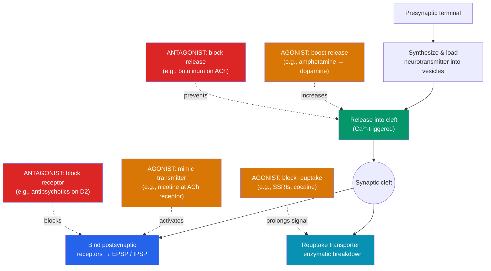

# 💊 Neurotransmitters and Psychopharmacology

> [!abstract] TL;DR
> Neurotransmitters are the brain's chemical messengers, each with characteristic roles: **dopamine** (reward, motivation, movement), **serotonin** (mood, sleep, appetite), **GABA** (the main *inhibitory* brake), **glutamate** (the main *excitatory* accelerator), **acetylcholine** (muscle action, attention, memory), and **norepinephrine** (alertness, fight-or-flight). Psychoactive drugs work by exploiting the synapse: **agonists** enhance a transmitter's action (by mimicking it, boosting release, or blocking reuptake) while **antagonists** block it (by occupying receptors or preventing release). **SSRIs** treat depression by blocking serotonin reuptake; L-DOPA replenishes dopamine in Parkinson's; benzodiazepines boost GABA. Nearly all addictive drugs converge on one circuit — the **mesolimbic dopamine reward pathway** — and repeated use rewires it, producing tolerance, dependence, and craving.

## Intuition — analogy FIRST

Think of the synapse as a conversation across a narrow alley, and psychoactive drugs as ways to tamper with that conversation.

The speaker (presynaptic neuron) shouts a specific word — the neurotransmitter — across the alley. The listener (postsynaptic neuron) only reacts to words that fit its ears (**receptors**), and a cleanup crew instantly sweeps the alley so each word is heard once (**reuptake** and enzymes). Every drug is just a different way to meddle:

- An **agonist** turns up the volume: it might *shout the same word* itself (a mimic like nicotine), *make the speaker louder* (amphetamine forcing dopamine out), or *fire the cleanup crew* so the word echoes longer (an SSRI blocking reuptake).
- An **antagonist** muffles the conversation: it might *plug the listener's ears* (an antipsychotic blocking dopamine receptors) or *gag the speaker*.

The genius and the danger are the same fact: because the whole system runs on this throw-catch-clean loop, a molecule that fits anywhere in the loop can amplify joy, calm panic, or — with the reward-pathway words — hijack motivation itself.

---

## How It Works — Points of Drug Action at the Synapse

## Key Concepts / Details

### The Major Neurotransmitters

Each transmitter has typical functions and clinical associations. Most are neither purely "good" nor "bad" — dysregulation in either direction causes problems.

| Neurotransmitter | Main functions | Too much / too little (associations) |
|------------------|----------------|--------------------------------------|
| **Dopamine (DA)** | Reward, motivation, motor control, reinforcement learning | ↓ in Parkinson's (motor); dysregulation implicated in schizophrenia (excess signaling) and addiction |
| **Serotonin (5-HT)** | Mood, sleep, appetite, impulse control | Low activity linked to depression, anxiety; target of SSRIs |
| **GABA** | Primary **inhibitory** transmitter — dampens neural activity | ↓ function linked to anxiety, seizures; boosted by benzodiazepines, alcohol |
| **Glutamate** | Primary **excitatory** transmitter — drives LTP and learning | Excess → **excitotoxicity** (stroke, seizure damage); NMDA role in memory |
| **Acetylcholine (ACh)** | Muscle contraction, attention, learning/memory | ↓ in Alzheimer's; blocked by curare (paralysis) |
| **Norepinephrine (NE)** | Arousal, alertness, fight-or-flight, mood | Involved in stress response; targeted by SNRIs for depression |

Other important signals include **endorphins** (endogenous opioids for pain and pleasure), **oxytocin** (bonding), and neuromodulators that broadly tune networks rather than carrying point-to-point messages.

### Agonists vs. Antagonists

The central vocabulary of psychopharmacology describes *which direction* a drug pushes a transmitter's effect:

- **Agonist** — *increases* a neurotransmitter's action. Sub-types:
  - **Direct agonist**: mimics the transmitter at its receptor (nicotine mimics ACh).
  - **Indirect agonist**: increases release (amphetamine) or blocks removal (reuptake inhibitors).
- **Antagonist** — *decreases* a neurotransmitter's action:
  - **Receptor antagonist**: occupies the receptor without activating it (antipsychotics block dopamine D2 receptors; curare blocks ACh at the muscle).
  - **Release/synthesis blocker**: prevents the transmitter from being released or made (botulinum toxin blocks ACh release).

Whether a drug helps or harms depends on the *system* it targets: a dopamine agonist relieves Parkinson's rigidity but can induce psychosis; a dopamine antagonist calms psychosis but can induce Parkinsonian side effects. This mirror-image trade-off is a recurring theme.

### Reuptake Inhibitors and SSRIs

Normally, transporters vacuum a transmitter back into the presynaptic terminal to end the signal. A **reuptake inhibitor** blocks this transporter, so the transmitter lingers in the cleft and keeps stimulating receptors — making it an *indirect agonist*.
- **SSRIs (Selective Serotonin Reuptake Inhibitors)** — fluoxetine (Prozac), sertraline (Zoloft) — block the serotonin transporter (SERT), raising synaptic serotonin. They are first-line for depression and anxiety.
- A key clue about mechanism: SSRIs raise serotonin within hours, yet mood improves over **weeks** — suggesting the therapeutic effect involves downstream **neuroplastic** adaptation (receptor changes, hippocampal neurogenesis) rather than the serotonin bump alone. This tempers the simple "chemical imbalance" story.
- **Cocaine** is also a reuptake blocker — of dopamine — which is why it is both a stimulant and highly addictive.

### The Reward Pathway and Addiction

Almost every addictive drug converges on a single circuit: the **mesolimbic dopamine pathway**, running from the **ventral tegmental area (VTA)** to the **nucleus accumbens** (and on to the prefrontal cortex). This pathway signals **reward prediction** — it fires when something is better than expected, teaching us to repeat the behavior.

- Drugs of abuse **artificially spike dopamine** here: cocaine and amphetamine directly; opioids, nicotine, and alcohol indirectly (by disinhibiting VTA neurons).
- Because the surge is larger and more reliable than natural rewards, the brain learns the drug is *maximally* worth pursuing — **incentive salience** ("wanting" can outstrip "liking").
- **Neuroadaptation** follows: receptors downregulate, producing **tolerance** (needing more for the same effect), **dependence** (withdrawal when absent), and long-lasting **plasticity** in reward circuits that drives craving and relapse long after detox. Addiction is thus partly a disorder of [[Neuroplasticity|maladaptive plasticity]].

> [!warning] The "chemical imbalance" oversimplification
> Popular accounts reduce depression to "low serotonin" or addiction to "too much dopamine." Real transmitter systems are networked, self-regulating, and region-specific; drug response involves receptor adaptation and plasticity over weeks. Neurotransmitter levels are one factor among many, not a simple thermostat.

## Real-World Notes

- **Parkinson's disease** — degeneration of dopamine neurons in the substantia nigra; treated with **L-DOPA**, a dopamine precursor that crosses the blood–brain barrier (dopamine itself cannot). Overshooting dopamine can cause psychotic side effects — the mirror of antipsychotics.
- **Antipsychotics** — block dopamine D2 receptors, supporting the **dopamine hypothesis** of schizophrenia; motor side effects reveal the same dopamine system controls movement.
- **Alzheimer's disease** — marked by loss of acetylcholine neurons; **cholinesterase inhibitors** (donepezil) slow ACh breakdown to modestly boost memory.
- **Anxiety and sleep** — **benzodiazepines** and alcohol enhance GABA's inhibitory effect, producing sedation; abrupt withdrawal can cause seizures (loss of inhibition).
- **Pain** — **opioids** (morphine, fentanyl) mimic endorphins at opioid receptors; high addiction and overdose risk driven by the same reward-pathway mechanism.

## Common Pitfalls

- **"Serotonin = happiness, dopamine = pleasure."** These are cartoons. Dopamine signals *prediction and wanting* more than pleasure itself; serotonin touches mood, sleep, appetite, and digestion. Function depends on *which pathway and receptor*.
- **Assuming faster chemistry means faster cure.** SSRIs change serotonin in hours but help mood over weeks — proof the effect is downstream and plastic, not a simple refill.
- **Conflating dependence and addiction.** Physical dependence (withdrawal) can occur without compulsive use; addiction is the compulsive, harm-persistent behavior driven by reward-circuit plasticity.
- **Ignoring the agonist/antagonist trade-off.** Boosting a system to fix one symptom often worsens another (dopamine for Parkinson's vs. psychosis). Systems are coupled, not isolated dials.

## Related Concepts

- [[_MOC_Biological_Psychology|↑ Section MOC]]
- [[Neurons_and_Neural_Communication]] — The synaptic machinery (vesicles, receptors, reuptake) every drug targets
- [[The_Human_Brain]] — The VTA, nucleus accumbens, and pathways these transmitters travel
- [[Neuroplasticity]] — Glutamate/NMDA in LTP and the maladaptive plasticity of addiction
- [[Methods_in_Neuroscience]] — PET imaging maps neurotransmitter receptors and drug binding in living brains
- Cross-vault: [[Cognitive_Biases]] — Reward-driven learning underlies present bias and hyperbolic discounting

## Review Questions

1. Define agonist and antagonist, and give a *distinct* mechanism by which each could increase or decrease serotonin signaling at a synapse. Which category is an SSRI, and why?
2. Explain why L-DOPA (not dopamine) is used to treat Parkinson's, and why pushing dopamine too high can produce psychotic symptoms. What does this trade-off reveal about the dopamine system?
3. Trace how a drug of abuse produces tolerance and craving via the mesolimbic pathway. Why is addiction better described as maladaptive neuroplasticity than as a simple "dopamine excess"?

## Sources

- Nestler, E.J., Hyman, S.E., Holtzman, D.M., & Malenka, R.C. (2015). *Molecular Neuropharmacology* (3rd ed.). McGraw-Hill.
- Volkow, N.D., Koob, G.F., & McLellan, A.T. (2016). "Neurobiologic advances from the brain disease model of addiction." *NEJM*, 374(4), 363–371.
- Schultz, W. (1998). "Predictive reward signal of dopamine neurons." *Journal of Neurophysiology*, 80(1), 1–27.
- Stahl, S.M. (2021). *Stahl's Essential Psychopharmacology* (5th ed.). Cambridge University Press.

#psychology #biological-psychology #neuroscience #psychopharmacology #neurotransmitters #addiction
