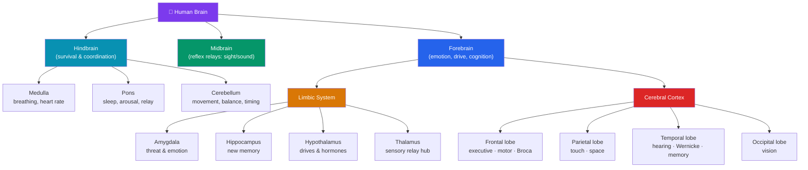

# 🧠 The Human Brain

> [!abstract] TL;DR
> The brain is organized hierarchically from ancient to recent. The **brainstem** (medulla, pons, midbrain) runs automatic survival functions; the **cerebellum** coordinates movement and timing; the **limbic system** — **amygdala** (threat/emotion), **hippocampus** (memory formation), **hypothalamus** (drives and hormones) — handles emotion and motivation; and the wrinkled **cerebral cortex** supports perception, thought, and planning across four lobes: **frontal** (executive control, movement), **parietal** (touch, space), **temporal** (hearing, language, memory), and **occipital** (vision). The two hemispheres are **lateralized** — language typically left, spatial attention right — and joined by the **corpus callosum**, whose severing in **Sperry & Gazzaniga's split-brain studies** revealed two semi-independent minds. Functions are neither perfectly **localized** nor fully **distributed**, but organized into overlapping networks.

## Intuition — analogy FIRST

Think of the brain as a city that was never demolished, only built over — each era's buildings still standing and still in use.

At the oldest core sits the original waterworks and power plant (the **brainstem**): unglamorous, automatic, keeping the lights and water on — breathing, heartbeat, arousal. Nobody "decides" to run them; they'd kill the city if switched off. Nearby is a specialist workshop that fine-tunes every physical movement so nothing is jerky (the **cerebellum**) — like the crew that smooths a dancer's steps.

Wrapped around the core is the old town's emotional heart (the **limbic system**): the alarm bell that rings before you consciously see danger (**amygdala**), the town archivist who files new memories (**hippocampus**), and the thermostat regulating hunger, thirst, temperature, and hormones (**hypothalamus**).

Sprawling over all of it is the modern downtown — the **cortex** — divided into four districts for seeing, hearing, feeling, and planning. And crucially the city has two halves connected by one great bridge (the **corpus callosum**). Cut the bridge and, astonishingly, the two halves keep functioning — but they stop fully agreeing with each other. That single experiment is where our story of "one brain, two minds" begins.

---

## How It Works — Hierarchical Organization

## Key Concepts / Details

### The Brainstem and Cerebellum

The **brainstem** is the evolutionarily oldest region, governing functions you never consciously control:
- **Medulla oblongata** — heartbeat, breathing, blood pressure; damage is usually fatal.
- **Pons** — bridges cortex and cerebellum; involved in sleep, arousal, and facial movement.
- **Reticular formation** — a net of neurons running through the brainstem that controls arousal and consciousness; damage can cause coma.
- **Midbrain** — reflexive orienting to visual and auditory stimuli.

The **cerebellum** ("little brain") holds over half the brain's neurons. It coordinates voluntary movement, balance, posture, and precise timing, and contributes to procedural learning (e.g., riding a bike). Damage produces **ataxia** — uncoordinated, jerky movement — even though strength is intact.

### The Limbic System

A ring of structures at the border of cortex and brainstem, central to emotion, motivation, and memory:

| Structure | Primary role | Failure signature |
|-----------|--------------|-------------------|
| **Amygdala** | Detects threat, tags emotional significance, fear conditioning | Klüver–Bucy: loss of fear, flattened emotion |
| **Hippocampus** | Forms new declarative (explicit) memories; spatial navigation | Anterograde amnesia (see patient **H.M.**) |
| **Hypothalamus** | Homeostasis — hunger, thirst, temperature, sex; drives the endocrine system via the pituitary | Disrupted appetite, temperature, hormonal cycles |
| **Thalamus** | Relay station routing almost all sensory input (except smell) to the cortex | Sensory loss, altered consciousness |

The amygdala's fast "low road" can trigger a fear response before the cortex has consciously identified the stimulus — the neural basis of jumping at a stick that *looks* like a snake.

### The Cerebral Cortex and Its Four Lobes

The cortex is the thin (~2–4 mm), deeply folded outer sheet; its **gyri** (ridges) and **sulci** (grooves) pack a large surface area into the skull.

- **Frontal lobe** — executive function, planning, working memory, personality, and voluntary movement via the **primary motor cortex** (precentral gyrus). Contains **Broca's area** (usually left) for speech *production*.
- **Parietal lobe** — the **somatosensory cortex** (postcentral gyrus) mapping touch, plus spatial awareness and attention. Damage can cause **hemispatial neglect**.
- **Temporal lobe** — **auditory cortex**, object and face recognition, and **Wernicke's area** (usually left) for language *comprehension*; wraps around the hippocampus.
- **Occipital lobe** — the **primary visual cortex** (V1); damage causes cortical blindness or specific deficits like motion blindness.

The motor and somatosensory cortices are laid out as a **homunculus** — a distorted body map giving disproportionate territory to high-acuity regions (hands, lips, tongue).

### Hemispheric Lateralization and the Split Brain

The cortex is two mirror hemispheres joined by the **corpus callosum**, a ~200-million-fiber bridge. Each hemisphere controls the **contralateral** (opposite) side of the body and receives the opposite visual field. Certain functions are **lateralized**:
- **Left hemisphere** (in ~95% of right-handers): language, speech, logical/sequential processing.
- **Right hemisphere**: spatial reasoning, face recognition, prosody, holistic processing.

**Roger Sperry and Michael Gazzaniga's split-brain studies** (Nobel Prize, 1981) tested patients whose corpus callosum was severed to treat epilepsy. When an image was flashed to the **left** visual field (→ right hemisphere), patients could not *name* it (language sits in the left hemisphere) but could *point to it* with the left hand. Flash it to the **right** visual field (→ left hemisphere) and they named it easily. The disconnected hemispheres could each perceive and act, yet only one could speak — evidence that consciousness can be split, and that the verbal left hemisphere acts as an "**interpreter**," confabulating explanations for what the right hemisphere did.

> [!warning] Beware "left-brained / right-brained" pop psychology
> Lateralization is real but *relative and specific* — it does not mean people are "logical left-brained" or "creative right-brained" personalities. Both hemispheres are active in virtually every task; the popular typology has no scientific support.

### Localization vs. Distributed Function

Two historical poles frame a still-live debate:
- **Localization** — specific functions live in specific places. Evidence: **Broca** (1861) and **Wernicke** (1874) localizing language; the motor homunculus; occipital lesions causing blindness.
- **Distributed / holistic processing** — complex functions emerge from networks spanning regions. Evidence: **Karl Lashley's** search for the memory "engram" found memory depended on the *amount* of cortex removed, not its location (**mass action** and **equipotentiality**).

The modern synthesis: **basic** functions (primary sensory/motor) are strongly localized, while **complex** functions (memory, decision-making, language use) arise from **distributed networks** with specialized hubs. Functional connectivity, not just cortical geography, defines cognition — a caution central to interpreting [[Methods_in_Neuroscience|neuroimaging]].

## Real-World Notes

- **Phineas Gage (1848)** — a tamping iron destroyed much of his ventromedial frontal cortex; his intellect survived but his personality and social judgment did not — an early, dramatic case for **frontal-lobe localization** of executive and social control (detailed in [[Methods_in_Neuroscience]]).
- **Patient H.M.** — bilateral removal of the hippocampus and nearby medial temporal lobe abolished his ability to form new explicit memories while sparing skill learning — proving the hippocampus is necessary for *forming* (not storing) declarative memory.
- **Stroke** localizes function in the clinic: a left-hemisphere stroke often impairs language; a right-parietal stroke can produce neglect of the left side of space.
- **Neurosurgical mapping**: Wilder Penfield electrically stimulated the exposed cortex of awake patients, building the original homunculus and eliciting vivid memories from temporal-lobe sites.

## Common Pitfalls

- **"Broca's area = all of language."** Broca's area supports speech *production*; comprehension depends on Wernicke's area, and real language use is a distributed network. Damage produces specific aphasias, not total language loss.
- **Over-reading lateralization.** Hemispheric specialization is statistical and partial; "left-brained vs. right-brained" personalities are a myth.
- **Confusing the hippocampus with memory storage.** It is essential for *forming* new declarative memories; long-term memories are consolidated into the cortex (why H.M. kept old memories).
- **Treating the brain as a fixed map.** Localization is a starting point, not the whole story — networks reorganize (see [[Neuroplasticity]]) and most functions are distributed.

## Related Concepts

- [[_MOC_Biological_Psychology|↑ Section MOC]]
- [[Neurons_and_Neural_Communication]] — The cellular units that compose every structure above
- [[Neuroplasticity]] — How these regions remap after damage or experience
- [[Methods_in_Neuroscience]] — Lesion studies, fMRI, and TMS that mapped these functions
- [[Neurotransmitters_and_Psychopharmacology]] — The chemical systems that project through these structures
- Cross-vault: [[_MOC_Philosophy_of_Mind]] — Split-brain findings and the unity (or division) of consciousness

## Review Questions

1. In a split-brain patient, an image of a spoon is flashed to the left visual field. Predict what the patient will *say* they saw and what they can *do* with each hand. Explain the anatomy that produces this dissociation.
2. Contrast localization and distributed models of brain function. Cite one classic piece of evidence for each, and state the modern synthesis that reconciles them.
3. A patient can no longer form new memories of daily events but can still learn new motor skills like mirror-tracing. Which structure is most likely damaged, and what does this dissociation reveal about how memory is organized?

## Sources

- Gazzaniga, M.S. (2005). "Forty-five years of split-brain research." *Nature Reviews Neuroscience*, 6(8), 653–659.
- Sperry, R.W. (1968). "Hemisphere deconnection and unity in conscious awareness." *American Psychologist*, 23(10), 723–733.
- Kandel, E.R. et al. (2021). *Principles of Neural Science* (6th ed.). McGraw-Hill.
- Purves, D. et al. (2018). *Neuroscience* (6th ed.). Oxford University Press / Sinauer.

#psychology #biological-psychology #neuroscience #neuroanatomy #brain #lateralization
