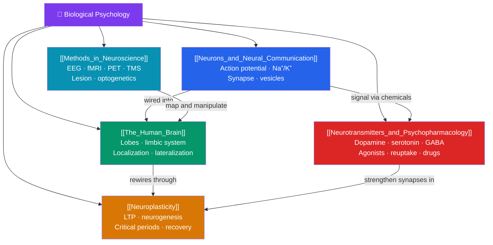

# 🧬 Biological Psychology & Neuroscience — Map of Content

> [!abstract] What This Section Covers
> Biological psychology grounds the mind in the physical brain. This section builds from the bottom up: the **neuron** and how electrochemical signals propagate and cross synapses; the **gross architecture of the human brain** and the principle of functional localization; **neuroplasticity**, the brain's lifelong capacity to rewire itself; the **neurotransmitter systems** and how psychoactive drugs exploit them; and the **methods** — from EEG to optogenetics — that let us observe and manipulate neural activity. Together these five notes explain how three pounds of tissue give rise to thought, emotion, and behavior.

## Concept Map

## Learning Path

1. [[Neurons_and_Neural_Communication]] — Neuron structure, the resting potential and action potential, saltatory conduction, and synaptic transmission via neurotransmitters.
2. [[The_Human_Brain]] — Brainstem, cerebellum, the limbic system, the four cortical lobes, hemispheric lateralization, and the localization-of-function principle.
3. [[Neuroplasticity]] — Synaptic plasticity, long-term potentiation (LTP), adult neurogenesis, critical periods, and functional recovery after injury.
4. [[Neurotransmitters_and_Psychopharmacology]] — Dopamine, serotonin, GABA, glutamate, and acetylcholine; agonists vs. antagonists, reuptake, and how drugs alter transmission.
5. [[Methods_in_Neuroscience]] — EEG, fMRI, PET, TMS, lesion studies, single-unit recording, and optogenetics — their spatial/temporal trade-offs.

## All Notes at a Glance

| Note | Difficulty | What You'll Learn |
|------|------------|-------------------|
| [[Neurons_and_Neural_Communication]] | Beginner → Intermediate | Dendrites/axon/myelin, resting & action potentials, ion channels, synaptic transmission, EPSPs/IPSPs |
| [[The_Human_Brain]] | Intermediate | Hindbrain/midbrain/forebrain, limbic system, frontal/parietal/temporal/occipital lobes, lateralization, Broca/Wernicke |
| [[Neuroplasticity]] | Intermediate → Advanced | Hebbian learning, LTP/LTD, neurogenesis, critical/sensitive periods, cortical remapping, stroke recovery |
| [[Neurotransmitters_and_Psychopharmacology]] | Intermediate | Major transmitter systems, agonist/antagonist, reuptake inhibition, SSRIs, dopaminergic drugs, tolerance |
| [[Methods_in_Neuroscience]] | Intermediate → Advanced | Spatial vs. temporal resolution, hemodynamic vs. electrophysiological signals, causal (lesion/TMS/optogenetics) vs. correlational methods |

## Key Questions This Section Answers

- How does an all-or-nothing electrical spike become a graded, chemical message at the synapse?
- What does it mean to say a function is "localized," and where does that model break down?
- If neurons largely don't regenerate, how does the adult brain still change with experience?
- Why does a drug that boosts dopamine treat Parkinson's but can also trigger psychosis?
- Why can't fMRI tell us whether a brain region *causes* a behavior?

## Related Sections

- [[_MOC_Psychology_Master|↑ Psychology Master MOC]]
- [[_MOC_Clinical_Applied|← Clinical & Applied]]
- [[_MOC_Personality_Psychology|→ Personality Psychology]]
- Cross-vault: [[_MOC_Philosophy_of_Mind]] — the mind–body problem and whether neuroscience can explain consciousness; [[_MOC_AI_ML_Master]] — artificial neural networks abstract the biological neuron

#MOC #Psychology #BiologicalPsychology
