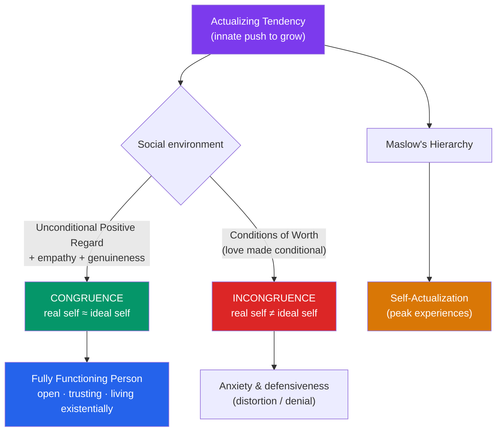

# 🌱 Humanistic Theories

> [!abstract] TL;DR
> Humanistic psychology — the "**Third Force**" between psychoanalysis and behaviorism — treats people as fundamentally good, growth-oriented, and free, and studies personality through the person's own **phenomenological** experience. **Carl Rogers** centered the **self-concept**: when a person's real self and ideal self are **congruent** they thrive, and growth is fueled by **unconditional positive regard** rather than the **conditions of worth** imposed by others; the endpoint is the **fully functioning person**. **Abraham Maslow** ranked human needs in a hierarchy topped by **self-actualization**. The approach is praised for humanizing psychology but criticized as vague, culturally individualistic, and hard to test.

## Intuition — analogy FIRST

Think of a person as an **acorn**, and the psychologist's job as gardening.

An acorn already contains, encoded within it, everything it needs to become a towering oak. You cannot *install* oak-ness into it — that potential is intrinsic. What the acorn needs from the outside is not instruction but **conditions**: good soil, water, and sunlight. Given those, it grows toward the light on its own; deprived of them, it grows stunted and twisted, but never *because* of a flaw in the acorn — only because the environment failed it.

This is the humanistic wager. Where Freud saw a boardroom of warring drives to be *managed*, and behaviorists saw a blank slate to be *conditioned*, Rogers and Maslow saw an organism with an innate **actualizing tendency** — a built-in push toward growth. The clinician isn't a mechanic fixing broken parts; they're a gardener providing the warmth (unconditional positive regard) and honest light (genuineness) that let the person's own nature unfold. Personality problems are what happen when the soil was poisoned by **conditions of worth** — "I'll love you *only if* you're an achiever" — teaching the acorn to distrust its own growth signals.

---

## How It Works — Self-Concept & the Actualizing Tendency

## Key Concepts / Details

### The Phenomenological Approach

Humanistic theory is **phenomenological**: it insists that behavior can only be understood from the person's own **subjective frame of reference** — their perceived reality, not the objective stimulus. This is a deliberate break from behaviorism (which ignored inner experience) and psychoanalysis (which claimed the analyst knows the patient's mind better than the patient does). The emphasis on **free will**, personal responsibility, and the here-and-now aligns it with existential philosophy.

### Carl Rogers: The Self and Its Conditions

**Carl Rogers** (1902–1987) built **person-centered theory** around the **self-concept** — the organized set of beliefs one holds about oneself.

- **Real self** vs. **ideal self**: the person one actually is vs. the person one wishes to be.
- **Congruence**: when real and ideal selves largely overlap, the person is psychologically healthy. Large gaps produce **incongruence**, anxiety, and defensive **distortion** or **denial** of experience.
- **Conditions of worth**: standards learned in childhood ("you are worthy *only if*...") that make self-regard contingent on meeting others' expectations, pulling the person away from their own organismic valuing.
- **Unconditional positive regard (UPR)**: accepting and valuing a person *without conditions*. Rogers argued this — plus **empathy** and **congruence/genuineness** in the therapist — constitutes the "**necessary and sufficient conditions**" for growth in therapy.
- **The fully functioning person**: the healthy ideal — open to experience, living existentially in the present, trusting one's own judgment, creative, and free.

### Abraham Maslow: The Hierarchy of Needs

**Abraham Maslow** (1908–1970) proposed that human motivation is organized into a **hierarchy**, usually drawn as a pyramid, in which lower **deficiency needs** must be substantially met before higher **growth needs** dominate.

| Level | Need | Type |
|---|---|---|
| 5 | **Self-actualization** — realizing one's full potential | Growth (being) |
| 4 | **Esteem** — respect, status, competence | Deficiency |
| 3 | **Love / belonging** — intimacy, friendship | Deficiency |
| 2 | **Safety** — security, stability | Deficiency |
| 1 | **Physiological** — food, water, sleep | Deficiency |

**Self-actualization** is the drive to become everything one is capable of becoming. Maslow studied exemplars (Lincoln, Einstein, Eleanor Roosevelt) and described **peak experiences** — transcendent moments of wholeness — as its signature. Late in life he added **self-transcendence** above self-actualization. See [[Maslows_Hierarchy]] for the full model and its motivational context.

> [!note] Rogers vs. Maslow
> Both center growth, but Rogers is a **clinical** theory of how the social environment enables or blocks the self, while Maslow is a **motivational** theory of the ordering of human needs. They are complementary pillars of the same "Third Force."

### Strengths and Criticisms

**Strengths**: restored the whole, conscious, striving person to psychology; seeded client-centered therapy, motivational interviewing, positive psychology, and the entire self-help tradition; gave methods (empathy, active listening) that endure in counseling.

**Criticisms**:
- **Vague and hard to test** — "self-actualization," "fully functioning," and "congruence" resist operational definition and falsification.
- **Weak evidence base** — Maslow's exemplar method was subjective and cherry-picked; the strict *ordering* of the hierarchy is not empirically supported (people pursue meaning while starving, etc.).
- **Cultural bias** — the primacy of self-actualization and individual fulfillment reflects Western **individualism**; collectivist cultures may rank belonging or duty above personal actualization.
- **Naïvely optimistic** — assuming innate goodness underweights aggression, and may leave the theory ill-equipped to explain evil.

## Real-World Notes

- **Counseling & therapy**: Rogers' core conditions (empathy, UPR, genuineness) are foundational to nearly all talk therapies and to **motivational interviewing** in addiction and health behavior change.
- **Education**: student-centered, "facilitator not lecturer" pedagogy descends directly from Rogers; growth-oriented feedback echoes UPR.
- **Management & positive psychology**: Maslow's hierarchy is ubiquitous (if oversimplified) in organizational motivation; humanistic assumptions underpin Seligman's positive-psychology movement.
- **Q-sort assessment**: Rogers pioneered the **Q-sort**, having clients sort self-descriptive cards to quantify the real-self/ideal-self gap — a rare measurement bridge from this tradition to [[Personality_Assessment]].

## Common Pitfalls

- **Reading the hierarchy as rigid steps** — Maslow himself allowed overlap and exceptions; people routinely pursue higher needs while lower ones are unmet.
- **Confusing unconditional positive regard with approving of all behavior** — UPR values the *person* unconditionally; it does not mean endorsing everything they do.
- **Assuming "humanistic" means "unscientific by choice"** — the tradition prizes rigor about *subjective* experience; the critique is that its constructs are hard to measure, not that measurement is rejected in principle.
- **Universalizing self-actualization** — treating individual fulfillment as the human telos ignores strong cross-cultural variation in what a "good life" means.

## Related Concepts

- [[_MOC_Personality_Psychology|↑ Section MOC]]
- [[Psychodynamic_Theories]] — The pessimistic, deterministic view humanism rebelled against
- [[Social_Cognitive_Personality]] — Shares an emphasis on agency; Bandura's self-efficacy is a more testable cousin of Rogers' self-concept
- [[Trait_Theory_and_the_Big_Five]] — The measurement-first approach humanists resist as reductive
- [[Personality_Assessment]] — The Q-sort and the measurement challenges humanistic constructs pose
- Cross-vault: [[Maslows_Hierarchy]] — Full treatment of the needs hierarchy in motivation psychology
- Cross-vault: [[Positive_Psychology]] — The modern research heir to humanistic optimism

## Review Questions

1. Explain how "conditions of worth" produce incongruence in Rogers' theory, and describe the three therapist conditions Rogers claimed are necessary and sufficient for growth.
2. State the strongest empirical criticism of Maslow's hierarchy of needs. Give a real example of behavior that appears to violate the strict ordering of the pyramid.
3. Humanistic psychology assumes people are innately good and growth-oriented. Identify two ways this assumption is a theoretical strength and two ways it is a liability. How does it shape what the approach can and cannot explain?

## Sources

- Rogers, C.R. (1961). *On Becoming a Person: A Therapist's View of Psychotherapy*. Houghton Mifflin
- Maslow, A.H. (1943). "A theory of human motivation." *Psychological Review*, 50(4), 370–396
- Rogers, C.R. (1957). "The necessary and sufficient conditions of therapeutic personality change." *Journal of Consulting Psychology*, 21(2), 95–103
- Wahba, M.A. & Bridwell, L.G. (1976). "Maslow reconsidered: A review of research on the need hierarchy theory." *Organizational Behavior and Human Performance*, 15(2), 212–240

#psychology #personality-psychology #humanistic #self-actualization #rogers
