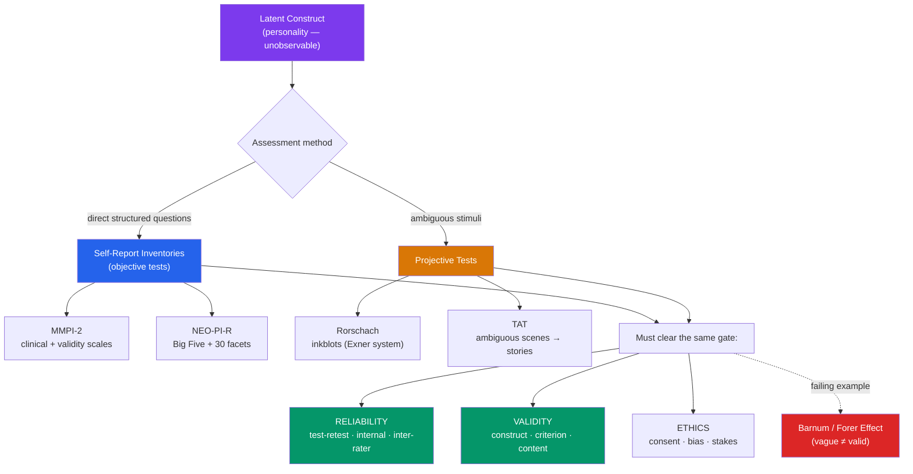

# 📋 Personality Assessment

> [!abstract] TL;DR
> Measuring an invisible construct forces a core trade-off between two families of tools. **Self-report inventories** (the **MMPI**, the **NEO-PI-R**) ask direct, structured questions — high in reliability and validity but vulnerable to faking and response bias. **Projective tests** (the **Rorschach inkblots**, the **TAT**) present ambiguous stimuli to bypass conscious defenses — rich but psychometrically weak. Every test must clear the same bars: **reliability** (consistency) and **validity** (measuring what it claims). The **Barnum/Forer effect** shows why vague feedback feels accurate, warning us against pseudo-assessments — and the whole enterprise carries real **ethical** stakes around consent, bias, and high-stakes decisions.

## Intuition — analogy FIRST

Think of assessing personality like **trying to measure the wind**.

You can't see wind directly, so you measure its *effects* — and your choice of instrument shapes what you learn. An **anemometer** gives you a precise number: 22 km/h, north-northwest. It's objective, repeatable, and comparable across weather stations — but it flattens a rich phenomenon into a scalar, and a clever prankster could spin the cups by hand and fool it. That's the **self-report inventory**: standardized, quantifiable, comparable, and *fakeable*.

Alternatively you could **watch which way the leaves scatter** — read the wind from the pattern it leaves in an ambiguous field. This catches gusts and swirls no anemometer number conveys, but two observers watching the same leaves may disagree wildly on what they saw. That's the **projective test**: sensitive to nuance, evocative, and dangerously subjective.

Neither the number nor the leaves *is* the wind — both are inferences from indirect evidence. So the real question for any personality test is not "what did it say?" but "how trustworthy is the inference?" — which is exactly what reliability and validity quantify.

---

## How It Works — Two Families, One Standard

## Key Concepts / Details

### Self-Report Inventories (Objective Tests)

Standardized questionnaires scored against normative samples. "Objective" refers to *scoring*, not the honesty of answers.

- **MMPI-2 (Minnesota Multiphasic Personality Inventory)**: 567 true/false items, the workhorse of **clinical/psychopathology** assessment. Built **empirically** (**criterion-keying**): items were retained only if they statistically discriminated diagnostic groups, regardless of face content. Crucially, it embeds **validity scales** — the **L (Lie)**, **F (Infrequency)**, and **K (Correction/defensiveness)** scales — that flag faking-good, faking-bad, and random responding.
- **NEO-PI-R**: 240 items measuring the **Big Five** and their 30 facets, the standard for **normal-range** personality. Constructed by **factor-analytic** methods (see [[Trait_Theory_and_the_Big_Five]]). Costa & McCrae.
- **Others**: the **16PF** (Cattell), the **MBTI** (popular but psychometrically weak — poor test-retest, dichotomizes continua), and the **CPI**.

**Strengths**: efficient, quantifiable, norm-referenced, generally strong reliability/validity. **Weaknesses**: **social desirability bias**, **acquiescence** (yea-saying), and deliberate faking; requires reading ability and self-insight.

### Projective Tests

Rooted in the **projective hypothesis** — that faced with an ambiguous stimulus, a person "projects" unconscious needs and conflicts into their response. A [[Psychodynamic_Theories|psychodynamic]] tradition.

- **Rorschach inkblots** (Hermann Rorschach, 1921): ten symmetrical inkblots; the client says what each could be. Responses are coded for **location, determinants** (form, color, movement), and content. The **Exner Comprehensive System** standardized scoring and improved reliability, but validity beyond a few indices (e.g., thought disorder) remains hotly disputed.
- **Thematic Apperception Test (TAT)** (Morgan & Murray, 1935): ambiguous scenes; the client invents a story for each. Interpreted for recurring themes and motives (achievement, power, intimacy) — **David McClelland** used TAT-style coding to measure implicit motives with more empirical success.
- **Others**: sentence-completion tests, Draw-a-Person.

**Strengths**: hard to fake, rich idiographic material, useful as a clinical "ice-breaker." **Weaknesses**: low inter-rater reliability (in non-Exner use), weak incremental validity over cheaper self-reports, susceptibility to examiner bias.

| Dimension | Self-Report (MMPI, NEO-PI-R) | Projective (Rorschach, TAT) |
|---|---|---|
| Stimulus | Structured, explicit items | Ambiguous images |
| Scoring | Objective, normed | Subjective / coded systems |
| Reliability | Generally high | Low–moderate (better under Exner) |
| Validity | Well-established | Contested |
| Fakeability | High (mitigated by validity scales) | Low |
| Theory | Trait / psychometric | Psychodynamic |

### The Barnum / Forer Effect

**Bertram Forer** (1949) gave students a "personalized" personality profile, then revealed everyone had received the *identical* text (assembled from horoscopes). Students rated its accuracy ~4.3/5. The **Barnum effect** (named for showman P.T. Barnum's "something for everyone") is the tendency to accept **vague, general, flattering** statements as uniquely descriptive of oneself. It explains the felt validity of astrology, cold reading, and weak pop-quizzes — and is the negative benchmark real assessment must beat: a test is only useful if it says something *specific and discriminating*, not merely agreeable.

### Reliability, Validity, and Ethics

The universal psychometric standards (see [[Reliability_and_Validity]]):

- **Reliability** = consistency: **test-retest** (stable over time), **internal consistency** (items cohere; Cronbach's α), **inter-rater** (scorers agree). A test cannot be valid if it isn't reliable.
- **Validity** = does it measure what it claims: **content** (covers the domain), **criterion** (predicts an outcome — concurrent & predictive), and **construct** (fits the theoretical network, via convergent and discriminant evidence).
- **Standardization & norms**: raw scores are meaningless without a representative reference sample.

> [!warning] Reliability ≠ Validity
> A bathroom scale that always reads 5 kg heavy is perfectly *reliable* (consistent) but completely *invalid* (wrong). Reliability is necessary but not sufficient for validity. A projective test can never be more valid than its reliability ceiling allows.

**Ethical stakes** (APA Standards): informed consent; test security and competence; avoiding **cultural/racial bias** in items and norms; the danger of high-stakes use (employment, custody, forensic) where a weak instrument can do real harm; and the right to feedback. Using an unvalidated or biased test for consequential decisions is an ethical, not merely technical, failure.

## Real-World Notes

- **Clinical**: the MMPI-2 anchors diagnostic and forensic evaluations precisely because its validity scales detect malingering — critical when there is incentive to fake.
- **Employment**: personality inventories are widely used in selection, but faking-good and the legal requirement to show job-relevance (validity) constrain them; **integrity tests** and structured Big Five measures dominate. Projectives are inappropriate here.
- **Research vs. clinic**: the NEO-PI-R rules research on normal personality; the Rorschach survives mainly in clinical niches where the Exner/R-PAS systems give defensible indices (e.g., detecting disordered thinking).
- **Pop culture caution**: the MBTI's popularity vastly exceeds its psychometric support — a cautionary case of a Barnum-flavored instrument mistaken for science.

## Common Pitfalls

- **Assuming "objective test" means honest answers** — "objective" describes standardized *scoring*; respondents can still fake, which is why validity scales exist.
- **Trusting a test because it "felt accurate"** — that feeling may be the Barnum effect, not validity. Felt accuracy is not evidence.
- **Confusing reliability with validity** — consistency is necessary but not sufficient; a reliably wrong test is still wrong.
- **Using projectives for high-stakes decisions** — their contested validity makes employment, custody, or forensic reliance ethically and legally risky.
- **Ignoring norm relevance** — applying norms from one population to a very different one (age, culture, language) invalidates the interpretation.

## Related Concepts

- [[_MOC_Personality_Psychology|↑ Section MOC]]
- [[Trait_Theory_and_the_Big_Five]] — The theory the NEO-PI-R operationalizes; factor-analytic test construction
- [[Psychodynamic_Theories]] — The projective hypothesis and the Rorschach/TAT tradition
- [[Social_Cognitive_Personality]] — Behavioral/situational sampling as an alternative assessment logic
- [[Humanistic_Theories]] — Rogers' Q-sort as a phenomenological assessment method
- Cross-vault: [[Reliability_and_Validity]] — Full psychometric treatment of these standards
- Cross-vault: [[Statistics_and_Probability]] — Correlation, factor analysis, and Cronbach's α underlying test evaluation

## Review Questions

1. Compare self-report inventories and projective tests on stimulus structure, scoring objectivity, fakeability, and validity. For a forensic evaluation where malingering is likely, which family would you choose and why — and which specific feature of the MMPI-2 supports that choice?
2. Explain the Barnum/Forer effect and how Forer demonstrated it. Why does it serve as the *negative benchmark* that a genuine personality test must outperform?
3. A new test yields nearly identical scores every time it is administered but fails to predict any real-world outcome. Identify which psychometric property it has and which it lacks, and explain why the first cannot compensate for the absence of the second.

## Sources

- Anastasi, A. & Urbina, S. (1997). *Psychological Testing* (7th ed.). Prentice-Hall
- Forer, B.R. (1949). "The fallacy of personal validation: A classroom demonstration of gullibility." *Journal of Abnormal and Social Psychology*, 44(1), 118–123
- Butcher, J.N. et al. (2001). *MMPI-2: Manual for Administration, Scoring, and Interpretation* (rev. ed.). University of Minnesota Press
- Lilienfeld, S.O., Wood, J.M. & Garb, H.N. (2000). "The scientific status of projective techniques." *Psychological Science in the Public Interest*, 1(2), 27–66

#psychology #personality-psychology #assessment #psychometrics #reliability-validity
