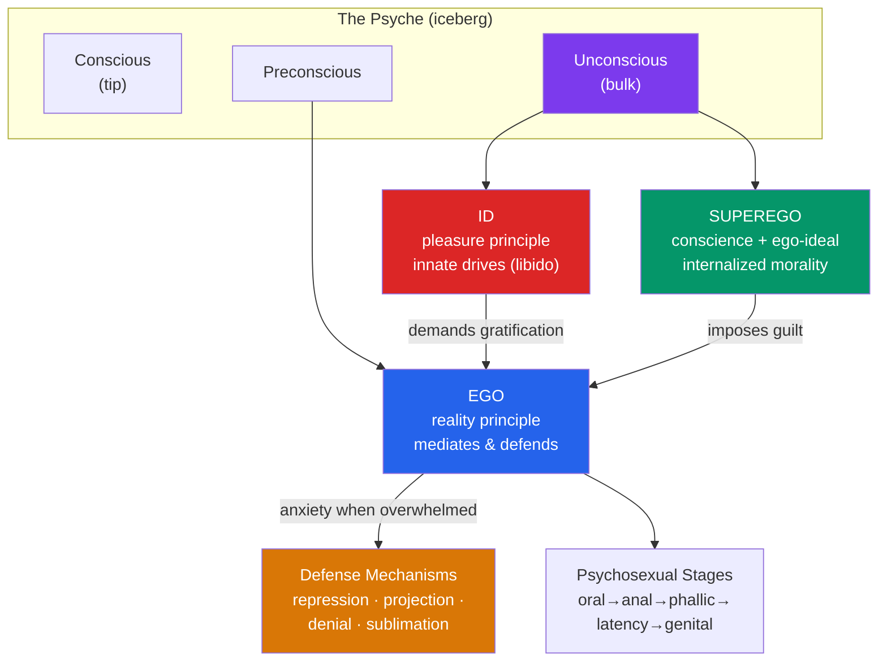

# 🌊 Psychodynamic Theories

> [!abstract] TL;DR
> Psychodynamic theory, founded by **Sigmund Freud**, holds that personality is driven by unconscious conflict among three mental agencies — the **id** (drives), **ego** (reality), and **superego** (conscience) — shaped by childhood **psychosexual stages** and defended by unconscious **defense mechanisms**. The **neo-Freudians** kept the unconscious but dropped Freud's sexual emphasis: **Jung** posited a shared **collective unconscious** of **archetypes**; **Adler** replaced libido with the striving to overcome an **inferiority complex**. Enormously influential culturally, the theory is widely criticized as **unfalsifiable**, method-dependent, and empirically thin — though some ideas (unconscious processing, defensive distortion) survive in modern research.

## Intuition — analogy FIRST

Think of the mind as an **iceberg with a boardroom hidden below the waterline**.

Only the tip of an iceberg shows above water; the vast majority — its true mass — is submerged and invisible. Freud's central claim is that consciousness is that tip, and the **unconscious** is the submerged bulk that actually steers the ship. You feel like you're captaining your own decisions, but most of the machinery runs below awareness.

Now imagine that submerged region isn't empty ice but a **boardroom in permanent argument**. A reckless investor (the **id**) shouts "spend it all now!"; a stern auditor (the **superego**) demands "that would be wrong, save every cent"; and an exhausted CEO (the **ego**) has to broker a workable compromise with reality before the company collapses. When the argument gets unbearable, the CEO doesn't resolve it — they **hide the memos** (defense mechanisms): shred them (repression), blame a rival division (projection), or dress up a bad decision in noble language (rationalization). Personality, in this view, is the characteristic style of that hidden negotiation.

---

## How It Works — The Structural Model & Its Defenses

## Key Concepts / Details

### Freud's Structural Model

**Sigmund Freud** (1856–1939) proposed three agencies of mind:

- **Id** — present at birth, entirely unconscious, operates on the **pleasure principle**: seeks immediate gratification of drives (sex/**libido** and aggression). Irrational, timeless, amoral.
- **Superego** — the internalized moral standards of parents and society, split into **conscience** (what's punished) and **ego-ideal** (what's rewarded). Source of guilt and shame.
- **Ego** — develops to mediate; operates on the **reality principle**, delaying gratification to fit the external world while keeping the id and superego from tearing the psyche apart.

The **topographic model** layers mind into **conscious**, **preconscious** (retrievable), and **unconscious** (actively kept out of awareness). Freud inferred the unconscious from dreams ("the royal road to the unconscious"), slips of the tongue ("Freudian slips"/parapraxes), and free association.

### Psychosexual Stages

Freud claimed personality forms through five childhood stages, each focused on an erogenous zone; **fixation** (from over- or under-gratification) leaves a lasting adult character.

| Stage | Age | Focus | Fixation → adult character |
|---|---|---|---|
| **Oral** | 0–1 | Mouth (feeding) | Dependency, smoking, sarcasm |
| **Anal** | 1–3 | Bowel control | "Anal-retentive" (orderly, stingy) or expulsive (messy) |
| **Phallic** | 3–6 | Genitals; **Oedipus/Electra complex** | Vanity, difficulty with authority/identity |
| **Latency** | 6–puberty | Dormant sexuality; social skills | — |
| **Genital** | Puberty+ | Mature sexual intimacy | Healthy resolution |

### Defense Mechanisms

Unconscious strategies the **ego** uses to reduce anxiety from unacceptable id impulses. Systematized by **Anna Freud** (1936).

| Defense | What it does | Example |
|---|---|---|
| **Repression** | Pushes threatening material out of awareness | No memory of a trauma |
| **Denial** | Refuses to accept external reality | Insisting a diagnosis is a mistake |
| **Projection** | Attributes own impulses to others | "*He* hates *me*" (I hate him) |
| **Displacement** | Redirects impulse to a safer target | Yelling at the dog after a bad day |
| **Reaction formation** | Converts impulse into its opposite | Overt kindness masking hostility |
| **Rationalization** | Invents acceptable reasons | "I didn't want the job anyway" |
| **Sublimation** | Channels impulse into socially valued activity | Aggression → competitive sport (Freud's only "mature" defense) |
| **Regression** | Retreats to an earlier stage | Adult sulking under stress |

### The Neo-Freudians

- **Carl Jung** (analytical psychology): split the unconscious into the **personal unconscious** and a **collective unconscious** — an inherited reservoir of universal images called **archetypes** (the Shadow, Anima/Animus, the Self, the Wise Old Man) that surface in myth, religion, and dream across all cultures. Introduced the **introversion/extraversion** dimension later absorbed by trait theory. See [[Jungian_Archetypes_and_Myth]].
- **Alfred Adler** (individual psychology): rejected libido as prime mover. All humans begin helpless and develop feelings of inferiority; healthy development is **striving for superiority/mastery**, while an unresolved **inferiority complex** (or an overcompensating **superiority complex**) drives neurosis. Stressed **social interest** and birth order.
- **Karen Horney**: challenged Freud's "penis envy" with the counter-notion of cultural power ("womb envy" as satire); emphasized **basic anxiety** from childhood insecurity.
- **Erik Erikson**: reworked the stages into eight lifelong **psychosocial** crises (trust vs. mistrust, identity vs. role confusion, etc.).

### Scientific Critiques

> [!warning] The falsifiability problem
> **Karl Popper** used psychoanalysis as his textbook example of a **pseudoscience**: it explains every outcome after the fact but forbids none in advance. If a patient resists an interpretation, that "resistance" *confirms* the theory; if they accept it, that also confirms it — so no observation can refute it.

Additional critiques: concepts (id, libido, repression) are hard to operationalize and measure; evidence rests on a handful of biased **case studies** (Little Hans, Anna O.) rather than controlled samples; the theory is **retrodictive** not predictive; and controlled tests of "repressed memory" find recovered memories are often confabulated (**Elizabeth Loftus**). What survives empirically is weaker and reframed: unconscious/automatic processing is real, but as associative learning, not a seething cauldron of drives.

## Real-World Notes

- **Clinical legacy**: modern **psychodynamic psychotherapy** and attachment-informed therapy descend from Freud; meta-analyses (Shedler) show short-term psychodynamic therapy is efficacious for some disorders, though not via Freud's original mechanisms.
- **Projective testing**: the **Rorschach** and **TAT** are direct psychodynamic instruments, built to bypass ego defenses and surface unconscious content — see [[Personality_Assessment]].
- **Culture**: Freud reshaped 20th-century art, literary criticism, and everyday vocabulary ("ego," "denial," "Freudian slip," "anal"). Jung's archetypes underlie the Myers-Briggs Type Indicator and much of comparative mythology.

## Common Pitfalls

- **Mistaking cultural influence for empirical support** — Freud's ubiquity in language does not mean the theory is validated. Influence and evidence are different currencies.
- **Reifying the id/ego/superego** — these are theoretical metaphors, not brain structures. Do not expect a neuroscientist to point to "the id."
- **Treating all defense mechanisms as pathological** — sublimation and humor are considered adaptive; the concept of defensive distortion is one of psychoanalysis's more durable contributions.
- **Assuming "unconscious" means Freud was right** — cognitive science's *adaptive unconscious* (fast, automatic processing) is a very different thing from Freud's *dynamic unconscious* (repressed, conflict-laden drives).

## Related Concepts

- [[_MOC_Personality_Psychology|↑ Section MOC]]
- [[Humanistic_Theories]] — Rogers and Maslow arose partly as a rebellion against Freud's dark, deterministic view of human nature
- [[Trait_Theory_and_the_Big_Five]] — The descriptive, measurable alternative to Freud's mechanistic theorizing
- [[Personality_Assessment]] — Projective tests (Rorschach, TAT) are the psychodynamic assessment tradition
- [[Social_Cognitive_Personality]] — Replaced unconscious drives with conscious expectancies and self-efficacy
- Cross-vault: [[Jungian_Archetypes_and_Myth]] — Jung's collective unconscious and archetypes in comparative mythology
- Cross-vault: [[Philosophy_of_Science]] — Popper's falsifiability criterion and the demarcation problem

## Review Questions

1. Describe the id, ego, and superego and the principle each operates on. Using a concrete everyday temptation, walk through how the ego might deploy two different defense mechanisms to resolve the conflict.
2. Both Jung and Adler kept Freud's unconscious but rejected his central drive. What did each replace libido with, and how does Jung's *collective* unconscious differ from Freud's personal one?
3. Explain Popper's charge that psychoanalysis is unfalsifiable, using the concept of "resistance" as an example. Does clinical usefulness rescue a theory from this critique? Argue your position.

## Sources

- Freud, S. (1923). *The Ego and the Id*. (Standard Edition, Vol. 19)
- Jung, C.G. (1969). *The Archetypes and the Collective Unconscious* (Collected Works, Vol. 9i). Princeton University Press
- Popper, K. (1963). *Conjectures and Refutations: The Growth of Scientific Knowledge*. Routledge
- Westen, D. (1998). "The scientific legacy of Sigmund Freud." *Psychological Bulletin*, 124(3), 333–371

#psychology #personality-psychology #psychodynamic #freud #defense-mechanisms
