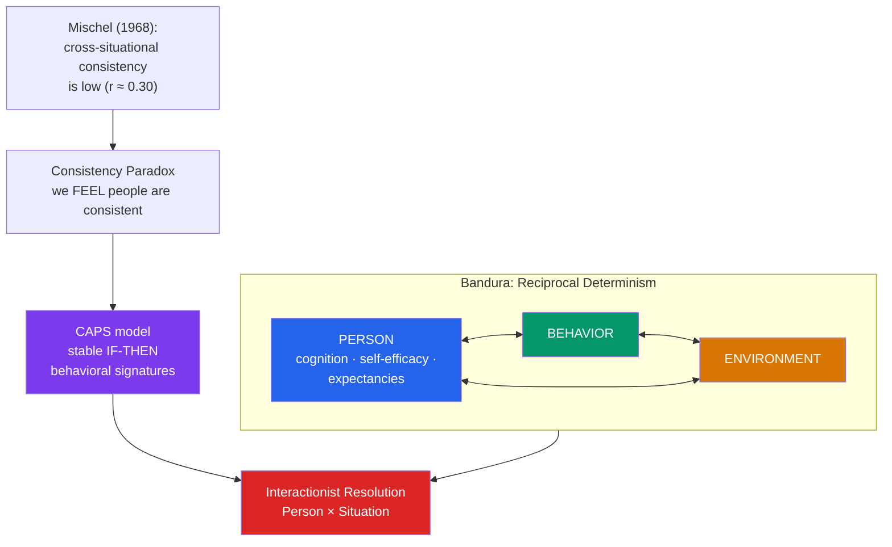

# 🔁 Social-Cognitive Personality

> [!abstract] TL;DR
> Social-cognitive theory explains personality through the **reciprocal** interaction of person, behavior, and environment rather than fixed inner traits or unconscious drives. **Albert Bandura** proposed **reciprocal determinism** and the pivotal concept of **self-efficacy** — belief in one's capacity to succeed. **Julian Rotter** added **locus of control** — whether you attribute outcomes to yourself (internal) or to fate (external). **Walter Mischel** ignited the **person–situation debate** by showing behavior is far less cross-situationally consistent than traits assume (the **consistency paradox**), later resolving it with his **CAPS** model. The modern **interactionist** consensus: personality is stable *if-then* signatures, not situation-blind constants.

## Intuition — analogy FIRST

Think of personality as a **thermostat**, not a fixed temperature.

If you describe a room simply as "warm," you've captured a static trait — but rooms don't hold one temperature. What's actually stable is the **thermostat's control logic**: a rule of the form "*if* the temperature drops below X, *then* switch on the heat." The room's readings swing all day, yet the underlying rule is perfectly consistent. Two thermostats set to different rules will produce opposite behaviors in the very same weather.

Social-cognitive theory says people are thermostats, not thermometers. The old trait question — "is this person aggressive?" — is like asking "is this room warm?" It ignores that the person is aggressive *in some situations and not others*, and that the pattern of **which** situations trigger **which** responses is the real, stable signature of personality. And crucially, the setting isn't imposed from outside alone: the thermostat's readings change the room, which feeds back and changes the readings. Person, behavior, and environment are locked in a loop, each continuously reshaping the others.

---

## How It Works — Reciprocal Determinism & the Interactionist Resolution

## Key Concepts / Details

### Bandura: Reciprocal Determinism and Self-Efficacy

**Albert Bandura** (1925–2021) argued that personality emerges from **reciprocal determinism** (triadic reciprocality): **person** (cognitions, beliefs), **behavior**, and **environment** continuously and *bidirectionally* influence one another. You are not merely shaped by your environment — your behavior selects and alters the environments that then shape you.

His most influential contribution is **self-efficacy**: the belief in one's ability to organize and execute the actions needed to succeed at a specific task. Distinct from self-esteem (global self-worth), self-efficacy is domain-specific and predicts effort, persistence, and resilience. Its four sources:

| Source | Mechanism | Strength |
|---|---|---|
| **Mastery experiences** | Succeeding at the task yourself | Strongest |
| **Vicarious experience** | Watching similar others succeed | Moderate |
| **Verbal persuasion** | Credible encouragement | Weaker |
| **Physiological/emotional states** | Interpreting arousal as readiness vs. anxiety | Contextual |

Bandura's earlier **social learning theory** (the **Bobo doll** studies) established **observational learning** — we acquire behaviors by watching models, without direct reinforcement.

### Rotter: Expectancy and Locus of Control

**Julian Rotter** framed behavior as a function of **expectancy** (belief a behavior will yield a reward) × **reinforcement value**. His enduring construct is **locus of control**:

- **Internal locus**: outcomes are seen as consequences of one's own actions and abilities. Associated with greater achievement, health behavior, and problem-focused coping.
- **External locus**: outcomes are seen as due to luck, fate, or powerful others. Associated with learned helplessness under chronic uncontrollability.

Locus of control is measured on Rotter's I-E Scale and is a generalized expectancy, not a hard trait.

### Mischel and the Person–Situation Debate

**Walter Mischel's** *Personality and Assessment* (1968) detonated the field. Reviewing the data, he reported that correlations between a trait and behavior across different situations rarely exceeded **r ≈ 0.30** — the so-called "**personality coefficient**." If knowing someone's trait score explains under 10% of behavioral variance, he argued, situations must dominate.

This produced the **consistency paradox**: our intuition that people are highly consistent clashes with data showing low *cross-situational* consistency. Mischel's resolution distinguished two kinds of consistency:

- **Cross-situational consistency** (same behavior across different situations) — genuinely low.
- **Temporal/if-then consistency** (same behavior in the *same type* of situation over time) — actually high.

His **Cognitive-Affective Personality System (CAPS)**, with **Yuichi Shoda**, models personality as a network of **cognitive-affective units** (encodings, expectancies, goals, self-regulatory plans) that generate stable **if-then behavioral signatures**: "she's warm *with subordinates* but hostile *with authority*." The signature — not a situation-free average — *is* the personality. (Mischel is also famous for the **marshmallow test** of delay of gratification.)

### The Interactionist Resolution

The debate ended not in victory for either side but in **interactionism**: behavior = f(Person × Situation). Traits predict *aggregated* behavior well (the **aggregation principle** — averaging over many situations recovers strong trait signal, as **Epstein** showed), while situations predict any *single* act. Both the Big Five's broad dispositions and Mischel's if-then signatures are real, at different levels of analysis. Modern **whole-trait theory** even reframes traits as density distributions of momentary states.

> [!note] Why the "personality coefficient" was misread
> An r of 0.30 across single situations sounds small, but aggregated over many occasions the same trait predicts behavior at r ≈ 0.60+. Mischel's critique wounded *naïve* trait theory (single-act prediction), not trait theory that respects aggregation. See [[Trait_Theory_and_the_Big_Five]].

## Real-World Notes

- **Health & clinical**: self-efficacy is one of the strongest predictors of health-behavior change (smoking cessation, exercise adherence) and is the engine of cognitive-behavioral interventions. Internal locus of control predicts better chronic-illness self-management.
- **Education & organizations**: efficacy beliefs predict academic persistence and job performance; "growth mindset" work (Dweck) is a descendant. Modeling and mastery-structured tasks are used to build efficacy deliberately.
- **Assessment implication**: the situational specificity of behavior is why single-occasion tests can mislead, and why behavioral assessment favors sampling across contexts — see [[Personality_Assessment]].

## Common Pitfalls

- **Confusing self-efficacy with self-esteem** — efficacy is task-specific ("can I do *this*?"); esteem is global self-worth. High esteem with low domain efficacy is common.
- **Reading Mischel as "traits don't exist"** — he argued against *situation-blind* single-act prediction, not against dispositions. The field's answer is "both/and," not "situation wins."
- **Treating locus of control as fixed destiny** — it is a generalized *expectancy* that shifts with experience and context, not an unchangeable trait.
- **Ignoring reciprocity** — remembering only "environment shapes person" and forgetting that behavior also selects and transforms environments (people evoke and create their own situations).

## Related Concepts

- [[_MOC_Personality_Psychology|↑ Section MOC]]
- [[Trait_Theory_and_the_Big_Five]] — The dispositional view Mischel challenged; resolved via the aggregation principle
- [[Humanistic_Theories]] — Shares the emphasis on agency and conscious cognition; self-efficacy is a testable cousin of Rogers' self-concept
- [[Psychodynamic_Theories]] — Replaced unconscious drives with conscious expectancies and self-regulation
- [[Personality_Assessment]] — Behavioral and situational sampling as an alternative to broad self-report
- Cross-vault: [[Operant_and_Classical_Conditioning]] — Bandura extended and cognitized behaviorist learning
- Cross-vault: [[Motivation_and_Emotion]] — Expectancy, efficacy, and self-regulation as motivational drivers

## Review Questions

1. Define reciprocal determinism and illustrate all three bidirectional links with a single concrete example (e.g., a student and their study environment).
2. Explain the consistency paradox and how Mischel's distinction between cross-situational and if-then consistency, plus the CAPS model, resolves it. Why is a behavioral "signature" more informative than a trait average?
3. An r of 0.30 was used to argue traits barely predict behavior. Using the aggregation principle, explain why this conclusion overreached and how trait and social-cognitive views are reconciled by interactionism.

## Sources

- Bandura, A. (1986). *Social Foundations of Thought and Action: A Social Cognitive Theory*. Prentice-Hall
- Mischel, W. (1968). *Personality and Assessment*. Wiley
- Mischel, W. & Shoda, Y. (1995). "A cognitive-affective system theory of personality." *Psychological Review*, 102(2), 246–268
- Rotter, J.B. (1966). "Generalized expectancies for internal versus external control of reinforcement." *Psychological Monographs*, 80(1), 1–28

#psychology #personality-psychology #social-cognitive #self-efficacy #person-situation
