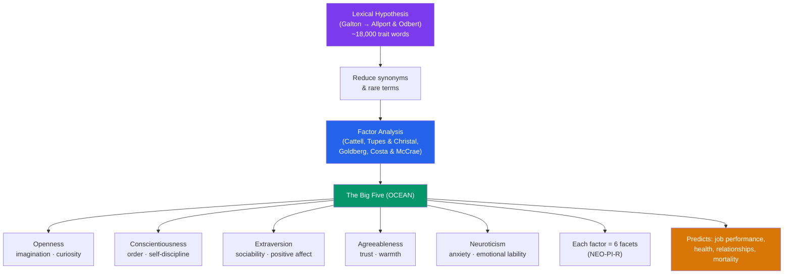

# 🧬 Trait Theory and the Big Five

> [!abstract] TL;DR
> Trait theory describes personality as a set of stable, continuous dimensions on which everyone can be scored. Decades of factor-analytic work converged on the **Big Five** (OCEAN): **Openness, Conscientiousness, Extraversion, Agreeableness, Neuroticism**. The model grew out of the **lexical hypothesis** — that important individual differences get encoded in language — and competes with narrower schemes like Eysenck's three-factor PEN model and Cattell's 16PF. Big Five traits are moderately heritable (~40–60% from twin studies), remarkably stable in adulthood, and predict outcomes from job performance to mortality better than most competing constructs.

## Intuition — analogy FIRST

Think of personality traits as the **equalizer sliders on a sound system**.

A graphic equalizer doesn't sort music into a few discrete genres — it gives you a handful of continuous sliders (bass, mids, treble) and *any* song is just a particular setting of all of them. Two tracks can share a heavy bass setting yet differ completely on treble. You don't ask "is this song bass or treble?" — that's a category error; you read the whole profile.

The Big Five works the same way. There is no "extravert box" and "introvert box" — extraversion is a slider, and everyone sits somewhere on it. Your personality is your particular setting across five sliders at once. This is why trait theory rejects "types": types pretend the sliders are switches, when the data show smooth, bell-shaped continua. The lexical hypothesis is just the observation that humanity has spent millennia inventing words to label where people's sliders sit — so the sliders that matter should fall out of the dictionary.

---

## How It Works — From Words to Factors

## Key Concepts / Details

### The Lexical Hypothesis

**Sir Francis Galton** first proposed (1884) that individual differences salient enough to matter would become encoded as single words in natural language. **Gordon Allport and Henry Odbert** (1936) operationalized this by combing an English dictionary and extracting ~18,000 person-descriptive terms, ~4,500 of them stable traits. The reasoning: if a distinction between people is socially important, humans will invent a word for it, and the more important the trait, the more words (synonyms) it will attract. Factor analysis then collapses thousands of correlated adjectives into a small number of underlying dimensions.

> [!note] What a "trait" is
> A **trait** is a relatively stable, internal disposition that produces consistent patterns of thought, feeling, and behavior across situations and time. Traits are **descriptive and dimensional** — they say *what* a person tends to do, not *why* (unlike psychodynamic or social-cognitive theories, which propose mechanisms).

### The Big Five (OCEAN)

Independently discovered by **Tupes and Christal** (1961, US Air Force data), rediscovered by **Warren Norman**, championed by **Lewis Goldberg** (who coined "Big Five"), and operationalized into the NEO inventories by **Paul Costa and Robert McCrae**.

| Factor | High scorer | Low scorer | Sample facets (NEO-PI-R) |
|---|---|---|---|
| **Openness** to experience | Imaginative, curious, unconventional | Practical, conventional, prefers routine | Fantasy, aesthetics, ideas, values |
| **Conscientiousness** | Organized, disciplined, dependable | Careless, impulsive, spontaneous | Order, dutifulness, achievement-striving, self-discipline |
| **Extraversion** | Sociable, assertive, energetic | Reserved, quiet, solitary | Warmth, gregariousness, assertiveness, positive emotion |
| **Agreeableness** | Trusting, cooperative, warm | Competitive, skeptical, blunt | Trust, altruism, compliance, tender-mindedness |
| **Neuroticism** | Anxious, moody, self-conscious | Calm, resilient, even-tempered | Anxiety, hostility, depression, vulnerability |

Mnemonics: **OCEAN** or **CANOE**. Each factor sits atop **six facets**, so the model is hierarchical — broad factors above, narrow facets below.

### Competing Trait Models

**Hans Eysenck's PEN model** is the leaner rival: just three biologically grounded superfactors — **Psychoticism** (tough-mindedness, aggression), **Extraversion**, and **Neuroticism**. Eysenck tied Extraversion to cortical arousal (introverts are chronically *over*-aroused, so they avoid stimulation) and Neuroticism to limbic-system reactivity. His E and N map neatly onto the Big Five; his Psychoticism spans the (reversed) low ends of Agreeableness and Conscientiousness.

**Raymond Cattell's 16PF** went the other direction — sixteen primary "source traits" derived by factor analysis. It captures more nuance but the sixteen factors are less replicable and themselves cluster into roughly five second-order factors, which is part of why the field consolidated on the Big Five.

**Newer variants**: the **HEXACO** model (Ashton & Lee) adds a sixth factor, **Honesty-Humility**, that the Big Five folds into Agreeableness.

### Stability, Heritability, and Validity

- **Stability**: rank-order stability rises through life, peaking around age 50. The **maturity principle** (Roberts & colleagues) describes mean-level drift with age — adults tend to gain Conscientiousness and Agreeableness and lose Neuroticism ("the La Dolce Vita effect").
- **Heritability**: classic **twin studies** (comparing monozygotic vs. dizygotic twins, including twins reared apart — e.g. the Minnesota Study) estimate ~**40–60%** of variance in each Big Five trait as heritable. Strikingly, the **shared environment** (growing up in the same home) contributes near-zero to adult personality; the non-shared environment and error account for the rest.
- **Predictive validity**: Conscientiousness predicts job performance across nearly all occupations and longer lifespan; Neuroticism predicts anxiety/depression and relationship dissatisfaction; low Agreeableness + low Conscientiousness predict antisocial outcomes. Meta-analyses show traits often rival or beat socioeconomic status in predicting mortality and divorce.

## Real-World Notes

- **Hiring and I/O psychology**: Conscientiousness is the single best broad personality predictor of job performance, so structured integrity/personality inventories (built on Big Five facets) supplement cognitive testing. Beware faking-good on self-report in high-stakes settings — see [[Personality_Assessment]].
- **Clinical**: the **Big Five have been embedded in the DSM-5 alternative model of personality disorders** as maladaptive extremes (e.g. pathological Neuroticism → "negative affectivity"). Personality is increasingly seen as continuous with psychopathology, not separate from it.
- **Cross-cultural**: the five-factor structure replicates across dozens of languages and cultures, supporting some universality — though Openness is the least stable factor cross-culturally, and some indigenous lexical studies surface extra factors.

## Common Pitfalls

- **Treating traits as types** — "I'm an introvert" implies a box; the data are continuous. Most people are near the middle of every dimension.
- **Confusing description with explanation** — saying someone procrastinates *because* they're low in Conscientiousness is nearly circular. Traits summarize behavior patterns; they don't identify causes the way a mechanism would.
- **Over-reading heritability** — "60% heritable" is a population-variance statistic, not a claim that 60% of *your* personality is fixed. It says nothing about how malleable a trait is, and heritability estimates shift with environment.
- **Ignoring facets** — two people with identical Extraversion scores can differ wildly (one high on assertiveness, one on warmth). Broad factors hide within-factor structure.

## Related Concepts

- [[_MOC_Personality_Psychology|↑ Section MOC]]
- [[Personality_Assessment]] — How the NEO-PI-R and other inventories operationalize and measure these five factors
- [[Psychodynamic_Theories]] — The mechanism-based rival trait theory reacted against; traits describe, psychoanalysis explains
- [[Social_Cognitive_Personality]] — Mischel's person–situation debate challenged the cross-situational consistency that traits assume
- [[Humanistic_Theories]] — An alternative that resists reducing the person to a score profile
- Cross-vault: [[Behavior_Genetics]] — Twin-study methodology behind heritability estimates
- Cross-vault: [[Statistics_and_Probability]] — Factor analysis, the engine that produced the Big Five

## Review Questions

1. Explain the lexical hypothesis and describe how it leads, via factor analysis, from a dictionary of ~18,000 words to just five factors. Why does the *number* of synonyms for a trait matter?
2. Twin studies estimate the Big Five as roughly 40–60% heritable while finding the shared environment contributes almost nothing to adult personality. Interpret both findings carefully — what common misconception about "60% heritable" should you warn against?
3. Contrast Eysenck's PEN model with the Big Five. Which two Big Five factors map cleanly onto two of Eysenck's, and how does his Psychoticism relate to the remaining Big Five factors?

## Sources

- Costa, P.T. & McCrae, R.R. (1992). *Revised NEO Personality Inventory (NEO-PI-R) Manual*. PAR
- Goldberg, L.R. (1993). "The structure of phenotypic personality traits." *American Psychologist*, 48(1), 26–34
- John, O.P., Robins, R.W. & Pervin, L.A. (Eds.) (2008). *Handbook of Personality: Theory and Research* (3rd ed.). Guilford
- Bouchard, T.J. & Loehlin, J.C. (2001). "Genes, evolution, and personality." *Behavior Genetics*, 31(3), 243–273

#psychology #personality-psychology #big-five #traits #heritability
