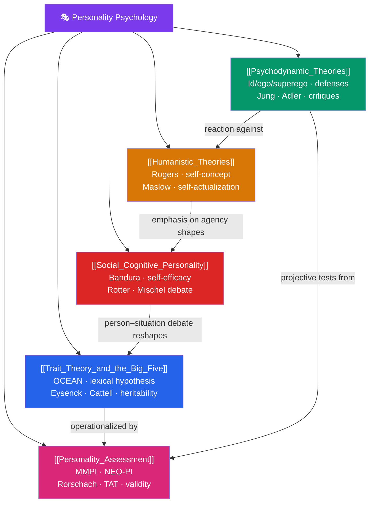

# 🎭 Personality Psychology — Map of Content

> [!abstract] What This Section Covers
> Personality psychology asks what makes people consistently *themselves* — and why they differ. This section surveys the major grand theories and the tools that test them: the **trait approach** that distills personality into measurable dimensions like the Big Five; **psychodynamic theory**, Freud's unconscious machinery and its descendants; **humanistic theory**, which centers growth, self-concept, and self-actualization; the **social-cognitive** view, which locates personality in the interaction of person and situation; and **assessment**, the psychometric problem of actually measuring an invisible construct. Together these five notes trace the field's arc from sweeping theory to rigorous measurement.

## Concept Map

## Learning Path

1. [[Trait_Theory_and_the_Big_Five]] — The lexical hypothesis, the OCEAN model, Eysenck's PEN and Cattell's 16PF, and the substantial heritability of traits.
2. [[Psychodynamic_Theories]] — Freud's id/ego/superego, psychosexual stages, defense mechanisms, plus Jung's and Adler's revisions and modern critiques.
3. [[Humanistic_Theories]] — Rogers' self-concept and unconditional positive regard, and Maslow's hierarchy and self-actualization.
4. [[Social_Cognitive_Personality]] — Bandura's reciprocal determinism and self-efficacy, Rotter's locus of control, and Mischel's person–situation debate.
5. [[Personality_Assessment]] — Self-report inventories (MMPI, NEO-PI), projective tests (Rorschach, TAT), and questions of reliability and validity.

## All Notes at a Glance

| Note | Difficulty | What You'll Learn |
|------|------------|-------------------|
| [[Trait_Theory_and_the_Big_Five]] | Beginner → Intermediate | Lexical hypothesis, OCEAN dimensions, Eysenck, Cattell, twin-study heritability, trait stability |
| [[Psychodynamic_Theories]] | Intermediate | Structural model, psychosexual stages, defense mechanisms, Jung's archetypes, Adler's inferiority, empirical critiques |
| [[Humanistic_Theories]] | Beginner → Intermediate | Phenomenology, self-concept, conditions of worth, unconditional positive regard, hierarchy of needs |
| [[Social_Cognitive_Personality]] | Intermediate | Reciprocal determinism, self-efficacy, locus of control, situational specificity, the consistency paradox |
| [[Personality_Assessment]] | Intermediate → Advanced | Self-report vs. projective methods, MMPI/NEO-PI, Rorschach/TAT, response bias, reliability & validity |

## Key Questions This Section Answers

- Are there really just five broad dimensions underlying all of personality?
- How much of your personality did you inherit, and how much did your environment build?
- Can a theory (like Freud's) be enormously influential yet largely unfalsifiable?
- Is behavior driven more by who you are or by the situation you're in?
- Why do many psychologists distrust projective tests like the Rorschach?

## Related Sections

- [[_MOC_Psychology_Master|↑ Psychology Master MOC]]
- [[_MOC_Biological_Psychology|← Biological Psychology]]
- [[_MOC_Learning_Behaviorism|→ Learning & Behaviorism]]

#MOC #Psychology #PersonalityPsychology
