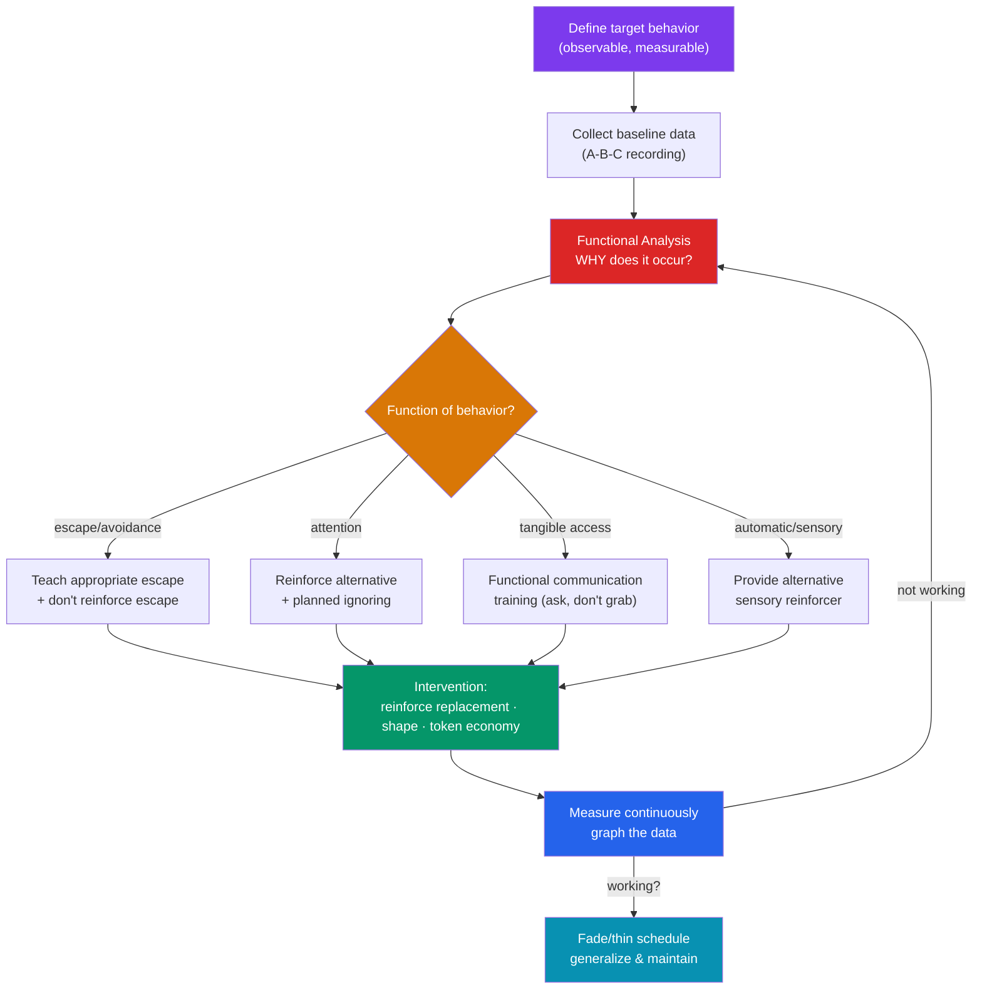

# 🛠️ Applied Behavior Analysis

> [!abstract] TL;DR
> Applied Behavior Analysis (ABA) turns the laws of conditioning into practice: it changes socially meaningful behavior by systematically arranging **antecedents and consequences**, measuring outcomes objectively. Its toolkit includes **functional (behavior) analysis** — identifying *why* a behavior occurs — plus **token economies**, **shaping**, **differential reinforcement**, and Pavlovian-derived **exposure** and **systematic desensitization** for anxiety. ABA is the dominant early-intervention model for **autism**, where evidence supports skill gains but where **ethical debates** (intensity, aversives, compliance vs. autonomy, neurodiversity critiques) are live and serious. It shares roots — and increasingly overlaps — with [[Cognitive_Behavioral_Therapy]].

## Intuition — analogy FIRST

Think of ABA as **debugging behavior the way an engineer debugs a system**.

An engineer doesn't guess why a program crashes — they **instrument** it, log the inputs and outputs, form a hypothesis about the cause, change *one variable*, and measure whether the crash rate drops. If a fix works, they keep it; if not, they revise the hypothesis. No appeals to the program's "personality," just observable inputs, outputs, and controlled changes.

ABA treats a problem behavior the same way. It asks: *what happens right before* (antecedent) and *right after* (consequence) the behavior — because those, not hidden traits, are the levers you can actually move. A child's tantrum isn't "just difficult behavior"; it's a behavior that *works* — it reliably produces escape from a task or access to attention. Find what maintains it, change that contingency, measure the result. The philosophy is radically empirical: **if the data don't show change, the intervention is wrong, not the person.**

---

## How It Works — The ABA Cycle

The loop is inherently **data-driven and iterative**: intervene, measure, and revise until the graph moves. Baer, Wolf & Risley's (1968) founding paper defined ABA's seven dimensions, insisting it be **applied** (socially important), **behavioral, analytic, technological, conceptual, effective, and generalizable**.

## Key Concepts / Details

### From Principles to Practice

ABA is the **applied** wing of the behaviorism family: it takes [[Operant_Conditioning|operant]] and [[Classical_Conditioning|Pavlovian]] principles and deploys them to change real-world behavior with measurable outcomes. Its non-negotiable commitment is **objective measurement** — behaviors are operationally defined and counted, and success is judged by the data, not clinical impression.

### Functional (Behavior) Analysis

The keystone insight: **behaviors persist because they are reinforced — so identify the reinforcer.** A **functional behavior assessment (FBA)** and experimental **functional analysis** (Iwata et al., 1982/1994) systematically test which consequence maintains a behavior. The four common functions (mnemonic **SEAT / EATS**):
- **E**scape/avoidance (of demands, tasks)
- **A**ttention (social)
- **T**angibles (access to items/activities)
- **S**ensory/automatic (self-stimulation)

Treatment then matches the function: you cannot fix an *escape*-maintained tantrum with attention-based rewards. This is the difference between symptom-whacking and root-cause fixing.

### Core Techniques

| Technique | Principle | What it does |
|---|---|---|
| **Token economy** | Secondary/generalized reinforcement | Earn tokens (points, stars) for target behaviors, exchange for backup reinforcers — used in classrooms, wards, corrections |
| **Shaping** | Successive approximation | Build new skills by reinforcing closer-and-closer attempts |
| **Chaining** | Sequencing operants | Link steps (e.g., handwashing) into a routine, forward or backward |
| **Differential reinforcement (DRA/DRO/DRI)** | Reinforce alternatives / omission | Reinforce a *replacement* or the *absence* of the problem behavior |
| **Prompting & fading** | Antecedent control | Add cues to evoke behavior, then systematically remove them |
| **Extinction** | Withhold the maintaining reinforcer | Stop reinforcing; expect an **extinction burst** first — see [[Reinforcement_Schedules]] |
| **Systematic desensitization** | Counter-conditioning (Pavlovian) | Pair a relaxation response with a graded fear hierarchy |
| **Exposure** | Respondent extinction | Repeated, safe CS exposure without the feared US extinguishes the CR |

### Token Economies

A **token economy** (Ayllon & Azrin, 1968) is a structured system in which target behaviors earn **tokens** (a generalized secondary reinforcer) exchangeable for a menu of backup reinforcers. Because tokens bridge the delay between behavior and reward and can be delivered immediately, they solve the "delayed consequence" problem of real-world reinforcement. Widely used in special education, psychiatric wards, and residential programs; effectiveness depends on clear contingencies, meaningful backups, and a plan to **fade** to natural reinforcers so gains generalize.

### ABA and Autism

ABA is the most researched behavioral intervention for **autism spectrum disorder (ASD)**. Building on **Lovaas's (1987)** early-intensive work, modern programs (including naturalistic, play-based variants like **Pivotal Response Treatment** and the **Early Start Denver Model**) use reinforcement, prompting, shaping, and discrete-trial or naturalistic teaching to build communication, self-care, and social skills, and to reduce dangerous behavior. Meta-analyses generally support gains in some domains (e.g., language, adaptive behavior), though effect sizes vary and evidence quality is debated.

### Exposure and Systematic Desensitization

For anxiety and phobias, ABA/behavior therapy applies **respondent** principles. **Systematic desensitization** (Wolpe, 1958) pairs deep relaxation with a graded **fear hierarchy**, exploiting **reciprocal inhibition** (you can't be relaxed and afraid at once) — a form of **counter-conditioning**. **Exposure therapy** is essentially clinical **extinction** of a conditioned fear (see [[Classical_Conditioning]]): the client contacts the feared CS repeatedly *without* the feared US, so the CR weakens. These are among the most empirically supported treatments in all of clinical psychology and are integral to [[Cognitive_Behavioral_Therapy]].

### Ethical Debates

ABA is effective **and** contested. Key issues:
- **Historical aversives**: early programs (including Lovaas's) used punishment/aversive procedures now widely rejected; some settings still controversially use them (e.g., contingent electric skin shock), condemned by many bodies.
- **Intensity & compliance**: very high-hour programs and an emphasis on "indistinguishability from peers"/compliance draw criticism for prioritizing appearance over well-being.
- **Neurodiversity critique**: autistic self-advocates argue some ABA suppresses harmless self-regulating behavior (e.g., stimming) and can cause distress; some report iatrogenic harm.
- **Consent & assent**: because clients are often children or have communication differences, ongoing **assent**, dignity, and function-based (not compliance-based) goals are central to contemporary ethical practice.

> [!warning] Effectiveness Is Not a Blank Check
> That a technique *works* to change behavior does not make every application *ethical*. Modern ABA emphasizes assent-based, socially valid goals, least-restrictive procedures, and reinforcement over punishment. The measure of a good program is client well-being and self-determination, not mere behavioral compliance.

## Real-World Notes

- **Classrooms**: token/point systems, differential reinforcement, and clear antecedent structure (routines, prompts) manage behavior and build skills.
- **Clinical & health**: exposure and desensitization for phobias/OCD/PTSD; contingency management (voucher-based reinforcement) for substance-use disorders; habit-reversal for tics.
- **Organizations (OBM)**: **Organizational Behavior Management** applies the same reinforcement principles to safety, productivity, and performance feedback at work.
- **Everyday self-management**: habit tracking, commitment devices, and self-administered reinforcement are folk ABA — arrange your own antecedents and consequences.

## Common Pitfalls

- **Treating the topography, not the function.** Two identical-looking tantrums may serve *different* functions (escape vs. attention) and require *opposite* interventions. Skip the functional analysis and you'll pick the wrong fix.
- **Reinforcing the problem during extinction.** Giving in during an **extinction burst** intermittently reinforces the behavior, making it *more* persistent — see [[Reinforcement_Schedules]].
- **Neglecting generalization and maintenance.** Behavior trained in one setting with one therapist often doesn't transfer; you must program for generalization and fade to natural reinforcers.
- **Conflating "evidence-based" with "beyond ethical scrutiny."** Efficacy and ethics are separate questions; aversives, excessive intensity, and compliance-first goals are legitimately contested.
- **Confusing ABA with CBT.** ABA centers observable behavior and environmental contingencies; **CBT** also targets *cognitions*. They overlap heavily and are often combined — see [[Cognitive_Behavioral_Therapy]].

## Related Concepts

- [[_MOC_Learning_Behaviorism|↑ Section MOC]]
- [[Operant_Conditioning]] — Reinforcement, punishment, shaping, and secondary reinforcers — ABA's core toolkit
- [[Classical_Conditioning]] — Extinction and counter-conditioning behind exposure and systematic desensitization
- [[Reinforcement_Schedules]] — Schedule thinning for maintenance; the extinction burst that derails naive interventions
- [[Observational_Learning]] — Modeling and participant modeling as ABA teaching techniques
- Cross-vault: [[Cognitive_Behavioral_Therapy]] — The cognitive-plus-behavioral therapy that extends these principles to thoughts and beliefs

## Review Questions

1. A student repeatedly disrupts class. Explain how a functional analysis would determine *why*, name the four common functions of behavior, and show how the correct intervention differs if the function is "escape from work" versus "peer attention."
2. Distinguish **systematic desensitization** from **exposure therapy**, tying each to a specific principle from [[Classical_Conditioning]] (counter-conditioning/reciprocal inhibition vs. respondent extinction). Why can't insight alone extinguish a phobia?
3. ABA is described as both "the most evidence-based autism intervention" and "ethically controversial." Summarize two specific ethical critiques and explain why demonstrated effectiveness does not by itself resolve them.

## Sources

- Baer, D. M., Wolf, M. M. & Risley, T. R. (1968). "Some current dimensions of applied behavior analysis." *JABA*, 1(1), 91–97
- Iwata, B. A. et al. (1994). "Toward a functional analysis of self-injury." *JABA*, 27(2), 197–209 (reprint of 1982)
- Ayllon, T. & Azrin, N. H. (1968). *The Token Economy: A Motivational System for Therapy and Rehabilitation*. Appleton-Century-Crofts
- Wolpe, J. (1958). *Psychotherapy by Reciprocal Inhibition*. Stanford University Press

#psychology #learning-behaviorism #applied-behavior-analysis #token-economy #aba
