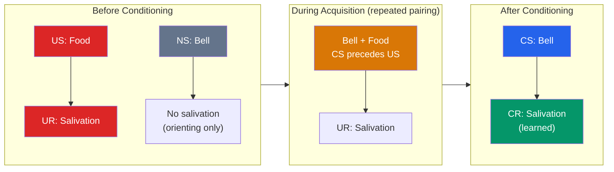

# 🔔 Classical Conditioning

> [!abstract] TL;DR
> Classical conditioning is learning that one stimulus predicts another. A neutral stimulus (a bell) repeatedly paired with a biologically significant one (food) comes to trigger the response the significant one produced (salivation). Discovered by **Ivan Pavlov** studying dog digestion, it is described by the **US → UR** reflex and the acquired **CS → CR** link. Its dynamics — acquisition, extinction, spontaneous recovery, generalization, discrimination — are lawful and reproducible. It is not "any old learning": the response is an automatic, reflexive, glandular or emotional reaction, and biology constrains which associations form easily (**taste aversion**, Garcia).

## Intuition — analogy FIRST

Think of classical conditioning as your brain quietly building a **weather forecast** out of coincidences.

You don't decide to associate dark clouds with rain — you just notice, over many days, that clouds reliably come *before* the downpour. Eventually the clouds alone make you reach for an umbrella. Nothing about a cloud is intrinsically wet; it simply became a **reliable signal** for something that is. Your reaching for the umbrella is a response that "belongs" to the rain, now triggered early by the predictor.

Pavlov's dogs did the same with a bell. A bell means nothing to a hungry dog — until it repeatedly announces food. After enough pairings, the bell alone waters the mouth, because the nervous system treats a reliable predictor as if it were the thing predicted. The key insight: **the organism is learning the structure of its environment — what predicts what — automatically, without intending to.**

---

## How It Works — The Pavlovian Sequence

The whole theory rests on **temporal contingency**: the CS must reliably *predict* the US. Simple pairing is not enough — Rescorla showed the CS must provide *information*. A bell that rings just as often without food as with it never becomes a CS, even though it is "paired" many times.

## Key Concepts / Details

### The Four-Term Framework

The vocabulary is the load-bearing part of the whole topic. Memorize it precisely.

| Term | Definition | Pavlov's dogs | Everyday example (fear of dentist) |
|---|---|---|---|
| **US** — Unconditioned Stimulus | Naturally triggers a response, no learning needed | Food | The drill / pain |
| **UR** — Unconditioned Response | The unlearned reflex to the US | Salivation to food | Anxiety from pain |
| **CS** — Conditioned Stimulus | Formerly neutral; now predicts the US | Bell | Whine of the drill, waiting room smell |
| **CR** — Conditioned Response | The learned response to the CS alone | Salivation to bell | Anxiety on hearing the drill |

Note that the **UR and CR are usually the same response** (salivation), differing only in what evokes them. The CR is often slightly weaker or faster than the UR.

### Acquisition and Timing

**Acquisition** is the phase where the CS–US link strengthens with repeated pairings. It is fastest when:
- The CS *precedes* the US by a short interval (**delay/forward conditioning**, ~0.5 s is often optimal for reflexes). Presenting the CS *after* the US (**backward conditioning**) produces little or no learning.
- The US is intense and the CS is salient.
- The CS reliably predicts the US (high contingency, per **Rescorla, 1968**).

### Extinction, Spontaneous Recovery, and Renewal

- **Extinction**: presenting the CS repeatedly *without* the US weakens the CR until it disappears. Crucially, extinction does **not erase** the original learning — it layers new "CS-means-nothing" learning on top.
- **Spontaneous recovery**: after a rest period, the extinguished CR reappears (weaker) when the CS is presented again. Proof the original memory survived.
- **Renewal**: an extinguished CR returns if the animal is moved to a different context than the one where extinction happened. Together these show extinction is *new learning, not unlearning* — a fact central to why phobias and cravings relapse.

### Generalization and Discrimination

- **Stimulus generalization**: stimuli *similar* to the CS also evoke the CR. A dog conditioned to a 1000 Hz tone salivates (less) to a 900 Hz tone. The more similar, the stronger the response — a **generalization gradient**.
- **Stimulus discrimination**: with training (reinforce CS+, never reinforce CS−), the organism learns to respond only to the precise CS. Pavlov could induce "experimental neurosis" by making the discrimination impossibly fine.

### Watson and Little Albert (1920)

**John B. Watson** and Rosalie Rayner conditioned an 11-month-old infant ("Little Albert") to fear a white rat by pairing it (CS) with a loud clanging steel bar (US → startle/crying UR). After pairings, Albert cried at the rat alone (CR), and the fear **generalized** to a rabbit, a fur coat, and a Santa mask. The study — ethically indefensible by modern standards, and methodologically shaky — nonetheless demonstrated that **emotional responses, including phobias, can be classically conditioned**, launching behaviorism as a program for human psychology.

### Biological Preparedness (Garcia Effect)

Classical conditioning is **not** a blank-slate, equipotential process. **John Garcia** (1966) showed rats form a **conditioned taste aversion** — nausea (US) paired with a novel flavor (CS) — after a *single* trial, even with a **delay of hours** between taste and sickness. Yet the same rats could *not* learn to associate that nausea with a light or tone. Conversely, pain (shock) conditions readily to lights/sounds but not to tastes. This **preparedness** (Seligman, 1970) reflects evolution: an animal that learns "the food that made me sick" in one trial survives; associating illness with a flashing light would be maladaptive. It broke the behaviorist assumption that any CS could be linked to any US.

> [!note] Conditioning ≠ Conscious Belief
> The CR is automatic and often survives the person "knowing better." A chemotherapy patient can salivate with nausea at the sight of the hospital parking lot even while fully aware no drug is coming. This is why insight alone rarely cures a conditioned phobia — see [[Applied_Behavior_Analysis]].

## Real-World Notes

- **Phobias and anxiety**: many specific phobias fit a Pavlovian origin (a dog bite pairs "dog" with pain). This is the theoretical basis for **exposure therapy**, which is essentially clinical extinction — see [[Applied_Behavior_Analysis]].
- **Advertising**: pairing a product (CS) with attractive models, music, or happy scenes (US → positive affect) transfers good feeling to the brand. This is **evaluative conditioning**.
- **Chemotherapy**: anticipatory nausea is a textbook conditioned response; clinicians use "overshadowing" (a novel strong-flavored candy before treatment) so the aversion attaches to the candy, not to normal food.
- **Addiction**: drug-paired cues (a particular street, paraphernalia) become CSs that trigger conditioned cravings and compensatory physiological responses, driving relapse even after detox.

## Common Pitfalls

- **Confusing the US with the CS.** The US is the *natural* trigger (food, pain); the CS is the *learned signal* (bell, drill sound). If you can swap them, you've mislabeled.
- **Thinking extinction erases learning.** It does not. Spontaneous recovery, renewal, and reinstatement all prove the original CS–US memory persists. This is the single most important nuance for therapy.
- **Assuming any CS pairs with any US.** Garcia's taste-aversion work killed equipotentiality. Biology pre-wires which associations form easily.
- **Confusing it with operant conditioning.** Classical conditioning is about *stimulus–stimulus* prediction and elicits *involuntary reflexes*; operant conditioning is about *behavior–consequence* and shapes *voluntary* action — see [[Operant_Conditioning]].

## Related Concepts

- [[_MOC_Learning_Behaviorism|↑ Section MOC]]
- [[Operant_Conditioning]] — The complementary engine: learning from *consequences* of action rather than *predictive* stimuli
- [[Observational_Learning]] — Emotional responses (including fears) can be acquired vicariously, without direct pairing
- [[Reinforcement_Schedules]] — How the *timing* of consequences shapes operant behavior (the operant analogue of acquisition dynamics)
- [[Applied_Behavior_Analysis]] — Extinction and counter-conditioning turned into clinical tools (exposure, systematic desensitization)
- Cross-vault: [[Neurons_and_Neurotransmitters]] — The amygdala and cerebellar circuits that implement fear and eyeblink conditioning

## Review Questions

1. A child is stung by a bee (pain) while playing near a specific flowerbed and now cries when brought near it. Label the US, UR, CS, and CR, and explain what "stimulus generalization" would look like in this case.
2. Explain why extinction is best described as "new learning" rather than "unlearning." Name two phenomena that prove the original association survives extinction, and state one clinical implication.
3. Garcia's taste-aversion experiments contradicted a core behaviorist assumption. What was that assumption, what did Garcia find, and why does an evolutionary account predict his results?

## Sources

- Pavlov, I. P. (1927). *Conditioned Reflexes*. Oxford University Press
- Watson, J. B. & Rayner, R. (1920). "Conditioned emotional reactions." *Journal of Experimental Psychology*, 3(1), 1–14
- Garcia, J. & Koelling, R. A. (1966). "Relation of cue to consequence in avoidance learning." *Psychonomic Science*, 4, 123–124
- Rescorla, R. A. (1988). "Pavlovian conditioning: It's not what you think it is." *American Psychologist*, 43(3), 151–160

#psychology #learning-behaviorism #classical-conditioning #pavlov #associative-learning
