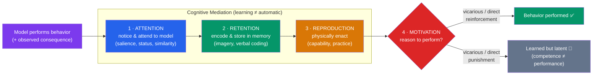

# 👀 Observational Learning

> [!abstract] TL;DR
> Observational learning is acquiring behavior by **watching others** rather than by direct reinforcement. **Albert Bandura's social learning theory** showed that children who watched an adult attack a **Bobo doll** later imitated that aggression — proving behavior can be learned without the learner ever being rewarded. Learning is governed by four component processes: **attention, retention, reproduction, motivation**. **Vicarious reinforcement** (seeing a model rewarded) and **vicarious punishment** modulate whether observed behavior is performed. Bandura's insertion of *cognition* — expectations, self-efficacy — between stimulus and response bridged behaviorism and cognitive psychology, and grounds modern debates on media violence.

## Intuition — analogy FIRST

Think of observational learning as **downloading a skill instead of coding it yourself**.

Pure trial-and-error learning is like writing every program from scratch: you try things, some crash, some work, and slowly you converge on code that runs. It works — but it's slow and every mistake costs you. Observational learning is like *forking someone else's working repository*: you watch a competent model, copy the parts that work, and skip the painful debugging they already did.

This is why a child learns to use a spoon, a phone, or a swear word without ever being reinforced for a single approximation — they simply watched. Crucially, you can even "download" the *consequences*: seeing a coworker get praised for an idea (or fired for a mistake) updates your behavior without your ever touching the stove. Learning, Bandura argued, does not require doing — only observing, encoding, and being motivated to reproduce.

---

## How It Works — Bandura's Four Processes

The diagram encodes Bandura's central claim: **learning and performance are separate.** All four processes are needed to *perform* an observed behavior, but the first three can succeed while motivation fails — so the behavior is *learned but not shown* until conditions favor it.

## Key Concepts / Details

### Bandura and Social Learning Theory

**Albert Bandura** challenged strict behaviorism (Skinner) on two fronts: (1) learning can occur **without any direct reinforcement of the learner**, and (2) **cognitive processes** — attention, memory, expectations — mediate between stimulus and response. His **social learning theory** (later **social cognitive theory**) reinserted the "black box" mind that radical behaviorism had banned, treating people as active processors who form expectations about the consequences of actions. This makes it a crucial **bridge** from [[Operant_Conditioning|behaviorism]] to cognitive psychology.

### The Bobo Doll Experiment (1961, 1963)

In the classic study, nursery-school children watched an adult model interact with an inflatable **Bobo doll**:
- Children who saw the model **punch, kick, hammer, and verbally abuse** the doll later reproduced those *specific novel* aggressive acts when left alone with it — far more than children who saw a gentle or no model.
- **Boys imitated physical aggression more** than girls, and imitation was stronger when the model was **same-sex**.
- Aggression was **not** reflexively triggered; it was learned and then *chosen*.

The **1963 follow-up** added observed consequences: children who saw the model **rewarded** for aggression imitated it most; those who saw the model **punished** imitated least. Then the twist — when *all* children were offered incentives to reproduce the behavior, they *all could*, including those who had seen the model punished. This proved the **learning–performance distinction**: everyone had *learned* it; punishment only suppressed *performance*.

### The Four Component Processes

| Process | Question it answers | What strengthens it |
|---|---|---|
| **Attention** | Did the observer notice the behavior? | Model's status, attractiveness, similarity, competence; behavior salience; observer's arousal |
| **Retention** | Was it encoded and remembered? | Mental imagery, verbal labeling, rehearsal, cognitive organization |
| **Reproduction** | Can the observer physically do it? | Motor capability, practice, self-corrective feedback |
| **Motivation** | Is there a reason to perform it? | Direct, vicarious, and self-reinforcement; expected outcomes; self-efficacy |

Failure at *any* stage blocks imitation: a distracted observer never encodes; a well-remembered dance you physically can't do stays unperformed; a perfectly reproducible behavior with no incentive stays latent.

### Vicarious Reinforcement and Punishment

**Vicarious reinforcement** — observing a model be *rewarded* — increases the observer's likelihood of imitating, even though the observer got nothing directly. **Vicarious punishment** does the reverse. This lets us learn the consequence structure of the world cheaply and safely: we don't each need to be bitten to learn to fear the dog others were bitten by. Bandura later showed even *fears* can be acquired vicariously (watching another person react fearfully), complementing the direct-pairing account in [[Classical_Conditioning]].

### Modeling, Self-Efficacy, and Media Effects

- **Modeling** effects depend on model characteristics: **high-status, competent, similar, warm** models are imitated most — the mechanism behind celebrity endorsement and peer influence.
- Bandura's later work introduced **self-efficacy** (belief in one's capability), itself partly built by *watching similar others succeed* (vicarious mastery experiences).
- **Media violence**: the Bobo work launched decades of research on whether screen violence teaches aggression. Meta-analyses find a **small-to-moderate association** between media violence and aggressive behavior, though causation, real-world magnitude, and confounds remain vigorously debated. The Bobo studies are also critiqued (a novel doll *designed* to be hit; demand characteristics; short-term measures).

> [!note] Learning ≠ Doing
> The single most important nuance: observation can install a behavior you never enact. A child who watches violence "knows how" without showing it — until a situation makes it worth performing. Prevention therefore targets *motivation and modeling of alternatives*, not just exposure.

## Real-World Notes

- **Media & advertising**: aspirational, high-status models are imitated; this underlies influencer marketing and the concern over copycat behaviors after publicized violence.
- **Education & training**: demonstration, worked examples, and apprenticeship exploit modeling; showing a *coping* model (who struggles then succeeds) often beats a flawless "mastery" model for building self-efficacy.
- **Therapy**: **participant modeling** treats phobias by having the client watch a model calmly handle the feared object, then imitate — a social-learning cousin of [[Applied_Behavior_Analysis|exposure therapy]].
- **Organizational culture & ethics**: employees model what leaders *actually do* (and what gets rewarded/punished), not what policies say — vicarious reinforcement shapes norms faster than rulebooks.

## Common Pitfalls

- **Confusing observational learning with imitation reflexes.** It is *cognitively mediated*: attention, memory, and motivation gate whether learning becomes behavior.
- **Assuming exposure guarantees imitation.** Seeing a behavior punished (vicarious punishment), or lacking motivation, leaves it learned-but-latent.
- **Treating the media-violence link as settled.** The correlation is real but modest, causation is contested, and effect sizes and real-world relevance are actively debated — don't overstate the Bobo findings.
- **Ignoring model characteristics.** Not all models are equal; status, similarity, warmth, and competence strongly moderate imitation.
- **Forgetting the learning–performance distinction.** Absence of a behavior does not mean it wasn't learned — a core misread of behaviorist "you only know it if you see it."

## Related Concepts

- [[_MOC_Learning_Behaviorism|↑ Section MOC]]
- [[Operant_Conditioning]] — Direct reinforcement of action; observational learning adds a *vicarious* route to the same principles
- [[Classical_Conditioning]] — Fears/emotions can be conditioned directly *or* acquired by watching others react
- [[Reinforcement_Schedules]] — The consequence structure whose observation drives vicarious reinforcement
- [[Applied_Behavior_Analysis]] — Modeling and participant modeling as clinical techniques
- Cross-vault: [[Social_Influence_and_Conformity]] — Broader social mechanisms (norms, conformity) by which others shape behavior

## Review Questions

1. Describe the Bobo doll experiment and its 1963 follow-up. What did the follow-up (with observed reward vs. punishment, then a universal incentive) demonstrate about the difference between *learning* and *performance*?
2. Name Bandura's four component processes and explain how failure at each one — using a concrete example — would block a child from imitating a model.
3. What is vicarious reinforcement, and how does it let observational learning improve on trial-and-error? Why did Bandura's inclusion of cognition make his theory a "bridge" out of strict behaviorism?

## Sources

- Bandura, A., Ross, D. & Ross, S. A. (1961). "Transmission of aggression through imitation of aggressive models." *Journal of Abnormal and Social Psychology*, 63(3), 575–582
- Bandura, A. (1965). "Influence of models' reinforcement contingencies on the acquisition of imitative responses." *JPSP*, 1(6), 589–595
- Bandura, A. (1977). *Social Learning Theory*. Prentice-Hall
- Anderson, C. A. & Bushman, B. J. (2001). "Effects of violent video games..." *Psychological Science*, 12(5), 353–359

#psychology #learning-behaviorism #observational-learning #bandura #modeling
