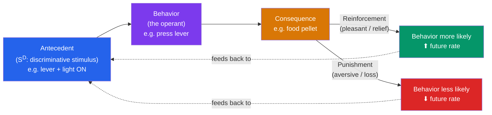

# 🎯 Operant Conditioning

> [!abstract] TL;DR
> Operant conditioning is learning from the **consequences** of voluntary behavior: actions that produce favorable outcomes are repeated, those that produce unfavorable ones are not. **Thorndike's law of effect** framed it; **B.F. Skinner** made it a precise science using the **operant chamber** ("Skinner box"). The core levers are **reinforcement** (increases behavior) and **punishment** (decreases it), each of which can be **positive** (add a stimulus) or **negative** (remove one) — a 2×2 grid. Reinforcers may be **primary** (innately rewarding) or **secondary** (rewarding by association). Complex behaviors are built by **shaping** — reinforcing **successive approximations** toward a target.

## Intuition — analogy FIRST

Think of operant conditioning as **water carving a canyon**.

Water doesn't flow with intent, but over time it finds the paths of least resistance, and those paths get deeper while others dry up. The landscape *selects* channels by their consequences: routes that let water through get reinforced (widened); dead ends get abandoned. Behavior works the same way. An organism emits many actions more or less at random; the environment "selects" some by rewarding them, and those actions deepen into habits while unrewarded ones fade.

Skinner called this **selection by consequences** and explicitly compared it to natural selection: instead of genes selected by survival, *behaviors* are selected by their outcomes within a single lifetime. Where classical conditioning asks "what does this stimulus *predict*?", operant conditioning asks "what does this action *produce*?" — and the answer reshapes what you do next.

---

## How It Works — The Three-Term Contingency

The **ABC** (Antecedent–Behavior–Consequence) contingency is the atom of operant analysis. The **discriminative stimulus (S^D)** signals *when* a behavior will be reinforced — the light means "pressing works now" — which is how context comes to control behavior.

## Key Concepts / Details

### Thorndike's Law of Effect (1898)

**Edward Thorndike** put cats in **puzzle boxes** they could escape (to reach fish) by pressing a lever. Cats did not "reason" the solution; over trials their escape times fell gradually as effective actions were "stamped in." He formalized the **law of effect**: *responses followed by satisfying consequences become more likely; those followed by discomfort become less likely.* This gradual, trial-and-error **learning curve** — not sudden insight — was the empirical seed of operant theory.

### Skinner and the Operant Chamber

**B.F. Skinner** (1930s–) built the **operant chamber**, an automated box with a lever/key, a food/water dispenser, and stimulus lights, plus a **cumulative recorder** to graph responses over time. It let him deliver consequences precisely and measure *response rate* as the fundamental datum. Skinner distinguished:
- **Respondent behavior** — reflexive, elicited (the domain of [[Classical_Conditioning]]).
- **Operant behavior** — emitted voluntarily and controlled by consequences.

He deliberately avoided mental terms, treating the mind as a "black box" and focusing on observable behavior–environment relations (**radical behaviorism**).

### The 2×2: Reinforcement vs. Punishment × Positive vs. Negative

This grid is the single most tested — and most misunderstood — idea in the topic. **"Positive" means ADD a stimulus; "negative" means REMOVE one.** "Reinforcement" always *increases* behavior; "punishment" always *decreases* it. The words describe operations, not "good/bad."

| | **Add a stimulus (Positive)** | **Remove a stimulus (Negative)** |
|---|---|---|
| **Increase behavior (Reinforcement)** | **Positive Reinforcement** — give something desired. *Dog sits → treat; sit more.* | **Negative Reinforcement** — take away something aversive. *Buckle seatbelt → beeping stops; buckle more.* |
| **Decrease behavior (Punishment)** | **Positive Punishment** — add something aversive. *Touch hot stove → pain; touch less.* | **Negative Punishment** — remove something desired. *Teen breaks curfew → lose phone; break curfew less.* |

**Negative reinforcement is not punishment.** It *strengthens* behavior by removing an aversive state (escape/avoidance). Taking a painkiller to stop a headache reinforces pill-taking. Confusing it with punishment is the #1 error in this topic.

Skinner and later research (e.g., **Azrin & Holz, 1966**) argued reinforcement is generally more effective and less problematic than punishment, which suppresses behavior without teaching an alternative and can produce fear, aggression, and avoidance of the punisher.

### Primary vs. Secondary Reinforcers

- **Primary reinforcers** are innately reinforcing because they satisfy biological needs: food, water, warmth, sex, relief from pain. No learning required.
- **Secondary (conditioned) reinforcers** acquire their power by association with primary ones: money, praise, tokens, a clicker. **Money** is the archetype — worthless paper that reinforces enormous behavior because it reliably buys primary reinforcers. A **generalized reinforcer** (like money or a token) is paired with *many* backup reinforcers, making it robust — the basis of [[Applied_Behavior_Analysis|token economies]].

### Shaping by Successive Approximation

You cannot wait for a rat to press a lever if it never goes near it. **Shaping** builds novel behavior by reinforcing **successive approximations**: first reinforce facing the lever, then approaching it, then touching it, then pressing. Each step raises the criterion once the prior one is mastered. Shaping (plus **chaining**, linking discrete steps into a sequence) explains how animal trainers, coaches, and therapists build complex skills that would never occur spontaneously to be reinforced.

> [!tip] Extinction in Operant Terms
> Stop reinforcing a previously reinforced behavior and it declines — operant **extinction**. Watch for an **extinction burst**: a temporary *spike* in the behavior (a child tantrums harder when ignoring first begins) before it fades. Inconsistent giving-in during a burst accidentally reinforces the *worst* version of the behavior on a lean schedule — see [[Reinforcement_Schedules]].

## Real-World Notes

- **Parenting & education**: praise and privileges (positive reinforcement) build behavior more durably than punishment; time-outs are negative punishment (removing attention/access). Consistency matters more than severity.
- **Workplace**: pay, bonuses, and recognition are reinforcers; the *schedule* on which they arrive drives effort — see [[Reinforcement_Schedules]]. Commission is closer to a ratio schedule; salary to interval.
- **Habit & app design**: streaks, points, and badges are secondary reinforcers; variable rewards make engagement "sticky" (and sometimes manipulative).
- **Clinical**: contingency management pays reinforcers (vouchers) for verified abstinence and is among the most effective behavioral treatments for substance use — a direct operant application in [[Applied_Behavior_Analysis]].

## Common Pitfalls

- **Calling negative reinforcement "punishment."** Negative reinforcement *increases* behavior by removing an aversive stimulus. If behavior went up, it was reinforcement — full stop.
- **Equating "negative" with "bad."** Positive/negative are add/remove operations, not value judgments. Positive punishment can be cruel; negative reinforcement can be benign.
- **Over-relying on punishment.** It suppresses without teaching a replacement, can generalize into avoidance of the punisher, and often just teaches *when not to get caught*. Reinforce an incompatible alternative instead.
- **Delayed consequences.** Reinforcement/punishment works best when *immediate*. Long-delayed consequences (this is why "you'll regret this in 20 years" fails, and why junk food beats health) barely condition behavior.
- **Confusing operant with classical.** Operant = voluntary behavior shaped by its consequences; classical = involuntary reflex elicited by a predictive stimulus. See [[Classical_Conditioning]].

## Related Concepts

- [[_MOC_Learning_Behaviorism|↑ Section MOC]]
- [[Classical_Conditioning]] — The other associative engine: stimulus prediction and reflexes, not consequences of action
- [[Reinforcement_Schedules]] — *When* and *how often* reinforcement is delivered, and the response patterns each schedule produces
- [[Applied_Behavior_Analysis]] — Reinforcement, shaping, and secondary reinforcers turned into token economies and clinical treatment
- [[Observational_Learning]] — Consequences observed happening to *others* (vicarious reinforcement) also change behavior
- Cross-vault: [[Reinforcement_Learning]] — The machine-learning formalization of reward-driven action selection (agents, policies, value functions)

## Review Questions

1. For each scenario, name the exact quadrant (positive/negative × reinforcement/punishment): (a) a student studies to *avoid* a nagging parent and the nagging stops; (b) a dog is given a treat for lying down; (c) a driver is fined for speeding; (d) a child loses screen time for hitting a sibling.
2. Explain why negative reinforcement is so frequently mistaken for punishment, and give a clean rule that resolves the confusion every time.
3. A trainer wants a rat to press a lever it currently ignores. Describe how shaping by successive approximation would accomplish this, and explain why simply waiting to reinforce the full behavior would fail.

## Sources

- Skinner, B. F. (1938). *The Behavior of Organisms: An Experimental Analysis*. Appleton-Century
- Thorndike, E. L. (1911). *Animal Intelligence: Experimental Studies*. Macmillan
- Azrin, N. H. & Holz, W. C. (1966). "Punishment." In W. K. Honig (Ed.), *Operant Behavior: Areas of Research and Application*
- Skinner, B. F. (1981). "Selection by consequences." *Science*, 213(4507), 501–504

#psychology #learning-behaviorism #operant-conditioning #skinner #reinforcement
