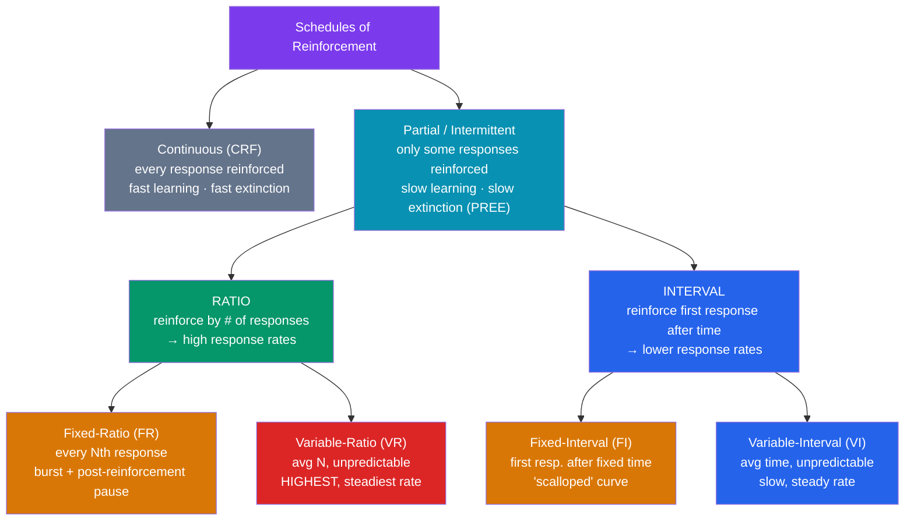

# 📊 Reinforcement Schedules

> [!abstract] TL;DR
> A reinforcement schedule is the *rule* that decides which responses get reinforced. **Continuous reinforcement** (every response) builds behavior fastest but extinguishes fastest; **partial (intermittent)** reinforcement builds behavior slower but makes it dramatically more persistent — the **partial-reinforcement extinction effect (PREE)**. Skinner mapped four basic schedules by crossing **ratio vs. interval** (reinforce by number of responses vs. by time) with **fixed vs. variable** (predictable vs. unpredictable). Each yields a signature response pattern. **Variable-ratio** — the schedule of gambling — produces the highest, steadiest rates and the hardest-to-extinguish behavior.

## Intuition — analogy FIRST

Think of two **vending machines**.

The first is an ordinary soda machine: put in money, out comes a drink — **every single time**. You learn to use it instantly. But the day it breaks and eats your money, you press twice, maybe give it a shake, and *walk away*. The reliable payoff made you quit the moment it stopped.

The second is a **slot machine**: it pays only *sometimes*, and you can never predict when. Learning to play is slow, but once hooked, a losing streak means *nothing* — because losing streaks were always normal. You'll feed it for hours after it has "broken," because you literally cannot tell a broken machine from a stingy one.

That is the whole topic in one image: **reliability builds behavior fast but makes it fragile; unpredictability builds it slowly but makes it nearly indestructible.** The schedule of payoff — not the payoff itself — controls persistence.

---

## How It Works — The 2×2 of Schedules

**Two dimensions, two levels each.** *Ratio vs. interval* answers "reinforcement depends on **what** — responses or the clock?" *Fixed vs. variable* answers "is the requirement **predictable**?" Ratio schedules pay for *doing more*, so they drive high rates; interval schedules pay for *doing at the right time*, so rate barely helps.

## Key Concepts / Details

### Continuous vs. Partial Reinforcement

- **Continuous reinforcement (CRF)**: every correct response is reinforced. Ideal for the *acquisition* phase — the contingency is obvious and learning is rapid. But behavior is fragile: because the absence of reinforcement is immediately noticeable, extinction is fast.
- **Partial (intermittent) reinforcement**: only some responses are reinforced. Learning is slower, but the resulting behavior is far more persistent. Best practice is to **start on CRF to establish a behavior, then thin to a partial schedule** to maintain it — the strategy used in animal training and [[Applied_Behavior_Analysis|token economies]].

### The Four Basic Schedules

| Schedule | Rule | Response rate | Signature pattern | Everyday example |
|---|---|---|---|---|
| **Fixed-Ratio (FR)** | Reinforce every *N*th response | High | Fast burst, then a **post-reinforcement pause** | Piecework pay (paid per 10 units); loyalty card ("10th coffee free") |
| **Variable-Ratio (VR)** | Reinforce after an *average* of *N* responses, unpredictable | **Highest, steadiest** | Steady, near-pauseless, extinction-resistant | **Slot machines**, lottery, cold-call sales |
| **Fixed-Interval (FI)** | Reinforce first response after a fixed *time* | Low–moderate | **Scalloped**: near-zero after reward, accelerating as deadline nears | Checking for the mail; cramming before a scheduled exam |
| **Variable-Interval (VI)** | Reinforce first response after an *average* time, unpredictable | Low–moderate, **very steady** | Slow, constant, steady | Checking for a text reply; pop-quiz studying; fishing |

**Ratio > interval** for response rate, because on a ratio schedule *more responding literally earns more reinforcement*, whereas on an interval schedule responding faster than the clock is wasted effort. **Variable > fixed** for persistence, because unpredictability removes the "safe to pause" signal.

### Two Signature Curves

- **FR scallop-free burst + pause**: the animal works fast to complete the ratio, then pauses right after reinforcement (the **post-reinforcement pause**) because it's "far" from the next payoff. Bigger ratios → longer pauses (**ratio strain** if stretched too far).
- **FI scalloping**: responding is near zero just after reinforcement and accelerates as the interval elapses, producing a scallop shape on the cumulative record. Legislators passing bills right before a deadline, or students studying only as the exam approaches, are living FI schedules.

### The Partial-Reinforcement Extinction Effect (PREE)

Behavior reinforced on a **partial** schedule is **more resistant to extinction** than behavior reinforced continuously. This is the **PREE** (or Humphreys' paradox, after **Lloyd Humphreys, 1939**). Two leading explanations:
- **Discrimination hypothesis**: after CRF, the switch to *no reinforcement* is easy to detect (every response used to pay; now none do). After a lean partial schedule, extinction "looks like" just another dry spell, so the organism keeps responding.
- **Frustration/sequential theories** (Amsel): on partial schedules the animal learns to *respond through* the frustration of non-reward, because persisting through non-reward has previously paid off.

The practical upshot is enormous: **intermittent reinforcement forges the most durable habits — for better (persistence, grit) or worse (gambling, checking behaviors, intermittent-reward relationships).**

### Why Variable-Ratio (Gambling) Is So Persistent

Slot machines combine every persistence-maximizing feature: it's a **ratio** schedule (payoff scales with play → high rate), it's **variable** (each pull is independent and unpredictable → no safe pause, strong PREE), and payoffs are **immediate and salient**. Because the player can never distinguish "unlucky streak" from "machine will never pay," extinction is agonizingly slow. Casinos, loot boxes, and infinite-scroll feeds are engineered around exactly this schedule.

> [!warning] Superstition and Accidental Schedules
> Skinner (1948) put pigeons on a **fixed-interval food delivery independent of behavior** and they developed "superstitious" rituals — turning, bobbing — whatever they happened to be doing when food arrived got accidentally reinforced. Non-contingent or poorly-designed schedules reinforce coincidental behavior. In therapy and parenting, an unintended intermittent schedule (occasionally giving in to a tantrum) is how the *worst* behaviors become the *most* durable.

## Real-World Notes

- **Gambling & game design**: VR is the design pattern behind slots, gacha/loot boxes, and lotteries; combined with near-misses it maximizes engagement and is central to problem-gambling research.
- **Social media**: notifications and likes arrive on an unpredictable, variable schedule (a VR/VI hybrid), producing compulsive checking — the "slot machine in your pocket."
- **Workplace pay**: piece-rate (FR) drives volume but invites burnout and post-payoff slumps; salary (fixed interval) yields steadier but lower-rate effort; commission (VR-ish) maximizes hustle.
- **Behavior modification**: thin from continuous to intermittent to make gains *stick*; conversely, to *extinguish* a bad habit you must remove reinforcement **completely and consistently**, because any intermittent slip-up rebuilds a persistent VR.

## Common Pitfalls

- **Assuming continuous reinforcement is "best."** It is best for *acquiring* a new behavior, but *worst* for durability. Maintenance requires thinning to intermittent.
- **Thinking more/bigger rewards = more persistence.** Persistence is driven by the *schedule*, not reward size. A tiny, unpredictable payoff (VR) beats a large, reliable one (CRF) for resistance to extinction.
- **Giving in "just this once."** Inconsistent reinforcement converts a behavior to an intermittent schedule, making it *harder* to extinguish — the classic parenting trap.
- **Confusing ratio and interval.** Ratio = per response (rate matters, so rate is high); interval = per time (rate doesn't help, so rate is lower). If responding faster earns more, it's ratio.

## Related Concepts

- [[_MOC_Learning_Behaviorism|↑ Section MOC]]
- [[Operant_Conditioning]] — The parent framework; schedules govern *how* reinforcement is delivered within it
- [[Applied_Behavior_Analysis]] — Schedule thinning is essential to making token-economy and clinical gains durable
- [[Classical_Conditioning]] — Extinction dynamics also appear in Pavlovian learning (spontaneous recovery, renewal)
- [[Observational_Learning]] — Observed reinforcement can substitute for direct reinforcement in changing behavior
- Cross-vault: [[Behavioral_Economics_Psychology]] — Variable rewards, near-misses, and how schedules exploit decision biases

## Review Questions

1. Name the schedule and predict the response pattern for each: (a) a factory worker paid per 20 assembled parts; (b) a person playing a slot machine; (c) an employee checking a shared inbox that gets messages at random times; (d) a student studying for an exam on a known date three weeks away.
2. State the partial-reinforcement extinction effect and give the "discrimination hypothesis" explanation for it. Why does this make intermittently-reinforced tantrums so hard to eliminate?
3. Explain, using both dimensions (ratio/interval and fixed/variable), *why* variable-ratio schedules produce the highest response rates and the greatest resistance to extinction of any schedule.

## Sources

- Ferster, C. B. & Skinner, B. F. (1957). *Schedules of Reinforcement*. Appleton-Century-Crofts
- Humphreys, L. G. (1939). "The effect of random alternation of reinforcement on the acquisition and extinction of conditioned eyelid reactions." *Journal of Experimental Psychology*, 25, 141–158
- Skinner, B. F. (1948). "'Superstition' in the pigeon." *Journal of Experimental Psychology*, 38(2), 168–172
- Amsel, A. (1992). *Frustration Theory: An Analysis of Dispositional Learning and Memory*. Cambridge University Press

#psychology #learning-behaviorism #reinforcement-schedules #variable-ratio #extinction
