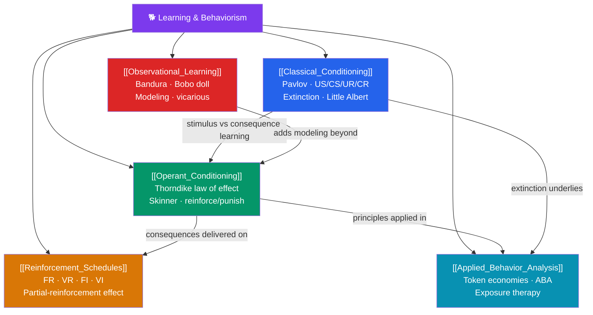

# 🐕 Learning & Behaviorism — Map of Content

> [!abstract] What This Section Covers
> Behaviorism sought to make psychology a rigorous science by studying only what could be observed: behavior and its environmental causes. This section covers the two engines of associative learning — **classical conditioning** (learning that one stimulus predicts another) and **operant conditioning** (learning from the consequences of action) — then examines how the *timing* of consequences via **reinforcement schedules** shapes persistence, how **observational learning** lets us learn without direct reinforcement, and how these principles are put to work in **applied behavior analysis**. Together these five notes explain how experience rewrites behavior.

## Concept Map

## Learning Path

1. [[Classical_Conditioning]] — Pavlov's dogs, the US/CS/UR/CR framework, acquisition, extinction, spontaneous recovery, generalization/discrimination, and Watson's Little Albert.
2. [[Operant_Conditioning]] — Thorndike's law of effect, Skinner's operant chamber, positive/negative reinforcement and punishment, and shaping by successive approximation.
3. [[Reinforcement_Schedules]] — Continuous vs. partial reinforcement; fixed/variable ratio and interval schedules; and the partial-reinforcement extinction effect.
4. [[Observational_Learning]] — Bandura's Bobo doll experiment, modeling, and vicarious reinforcement — learning by watching others.
5. [[Applied_Behavior_Analysis]] — Behavior modification, token economies, ABA for autism, and exposure-based therapies grounded in conditioning.

## All Notes at a Glance

| Note | Difficulty | What You'll Learn |
|------|------------|-------------------|
| [[Classical_Conditioning]] | Beginner | US/CS/UR/CR, acquisition, extinction, spontaneous recovery, stimulus generalization/discrimination, Watson & Little Albert |
| [[Operant_Conditioning]] | Beginner → Intermediate | Law of effect, Skinner box, reinforcement vs. punishment, positive/negative, shaping, primary vs. secondary reinforcers |
| [[Reinforcement_Schedules]] | Intermediate | FR/VR/FI/VI schedules, response patterns, the partial-reinforcement extinction effect, gambling as VR |
| [[Observational_Learning]] | Beginner → Intermediate | Attention/retention/reproduction/motivation, the Bobo doll study, vicarious reinforcement, modeling of aggression |
| [[Applied_Behavior_Analysis]] | Intermediate | Functional analysis, token economies, ABA for ASD, systematic desensitization, ethics of behavior control |

## Key Questions This Section Answers

- What is the essential difference between classical and operant conditioning?
- Why is negative reinforcement so often confused with punishment?
- Why does intermittent (partial) reinforcement produce behavior that is *hardest* to extinguish?
- Can you learn a complex behavior without ever being reinforced for it yourself?
- How do abstract conditioning laws become real therapies for phobias and autism?

## Related Sections

- [[_MOC_Psychology_Master|↑ Psychology Master MOC]]
- [[_MOC_Personality_Psychology|← Personality Psychology]]
- [[_MOC_Evolutionary_Psychology|→ Evolutionary Psychology]]

#MOC #Psychology #LearningBehaviorism
