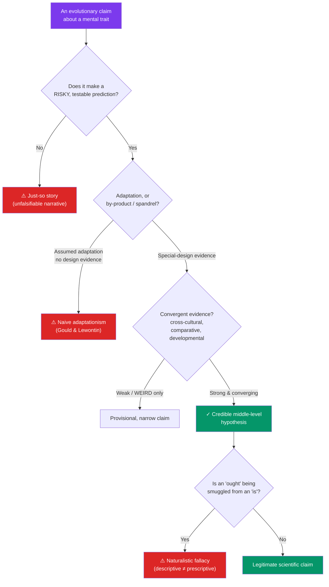

# ⚖️ Criticisms of Evolutionary Psychology

> [!abstract] TL;DR
> Evolutionary psychology attracts serious scientific and philosophical criticism, and taking it seriously *strengthens* the good parts of the field. The core charges: (1) the **"just-so story"** problem — adaptive explanations can be spun for almost any trait, raising doubts about **falsifiability**; (2) **Gould & Lewontin's "spandrels"** critique of naive **adaptationism** — many traits are by-products, not adaptations; (3) the **naturalistic fallacy** — evolved ≠ good, and EP findings are routinely (mis)used to justify the status quo; (4) **genetic-determinism** worries — evolved does not mean fixed; and (5) epistemic limits — our knowledge of the **EEA** is thin and human data are **WEIRD**. Balanced verdict: strong, testable, middle-level EP hypotheses (with convergent, cross-cultural, comparative evidence) survive these critiques; sweeping, untestable "ancestral scenarios" do not. Knowing the difference is what makes EP a science rather than storytelling.

## Intuition — analogy FIRST

The phrase "**just-so story**" comes from Rudyard Kipling's children's tales — *How the Leopard Got His Spots*, *How the Camel Got His Hump* — charming narratives that *explain* a feature with a tidy backstory while predicting nothing and forbidding nothing.

That is the worry critics press against weak evolutionary psychology. Suppose you observe that men, on average, take more physical risks. You can craft an adaptive tale: risk-taking signaled fitness to ancestral mates. But suppose you had observed the *opposite* — men more cautious. You could equally spin a tale: caution preserved the provider. If a theory can comfortably "explain" a result *and its exact opposite*, it has explained nothing; it has merely narrated. A good scientific hypothesis, by contrast, is a bet that *rules out* possible observations — it can be caught being wrong.

The critique is therefore not "evolution didn't shape the mind" (almost no one denies that). It is: *how do we tell a disciplined, testable evolutionary hypothesis from a flattering story that fits any outcome after the fact?* That question is the whole chapter.

---

## How It Works — Filtering Strong Claims from Just-So Stories

## Key Concepts / Details

### The "Just-So Story" Charge and Falsifiability

The central epistemic worry: because we cannot directly observe ancestral minds, an evolutionary *function* is often inferred *after* seeing the trait, then the trait is used as evidence for the function — a circle. By **Popper's** falsifiability standard, a hypothesis must forbid some observations. Critics argue many EP claims are protected by *ad hoc* auxiliary assumptions ("the module is context-sensitive," "the cue was reliable in the EEA") that can absorb any counter-evidence.

Defenders reply that this critique applies to *lazy* EP, not the discipline as such: well-run EP generates **novel, risky predictions** (e.g., the specific pattern of the Wason cheater results, or morning-sickness timing tracking organogenesis) and sometimes *fails* them — which is precisely what falsifiable science looks like.

### Gould & Lewontin: Spandrels and the Critique of Adaptationism

**Stephen Jay Gould and Richard Lewontin's (1979)** "**The Spandrels of San Marco and the Panglossian Paradigm**" is the founding critique. A **spandrel** is the roughly triangular space *necessarily* left when you put a dome on arches — architecturally a *by-product*, even though the mosaics filling it look purpose-designed. Their point: adaptationists too readily assume every trait is an optimized adaptation ("Panglossian" — best of all possible worlds), when many are **by-products**, constraints, or historical accidents. Traits also face **developmental, genetic, and physical constraints** that adaptation cannot override.

Gould further argued much human cognition may be **exaptation** or spandrel — capacities like language, art, or religion possibly repurposed from machinery selected for other reasons, not directly selected "for" their current use. This directly challenges the modularity story in [[Foundations_of_Evolutionary_Psychology]].

### The Naturalistic Fallacy (and Its Twin)

- **Naturalistic fallacy** (after G.E. Moore) / **is–ought gap** (Hume): you cannot derive a moral *ought* from a natural *is*. That aggression, deception, or sex differences may be evolved says *nothing* about whether they are good, just, or acceptable. EP findings are frequently abused to "naturalize" inequality or excuse behavior — an abuse EP researchers themselves widely disavow.
- **Moralistic fallacy** (its mirror, coined by Bernard Davis): inferring that because something *ought not* be true, it *is not* — i.e., rejecting a finding purely because its implications feel unpalatable. Good practice avoids *both*: keep description and prescription firmly separate.

### Genetic Determinism Worries

A common critique — and a common misreading. "Evolved" is heard as "genetically fixed, inevitable, unchangeable." But evolved mechanisms are typically **conditional and developmentally plastic**: they take environmental input and produce context-sensitive output. Behavioral genetics finds most traits are *polygenic* and *heritable-but-malleable*; **gene–environment interaction** is the norm. Serious EP endorses "nature *via* nurture," not nature *versus* nurture — though critics counter that the field's rhetoric sometimes drifts toward determinism even when its formal models do not.

### Epistemic Limits: EEA Uncertainty and WEIRD Samples

- **EEA reconstruction is thin.** We infer ancestral selection pressures from archaeology, hunter-gatherer analogues, and comparative data — all indirect. Over-specific "ancestral scenarios" outrun the evidence.
- **WEIRD samples** (Henrich, Heine & Norenzayan, 2010): psychology's database is dominated by **W**estern, **E**ducated, **I**ndustrialized, **R**ich, **D**emocratic participants — arguably the *least* representative humans for claims about universal human nature. Cross-cultural breadth is a partial remedy, not a cure.
- **Reverse inference** — arguing backward from a behavior to a hypothesized ancestral cause — is logically weak without independent evidence.

### The Buller Critique and Internal Diversity

Philosopher **David Buller** (*Adapting Minds*, 2005) mounted a book-length critique specifically of the **Santa Barbara** program (Tooby, Cosmides, Buss), targeting massive modularity, the fixed-Pleistocene EEA, and specific empirical claims — while explicitly *endorsing* the broader project of evolutionarily informed psychology. This distinction matters: **"evolutionary psychology" is not monolithic.** Alternatives and cousins include:

| Framework | Core emphasis | Key figures |
|---|---|---|
| **Santa Barbara EP** | Massive modularity, universal human nature, Pleistocene EEA | Tooby, Cosmides, Buss, Pinker |
| **Human behavioral ecology** | Behavior optimized to *current* local ecology (not just ancestral) | Borgerhoff Mulder, Kaplan |
| **Gene–culture coevolution / dual inheritance** | Culture as a second evolutionary system; cumulative culture | Boyd & Richerson, Henrich |
| **Evolutionary developmental (evo-devo) psychology** | Plasticity, developmental construction of traits | West-Eberhard; developmental systems theorists |
| **Cognitive gadgets** | Many "modules" are culturally *learned*, not innate | Cecilia Heyes |

Recognizing this pluralism defuses a common straw man: criticisms of *one* program are often mistaken for refutations of *all* evolutionary approaches to mind.

### What EP Can and Cannot Claim

| EP *can* legitimately | EP *cannot* legitimately |
|---|---|
| Generate testable, novel predictions from selection theory | Prove a specific ancestral scenario happened as narrated |
| Explain *patterns* (cross-cultural regularities, sex-difference gradients) | Predict or prescribe any *individual's* behavior |
| Distinguish adaptation from by-product *with design evidence* | Assume every trait is an optimized adaptation |
| Describe evolved tendencies | Derive moral/political norms from those descriptions |
| Complement proximate (developmental, cultural) explanations | Replace or override proximate causes |

## Real-World Notes

- **Media distortion**: pop coverage strips effect sizes and caveats, converting tentative averages into deterministic headlines — a major reason EP is publicly contentious. Researchers increasingly publish "how not to misread this" companions.
- **Policy misuse**: EP has been invoked to naturalize gender roles, hierarchy, or inequality; the is–ought gap makes such inferences fallacious regardless of the underlying science.
- **Better practice**: the strongest recent EP integrates **pre-registration**, cross-cultural sampling, and comparative/phylogenetic data — directly answering the falsifiability and WEIRD critiques.
- **Interdisciplinary fertility**: even critics grant that evolutionary framing has generated productive research programs (Darwinian medicine, cheater-detection, life-history theory), whatever the fate of specific claims.

## Common Pitfalls

- **Straw-manning either side.** "EP is all just-so stories" ignores its testable successes; "critics deny evolution shaped the mind" ignores that they mostly don't.
- **Conflating the whole field with one program.** Buller critiques Santa Barbara EP, not evolutionary psychology writ large.
- **Committing the naturalistic *or* moralistic fallacy.** Keep *is* and *ought* apart in both directions.
- **Reading "evolved" as "fixed."** Plasticity and gene–environment interaction are the rule, not the exception.
- **Demanding certainty about the EEA.** Uncertainty is a reason for humility and convergent evidence, not for either blanket acceptance or blanket dismissal.

## Related Concepts

- [[_MOC_Evolutionary_Psychology|↑ Section MOC]]
- [[Foundations_of_Evolutionary_Psychology]] — The adaptationism, modularity, and EEA claims this note stress-tests
- [[Mating_and_Attraction]] — Where the is–ought and cultural-moderator critiques bite hardest
- [[Kin_Selection_and_Altruism]] — The group-selection debate as a live example of internal scientific dispute
- [[Evolutionary_Mismatch]] — How to keep mismatch claims falsifiable and avoid paleo-fantasy
- Cross-vault: [[_MOC_Game_Theory_Master]] — Formal models offer testable rigor that narrative adaptationism lacks

## Review Questions

1. What is a **"just-so story,"** and why is **falsifiability** the crux of the charge? Give an example of a *weak* (unfalsifiable) and a *strong* (risky, testable) evolutionary hypothesis about the same trait.
2. Explain **Gould & Lewontin's spandrel** metaphor. How does the concept of a **by-product/exaptation** threaten a naive adaptationist reading of a human cognitive trait such as language or music?
3. Distinguish the **naturalistic fallacy** from the **moralistic fallacy**, giving an example of each in how EP findings get (mis)used. Then list two things evolutionary psychology *can* legitimately claim and two things it *cannot*.

## Sources

- Gould, S.J. & Lewontin, R.C. (1979). "The Spandrels of San Marco and the Panglossian Paradigm." *Proceedings of the Royal Society B*, 205(1161), 581–598
- Buller, D.J. (2005). *Adapting Minds: Evolutionary Psychology and the Persistent Quest for Human Nature*. MIT Press
- Henrich, J., Heine, S.J. & Norenzayan, A. (2010). "The weirdest people in the world?" *Behavioral and Brain Sciences*, 33(2–3), 61–83
- Confer, J.C. et al. (2010). "Evolutionary psychology: Controversies, questions, prospects, and limitations." *American Psychologist*, 65(2), 110–126

#psychology #evolutionary-psychology #philosophy-of-science #adaptationism #falsifiability
