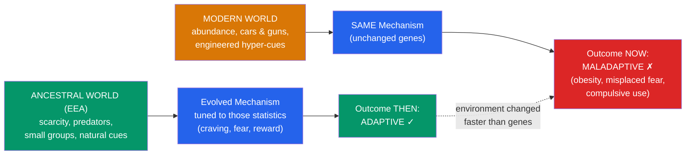

# 🍔 Evolutionary Mismatch

> [!abstract] TL;DR
> **Evolutionary mismatch** is what happens when adaptations calibrated to the ancestral environment (the **EEA**) meet a modern world that changed far faster than genes can. A mechanism that was *adaptive then* can be *maladaptive now*. Three flagship cases: (1) **diet** — evolved cravings for scarce sugar, fat, and salt drive over-consumption amid modern abundance, contributing to the obesity and metabolic-disease epidemic; (2) **fear modules** — we readily learn to fear ancestral dangers (snakes, spiders, heights) but not the far deadlier modern ones (cars, guns, electrical outlets); and (3) **supernormal stimuli** — engineered exaggerations of ancestral cues (junk food, pornography, social media, cuteness) that hijack reward systems more powerfully than any natural stimulus. Mismatch is one of EP's most testable and least contested ideas — though "which trait is a true mismatch" still requires evidence.

## Intuition — analogy FIRST

Think of a **moth circling a porch light**.

For millions of years, moths navigated by keeping a bright, effectively infinite light source — the moon — at a fixed angle. That rule of thumb worked flawlessly in the ancestral world, because the only such light *was* the moon. Then humans invented the lightbulb: a bright point source that is *close*. Holding a constant angle to a nearby light forces the moth into a doomed inward spiral. The moth is not broken; its navigation adaptation is *perfectly good* — it is simply running in an environment it was never designed for, and a once-adaptive rule now kills it.

Human minds are full of moth-and-moon rules. "Crave calorie-dense food whenever available" was brilliant when starvation loomed and sweetness was a rare ripe-fruit signal. Drop that rule into a world of vending machines and it drives us into the metabolic equivalent of the death spiral. The lesson of mismatch is that **maladaptive behavior often reflects a well-designed mechanism meeting a novel world**, not a defective one.

---

## How It Works — When "Adaptive Then" Becomes "Maladaptive Now"

## Key Concepts / Details

### The Mismatch Hypothesis

Genes evolve over hundreds of generations; culture and technology now change within a single lifetime. Agriculture is ~12,000 years old, industry ~250, smartphones ~15 — all a blink relative to the Pleistocene. **Daniel Lieberman** (*The Story of the Human Body*, 2013) calls chronic diseases that arise from this gap "**mismatch diseases**," and the feedback loop in which we treat symptoms while preserving the mismatched environment "**dysevolution**." Mismatch is EP's cleanest predictive engine: it forecasts *where* modern life should misfire.

### Diet, Cravings, and the Obesity Epidemic

Ancestral diets made sugar, fat, and salt **scarce and valuable**, so selection built strong preferences for them — reliable signals of ripe fruit, energy, and needed electrolytes. Modern food engineering delivers these in unlimited, concentrated form, so the same preferences now drive over-consumption.

- **Thrifty gene hypothesis (James Neel, 1962):** genes that efficiently store fat during feast to survive famine become liabilities when famine never comes.
- **Thrifty phenotype (Hales & Barker):** *developmental* programming — poor fetal nutrition tunes metabolism for scarcity, mismatching later abundance.
- **Critiques:** John **Speakman's "drifty gene"** hypothesis argues the thrifty-gene story is under-supported (predation-release plus drift may explain obesity-susceptibility variance better). So the *phenomenon* of dietary mismatch is robust, but the *specific genetic story* is contested — a useful reminder to hold sub-hypotheses loosely.

### Evolved Fear Modules and Prepared Learning

We do not fear all dangers equally. **Martin Seligman's (1971) "preparedness"** proposed that organisms are biologically prepared to *rapidly* associate fear with ancestral threats. **Öhman & Mineka (2001)** formalized an evolved **"fear module"** — fast, automatic, encapsulated, centered on the amygdala.

- **Cook & Mineka's monkey studies:** lab monkeys acquired snake fear by observing another monkey react fearfully to a snake, but *not* to flowers — fear conditioning is **content-biased** toward evolutionarily relevant stimuli.
- The result: phobias cluster around **snakes, spiders, heights, deep water, the dark, strangers** — ancestral dangers — while modern hazards that kill far more people (cars, guns, cigarettes, electrical outlets) rarely become phobias, because they were absent from the EEA and carry no prepared-learning bias.

### Supernormal Stimuli

**Niko Tinbergen** discovered that animals can respond *more strongly* to an exaggerated ("supernormal") version of a natural cue than to the real thing: a greylag goose will roll a giant artificial egg toward its nest in preference to its own; herring-gull chicks peck harder at an exaggerated red stick than at a real parent's beak. **Deirdre Barrett** (*Supernormal Stimuli*, 2010) applied this to humans: much of modern consumer culture is engineered supernormal stimuli that exceed anything in the EEA.

| Ancestral cue (adaptive target) | Modern supernormal exaggeration | Hijacked mechanism |
|---|---|---|
| Ripe fruit / rare fat | Ultra-processed junk food | Sweet/fat reward system |
| Fertility & attractiveness cues | Pornography, filtered/idealized images | Mate-evaluation & arousal systems |
| Social connection & status | Social media likes, notifications | Reputation / affiliation reward |
| Infant "cuteness" (Kindchenschema) | Cartoon characters, plush toys, pets bred for neoteny | Nurturance / caregiving response |
| Novel information (worth attending) | Infinite scroll, news feeds, gambling | Curiosity / variable-reward dopamine loops |

The design logic of many attention-economy products is explicitly to *out-compete* natural rewards — a manufactured mismatch. This descriptive point cuts across [[Mating_and_Attraction]] (novel mating markets) and links to reward-learning in behavioral psychology.

### Other Candidate Mismatches

Sedentary lifestyle vs. bodies built for endurance movement; myopia linked to reduced outdoor light in childhood; chronic stress systems tuned for acute physical threats now triggered by unresolvable social/financial stressors; disrupted circadian rhythms from artificial light. Each is a *hypothesis* requiring its own evidence — the framework predicts *where to look*, not a blanket verdict.

## Real-World Notes

- **Public health**: "obesogenic environment" policy (portion limits, sugar taxes, defaults) is applied mismatch thinking — change the environment, since you cannot change the evolved appetite.
- **Product ethics / "dopamine design"**: recognizing engineered supernormal stimuli underpins digital-wellbeing features (grayscale mode, usage limits) and debates over addictive design.
- **Clinical phobia treatment**: prepared-learning theory predicts snake/spider phobias resist extinction more than modern-object fears, informing exposure-therapy expectations.
- **Nutrition science**: mismatch reframes obesity as a *normal response of a normal appetite to an abnormal food supply*, shifting blame from individual willpower toward environment design — while avoiding the fatalism of genetic determinism.

## Common Pitfalls

- **"Everything modern is a mismatch."** Not so — many modern conditions (sanitation, refrigeration) are hugely beneficial. Mismatch is a *specific, testable* claim about particular traits, not a nostalgia for the Stone Age.
- **Appeal to nature / paleo-fantasy.** "Ancestral = healthy" is a fallacy (the naturalistic fallacy again). Ancestral life featured high infant mortality and infection; cherry-picking a "paleo ideal" is unscientific (Marlene Zuk, *Paleofantasy*).
- **Assuming zero recent evolution.** Some human adaptation *is* fast (lactase persistence, high-altitude tolerance), so "genes can't change that quickly" is an overstatement — mismatch is about *rate gaps*, not frozen genomes.
- **Treating mismatch as destiny.** Environments are the fixable variable; recognizing an evolved pull is the first step to engineering around it, not surrendering to it.
- **Confusing "supernormal" with "unnatural."** The point is *exaggeration of an evolved target*, not mere novelty.

## Related Concepts

- [[_MOC_Evolutionary_Psychology|↑ Section MOC]]
- [[Foundations_of_Evolutionary_Psychology]] — The EEA concept that mismatch depends on entirely
- [[Mating_and_Attraction]] — Pornography, dating apps, and contraception as novel mating-market mismatches
- [[Kin_Selection_and_Altruism]] — Anonymous, one-shot modern interactions strip the conditions reciprocity assumes
- [[Criticisms_of_Evolutionary_Psychology]] — How to keep mismatch claims falsifiable rather than just-so
- Cross-vault: [[_MOC_Game_Theory_Master]] — Attention economics as engineered exploitation of evolved reward loops

## Review Questions

1. Define **evolutionary mismatch** and explain, using the moth-and-moon analogy, why maladaptive modern behavior can arise from a *well-designed* mechanism. Then give one dietary and one fear-related example.
2. What is a **supernormal stimulus**? Trace it from Tinbergen's gull and goose experiments to a modern human example, and explain *which* evolved mechanism the modern version exploits.
3. The **thrifty gene hypothesis** is contested by Speakman's "drifty gene" idea. Explain why the *general* dietary-mismatch phenomenon can be robust even while a *specific* genetic sub-hypothesis is doubtful. What does this teach about evaluating EP claims?

## Sources

- Lieberman, D.E. (2013). *The Story of the Human Body: Evolution, Health, and Disease*. Pantheon
- Öhman, A. & Mineka, S. (2001). "Fears, phobias, and preparedness." *Psychological Review*, 108(3), 483–522
- Barrett, D. (2010). *Supernormal Stimuli: How Primal Urges Overran Their Evolutionary Purpose*. W.W. Norton
- Nesse, R.M. & Williams, G.C. (1994). *Why We Get Sick: The New Science of Darwinian Medicine*. Times Books

#psychology #evolutionary-psychology #mismatch #supernormal-stimuli #fear-modules
