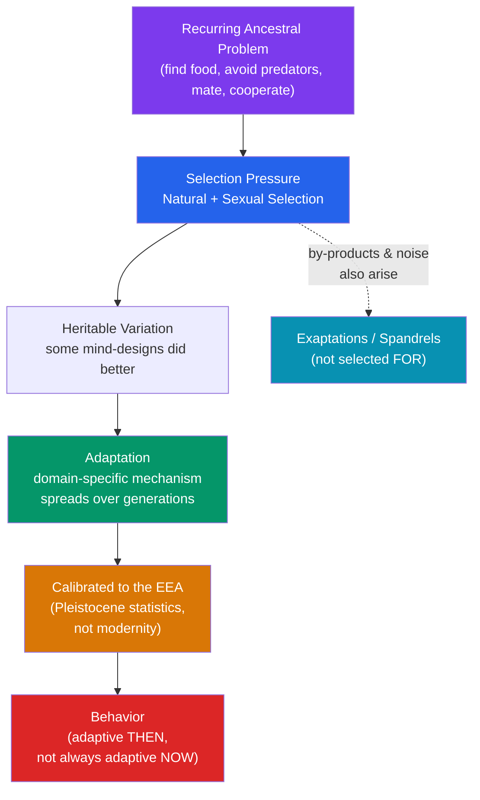

# 🧬 Foundations of Evolutionary Psychology

> [!abstract] TL;DR
> Evolutionary psychology (EP) applies Darwin's theories of **natural selection** and **sexual selection** to the mind, treating psychological mechanisms as **adaptations** — information-processing systems that spread because they solved recurring survival and reproduction problems faced by our ancestors. These adaptations were shaped in the **environment of evolutionary adaptedness (EEA)**, not the modern world. Tooby and Cosmides argue for **massive modularity**: the mind is less a single general-purpose computer than a bundle of specialized "mental organs," each tuned to a particular ancestral problem. Their signature evidence is the **Wason selection task**, where people reason poorly about abstract logic but sharply about detecting cheaters in social exchange. EP is a powerful research heuristic — and a contested one, as its own critics note.

## Intuition — analogy FIRST

Think of the mind as a **Swiss Army knife**, not a single blade.

A single all-purpose blade is a compromise: passable at many jobs, excellent at none. A Swiss Army knife wins by carrying *many special-purpose tools* — a blade for cutting, a corkscrew for corks, a tiny scissors for thread. Each tool exists because a specific, recurring task made it worth the extra metal. You would never expect the corkscrew to have "figured out" corks by general reasoning; it is *pre-shaped* to the problem.

Evolutionary psychology makes the same claim about cognition. Detecting a cheater in a trade, choosing a nutritious food, recognizing a face, avoiding a snake, and caring for an infant are radically different problems, and a mechanism optimized for one is unlikely to be optimal for another. So natural selection, over deep time, plausibly built a set of **domain-specific mechanisms**, each honed by the statistical regularities of ancestral life. The mind we carry is therefore, in Tooby and Cosmides' phrase, "a confederation of hundreds or thousands" of such tools — designed for the Stone Age, running in the Space Age.

---

## How It Works — From Ancestral Problem to Evolved Mind

## Key Concepts / Details

### Natural and Sexual Selection Applied to Mind

**Natural selection** (Darwin, 1859): heritable traits that improve survival and reproduction become more common over generations. EP's move is to extend this from bodies (the eye, the hand) to *psychological* machinery (fear systems, mate preferences, kin-directed care).

**Sexual selection** (Darwin, 1871): a distinct pressure arising from competition for mates. It has two flavors:
- **Intersexual selection** (mate choice) — traits that make one attractive to the opposite sex spread (the peacock's tail; in humans, plausibly symmetry, status cues, signals of investment).
- **Intrasexual selection** (same-sex competition) — traits that win contests for access to mates spread (antlers; in humans, plausibly coalition-building, status striving).

Because reproduction — not mere survival — is the currency of selection, EP predicts many mind mechanisms are organized around mating, not just staying alive. See [[Mating_and_Attraction]].

### Adaptations, By-products, and Noise

A central discipline of EP is *not* calling everything an adaptation. George Williams (*Adaptation and Natural Selection*, 1966) insisted the concept be used sparingly and only with evidence of special design.

| Category | Definition | Example |
|---|---|---|
| **Adaptation** | A trait selected *for* because it solved an adaptive problem; shows evidence of special design (efficiency, specificity, reliability) | Fear system for snakes; sweet taste preference; pregnancy sickness |
| **By-product (spandrel)** | A trait that exists as a side-effect of an adaptation, not selected for itself | The whiteness of bone (side-effect of calcium); arguably reading and music |
| **Exaptation** | A trait that arose for one function, later co-opted for another | Feathers (thermoregulation → flight); language circuitry reused for math? |
| **Noise** | Random variation with no fitness consequence | Idiosyncratic quirks, mutation-load effects |

Distinguishing these is the field's core methodological battleground — and the entry point for its critics. See [[Criticisms_of_Evolutionary_Psychology]].

### The Environment of Evolutionary Adaptedness (EEA)

Coined by **John Bowlby**, the **EEA** is not a single place or time but the *statistical composite* of selection pressures that shaped a given adaptation. For most human psychology, the relevant EEA is the **Pleistocene** — roughly the last ~2 million years of small-scale, mobile, foraging life, which ended only ~12,000 years ago with agriculture.

The EEA concept explains why some modern behavior looks irrational: mechanisms are calibrated to *ancestral* regularities. A craving for calorie-dense fat was adaptive when fat was scarce; the mismatch with a modern food supply is the subject of [[Evolutionary_Mismatch]]. A key caution: we have *imperfect* knowledge of the EEA, which is exactly why reconstructions must be tested, not assumed.

### Proximate vs. Ultimate: Tinbergen's Four Questions

Ernst Mayr distinguished **proximate causes** (the immediate mechanism — hormones, neurons, learning) from **ultimate causes** (the evolutionary function). **Niko Tinbergen** (1963) refined this into four complementary questions any behavior can be asked:

| Level | Question | Example: fear of snakes |
|---|---|---|
| **Mechanism** (proximate) | How does it work right now? | Amygdala threat circuit fires |
| **Ontogeny** (proximate) | How does it develop in a lifetime? | Prepared learning; rapid conditioning |
| **Function** (ultimate) | What is it *for*? | Avoiding venomous predators |
| **Phylogeny** (ultimate) | How did it evolve across species? | Shared primate snake-detection |

EP mostly asks the *ultimate* questions. Crucially, an ultimate answer never *replaces* a proximate one — they are different levels, and confusing them is a common error on both sides of the debate.

### Massive Modularity (Tooby & Cosmides)

**Leda Cosmides and John Tooby** (the "Santa Barbara school") argue for **massive modularity**: the mind is composed of many **domain-specific modules**, each an evolved information-processing device with its own proprietary logic. This extends Jerry **Fodor's** narrower idea of perceptual modules (which Fodor himself thought did *not* cover central cognition) to reasoning itself.

They frame this against what they call the **Standard Social Science Model (SSSM)** — the view of the mind as a general-purpose "blank slate" whose content comes almost entirely from culture. Their reply: a truly content-free general learner could not *know which of infinitely many inferences to draw* from experience. Domain-specific machinery supplies the built-in assumptions ("innate priors") that make learning possible. Steven **Pinker** popularized this in *How the Mind Works* (1997).

Note that modularity is *internally contested* even among evolutionists: many favor a lighter "functional specialization" rather than hundreds of encapsulated modules.

### The Wason Selection Task and Cheater Detection

Cosmides' most famous evidence. In **Peter Wason's** (1966) card task, people must test a rule like *"If a card shows an even number on one face, it is red on the other."* Given cards, most people fail — they check confirming cases and miss the logically required disconfirming card. Abstract logical performance is poor (~10–25% correct).

But **Cosmides (1989)** showed that when the *identical logical structure* is dressed as a **social contract** — *"If you take the benefit, you must pay the cost"* (e.g., "If you drink alcohol, you must be over 18") — performance jumps to ~65–80%. People spontaneously check the potential **cheater** (the under-18 drinker), which is the logically correct card.

Her interpretation: humans possess an evolved **cheater-detection** mechanism for policing social exchange, because reciprocal cooperation (see [[Kin_Selection_and_Altruism]]) is vulnerable to free-riders. The effect is robust and cross-cultural, but its *interpretation* is disputed — rivals argue it reflects general **deontic reasoning** (reasoning about permissions/obligations) or relevance/pragmatics rather than a dedicated cheater module.

## Real-World Notes

- **Medicine**: Darwinian/evolutionary medicine reframes symptoms (fever, cough, morning sickness) as possible *defenses* rather than malfunctions — sometimes changing treatment logic. Randolph Nesse's work is central here.
- **Product & UX**: designers exploit evolved attention priors — faces, motion, social cues, and threat signals grab attention because ancestral minds were built to track them.
- **Law and testimony**: cheater-detection research informs why humans are vigilant about fairness and violations, and why abstract contractual logic is hard for jurors while "who broke the deal?" is intuitive.
- **AI framing**: the modularity debate parallels the machine-learning contrast between general-purpose learners and architectures with strong built-in inductive biases.

## Common Pitfalls

- **Assuming everything is an adaptation** ("adaptationism"). Williams' rule stands: demand evidence of special design before claiming a trait was selected *for* a function. By-products are real and common.
- **Treating the EEA as a known Eden.** We infer it; we do not have a video of it. Over-specific "ancestral scenarios" are the seed of just-so stories.
- **Confusing ultimate with proximate.** "It evolved for X" does not mean people consciously pursue X, nor does it deny that learning and culture shape the trait.
- **Sliding from *is* to *ought*.** That a tendency is evolved says nothing about whether it is good or acceptable — the naturalistic fallacy. See [[Criticisms_of_Evolutionary_Psychology]].
- **Reading "modular" as "hard-wired and unchangeable."** Evolved mechanisms are typically *conditional* — they take environmental input and produce context-sensitive output.

## Related Concepts

- [[_MOC_Evolutionary_Psychology|↑ Section MOC]]
- [[Mating_and_Attraction]] — Sexual selection and parental investment applied to mate preferences
- [[Kin_Selection_and_Altruism]] — How cooperation and self-sacrifice evolve; the exchange logic cheater-detection polices
- [[Evolutionary_Mismatch]] — What happens when EEA-calibrated adaptations meet a novel modern world
- [[Criticisms_of_Evolutionary_Psychology]] — The adaptationism, falsifiability, and just-so-story critiques of everything above
- Cross-vault: [[_MOC_Game_Theory_Master]] — Formal models of the cooperation problems selection had to solve

## Review Questions

1. Distinguish an **adaptation**, an **exaptation**, and a **spandrel**, giving one plausible human example of each. What kind of evidence would you demand before calling a psychological trait an adaptation?
2. In the **Wason selection task**, people fail the abstract version but succeed on the social-contract version. Explain Cosmides' adaptationist interpretation *and* one competing (non-modular) explanation of the same result.
3. Why does confusing **proximate** and **ultimate** causation lead to bad arguments on *both* sides of the evolutionary-psychology debate? Use Tinbergen's four questions in your answer.

## Sources

- Tooby, J. & Cosmides, L. (1992). "The Psychological Foundations of Culture." In *The Adapted Mind* (Barkow, Cosmides & Tooby, eds.). Oxford University Press
- Williams, G.C. (1966). *Adaptation and Natural Selection*. Princeton University Press
- Cosmides, L. (1989). "The logic of social exchange." *Cognition*, 31(3), 187–276
- Pinker, S. (1997). *How the Mind Works*. W.W. Norton

#psychology #evolutionary-psychology #natural-selection #adaptation #modularity
