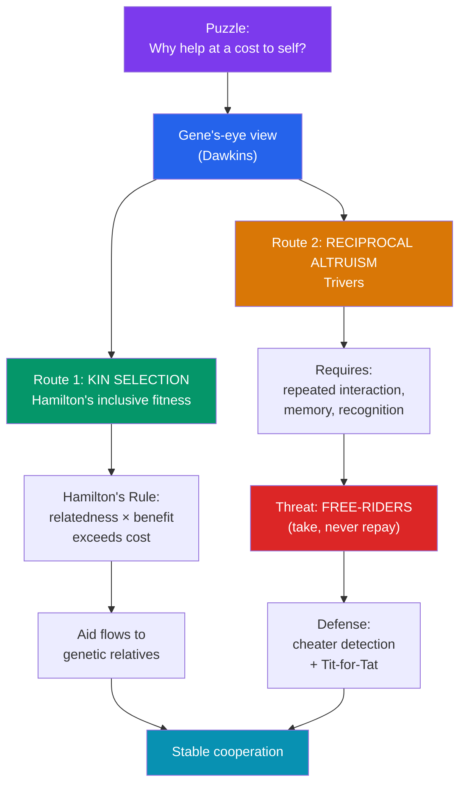

# 🤝 Kin Selection and Altruism

> [!abstract] TL;DR
> Altruism — helping others at a cost to yourself — is a puzzle for a "survival of the fittest" story: how can a self-sacrificing tendency ever spread? The gene's-eye view supplies two answers. **Kin selection**, formalized by **Hamilton's rule** (help pays off when *relatedness × benefit-to-recipient > cost-to-actor*), shows that genes can promote self-sacrifice toward *relatives* who carry copies of those same genes. This is captured by **inclusive fitness**: reproducing your genes directly *or* by aiding kin who share them. Between non-relatives, **Trivers' reciprocal altruism** — "I help you now, you help me later" — can evolve when interactions repeat, but it is always threatened by **free-riders**, which is why organisms evolve cheater-detection and why cooperation is best modeled game-theoretically. Together these explain much prosocial behavior without invoking group-good "for the species."

## Intuition — analogy FIRST

The biologist **J.B.S. Haldane** reportedly quipped that he would lay down his life "for two brothers or eight cousins."

The joke is a precise piece of accounting. You share, on average, **half your genes** with a full sibling and **one-eighth** with a first cousin. So from a *gene's* point of view, sacrificing yourself to save two siblings — or eight cousins — breaks even on the genetic ledger: the copies of your genes carried in those relatives, taken together, equal the copies lost with you. Save *three* siblings and the genes come out ahead.

That is the whole intuition of kin selection: a gene "cares" not about the body it sits in but about *copies of itself*, wherever they reside. A tendency to help close relatives can therefore spread even if it hurts the individual who carries it — because it helps the *gene* propagate through the bodies of kin. Reciprocity extends the same accounting to strangers, but only when the favor is likely to be repaid — and only if you can spot the cheat who takes without giving back.

---

## How It Works — Two Routes to Cooperation

## Key Concepts / Details

### Inclusive Fitness and Hamilton's Rule

**W.D. Hamilton (1964)** solved the altruism puzzle with **inclusive fitness**: an organism's total genetic contribution is its *direct* reproduction **plus** its effect on the reproduction of relatives, weighted by how related they are. The condition for an altruistic gene to spread is **Hamilton's rule**:

> **rB > C**
> where **r** = coefficient of relatedness (probability an allele is shared by descent), **B** = reproductive benefit to the recipient, **C** = reproductive cost to the actor.

| Relationship | Coefficient of relatedness (r) |
|---|---|
| Identical twin | 1.0 |
| Parent / full sibling / child | 0.5 |
| Grandparent / half-sibling / aunt-uncle / niece-nephew | 0.25 |
| First cousin | 0.125 |
| Unrelated stranger | ~0 |

The rule predicts *graded* helping: more, and costlier, aid toward closer kin. Empirically, this "kin premium" appears in inheritance patterns, willingness to help in life-or-death vs. everyday scenarios (Burnstein et al., 1994), and grief intensity. **Haplodiploidy** in bees, ants, and wasps — where sisters can share r ≈ 0.75 — was Hamilton's showcase for why sterile workers help raise sisters (though the haplodiploidy explanation is now debated).

### The Gene's-Eye View

**Richard Dawkins** (*The Selfish Gene*, 1976) popularized the framing that makes kin selection intuitive: the unit that natural selection ultimately "sees" is the **gene**, and organisms are vehicles for gene propagation. "Selfish" genes can build *unselfish* organisms whenever helping copies of themselves (in kin) outperforms pure self-interest. This is a *metaphor about accounting*, not a claim that people consciously calculate r — the psychology runs on proximate cues (see below).

### Kin Recognition

Genes cannot label relatives directly, so organisms use **proximate cues** that *correlated* with kinship in the EEA:
- **Association / co-residence** — those you grew up with are treated as kin (drives the **Westermarck effect**: reduced sexual attraction to childhood co-rearees, an incest-avoidance mechanism).
- **Phenotype matching** — resemblance in smell, face, or immune (MHC) markers.
- **Maternal perinatal cues** — e.g., cues around birth and nursing.

Because these are *cues*, they can be fooled — adoption, wet-nursing, and manipulative "fictive kin" language ("brothers in arms," "motherland") all hijack kin psychology.

### Reciprocal Altruism (Trivers) and the Free-Rider Problem

For helping *non*-relatives, **Robert Trivers (1971)** proposed **reciprocal altruism**: a costly act now pays off if the recipient reciprocates later. It evolves only under enabling conditions — **repeated interactions**, **individual recognition**, **good memory**, and roughly **symmetric costs/benefits**. Its Achilles' heel is the **free-rider (cheater)**: someone who accepts help but never repays gains the benefit without the cost. This is exactly the vulnerability the cheater-detection research in [[Foundations_of_Evolutionary_Psychology]] addresses — cooperation requires policing.

### The Evolution of Cooperation (Game Theory)

Reciprocity is naturally modeled as the **iterated Prisoner's Dilemma**. In **Axelrod & Hamilton's (1981)** famous tournaments, the simple strategy **Tit-for-Tat** — cooperate first, then mirror the partner's last move — outperformed more complex rivals: it was *nice* (never defects first), *retaliatory* (punishes cheats), *forgiving* (returns to cooperation), and *clear*. This showed cooperation can be an **evolutionarily stable strategy (ESS)** without any group-level design.

| Mechanism | Basis of helping | Key requirement | Theorist |
|---|---|---|---|
| **Kin selection** | Shared genes (r) | Ability to direct aid toward kin | Hamilton |
| **Direct reciprocity** | "I help you, you help me" | Repeated dyadic interaction | Trivers; Axelrod |
| **Indirect reciprocity** | Reputation ("help the helpful") | Gossip, reputation tracking | Nowak & Sigmund |
| **Network reciprocity** | Clusters of cooperators | Spatial/social structure | Nowak |
| **Group / multilevel selection** | Between-group competition (contested) | Groups vary in cooperation | D.S. Wilson; E.O. Wilson |

**Martin Nowak** systematized these as "five rules for the evolution of cooperation." The **group-selection** row remains genuinely contested: Hamilton, Dawkins, and Pinker argue most apparent group selection reduces to kin selection or reciprocity, while D.S. Wilson and (late) E.O. Wilson champion **multilevel selection**. A 2010 Nowak–Tarnita–Wilson paper attacking inclusive fitness drew a rebuttal signed by ~140 biologists — a live scientific fault line, not a settled question.

## Real-World Notes

- **Public-goods problems**: free-riding in taxation, vaccination, and climate action mirrors the reciprocal-altruism cheater problem; institutions (audits, reputation systems, punishment) are cultural cheater-detection.
- **Blood and organ donation**: often cited as reciprocal/indirect-reciprocity behavior scaffolded by reputation and norms rather than pure kinship.
- **Nepotism and inheritance law**: kin-biased resource transfer is a near-universal that Hamilton's rule predicts and that legal systems both encode and constrain.
- **Online reputation systems**: eBay/Uber ratings are engineered *indirect reciprocity* — reputation makes cooperation pay among strangers who never meet again.

## Common Pitfalls

- **"For the good of the species."** Naïve group selection is the classic error; standard theory explains altruism through gene-level accounting, not species benefit.
- **Assuming conscious calculation.** No one computes r. Evolved *proximate cues* (familiarity, resemblance) approximate kinship; that's why the cues can be tricked.
- **Confusing psychological with evolutionary altruism.** Evolutionary "altruism" is defined by *fitness* costs/benefits, not by kind intentions; the two can come apart.
- **Overstating haplodiploidy.** Once the star example for insect eusociality, it is now seen as neither necessary nor sufficient — monogamy and ecology matter too.
- **Treating group selection as debunked *or* obvious.** It is an unresolved, technical dispute; both dismissal and overconfident endorsement misrepresent the field.

## Related Concepts

- [[_MOC_Evolutionary_Psychology|↑ Section MOC]]
- [[Foundations_of_Evolutionary_Psychology]] — Gene's-eye view and cheater-detection that make cooperation policing possible
- [[Mating_and_Attraction]] — Parental investment is kin-directed altruism toward r = 0.5 offspring
- [[Evolutionary_Mismatch]] — Modern anonymous, one-shot interactions strip the conditions reciprocity evolved for
- [[Criticisms_of_Evolutionary_Psychology]] — Where the group-selection and adaptationism debates get sharp
- Cross-vault: [[_MOC_Game_Theory_Master]] — Iterated Prisoner's Dilemma, Tit-for-Tat, ESS, and the formal backbone of cooperation theory

## Review Questions

1. Write out **Hamilton's rule** and define each term. Use the coefficients of relatedness to explain Haldane's "two brothers or eight cousins" quip, and compute the break-even number of *first cousins* one would (genetically) trade one's life for.
2. What four conditions must hold for **reciprocal altruism** to evolve, and why does each one matter? Explain how the **free-rider problem** threatens it and how **Tit-for-Tat** counters cheating.
3. Contrast **kin selection**, **direct reciprocity**, and **indirect reciprocity** as routes to cooperation. Why is the **group-selection / multilevel-selection** debate still genuinely unresolved rather than simply "debunked"?

## Sources

- Hamilton, W.D. (1964). "The genetical evolution of social behaviour, I & II." *Journal of Theoretical Biology*, 7(1), 1–52
- Trivers, R.L. (1971). "The evolution of reciprocal altruism." *Quarterly Review of Biology*, 46(1), 35–57
- Axelrod, R. & Hamilton, W.D. (1981). "The evolution of cooperation." *Science*, 211(4489), 1390–1396
- Nowak, M.A. (2006). "Five rules for the evolution of cooperation." *Science*, 314(5805), 1560–1563

#psychology #evolutionary-psychology #altruism #cooperation #kin-selection
