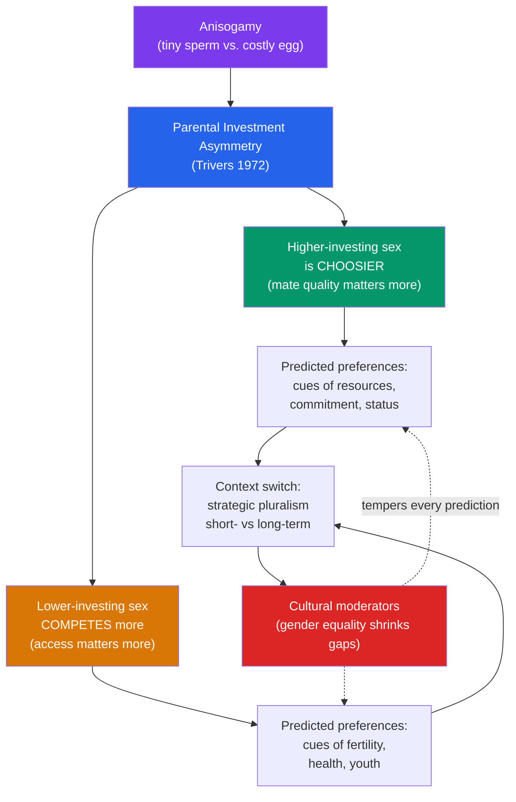

# 💞 Mating and Attraction

> [!abstract] TL;DR
> Evolutionary accounts of human mating start from **Trivers' parental investment theory**: the sex that invests more per offspring (typically, but not always, females) becomes the "choosier" one, while the lower-investing sex competes more intensely for access. From this asymmetry, EP predicts *some* systematic, population-level sex differences in mate preferences — famously mapped by **David Buss's 37-culture study** — and a menu of **short- and long-term mating strategies** that both sexes can deploy depending on context. Jealousy is analyzed as an evolved "mate-guarding" response. These claims are among EP's most cited *and* most criticized: effect sizes are modest, differences describe averages (not individuals), and **cultural conditions strongly moderate them**. This note describes hypotheses about central tendencies; it is *not* prescriptive about how any person should behave or be treated.

> [!note] Framing note
> Everything below describes *statistical averages across populations*, offered as scientific hypotheses under active debate. Group-level tendencies say nothing about any individual, do not imply that behavior is fixed or desirable, and carry no moral prescription. Deriving "ought" from "is" here is a fallacy (see [[Criticisms_of_Evolutionary_Psychology]]).

## Intuition — analogy FIRST

Think of reproduction as an **investment with wildly unequal minimum buy-ins**.

Imagine two investors in the same venture. One can enter for a tiny stake and walk away immediately; the other is committed to a nine-month lock-up plus years of costly follow-on funding before any return. These two will *rationally* adopt different strategies. The low-stakes investor can afford to spread many small bets and be less selective per bet. The high-stakes investor, facing a scarce and expensive slot, will screen prospects hard — vetting reliability, resources, and willingness to co-invest — because a bad choice is enormously costly.

That asymmetry in "minimum investment" is the engine of Trivers' theory. Because the biological floor of investment differs between the sexes (one sperm vs. gestation and lactation), selection is predicted to have tuned somewhat different priorities into the choosier and the competing roles. The key word is *predicted*: humans are unusual in that fathers often invest heavily too, which pulls male and female strategies closer together and makes the human case far messier than a peacock's.

---

## How It Works — The Logic of Investment Asymmetry

## Key Concepts / Details

### Parental Investment Theory (Trivers)

**Robert Trivers (1972)** generalized **Bateman's principle** (1948, from fruit flies): the sex whose reproductive success is more limited by *access to mates* competes more, and the sex more limited by *parental resources* chooses more. **Parental investment** is any investment in one offspring that reduces the parent's ability to invest in others. The prediction is not about chromosomes per se but about *who invests more* — in species where males invest more (e.g., some seahorses, phalaropes), the roles reverse. Humans are a **high-biparental-investment** species, which is exactly why simple predictions blur.

### Buss's Cross-Cultural Study of Mate Preferences

**David Buss (1989)** surveyed **10,047 people across 37 cultures** on six continents. Averaged findings that recurred widely:
- Both sexes ranked **kindness, intelligence, and mutual attraction** at the top — the *largest* commonalities, often underreported.
- Where sexes differed, men (on average) placed somewhat more weight on **cues associated with fertility** (youth, health), and women (on average) somewhat more weight on **cues associated with resource-acquisition and status**.
- Men on average preferred slightly younger partners; women slightly older.

| Preference (population averages) | Direction of reported sex difference | Typical effect size |
|---|---|---|
| Kindness / intelligence | ~No difference (both rank highest) | ~zero |
| Physical attractiveness / youth | Men weight somewhat higher | small–moderate |
| Financial prospects / status | Women weight somewhat higher | small–moderate |
| Preferred age of partner | Men younger, women older | moderate |
| Chastity / fidelity emphasis | Highly culture-dependent | varies widely |

Two cautions the primary literature stresses: (1) commonalities dwarf differences, and (2) these are **stated preferences**, which predict real mate choice only imperfectly (speed-dating studies, e.g., Eastwick & Finkel, find stated sex differences often shrink in actual choices).

### Short- vs. Long-Term Strategies (Sexual Strategies Theory)

**Buss & Schmitt's (1993) Sexual Strategies Theory** argues both sexes possess a *repertoire* of strategies and deploy them by context — not that men are "short-term" and women "long-term." **Strategic pluralism** (Gangestad & Simpson, 2000) adds that individuals shift along this continuum depending on ecology, market conditions, and their own mate value. Predicted differences are about the *conditions* triggering short-term mating and the *standards* applied within it, not categorical types.

### Jealousy as Mate-Guarding

EP treats jealousy as an evolved response to threats against a valued pair-bond. **Buss et al. (1992)** proposed a sex difference: because ancestral men faced **paternity uncertainty**, they might be more distressed by a partner's *sexual* infidelity; women, facing the risk of a partner's *investment* being diverted, more distressed by *emotional* infidelity. Forced-choice questionnaires supported this.

This is one of EP's most contested findings. **Christine Harris (2003)** and **DeSteno et al.** showed the sex difference largely appears in *hypothetical forced-choice* formats and shrinks or vanishes with continuous measures or physiological data — both sexes find *both* kinds of infidelity distressing. The honest summary: a real but format-sensitive and modest effect, not a categorical divide.

### Critiques and Cultural Moderators

Balance is essential here — the alternatives are serious science, not mere skepticism:
- **Biosocial / social structural theory (Eagly & Wood, 1999):** apparent "evolved" sex differences may partly reflect the **division of labor and gendered access to resources**. Their re-analysis of Buss's data found that in more gender-equal nations, the sex difference in valuing "good financial prospects" *shrank*.
- **Gender-equality moderation (Zentner & Mitura, 2012):** across nations, greater gender equality predicts *smaller* sex differences in mate preferences — a pattern EP and social-structural theory both try to explain.
- **Replication and scope:** large cross-cultural re-tests (e.g., Walter et al., 2020) confirm *directional consistency* of some sex differences while underscoring their **small average magnitude** and heavy cultural variance.
- **WEIRD-sample worries:** much data historically over-sampled Western, educated populations (Henrich et al., 2010).

The mainstream position is *interactionist*: evolved dispositions and social/cultural structure jointly shape mating psychology, and disentangling their contributions is an empirical, ongoing project.

## Real-World Notes

- **Online dating**: platforms create novel "mating markets" with search parameters that make stated preferences salient — a modern context whose mismatch with ancestral small-group mating is itself of interest (see [[Evolutionary_Mismatch]]).
- **Advertising**: marketers exploit attraction cues (status signals, youth, symmetry) — a descriptive fact about persuasion, not an endorsement.
- **Clinical / relationship counseling**: understanding jealousy as a mate-guarding *emotion* (not a character flaw) can reframe conversations, while emphasizing that its expression is a choice subject to ethics and consent.
- **Public communication**: EP mating claims are among the *most misreported* in media, frequently stripped of effect sizes and cultural caveats and repackaged as prescriptions — a pattern researchers actively warn against.

## Common Pitfalls

- **Ecological fallacy**: applying a population average to an individual. "On average, X" never predicts a given person.
- **Naturalistic / moralistic fallacy**: treating an evolved tendency as *good* (naturalistic) or denying a finding because it seems *bad* (moralistic). Both are errors; the science is descriptive.
- **Ignoring effect sizes**: many sex differences here are *small*, and commonalities are large. Reporting only the difference distorts the science.
- **Treating strategies as fixed types**: both sexes flexibly shift along short-/long-term continua by context.
- **Forgetting cultural moderation**: gender-equality gradients change the size of these differences, so "universal" claims must be stated probabilistically.

## Related Concepts

- [[_MOC_Evolutionary_Psychology|↑ Section MOC]]
- [[Foundations_of_Evolutionary_Psychology]] — Sexual selection and adaptation logic underlying every prediction here
- [[Kin_Selection_and_Altruism]] — Parental investment is itself a form of kin-directed investment; feeds cooperation theory
- [[Evolutionary_Mismatch]] — Modern mating markets, pornography, and contraception as novel environments
- [[Criticisms_of_Evolutionary_Psychology]] — Adaptationism, testability, and the is/ought critiques applied directly to mating claims
- Cross-vault: [[_MOC_Game_Theory_Master]] — Mate choice and commitment as signaling and bargaining problems

## Review Questions

1. State **Trivers' parental investment theory** in your own words. Why does the theory predict *role reversal* in species where males invest more, and why does high biparental investment make human predictions weaker?
2. Buss (1992) reported a sex difference in **sexual vs. emotional jealousy**. Summarize the finding *and* Harris's methodological critique. What does the balance of evidence actually support?
3. **Eagly & Wood** and **Zentner & Mitura** show that some mate-preference sex differences shrink with gender equality. Explain how *both* an evolutionary and a social-structural theory try to account for this, and why the mainstream view is interactionist.

## Sources

- Trivers, R.L. (1972). "Parental investment and sexual selection." In *Sexual Selection and the Descent of Man* (Campbell, ed.). Aldine
- Buss, D.M. (1989). "Sex differences in human mate preferences." *Behavioral and Brain Sciences*, 12(1), 1–49
- Eagly, A.H. & Wood, W. (1999). "The origins of sex differences in human behavior." *American Psychologist*, 54(6), 408–423
- Zentner, M. & Mitura, K. (2012). "Stepping out of the caveman's shadow." *Psychological Science*, 23(10), 1176–1185

#psychology #evolutionary-psychology #mating #sexual-selection #parental-investment
