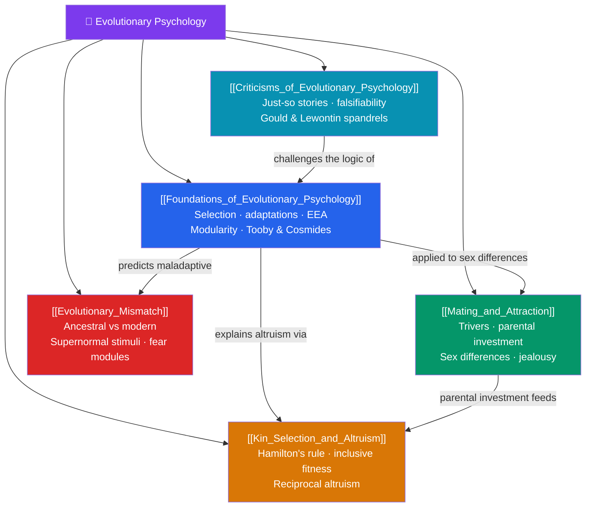

# 🐒 Evolutionary Psychology — Map of Content

> [!abstract] What This Section Covers
> Evolutionary psychology treats the mind as a set of information-processing adaptations shaped by natural and sexual selection to solve the recurring problems our ancestors faced. This section lays the **foundations** — adaptations, the environment of evolutionary adaptedness (EEA), and mental modularity — then applies them to **mating and attraction**, to **kin selection and altruism** (why we help others at a cost to ourselves), and to **evolutionary mismatch** (why minds built for the Stone Age misfire in modernity). It closes with the field's most serious **criticisms**. Together these five notes ask what human nature looks like through a Darwinian lens — and where that lens distorts.

## Concept Map

## Learning Path

1. [[Foundations_of_Evolutionary_Psychology]] — Natural and sexual selection, adaptations vs. by-products, the EEA, mental modularity, and Tooby & Cosmides' program.
2. [[Mating_and_Attraction]] — Trivers' parental investment theory, sex differences in mate preferences, and the evolutionary logic of jealousy.
3. [[Kin_Selection_and_Altruism]] — Hamilton's rule, inclusive fitness, and reciprocal altruism as solutions to the puzzle of self-sacrifice.
4. [[Evolutionary_Mismatch]] — The gap between ancestral and modern environments: diet and obesity, evolved fear modules, and supernormal stimuli.
5. [[Criticisms_of_Evolutionary_Psychology]] — The "just-so stories" charge, problems of falsifiability, and Gould & Lewontin's spandrels critique.

## All Notes at a Glance

| Note | Difficulty | What You'll Learn |
|------|------------|-------------------|
| [[Foundations_of_Evolutionary_Psychology]] | Intermediate | Natural/sexual selection, adaptation vs. by-product/exaptation, EEA, massive modularity, gene's-eye view |
| [[Mating_and_Attraction]] | Intermediate | Parental investment theory, short/long-term strategies, mate-preference sex differences, sexual vs. emotional jealousy |
| [[Kin_Selection_and_Altruism]] | Intermediate → Advanced | Inclusive fitness, Hamilton's rule (rB > C), reciprocal altruism, cheater detection, group-selection debates |
| [[Evolutionary_Mismatch]] | Intermediate | Mismatch hypothesis, thrifty genes, prepared learning/fear modules, supernormal stimuli, modern maladies |
| [[Criticisms_of_Evolutionary_Psychology]] | Intermediate → Advanced | Adaptationism critique, spandrels, testability, alternative explanations, genetic determinism worries |

## Key Questions This Section Answers

- What makes a psychological trait an *adaptation* rather than an incidental by-product?
- Why do evolutionary theories predict systematic sex differences in mating strategies?
- How can genes "for" self-sacrifice ever spread through a population?
- If cravings for sugar and fat were once adaptive, why do they harm us now?
- When does an evolutionary explanation become an untestable "just-so story"?

## Related Sections

- [[_MOC_Psychology_Master|↑ Psychology Master MOC]]
- [[_MOC_Learning_Behaviorism|← Learning & Behaviorism]]
- [[_MOC_Psychometrics|→ Psychometrics & Assessment]]
- Cross-vault: [[_MOC_Game_Theory_Master]] — reciprocal altruism, cooperation, and evolutionarily stable strategies formalize these ideas

#MOC #Psychology #EvolutionaryPsychology
