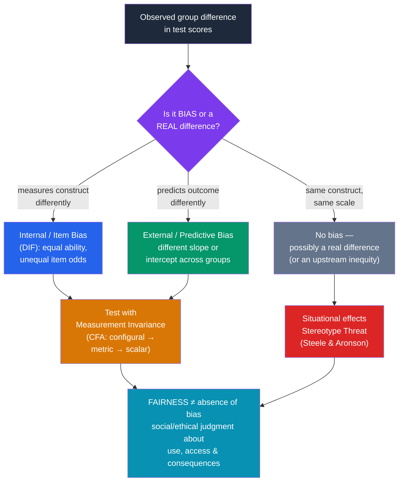

# ⚖️ Bias and Fairness in Testing

> [!abstract] TL;DR
> **Bias is a technical, statistical property; fairness is a social and ethical judgment** — and conflating them is the field's oldest confusion. A group *difference* in scores is not by itself bias: bias exists only when the test measures the construct *differently*, or predicts an outcome *differently*, across groups. **Item bias / Differential Item Functioning (DIF)** occurs when test-takers of equal ability but different groups have unequal odds of a correct answer. **Predictive bias** occurs when the same score predicts different real-world outcomes for different groups (different regression slopes/intercepts). **Measurement invariance** — tested with confirmatory factor analysis — is the formal requirement that a test measures the *same construct on the same scale* across groups. Even a statistically unbiased test can be socially unfair, and **stereotype threat** (Steele & Aronson, 1995) shows the testing *situation* itself can depress performance. High-stakes testing therefore carries ethical stakes far beyond the psychometrics.

## Intuition — analogy FIRST

Imagine a **high-jump competition where the crossbar sits at a fixed height** — but some athletes must jump on a sunken runway.

If Group A clears the bar more often than Group B, is the *bar* biased? Not necessarily. Maybe Group A genuinely trained more — a real difference the bar is correctly detecting. **A score gap alone tells you nothing about bias.**

Now look closer. **Item bias (DIF)** is like discovering that for athletes of *identical jumping ability*, the runway is springier for one group than the other — same true skill, different odds of clearing. **Predictive bias** is different: it's when clearing the bar reliably predicts Olympic success for Group A but *not* for Group B — the score means something different downstream. And **stereotype threat** is subtler still: telling Group B "people like you tend to jump poorly" right before their attempt makes them tense up and underperform — the *situation*, not the bar or the athlete, produced the gap. Fairness asks a further question the physics can't answer: even if the bar is perfectly calibrated, *should* clearing it be the gatekeeper for who gets to compete at all?

---

## How It Works — Anatomy of Test Bias

The diagram enforces the field's central distinction: an observed gap forks into **item bias**, **predictive bias**, or **a real difference**. Only the first two are *bias* in the technical sense; both are diagnosed against a backdrop of **measurement invariance**. And **fairness** is a separate, higher-order judgment about use and consequences that psychometrics alone cannot settle.

## Key Concepts / Details

### Bias Is Not the Same as a Group Difference

The foundational point (Cleary, 1968; Jensen, 1980): **a mean score difference between groups is not evidence of test bias.** A thermometer reading higher in Death Valley than in Alaska isn't a "biased thermometer." Bias is a property of the *measurement or prediction process*, not of the outcome distribution. Real differences can arise from genuine upstream inequities (unequal schooling, nutrition, opportunity) that the test faithfully reflects — which is an argument about *social justice and test use*, not about the test's psychometric bias.

### Item Bias and Differential Item Functioning (DIF)

**DIF** exists when test-takers **matched on the underlying trait (θ)** but from different groups have **different probabilities** of answering an item correctly.

- **Uniform DIF**: one group is favored across all ability levels (ICCs shifted).
- **Non-uniform DIF**: the advantage reverses across ability levels (ICCs cross).
- **Detection methods**: **Mantel-Haenszel**, **logistic regression DIF**, and **IRT-based ICC comparison** (see [[Item_Response_Theory]]).
- *Classic example*: a math word problem set in a context (regattas, specific idioms) familiar to one cultural group can show DIF even when the underlying math skill is equal. Flagged items are reviewed by sensitivity panels and revised or removed.

DIF is *item*-level and *internal* — it asks whether the item measures the same thing for everyone at equal ability.

### Predictive (External) Bias

Predictive bias concerns the test's relationship to an **external criterion** (job performance, college GPA). Following the **Cleary model**, a test is predictively biased if a **single regression equation** systematically over- or under-predicts the criterion for a group — i.e., groups have different **slopes** or **intercepts**.

| Bias type | Level | Question | Tool |
|---|---|---|---|
| **Item bias / DIF** | Individual item | Equal-ability people, equal item odds? | Mantel-Haenszel, IRT |
| **Predictive bias** | Whole test → outcome | Same score → same predicted outcome? | Moderated regression |
| **Construct bias** | Whole test | Same construct measured across groups? | CFA invariance |
| **Method bias** | Administration | Format/language advantages a group? | Procedure review |

Empirically, well-constructed cognitive tests often show **little predictive bias** against protected groups — and where bias appears, it frequently *over*-predicts minority performance, contrary to intuition. This is a genuinely counterintuitive finding: a test can be predictively *unbiased* yet still produce **adverse impact** (different selection rates), which is the *fairness/legal* problem, not a bias problem.

### Measurement Invariance

Before comparing groups at all, you must show the test **measures the same construct on the same scale** in each group. Tested via a hierarchy of nested **CFA** models (see [[Factor_Analysis_and_Test_Construction]]):

1. **Configural** — same factor *structure* (same items load on same factors) in all groups.
2. **Metric (weak)** — equal **factor loadings** → the construct has the same meaning; you may compare associations.
3. **Scalar (strong)** — equal loadings **and** intercepts → you may validly compare **means** across groups.
4. **Strict** — equal residual variances too.

If scalar invariance fails, comparing group means is comparing apples to oranges — a common but often-ignored precondition for cross-group and cross-cultural score comparisons.

### Stereotype Threat

**Claude Steele and Joshua Aronson (1995)** showed that the *testing situation itself* can depress performance. When a negative stereotype about one's group is made salient ("this test measures your ability"), members of the stereotyped group underperform relative to controls — even with identical ability — apparently via anxiety, working-memory load, and monitoring.

- Demonstrated for race (Black students on "diagnostic" tests) and gender (women on hard math tests when gender is primed).
- **Interventions**: values affirmation, reframing the test as non-diagnostic, presenting difficulty as normal, and diverse role models.
- **Caveat**: effect sizes are debated and some findings have **failed to replicate** or shrink under publication-bias correction — the phenomenon is real but its magnitude and boundary conditions are contested. It illustrates that a psychometrically unbiased test can still yield unfair outcomes through the context of administration.

### Cultural Fairness and the Ethics of High-Stakes Testing

- **"Culture-fair" tests** (e.g., Raven's Progressive Matrices) aim to minimize language and cultural loading, but *no* test is truly culture-free — even abstract reasoning is shaped by schooling and familiarity with test conventions.
- **High-stakes tests** (admissions, licensure, employment, immigration) allocate life opportunities. The ethical stakes: **due process, transparency, appropriate use, and consequential validity** — Messick's insistence that validity includes the *social consequences* of test use (see [[Reliability_and_Validity]]).
- Governed by the *Standards for Educational and Psychological Testing* (AERA/APA/NCME) and, legally in the U.S., by *Griggs v. Duke Power* (1971, disparate impact) and the *Uniform Guidelines on Employee Selection*.

## Real-World Notes

- **College admissions**: SAT/ACT DIF analyses and predictive-validity studies are routine; debates over score gaps drive test-optional policies and holistic review.
- **Employment**: cognitive tests predict performance well but often cause adverse impact; organizations balance validity against diversity via banding, combining predictors, or structured alternatives (Schmidt & Hunter, 1998).
- **Cross-cultural research**: comparing well-being or personality across nations is invalid without first establishing scalar measurement invariance — a step frequently skipped.
- **Clinical assessment**: norms developed on one population may misdiagnose another; culturally competent assessment adjusts interpretation and, where possible, uses locally normed instruments.

## Common Pitfalls

- **Equating a score gap with bias** — the single most common error; a difference can be real, situational, or an upstream inequity rather than a flaw in the test.
- **Conflating bias with unfairness** — a test can be statistically unbiased yet socially unfair in its consequences (adverse impact), and vice versa.
- **Comparing group means without testing invariance** — cross-group mean comparisons are meaningless if scalar invariance fails.
- **Assuming "culture-fair" means culture-free** — reduced cultural loading is not zero cultural loading.
- **Over- or under-claiming stereotype threat** — treating it as either a debunked myth or a settled large effect both misread a contested but real literature.
- **Ignoring consequential validity** — evaluating a test only on prediction while ignoring the social consequences of its use.

## Related Concepts

- [[_MOC_Psychometrics]] — Section map of content
- [[Item_Response_Theory]] — DIF is detected by comparing item characteristic curves across groups
- [[Factor_Analysis_and_Test_Construction]] — Measurement invariance is tested with multi-group CFA
- [[Reliability_and_Validity]] — Predictive bias is a validity question; consequential validity covers social impact
- [[Intelligence_and_IQ_Testing]] — The historical epicenter of test-bias and fairness controversy
- Cross-vault: [[_MOC_Cross_Cultural_Psychology]] — Cross-cultural comparison requires measurement invariance
- Cross-vault: [[Prejudice_and_Discrimination]] — Stereotypes as the mechanism behind stereotype threat

## Review Questions

1. A test shows a 0.5-SD mean difference between two groups. Explain why this is *not*, by itself, evidence of test bias, and describe the two distinct forms of evidence (internal and external) you would examine to determine whether the test is actually biased.
2. Define Differential Item Functioning and distinguish it from predictive bias, naming a detection method for each. Why is it important that DIF compares people *matched on the underlying trait*?
3. Explain the difference between test *bias* and test *fairness* using stereotype threat and adverse impact as examples. Why can a statistically unbiased test still raise serious fairness concerns?

## Sources

- Steele, C.M. & Aronson, J. (1995). "Stereotype threat and the intellectual test performance of African Americans." *JPSP*, 69(5), 797–811
- Cleary, T.A. (1968). "Test bias: Prediction of grades of Negro and white students in integrated colleges." *Journal of Educational Measurement*, 5(2), 115–124
- AERA, APA & NCME (2014). *Standards for Educational and Psychological Testing*. AERA
- Meredith, W. (1993). "Measurement invariance, factor analysis and factorial invariance." *Psychometrika*, 58(4), 525–543

#psychology #psychometrics #test-bias #fairness #ethics
