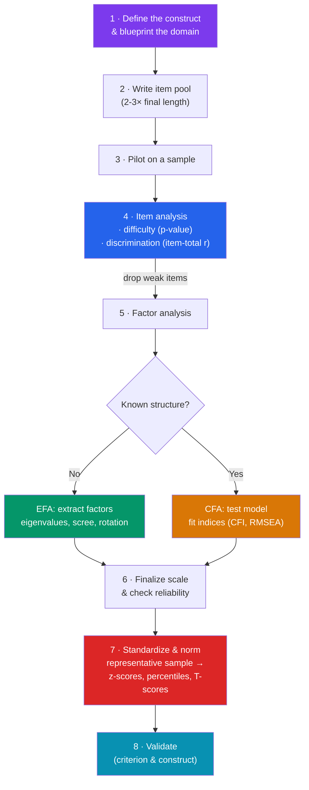

# 🧩 Factor Analysis and Test Construction

> [!abstract] TL;DR
> **Factor analysis** finds the small number of hidden (latent) variables that explain why many observed items correlate. **Exploratory factor analysis (EFA)** discovers structure when you don't know it in advance; **confirmatory factor analysis (CFA)** tests a structure you hypothesized, yielding fit statistics. The key outputs are **factor loadings** (item-to-factor correlations) and **eigenvalues** (variance each factor explains, used to decide how many factors to keep). Building a real test is a pipeline: define the construct → write and pilot items → run **item analysis** (difficulty and discrimination) → establish the factor structure → then **standardize and norm** the test on a representative sample so raw scores become interpretable percentiles or standard scores. Factor analysis is the statistical engine behind g, the Big Five, and nearly every psychological scale.

## Intuition — analogy FIRST

Imagine a **music mixing board** playing back a finished song.

You hear dozens of individual sounds — guitar, vocals, drums, bass, synth. But those sounds weren't created independently; they were mixed down from a few underlying *tracks*. Factor analysis works the mixing board **in reverse**: given only the final blend of many correlated signals (test items), it estimates how few underlying tracks (factors) could have produced them, and how strongly each track feeds into each channel (the **loadings**).

Some channels are almost pure — driven by one track (a strong single loading). Others are muddy — fed by several tracks at once (**cross-loadings**), and you may want to remix (rotate) or drop them. **EFA** is discovering how many tracks are on the tape when the label is missing; **CFA** is checking whether the tape matches the track list you were promised. And just as a song must be *mastered* to a standard loudness before release, a test must be *normed* before its scores mean anything.

---

## How It Works — The Test-Construction Pipeline

The pipeline moves from **theory → items → statistics → norms → validation**. Factor analysis (step 5) sits in the middle: it confirms the items actually cluster the way the construct predicts. Item analysis (step 4) prunes bad items *before* factoring, and norming (step 7) makes raw scores interpretable.

## Key Concepts / Details

### Exploratory Factor Analysis (EFA)

EFA discovers latent structure without a prior hypothesis. Core mechanics:

- **Extraction**: methods like **principal axis factoring** or **maximum likelihood** pull common factors from the item correlation matrix. (Note: **PCA** is a data-reduction cousin that analyzes *total* variance, not just shared/common variance — factor analysts prefer common-factor methods.)
- **Eigenvalues** measure how much total variance each factor accounts for. Deciding **how many factors to retain**:
  - **Kaiser criterion**: keep factors with eigenvalue > 1 (crude, often over-extracts).
  - **Cattell's scree test**: plot eigenvalues, keep factors above the "elbow."
  - **Parallel analysis** (Horn, 1965): retain factors whose eigenvalues exceed those from random data — the modern best practice.
- **Rotation** makes factors interpretable by pushing loadings toward 0 or 1 (**simple structure**, Thurstone):
  - **Orthogonal** (e.g., *varimax*) — factors kept uncorrelated.
  - **Oblique** (e.g., *promax*, *oblimin*) — factors allowed to correlate, usually more realistic in psychology (abilities *do* correlate → hence a higher-order g).

### Confirmatory Factor Analysis (CFA)

CFA, a special case of **structural equation modeling**, tests a *pre-specified* model: you assign items to factors in advance and ask how well the model reproduces the observed covariances.

| Feature | EFA | CFA |
|---|---|---|
| Hypothesis | None — discovers structure | Specified in advance |
| Every item loads on | *All* factors | Only its *assigned* factor(s) |
| Output | Loadings, eigenvalues | Loadings **+ fit indices** |
| Typical use | Early scale development | Validation, invariance testing |
| Key statistics | Scree, parallel analysis | **CFI/TLI ≥ .95, RMSEA ≤ .06, SRMR ≤ .08** |

CFA's fit indices let you *reject* a proposed structure — impossible in EFA. It is the standard tool for confirming a scale's dimensionality and, crucially, for testing **measurement invariance** across groups (see [[Bias_and_Fairness_in_Testing]]).

### Factor Loadings and Communality

- A **factor loading** is the correlation (in orthogonal models) between an item and a factor — how much the factor "drives" the item. Loadings ≥ 0.40 are usually considered meaningful; a **cross-loading** item loads on two factors and is often cut.
- **Communality (h²)** is the proportion of an item's variance explained by the retained factors — the item's shared-variance "signal."
- **Simple structure**: each item loads high on one factor and near-zero on others — the interpretive goal of rotation.

### Item Analysis: Difficulty and Discrimination

Before factoring, each item is evaluated (Classical Test Theory statistics):

- **Item difficulty (p-value)** = proportion who answer correctly. p near 0 (too hard) or 1 (too easy) carries little information; **p ≈ 0.5** maximizes variance and discrimination for a norm-referenced test. (Item response theory reframes this as the **b parameter** — see [[Item_Response_Theory]].)
- **Item discrimination** = how well an item separates high scorers from low scorers. Measured by the **item-total correlation (point-biserial)** or the **discrimination index D** (upper-group minus lower-group pass rates). Low or negative discrimination flags a broken or mis-keyed item.
- **Distractor analysis** (for multiple-choice): each wrong option should attract *some* low scorers; a distractor no one picks is dead weight.

### Standardizing and Norming

Raw scores are meaningless until referenced to a population.

- **Standardization** = administering the test under fixed, identical conditions so scores are comparable across people and settings.
- **Norming** = building a **normative sample** — a large, representative reference group (matched to census demographics) — and converting raw scores to standardized metrics:
  - **z-scores** (mean 0, SD 1), **T-scores** (mean 50, SD 10), **IQ/deviation scores** (mean 100, SD 15), **percentile ranks**, **stanines**.
- Norms **age**: population performance drifts (the **Flynn effect** forces periodic renorming of IQ tests — see [[Intelligence_and_IQ_Testing]]).
- **Norm-referenced** interpretation ranks a person against others; **criterion-referenced** interpretation compares to an absolute standard (e.g., "70% to pass"). Different purposes demand different construction choices.

> [!warning] EFA is not a magic structure-finder
> Factor solutions depend on the items you fed in ("garbage in, factors out"), the extraction and rotation choices, and the sample. A factor is only as meaningful as the researcher's *interpretation* of the items that load on it — the statistics name nothing. Always confirm an EFA-derived structure with CFA on a *fresh* sample.

## Real-World Notes

- **The Big Five** personality model emerged largely from decades of factor-analyzing trait adjectives — a textbook EFA success story now confirmed by CFA across cultures.
- **Intelligence**: factor analysis is literally how Spearman found g and how Carroll built the CHC three-stratum model from 460+ datasets (see [[Intelligence_and_IQ_Testing]]).
- **Scale development in clinical psych**: depression, anxiety, and quality-of-life scales are routinely validated with CFA fit indices before publication.
- **Cross-vault link**: factor models, latent variables, and measurement error are the shared backbone of psychometrics and econometrics — see [[_MOC_Econometrics_Master]] for the same math applied to latent economic constructs and instrumental variables.

## Common Pitfalls

- **Using PCA and calling it factor analysis** — PCA analyzes total variance and tends to inflate loadings; report the actual common-factor method used.
- **Over-relying on the Kaiser (eigenvalue > 1) rule** — it systematically over-extracts; parallel analysis is the defensible choice.
- **Confirming structure on the same data used to discover it** — EFA-then-CFA on identical data is circular; split the sample or replicate.
- **Naming a factor from a single high-loading item** — interpret factors from the *pattern* of loadings, and beware reifying a statistical factor as a real entity.
- **Publishing a scale without norms** — without a representative normative sample, a raw score cannot be interpreted for any individual.
- **Ignoring sample size** — factor solutions are unstable in small samples; rules of thumb demand many observations per item.

## Related Concepts

- [[_MOC_Psychometrics]] — Section map of content
- [[Reliability_and_Validity]] — Factorial validity and internal consistency draw directly on factor structure
- [[Intelligence_and_IQ_Testing]] — g and the CHC hierarchy are factor-analytic products
- [[Item_Response_Theory]] — The modern alternative to CTT item analysis; a nonlinear latent-variable model
- [[Bias_and_Fairness_in_Testing]] — CFA tests measurement invariance to detect item bias across groups
- Cross-vault: [[_MOC_Econometrics_Master]] — Latent variables, measurement error, and factor models share deep statistical roots

## Review Questions

1. Distinguish EFA from CFA on three dimensions: the role of a prior hypothesis, what each item is allowed to load on, and what statistical output you get. Give a scenario appropriate to each.
2. You pilot a 60-item test. One item has difficulty p = 0.97 and item-total correlation of −0.05. Interpret both statistics and decide whether to keep the item, justifying your answer.
3. Explain what norming accomplishes and why the Flynn effect requires IQ tests to be periodically renormed. What would happen to reported IQ scores if an old norm set were used today?

## Sources

- Fabrigar, L.R. et al. (1999). "Evaluating the use of exploratory factor analysis in psychological research." *Psychological Methods*, 4(3), 272–299
- Brown, T.A. (2015). *Confirmatory Factor Analysis for Applied Research* (2nd ed.). Guilford Press
- Horn, J.L. (1965). "A rationale and test for the number of factors in factor analysis." *Psychometrika*, 30(2), 179–185
- DeVellis, R.F. (2016). *Scale Development: Theory and Applications* (4th ed.). SAGE

#psychology #psychometrics #factor-analysis #test-construction #statistics
