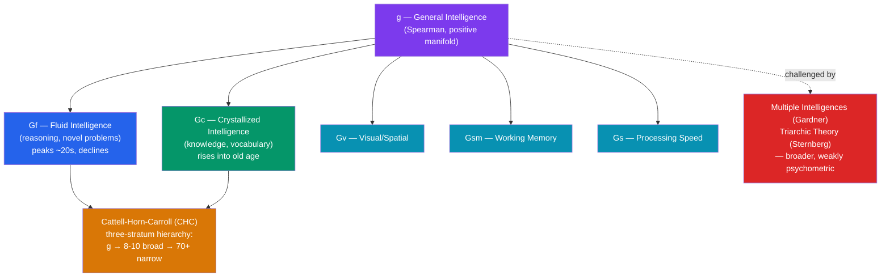

# 🧠 Intelligence and IQ Testing

> [!abstract] TL;DR
> Intelligence testing is psychology's most predictively powerful and most historically abused measurement. **Spearman's g** — a general factor extracted by factor analysis from the observation that all cognitive tests correlate positively (the "positive manifold") — is one of the most replicated findings in psychology and predicts job performance, education, and health. Yet the *structure* of intelligence is contested: **Cattell** split it into **fluid** (reasoning) and **crystallized** (knowledge) intelligence; **Gardner** and **Sternberg** argued for multiple, broader intelligences. Modern tests (**Stanford-Binet**, the **Wechsler** scales) are professionally reliable and valid, but scores are not fixed: the **Flynn effect** shows population IQ rose ~3 points/decade. IQ is substantially heritable *and* environmentally sensitive — and the field's eugenics history (Goddard, immigration testing, forced sterilization) is a permanent caution against misusing group scores.

## Intuition — analogy FIRST

Think of the mind as a **track-and-field decathlete**.

An athlete competes in ten wildly different events — sprints, shot put, high jump, distance running. You might expect no relationship between throwing a javelin and running 1500 metres. Yet in practice, athletes who are good at one event tend to be good at others, because underlying factors — general fitness, coordination, training capacity — lift *all* the events together. That shared, cross-event advantage is the athletic analogue of **g**.

But "general athleticism" doesn't erase specialization: a sprinter and a marathoner both benefit from fitness yet differ enormously in their *specific* strengths (explosive power vs. endurance). Likewise the mind has **g** *and* specialized group factors — verbal, spatial, memory, processing speed. The whole debate over intelligence is really a debate about **how much of performance is the general factor versus the specific events** — and whether "intelligence" should even be measured on one leaderboard.

---

## How It Works — The Structure of Intelligence

The diagram shows the **Cattell-Horn-Carroll (CHC)** model, today's consensus framework: a three-stratum hierarchy with **g** at the top, ~8–10 **broad abilities** (fluid, crystallized, visual, memory, speed) in the middle, and 70+ **narrow abilities** at the bottom. The alternative theories (Gardner, Sternberg) sit outside this psychometric hierarchy because their proposed "intelligences" are broader and harder to measure with the same rigor.

## Key Concepts / Details

### Spearman's g and the Positive Manifold

**Charles Spearman (1904)** noticed that scores on *any* two cognitive tests correlate positively — the **positive manifold**. Using early **factor analysis** (see [[Factor_Analysis_and_Test_Construction]]), he extracted a single **general factor, g**, plus test-specific factors (**s**). g is not a "thing in the brain" but a statistical regularity: whatever makes people good at one mental task tends to make them good at others. g is remarkably robust — it emerges from almost any diverse battery of tests and is among the most predictive single variables in social science for job performance, educational attainment, income, and even longevity.

### Fluid vs Crystallized Intelligence (Cattell & Horn)

**Raymond Cattell** and **John Horn** split g into two broad factors:

- **Fluid intelligence (Gf)** — the ability to reason, spot patterns, and solve *novel* problems independent of prior knowledge. Peaks in the early 20s and declines gradually with age. Measured by matrix-reasoning tasks (Raven's Progressive Matrices).
- **Crystallized intelligence (Gc)** — accumulated knowledge, vocabulary, and skills. *Rises* through adulthood and is well-preserved into old age.

This distinction explains the paradox that older adults lose reasoning speed yet gain wisdom and vocabulary. It later fused with Carroll's work into the **CHC model**.

### Multiple and Triarchic Theories (Gardner & Sternberg)

| Theory | Proponent | Core claim | Psychometric status |
|---|---|---|---|
| **Multiple Intelligences** | Howard Gardner (1983) | 8+ independent intelligences: linguistic, logical-mathematical, spatial, musical, bodily-kinesthetic, interpersonal, intrapersonal, naturalist | Popular in education; weak empirical support — proposed intelligences still correlate (g reappears) |
| **Triarchic Theory** | Robert Sternberg (1985) | Three aspects: **analytical** (academic), **creative** (novel), **practical** ("street smarts"/tacit knowledge) | Broader construct validity than IQ for some outcomes; measures less standardized |

Both broaden "intelligence" beyond what IQ tests capture and are pedagogically influential, but neither has displaced g in prediction. Critics note Gardner's "intelligences" often describe *talents* and still show positive intercorrelations — the very evidence for g.

### The Major Tests: Stanford-Binet and Wechsler

- **Binet-Simon scale (1905)**, by **Alfred Binet** and **Théodore Simon**, was built in France to identify children needing educational support — Binet explicitly warned against treating the score as a fixed, innate rank. **Lewis Terman** at Stanford revised it into the **Stanford-Binet (1916)**, introducing the **Intelligence Quotient** (originally mental age / chronological age × 100).
- **David Wechsler** developed the **Wechsler-Bellevue (1939)**, evolving into the **WAIS** (adults) and **WISC** (children) — now the most-used clinical IQ tests. Wechsler abandoned the mental-age ratio for the **deviation IQ**: scores are normed to a **mean of 100 and SD of 15**, so an IQ is a *percentile rank within an age group*, not a ratio. The Wechsler scales yield index scores (Verbal Comprehension, Perceptual Reasoning, Working Memory, Processing Speed) mapping cleanly onto CHC broad abilities.

Modern IQ tests are psychometrically excellent: **reliability typically ≥ 0.95** and strong predictive validity for academic and occupational outcomes (see [[Reliability_and_Validity]]).

### The Flynn Effect

**James Flynn** documented that raw IQ scores rose roughly **~3 points per decade** across the 20th century in many countries — so much that tests must be periodically **renormed** to keep the mean at 100. A person scoring average today would have scored well above average on 1940s norms. Proposed causes: better nutrition, schooling, smaller families, more abstract/visual environments, and reduced disease burden. The Flynn effect is decisive evidence that **IQ scores are environmentally malleable at the population level** and are *not* a direct readout of fixed genetic potential. (In several developed nations the effect has recently stalled or reversed.)

### Heritability, Environment, and the Misuse of Group Scores

> [!warning] Handle with extreme care
> **Heritability** is the proportion of *variance within a population* attributable to genetic differences — it is **not** the degree to which a trait is "genetic" in an individual, and it says **nothing** about the causes of *differences between groups*. IQ heritability estimates rise with age (~0.4 in childhood to ~0.7 in adulthood) but are always population- and environment-specific. High heritability is fully compatible with large environmental effects (the Flynn effect proves this).

- **Twin and adoption studies** show substantial genetic contribution to IQ variance, but also large shared-environment effects in childhood and strong gene-environment interaction (the **Scarr-Rowe effect**: heritability is lower in impoverished environments, where environment constrains everyone).
- **History of misuse**: **Henry Goddard** mistranslated Binet's tool into a device for labeling "feeble-minded" immigrants at Ellis Island; IQ data fed the U.S. **eugenics movement**, the *Buck v. Bell* (1927) ruling permitting forced sterilization, and the 1924 Immigration Act. These abuses rested on the false leap from "a score" to "fixed, heritable, group-ranked worth."
- The scientific consensus (e.g., the APA's *Neisser et al., 1996* task force) is that g is real and predictive, that individual scores are meaningful with proper interpretation, and that claims of innate, immutable *group* differences are **not** supported by the evidence. The predictive validity of IQ and the injustice of its historical misuse are *both* true — see [[Bias_and_Fairness_in_Testing]].

## Real-World Notes

- **Education**: IQ-type tests identify learning disabilities and giftedness; the discrepancy between ability and achievement historically defined "specific learning disorder."
- **Employment**: general cognitive ability (a proxy for g) is among the strongest predictors of job performance across roles (Schmidt & Hunter, 1998), though its use is legally constrained where it produces adverse impact.
- **Clinical neuropsychology**: Wechsler index profiles help localize deficits (e.g., low Processing Speed after traumatic brain injury) and track dementia progression.
- **Aging**: the fluid/crystallized split predicts *what* declines (reasoning speed) and *what* is preserved (vocabulary) — central to cognitive-aging research.

## Common Pitfalls

- **Reifying g** — treating g as a single physical quantity in the brain rather than a statistical summary of correlated abilities.
- **Confusing heritability with immutability** — a highly heritable trait can still be highly changeable (height rose with nutrition; IQ rose via the Flynn effect).
- **Between-group inference from within-group heritability** — the single most abused error in the field; within-population heritability licenses *no* conclusion about causes of between-group gaps.
- **Treating a score as destiny** — Binet himself warned against this. IQ predicts *on average* across groups but has wide individual error bands (report the SEM).
- **Dismissing IQ wholesale because of its abuse history** — the misuse is real, but so is the predictive validity; conflating the two is its own error.

## Related Concepts

- [[_MOC_Psychometrics]] — Section map of content
- [[Factor_Analysis_and_Test_Construction]] — The statistical engine that extracts g and the CHC hierarchy
- [[Reliability_and_Validity]] — Why modern IQ tests are psychometrically strong
- [[Bias_and_Fairness_in_Testing]] — Cultural bias, stereotype threat, and the ethics of IQ testing
- [[Item_Response_Theory]] — How adaptive ability tests are scored today
- Cross-vault: [[_MOC_Behavioral_Genetics]] — Heritability, twin studies, and gene-environment interaction

## Review Questions

1. State Spearman's g and the positive manifold. Explain how Gardner's theory of multiple intelligences challenges g, and why the persistent positive intercorrelation among his "intelligences" is often cited as evidence *for* g.
2. The Flynn effect shows IQ rising ~3 points per decade while twin studies show IQ is highly heritable. Explain precisely why these two findings are *not* contradictory, using the definition of heritability.
3. A commentator argues that because IQ is 70% heritable within a population, an observed IQ gap between two groups must be mostly genetic. Identify the specific logical error and explain why within-population heritability is silent on between-group differences.

## Sources

- Neisser, U. et al. (1996). "Intelligence: Knowns and unknowns." *American Psychologist*, 51(2), 77–101
- Carroll, J.B. (1993). *Human Cognitive Abilities: A Survey of Factor-Analytic Studies*. Cambridge University Press
- Flynn, J.R. (1987). "Massive IQ gains in 14 nations." *Psychological Bulletin*, 101(2), 171–191
- Gould, S.J. (1996). *The Mismeasure of Man* (rev. ed.). Norton — critical history of IQ misuse

#psychology #psychometrics #intelligence #iq #cognitive-ability
