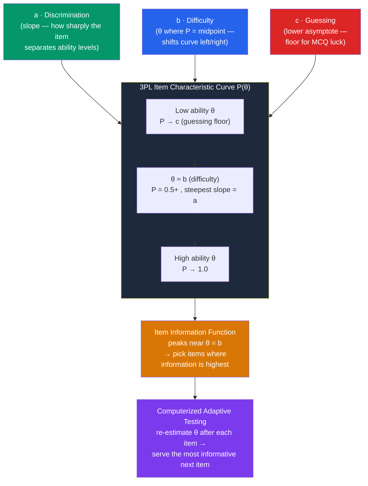

# 📈 Item Response Theory

> [!abstract] TL;DR
> **Item Response Theory (IRT)** models the probability that a person answers an item correctly as a function of a single latent trait (**θ, "theta"**) and the item's own properties. It fixes the central weakness of **Classical Test Theory (CTT)**: in CTT, item statistics and person scores are hopelessly entangled with the particular sample and test form. IRT puts *people and items on the same scale* (**θ**), so item difficulty is sample-independent and ability is test-independent. Each item is described by an **item characteristic curve (ICC)** governed by up to three parameters: **difficulty (b)**, **discrimination (a)**, and **guessing (c)** — giving the **1PL/Rasch, 2PL, and 3PL** models. Because IRT knows how much *information* each item provides at each ability level, it powers **computerized adaptive testing (CAT)** — the GRE, GMAT, and NCLEX pick each next question based on your running estimate, measuring you precisely with far fewer items.

## Intuition — analogy FIRST

Think of measuring strength with a **rack of dumbbells** instead of a single questionnaire.

Under the old (CTT) approach, your "strength score" is just *how many reps you did on whatever weights happened to be in the room*. Bring an easy rack and everyone looks strong; bring a heavy rack and everyone looks weak. Your score is tangled up with the *particular weights* you faced — you can't compare a person tested in one gym to a person tested in another.

IRT re-anchors everything to a shared **weight scale (kilograms = θ)**. Each dumbbell has a fixed weight (its **difficulty, b**) that doesn't change with who lifts it. Now the interesting question flips: for a person of a given strength, *what is the probability they can lift this specific weight?* Someone far stronger than a dumbbell lifts it almost surely; someone far weaker almost never; near their limit it's a coin-flip. Plot that probability against strength and you get an **S-shaped item characteristic curve**. And once every weight is calibrated, a smart trainer stops making you lift everything — they hand you weights near your estimated max, zeroing in on your true strength in a handful of lifts. That is **adaptive testing**.

---

## How It Works — The Item Characteristic Curve

The **ICC** is an S-shaped (logistic) curve: probability of a correct answer rises from a floor (**c**, guessing) to 1.0 as ability (**θ**) increases. Its **location** is set by difficulty **b**, its **steepness** by discrimination **a**. The derived **item information function** tells you where on the θ scale an item measures best — the basis for adaptive item selection.

## Key Concepts / Details

### Classical Test Theory vs IRT

CTT (see [[Reliability_and_Validity]]) served for a century but has structural limits that IRT removes:

| Property | Classical Test Theory (CTT) | Item Response Theory (IRT) |
|---|---|---|
| Unit of analysis | Whole test (sum score) | Individual item |
| Item difficulty | Sample-**dependent** (p-value) | Sample-**independent** (b) |
| Person ability | Test-**dependent** (raw score) | Test-**independent** (θ) |
| Person & item scale | Different scales | **Same scale (θ)** |
| Measurement precision | One reliability for the whole test | **Varies by θ** (information function) |
| Scores | Number correct | Latent trait estimate (θ) |

The headline win is **invariance**: item parameters don't depend on which sample you calibrated them on, and ability estimates don't depend on which items you happened to answer. This is what makes item banks, test equating, and adaptive testing possible.

### The Three Parameters and the 1PL/2PL/3PL Models

IRT models differ by how many item parameters they estimate:

- **Difficulty (b)** — the θ value at which a person has a 50% chance (2PL) of a correct answer. Higher b = harder item; shifts the ICC rightward.
- **Discrimination (a)** — the slope of the ICC at its inflection point. High a = the item sharply separates people just below vs. just above b; low a = a fuzzy, weakly-informative item.
- **Guessing (c)** — the lower asymptote: the probability even very low-ability test-takers get it right by luck (≈ 0.25 for a 4-option MCQ).

| Model | Parameters | Assumes | Typical use |
|---|---|---|---|
| **1PL / Rasch** | b only | all items equally discriminating, no guessing | educational measurement, when you *want* simple invariance (Rasch philosophy) |
| **2PL** | a, b | items vary in discrimination, no guessing | attitude/personality scales, constructed-response items |
| **3PL** | a, b, c | discrimination + guessing floor | multiple-choice ability tests (SAT, GRE) |

(The **4PL** adds an upper asymptote for careless slips, used rarely.) The **Rasch model** is mathematically the 1PL but comes from a different philosophy: Rasch treats the model as a *standard the data must meet* (drop misfitting items) rather than a description to be enriched with more parameters.

### Assumptions of IRT

- **Unidimensionality** — one dominant latent trait underlies responses (multidimensional IRT relaxes this). Overlaps with the factor-analytic notion of a single factor — see [[Factor_Analysis_and_Test_Construction]].
- **Local independence** — after conditioning on θ, responses to different items are independent (no item cues another).
- **Monotonicity** — probability of a correct response increases with θ.

Violations (e.g., items about the same reading passage) bias parameter estimates.

### Information, Precision, and the Test Information Function

Instead of a single reliability, IRT gives an **information function**. Each item's information peaks near its own difficulty **b** and scales with the *square* of its discrimination **a** — highly discriminating items near a person's ability are worth the most. Summing item informations gives the **Test Information Function**; its inverse is the **standard error of θ** *at each ability level*. This is why IRT can measure precisely with few items — you deploy items where they carry the most information for that person.

### Computerized Adaptive Testing (CAT)

CAT operationalizes the information function:

1. Present an item of moderate difficulty; score it.
2. **Re-estimate θ** (e.g., maximum likelihood / Bayesian).
3. Select the item from the calibrated **item bank** that provides **maximum information at the current θ estimate** (subject to content-balancing and exposure-control constraints).
4. Repeat until the standard error of θ drops below a threshold or a length/time limit is hit.

- Right answers → harder next item; wrong answers → easier next item. Everyone converges toward items near their own ability, where measurement is most precise.
- **Result**: equal or better precision than a fixed test using **~50% fewer items**, plus enhanced security (test-takers see different items).
- **Live examples**: the **GRE** (section-adaptive), **GMAT** (question-adaptive), **NCLEX** nursing licensure, and many K-12 assessments (e.g., MAP).

> [!warning] IRT is powerful but demanding
> IRT needs **large calibration samples** (hundreds to thousands per item), reasonable satisfaction of unidimensionality and local independence, and careful model-fit checking. Misfit, multidimensionality, or thin samples produce unstable parameters. CAT additionally requires a large, well-calibrated item bank and exposure controls to prevent item over-use and cheating.

## Real-World Notes

- **High-stakes licensure and admissions**: GRE, GMAT, NCLEX, and many state K-12 tests run on IRT/CAT for efficiency and security.
- **Test equating**: IRT's invariant parameters let different test forms be placed on a common scale, so a "500" means the same thing across years and versions.
- **Patient-reported outcomes**: the NIH's **PROMIS** system uses IRT-calibrated item banks and CAT to measure pain, fatigue, and depression with a handful of adaptive items.
- **Detecting bias**: IRT underpins **Differential Item Functioning (DIF)** analysis — comparing ICCs across groups to flag items that behave differently at equal θ (see [[Bias_and_Fairness_in_Testing]]).

## Common Pitfalls

- **Applying IRT to small samples** — parameter estimates (especially the 3PL guessing parameter) are unstable without large N; CTT may be more robust for a small pilot.
- **Ignoring dimensionality** — fitting a unidimensional model to genuinely multidimensional data produces distorted θ and item parameters.
- **Confusing the b parameter with a CTT p-value's direction** — high **b** means *harder*, whereas a high CTT **p-value** means *easier*; the metrics run opposite ways.
- **Assuming CAT is always shorter for everyone** — extreme-ability test-takers may need more items to hit the precision target, and poor item banks undermine the whole scheme.
- **Treating θ as an absolute quantity** — θ is on an arbitrary interval scale (usually mean 0, SD 1); it is meaningful only relative to the calibration and reported with its standard error.

## Related Concepts

- [[_MOC_Psychometrics]] — Section map of content
- [[Reliability_and_Validity]] — CTT is the framework IRT improves upon; IRT reconceives reliability as information
- [[Factor_Analysis_and_Test_Construction]] — Unidimensionality links IRT to the single-factor model; item analysis in CTT terms
- [[Bias_and_Fairness_in_Testing]] — DIF uses IRT to detect items that function differently across groups
- [[Intelligence_and_IQ_Testing]] — Modern ability tests are increasingly IRT-scored and adaptive
- Cross-vault: [[Logistic_Regression]] — The ICC is a logistic function; IRT and logistic regression share the same S-curve math

## Review Questions

1. Give two concrete limitations of Classical Test Theory that Item Response Theory resolves, and explain what "invariance" of item and person parameters means and why it matters for building an item bank.
2. Describe the three parameters of a 3PL model and what each does to the item characteristic curve. For a four-option multiple-choice item, what value would you expect the guessing parameter c to approach, and why?
3. Walk through how a computerized adaptive test selects each successive item using the item information function. Explain why CAT can achieve the same precision as a fixed-form test with roughly half the items.

## Sources

- Embretson, S.E. & Reise, S.P. (2000). *Item Response Theory for Psychologists*. Lawrence Erlbaum
- Lord, F.M. (1980). *Applications of Item Response Theory to Practical Testing Problems*. Erlbaum
- Hambleton, R.K., Swaminathan, H. & Rogers, H.J. (1991). *Fundamentals of Item Response Theory*. SAGE
- Wainer, H. (ed.) (2000). *Computerized Adaptive Testing: A Primer* (2nd ed.). Erlbaum

#psychology #psychometrics #irt #adaptive-testing #measurement
