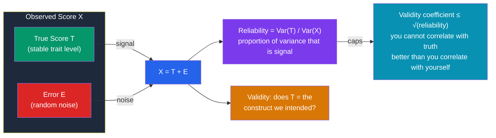

# 🎯 Reliability and Validity

> [!abstract] TL;DR
> **Reliability** is consistency — does the test give the same answer under the same conditions? **Validity** is accuracy — does it measure what it claims to measure? They are related but distinct: a test can be perfectly reliable yet completely invalid (a bathroom scale that always reads 5 kg too high), but it can never be more valid than it is reliable — reliability caps validity. Under the classical **true-score model**, every observed score is a true score plus random measurement error; reliability is the proportion of score variance that is *true* rather than *noise*. Reliability is estimated with test-retest, inter-rater, and internal-consistency methods (Cronbach's alpha, split-half); validity is argued through content, criterion, and construct evidence.

## Intuition — analogy FIRST

Think of a test as a **rifle firing at a target**.

**Reliability** is how tightly the shots cluster. If every shot lands in the same small spot, the rifle is reliable — you can predict where the next shot goes. If shots scatter all over the target, it is unreliable, and no amount of skill will fix the randomness.

**Validity** is whether the cluster is centered on the bullseye. You can have a *tight cluster in the wrong corner* — highly reliable, completely invalid. That is the dangerous case: consistency *feels* like accuracy, so a reliably-wrong test looks trustworthy.

The crucial asymmetry falls straight out of the analogy: **a scattered rifle can never reliably hit the bullseye, so it can never be valid — but a tightly-clustered rifle can easily be aimed at the wrong place.** Reliability is *necessary but not sufficient* for validity. That single sentence is the backbone of psychometrics.

---

## How It Works — The True-Score Model

The diagram shows **Classical Test Theory's** foundational equation: `X = T + E`. The observed score you actually record is the sum of a stable **true score** and **random error**. Reliability is the ratio of true-score variance to total observed variance. Because error is random (uncorrelated with anything real), a test full of noise cannot correlate strongly with any external criterion — hence reliability mathematically *ceilings* validity.

## Key Concepts / Details

### The Classical Test Theory (True-Score) Model

Formalized by **Spearman (1904)** and codified by **Lord & Novick (1968)**, CTT assumes:

- `X = T + E` — observed = true + error
- Error is **random**, has a mean of zero across infinite retakes, and is **uncorrelated** with the true score.
- The **true score** is defined operationally: the average score a person would get over infinitely many independent administrations.

**Reliability coefficient** `ρ_XX = Var(T) / Var(X) = 1 − Var(E)/Var(X)`. It ranges 0–1. The **Standard Error of Measurement (SEM)** = `SD × √(1 − reliability)` translates reliability into a confidence band around an individual's score — the practical output clinicians actually use ("your IQ is 108 ± 5").

### Types of Reliability

Different threats to consistency require different estimation methods:

| Type | Question it answers | How it's measured | Main threat it catches |
|---|---|---|---|
| **Test-retest** | Stable over time? | Correlate scores from two administrations | Temporal instability |
| **Inter-rater** | Consistent across judges? | Cohen's κ, ICC, % agreement | Subjective scorer bias |
| **Internal consistency** | Items measure one thing? | Cronbach's α, ω | Item heterogeneity |
| **Split-half** | Do halves agree? | Correlate two halves, Spearman-Brown correction | Content sampling error |
| **Parallel/alternate forms** | Do two versions agree? | Correlate Form A vs Form B | Item-specific error |

- **Test-retest reliability** correlates the same test given twice. High values require a *stable* trait; it fails for moods, which genuinely change. Threatened by **practice/carryover effects** (memory of the first attempt).
- **Inter-rater reliability** matters whenever humans score responses (essays, clinical interviews, behavioral coding). **Cohen's kappa (κ)** corrects for chance agreement; the **Intraclass Correlation Coefficient (ICC)** handles continuous ratings.
- **Internal consistency** asks whether items hang together. **Cronbach's alpha (α)** (Cronbach, 1951) is the average of all possible split-half correlations, roughly the mean inter-item correlation scaled by test length. Conventionally α ≥ 0.70 is acceptable, ≥ 0.80 good, ≥ 0.90 required for high-stakes individual decisions.
- **Split-half** splits items into two halves and correlates them; because halving a test lowers reliability, the **Spearman-Brown prophecy formula** projects the full-length value back up.

> [!warning] Cronbach's alpha is widely misread
> α is **not** a measure of unidimensionality — a two-factor test can have high α. It is also inflated by test length: adding mediocre items raises α. High α means items are *interrelated*, not that they measure *one* construct. McDonald's **omega (ω)** is now preferred by methodologists (Sijtsma, 2009) because it rests on a factor model rather than α's restrictive tau-equivalence assumption.

### Types of Validity

Modern theory (Messick, 1995; the *Standards for Educational and Psychological Testing*) treats validity as a **unified argument** about whether score interpretations are justified, gathering several kinds of evidence:

- **Content validity** — do the items sample the full domain? Judged by subject-matter experts. A statistics exam that only tests probability lacks content validity for "statistics knowledge." **Face validity** (does it *look* relevant to test-takers?) is a weak, non-technical cousin.
- **Criterion validity** — does the test correlate with an external outcome (the criterion)?
  - **Predictive validity**: correlation with a *future* outcome (SAT predicting college GPA; a hiring test predicting job performance).
  - **Concurrent validity**: correlation with a *present* outcome measured at the same time (a new depression scale vs. a clinician's diagnosis today).
- **Construct validity** — the master concept. Does the test measure the theoretical construct (intelligence, extraversion, anxiety)? Evidenced by:
  - **Convergent validity**: correlates with other measures of the *same* construct.
  - **Discriminant validity**: does *not* correlate with measures of *different* constructs. **Campbell & Fiske's (1959) multitrait-multimethod matrix** formalized this pairing.
  - **Factorial validity**: the internal factor structure matches theory (see [[Factor_Analysis_and_Test_Construction]]).

### The Reliability–Validity Relationship

The single most tested idea in this area:

- **Reliability is necessary but not sufficient for validity.** A reliable test *can* be invalid; an unreliable test *cannot* be valid.
- **Reliability sets a ceiling on validity.** The correlation between a test and any true criterion cannot exceed `√(reliability)`. If a test's reliability is 0.64, its validity coefficient cannot exceed 0.80.
- **Attenuation**: unreliability in *either* the test or the criterion shrinks (attenuates) the observed validity correlation. The **correction for attenuation** estimates what the correlation would be with perfect measurement.

## Real-World Notes

- **Clinical psychology**: a diagnostic instrument with poor inter-rater reliability produces inconsistent diagnoses — a major criticism of early DSM editions and a driver of structured interviews (SCID).
- **Hiring and selection**: predictive validity is the dollar-value question — Schmidt & Hunter's (1998) meta-analyses showed structured interviews and cognitive ability tests are among the most predictive of job performance, whereas unstructured interviews and graphology are near-worthless despite high face validity.
- **Education**: high-stakes exams demand reliability ≥ 0.90 because decisions affect individuals; the SEM defines the "score band" within which two students are statistically indistinguishable.
- **Survey research**: a scale reported with a Cronbach's α is now standard practice, though methodologists increasingly ask for ω and evidence of dimensionality instead.

## Common Pitfalls

- **Confusing the two** — "the test is reliable, so it's a good test." Reliability alone guarantees only consistency, not that you are measuring the right thing.
- **Treating high α as proof of unidimensionality** — it isn't; it's inflated by test length and can be high for multidimensional scales.
- **Ignoring the criterion's reliability** — if your job-performance rating is noisy, a genuinely valid predictor will look weak. Validity failures are sometimes criterion failures.
- **Chasing face validity** — a test that *looks* relevant can be useless (unstructured interviews); a test that looks irrelevant can be powerfully predictive (integrity tests, cognitive ability).
- **Assuming validity transfers** — a test valid for predicting sales performance is not automatically valid for predicting managerial success. Validity is claim-, population-, and use-specific.

## Related Concepts

- [[_MOC_Psychometrics]] — Section map of content
- [[Factor_Analysis_and_Test_Construction]] — Factorial validity and how internal structure is established
- [[Item_Response_Theory]] — Reconceives reliability as *information*, varying across the trait scale
- [[Intelligence_and_IQ_Testing]] — IQ tests are the classic case study in reliability and validity
- [[Bias_and_Fairness_in_Testing]] — Predictive bias is a *validity* question across groups
- [[Personality_Assessment]] — Personality inventories live or die on construct and discriminant validity
- Cross-vault: [[_MOC_Econometrics_Master]] — Measurement error and attenuation appear identically in errors-in-variables regression

## Review Questions

1. A vocabulary test correlates 0.95 with itself on retest but only 0.10 with any measure of vocabulary knowledge. State the test's reliability and validity qualitatively, and explain using the true-score model why this pattern is possible.
2. Explain precisely why reliability sets a *ceiling* on validity. Given a test with reliability 0.49, what is the maximum possible correlation it can have with any external criterion, and why?
3. A researcher reports Cronbach's α = 0.92 for a 40-item scale and concludes the scale is unidimensional. Give two reasons this conclusion is unjustified, and name a better statistic to report.

## Sources

- Lord, F.M. & Novick, M.R. (1968). *Statistical Theories of Mental Test Scores*. Addison-Wesley
- Cronbach, L.J. (1951). "Coefficient alpha and the internal structure of tests." *Psychometrika*, 16(3), 297–334
- Messick, S. (1995). "Validity of psychological assessment." *American Psychologist*, 50(9), 741–749
- Campbell, D.T. & Fiske, D.W. (1959). "Convergent and discriminant validation by the multitrait-multimethod matrix." *Psychological Bulletin*, 56(2), 81–105

#psychology #psychometrics #reliability #validity #measurement
