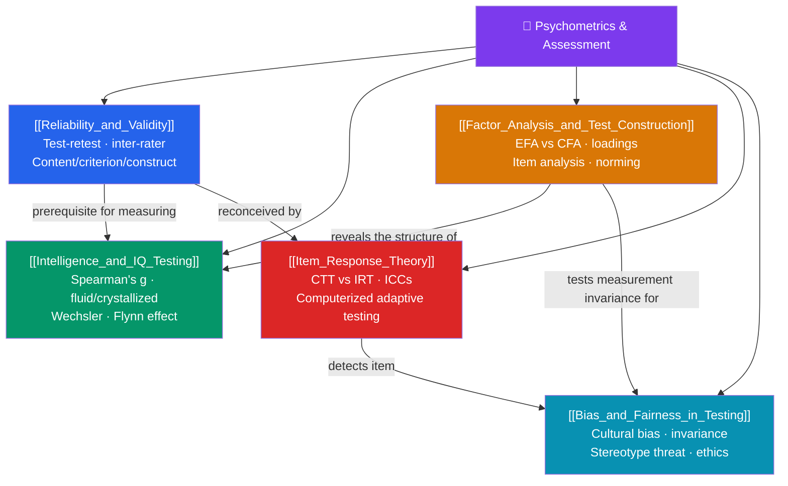

# 📏 Psychometrics & Assessment — Map of Content

> [!abstract] What This Section Covers
> Psychometrics is the science of measuring the unmeasurable — intelligence, personality, aptitude — with numbers you can defend. This section starts with the twin pillars every test must satisfy, **reliability and validity**, then applies them to psychology's most contested measurement problem, **intelligence and IQ testing**. It covers the statistical machinery of building tests — **factor analysis and test construction** — and the modern paradigm of **item response theory** that powers adaptive testing. It ends with the ethical crux of the field: **bias and fairness**, and whether a test measures the same thing across groups. Together these five notes turn measurement from art into science.

## Concept Map

## Learning Path

1. [[Reliability_and_Validity]] — Test-retest, inter-rater, and internal-consistency reliability; content, criterion, and construct validity; and measurement error.
2. [[Intelligence_and_IQ_Testing]] — Spearman's g, Cattell's fluid/crystallized distinction, Gardner and Sternberg, the Wechsler scales, and the Flynn effect.
3. [[Factor_Analysis_and_Test_Construction]] — Exploratory vs. confirmatory factor analysis, factor loadings, item analysis, and standardization/norming.
4. [[Item_Response_Theory]] — Classical test theory vs. IRT, item characteristic curves, and computerized adaptive testing.
5. [[Bias_and_Fairness_in_Testing]] — Cultural bias, measurement invariance, stereotype threat, and the ethics of high-stakes assessment.

## All Notes at a Glance

| Note | Difficulty | What You'll Learn |
|------|------------|-------------------|
| [[Reliability_and_Validity]] | Beginner → Intermediate | Reliability types, Cronbach's alpha, validity types, the reliability–validity relationship, measurement error |
| [[Intelligence_and_IQ_Testing]] | Intermediate | g and group factors, fluid/crystallized, multiple/triarchic theories, Wechsler & Stanford-Binet, the Flynn effect |
| [[Factor_Analysis_and_Test_Construction]] | Intermediate → Advanced | EFA vs. CFA, eigenvalues, loadings, rotation, item difficulty/discrimination, standardization and norms |
| [[Item_Response_Theory]] | Advanced | CTT limits, latent trait θ, 1PL/2PL/3PL models, item characteristic curves, information functions, CAT |
| [[Bias_and_Fairness_in_Testing]] | Intermediate → Advanced | Test bias vs. unfairness, differential item functioning, measurement invariance, stereotype threat, ethics |

## Key Questions This Section Answers

- Can a test be reliable but not valid — and why is the reverse impossible?
- Is intelligence one general ability or many distinct ones?
- How do factor analysis and item statistics turn a pile of questions into a valid scale?
- Why can item response theory shorten a test without losing precision?
- How do you tell whether a test is genuinely biased against a group or just measuring a real difference?

## Related Sections

- [[_MOC_Psychology_Master|↑ Psychology Master MOC]]
- [[_MOC_Evolutionary_Psychology|← Evolutionary Psychology]]
- [[_MOC_Cross_Cultural_Psychology|→ Cross-Cultural Psychology]]
- Cross-vault: [[_MOC_Econometrics_Master]] — measurement error, latent variables, and factor models share deep statistical roots

#MOC #Psychology #Psychometrics
