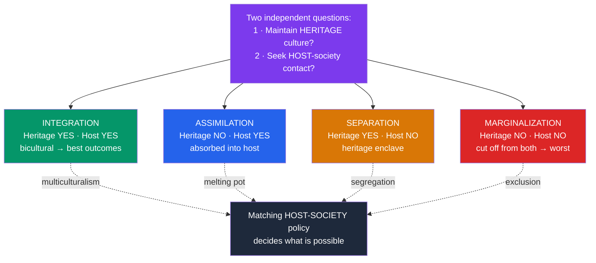

# 🌐 Acculturation and Identity

> [!abstract] TL;DR
> **John Berry's** acculturation model asks how individuals and groups navigate contact between cultures using two questions: *Do I value maintaining my heritage culture?* and *Do I value contact with the larger/host society?* Crossing these yields four strategies — **integration, assimilation, separation, and marginalization**. Integration (biculturalism) is generally linked to the best psychological and sociocultural outcomes, marginalization to the worst — but only when the receiving society actually permits integration. The model also frames **acculturative stress**, and connects to research on **bicultural identity integration** and **cultural frame-switching**. Acculturation is bidirectional and shaped as much by the host society's openness as by the individual's choices.

## Intuition — analogy FIRST

Think of arriving in a new culture like becoming bilingual, but for *ways of living* rather than words.

You don't have to erase your first language to learn a second — most fluent bilinguals keep both and switch depending on who they're talking to. Some people, though, do let the first language fade (assimilation); others refuse the second and stay only in their first community (separation); and some, tragically, end up cut off from *both* — no longer fluent at home, never made welcome in the new place (marginalization).

Berry's insight is that "how immigrants adapt" isn't a single sliding scale from "old culture" to "new culture." It's *two* independent dials — how much you keep and how much you take on — and the best outcomes usually come from turning *both* up: full command of both repertoires, switching between them as the situation calls. But whether that bilingual life is even possible depends heavily on whether the new society lets you speak your first language at all.

---

## How It Works — Berry's Two-Dimensional Model

## Key Concepts / Details

### The Fourfold Model

**John W. Berry** (1980, 1997) defined acculturation strategies at the *individual* level by crossing two independent orientations. Note these are strategies people (and policies) adopt, not fixed personality types.

| Strategy | Maintain heritage culture? | Seek host-culture contact? | Sketch |
|---|---|---|---|
| **Integration** | Yes | Yes | Bicultural: participates in the larger society while retaining heritage identity |
| **Assimilation** | No | Yes | Absorbs into host culture, lets heritage identity fade |
| **Separation** | Yes | No | Holds to heritage culture, withdraws from the larger society |
| **Marginalization** | No | No | Loses connection to both; often reflects exclusion, not free choice |

**Empirical pattern**: across many studies and Berry's own large **ICSEY project** (International Comparative Study of Ethnocultural Youth, 2006), **integration** is most consistently associated with better psychological wellbeing and sociocultural adaptation, and **marginalization** with the worst. Assimilation and separation fall in between.

### It Takes Two: The Role of the Receiving Society

A vital refinement: an individual cannot simply *choose* integration if the host society is hostile.

- **Berry** paired the four individual strategies with corresponding **societal / policy strategies**: **multiculturalism** (supports integration), **melting pot** (pushes assimilation), **segregation** (imposes separation), and **exclusion** (produces marginalization).
- **Bourhis et al.'s (1997) Interactive Acculturation Model (IAM)** formalized how *immigrant* orientations and *host-community* orientations combine to produce **consensual, problematic, or conflictual** relations. Discrimination is a key driver of poor outcomes, independent of individual strategy.

> [!note] Marginalization is usually not a "choice"
> Critics (e.g. **Rudmin, 2003**) note that almost no one *wants* to belong to neither culture. Marginalization typically reflects **rejection and exclusion** by the host society plus disruption of the heritage community — reading it as an individual preference blames the person for a structural failure.

### Acculturative Stress

Berry reframed the older, deficit-laden notion of "culture shock" as **acculturative stress**: the stress response arising from acculturation demands (language barriers, discrimination, identity conflict, loss of social support) when they exceed coping resources.

- Severity depends on moderators: the acculturation **strategy** (integration buffers stress; marginalization amplifies it), **cultural distance** between heritage and host (see dimension "distance" in [[Hofstede_Cultural_Dimensions]]), the **voluntariness** of the move (refugees vs voluntary migrants), age, social support, and perceived **discrimination**.
- Outcomes range from growth and resilience to anxiety, depression, and somatic complaints — it is a *risk factor*, not a destiny.

### Bicultural Identity: Beyond a Single Dimension

Modern work treats heritage and mainstream identities as **two independent dimensions** rather than a single old-to-new continuum.

- **Bicultural Identity Integration (BII)** — **Benet-Martínez and Haritatos (2005)** — measures how much a person perceives their two cultural identities as **compatible/blended vs conflicting/distant**. High-BII individuals experience the cultures as harmonious; low-BII individuals feel torn between them.
- **Cultural frame-switching** — **Hong, Morris, Chiu, and Benet-Martínez (2000)** — showed that bicultural individuals shift cultural cognition when **primed** with cultural icons (e.g. an American flag vs a Chinese dragon), for instance making more dispositional vs situational attributions accordingly. This links directly to the frame-switching bilinguals in [[Culture_and_Cognition]].
- **LaFromboise, Coleman, and Gerton (1993)** distinguished models of second-culture acquisition (assimilation, acculturation, alternation, multicultural, fusion), arguing that an **alternation model** — competently switching between cultures without ranking them — best supports wellbeing.

> [!warning] Heritage vs mainstream are not a see-saw
> Gaining the host culture does *not* require losing the heritage culture. The single-dimension "how American are you now?" framing is exactly what the two-dimensional models were built to replace. Biculturalism is additive, not subtractive.

## Real-World Notes

- **Immigration and refugee policy**: whether a society offers multiculturalism vs demands assimilation materially changes newcomers' mental-health trajectories; integration outcomes require host-side openness, not just newcomer effort.
- **Second-generation youth**: children of immigrants often manage a heritage culture at home and a mainstream culture at school; strong bicultural identity integration predicts better adjustment than feeling forced to choose.
- **Clinical practice**: assessing a client's acculturation strategy, experienced discrimination, and BII helps distinguish acculturative stress from other disorders and avoids pathologizing normal adaptation.
- **Workplaces and universities**: "culture fit" language can implicitly demand assimilation; genuinely inclusive institutions enable integration by valuing heritage identities rather than asking people to shed them.

## Common Pitfalls

- **Reading marginalization as a personal choice** — it usually reflects exclusion and lost heritage community, i.e. a structural and relational failure, not a preference.
- **Treating acculturation as one-way and one-dimensional** — it is **bidirectional** (host cultures change too) and **two-dimensional** (heritage and mainstream vary independently).
- **Assuming assimilation is the goal or endpoint** — this is a values-laden, host-centric assumption; integration generally outperforms assimilation on wellbeing.
- **Ignoring the host society** — an individual's strategy interacts with policy and discrimination; you cannot predict outcomes from the newcomer's attitude alone.
- **Overgeneralizing across migration types** — voluntary immigrants, refugees, sojourners, and indigenous peoples face very different acculturation conditions; one label hides them.

## Related Concepts

- [[_MOC_Cross_Cultural_Psychology|↑ Section MOC]]
- [[Culture_and_the_Self]] — Bicultural people negotiate more than one self-construal at once
- [[Culture_and_Cognition]] — Cultural frame-switching applies holistic vs analytic cognition situationally
- [[Hofstede_Cultural_Dimensions]] — "Cultural distance" between heritage and host predicts acculturative stress
- [[The_WEIRD_Problem]] — Studying migrants pushes psychology beyond monocultural WEIRD samples
- Cross-vault: [[Stress_and_Coping|Stress and Coping]] — Acculturative stress as an application of the stress-appraisal framework
- Cross-vault: [[Prejudice_and_Discrimination]] — Discrimination as a primary driver of poor acculturation outcomes

## Review Questions

1. Berry's model is built from two questions rather than one. State the two questions, name the four strategies they generate, and explain why using a single "old culture ↔ new culture" scale would obscure the model's central insight.
2. Explain why it is misleading to describe marginalization as an individual's chosen strategy. What does the Interactive Acculturation Model add to Berry's original account?
3. Define Bicultural Identity Integration (BII) and describe the cultural frame-switching paradigm (Hong et al., 2000). How do these together show that biculturalism can be additive rather than a zero-sum trade-off?

## Sources

- Berry, J.W. (1997). "Immigration, acculturation, and adaptation." *Applied Psychology: An International Review*, 46(1), 5–34
- Berry, J.W., Phinney, J.S., Sam, D.L. & Vedder, P. (2006). *Immigrant Youth in Cultural Transition* (the ICSEY study). Lawrence Erlbaum
- Benet-Martínez, V. & Haritatos, J. (2005). "Bicultural identity integration (BII): Components and psychosocial antecedents." *Journal of Personality*, 73(4), 1015–1050
- Hong, Y., Morris, M.W., Chiu, C. & Benet-Martínez, V. (2000). "Multicultural minds: A dynamic constructivist approach to culture and cognition." *American Psychologist*, 55(7), 709–720

#psychology #cross-cultural-psychology #acculturation #bicultural-identity #acculturative-stress
