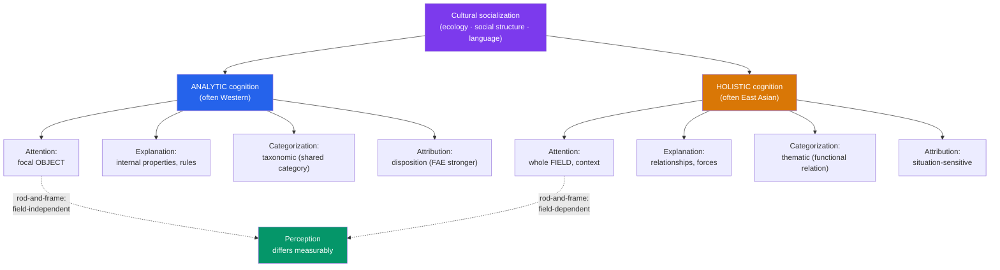

# 🧠 Culture and Cognition

> [!abstract] TL;DR
> **Richard Nisbett** and colleagues argued that culture shapes not just *what* people think but *how* they think. Many **East Asian** contexts foster **holistic cognition** — attention to the whole field, relationships, and context — while many **Western** contexts foster **analytic cognition** — attention to focal objects, categories, and rules. This shows up in perception (field dependence, change blindness, the rod-and-frame task), in **categorization** (relationships vs taxonomic rules), and in **attribution** (situational vs dispositional). These are differences in cognitive *style*, driven by socialization and even language, not in cognitive *ability* — and, like all cultural findings, they are population tendencies, not individual destinies.

## Intuition — analogy FIRST

Imagine two photographers sent to shoot the same scene: a fish swimming near some rocks and plants.

The **analytic photographer** frames a tight portrait of the fish — sharp, centered, background blurred. Asked later what they saw, they describe the fish: its size, colour, that it was the fast one. The **holistic photographer** shoots wide — the fish *in its pond*, the light, the reeds, the other fish it swims beside. Asked later, they describe the scene and the relationships: the water was murky, the big fish was chasing the small ones.

Neither photographer has better eyes. They've learned to *attend* differently — one foregrounds the object, the other the field. **Masuda and Nisbett's (2001)** actual underwater-scene experiment found exactly this: American participants led with the focal fish; Japanese participants made 60% more statements about background and relationships, and their memory for the focal fish suffered when it was later shown against a *new* background.

---

## How It Works — Two Cognitive Styles

## Key Concepts / Details

### Nisbett's Holistic vs Analytic Framework

In *The Geography of Thought* (2003), **Richard Nisbett** synthesized a program of research (with **Kaiping Peng, Incheol Choi, Takahiko Masuda**, and others) proposing two broad **systems of thought**:

- **Analytic cognition**: detaching the focal object from its context, assigning it to categories, and using formal logic and rules to explain and predict. Historically traced (speculatively) to ancient Greek emphasis on individual agency and debate.
- **Holistic cognition**: attending to the entire field, emphasizing relationships and change, tolerating contradiction, and reasoning dialectically. Historically linked (speculatively) to Confucian, Taoist, and Buddhist traditions emphasizing harmony and interdependence.

Nisbett tied these styles back to **self-construal** (see [[Culture_and_the_Self]]): an interdependent self, embedded in relationships, plausibly cultivates attention to relationships in the world at large.

### Perception: The Field Really Looks Different

| Task | What it measures | Typical cross-cultural finding |
|---|---|---|
| **Rod-and-frame test** (Witkin) | Judging vertical of a rod inside a tilted frame — field dependence | East Asian participants more influenced by the surrounding frame (field-dependent); Western more field-independent |
| **Framed-line task** (Kitayama et al., 2003) | Reproducing a line's *absolute* vs *relative* length | Americans better at absolute (ignore frame); Japanese better at relative (use frame) |
| **Change blindness / eye tracking** (Masuda & Nisbett) | What changes are noticed; where eyes fixate | East Asian viewers detect background/relational changes and saccade to context sooner; Westerners fixate focal objects |
| **Underwater vignette** (Masuda & Nisbett, 2001) | Free recall of an animated scene | Japanese report far more context and relationships; object memory is context-bound |

The crucial point: these are not opinion differences reported on a survey. They appear in reaction times, eye-movements, and memory errors — perception itself is tuned by culture. This is the same lesson as the Müller-Lyer findings in [[The_WEIRD_Problem]].

### Categorization and Language

**Ji, Zhang, and Nisbett (2004)** used the classic **triad task**: given *panda, monkey, banana*, which two go together?
- **Analytic/taxonomic** grouping: *panda + monkey* (both animals — a shared category).
- **Holistic/thematic** grouping: *monkey + banana* (a functional/relational tie — the monkey eats the banana).
Chinese participants favored thematic (relational) groupings; American participants favored taxonomic (categorical) ones. Bilingual participants shifted depending on the **language of testing** — a demonstration of **linguistic relativity** in action, and of cultural frame-switching (see [[Acculturation_and_Identity]]).

> [!note] Weak, not strong, linguistic relativity
> The evidence supports a *weak* Whorfian view: language and cultural practice *nudge* habitual attention and categorization. It does not support the discredited *strong* claim that language rigidly determines what thoughts are possible.

### Attribution: The FAE Is Not Universal

The **fundamental attribution error** — overweighting disposition, underweighting situation — is a signature of analytic cognition.
- **Miller (1984)**: American explanations grew more dispositional with age; Indian explanations grew more situational — the divergence is *developmental*, i.e. learned.
- **Morris and Peng (1994)**: American vs Chinese newspaper accounts of the same crimes differed in exactly this way (dispositional vs situational).
- **Choi, Nisbett, and Norenzayan (1999)** reviewed evidence that East Asian reasoners are more sensitive to situational information and more prone to **hindsight bias** (the world "made sense all along"), consistent with holistic attention to context.

### Dialectical Reasoning and Contradiction

**Peng and Nisbett (1999)** found that Chinese participants, faced with two contradictory propositions, tended toward a **dialectical** "middle way" that accepted partial truth in both, whereas American participants more often chose one and rejected the other (**differentiation**). Neither is "more logical" universally — they reflect different epistemic norms about contradiction and change.

## Real-World Notes

- **Design and data display**: high-context, relational presentation may suit holistic-leaning audiences; sparse, object-focused layouts may suit analytic-leaning ones — echoing UX notes in [[Hofstede_Cultural_Dimensions]].
- **Eyewitness and testimony**: cultural differences in what is attended to and encoded (focal actor vs surrounding scene) can affect what witnesses spontaneously report.
- **Education**: physics and formal logic curricula assume analytic decontextualization; word problems and rote rules can advantage or disadvantage different cognitive habits. Teaching can *build* the less-practiced style — these are trainable.
- **Cross-cultural teams**: a "vague, meandering" report to one colleague may be a *properly contextualized* report to another; a "blunt, context-free" ask may read as clarity to one and rudeness to another.

## Common Pitfalls

- **Turning style into ability** — holistic thinkers are not "worse at logic," analytic thinkers not "blind to context." Both styles are trainable and both groups can deploy either when cued.
- **Essentializing "the Eastern mind"** — these are averaged, primeable tendencies with huge overlap between populations; there is no monolithic Asian or Western cognition, and within-region variation is large.
- **Over-reading the historical origin stories** — the Greek/Confucian genealogies Nisbett offers are evocative hypotheses, not established causal history; the *contemporary* experimental effects are the solid part.
- **Forgetting priming** — self-construal and cognitive style can be temporarily shifted in the lab by priming independence vs interdependence, so "culture" here is a dynamic repertoire, not a hardwired constant.

## Related Concepts

- [[_MOC_Cross_Cultural_Psychology|↑ Section MOC]]
- [[Culture_and_the_Self]] — Interdependent self-construal plausibly drives holistic attention to relationships
- [[The_WEIRD_Problem]] — Perceptual differences (Müller-Lyer) show cognition is not culturally uniform
- [[Hofstede_Cultural_Dimensions]] — Cognitive style co-varies with individualism–collectivism scores
- [[Acculturation_and_Identity]] — Bilinguals frame-switch cognitive style with language and context
- Cross-vault: [[Cognitive_Biases]] — The FAE, hindsight bias, and their culturally variable strength
- Cross-vault: [[_MOC_Philosophy_Master|Philosophy]] — Logic, dialectics, and epistemic norms about contradiction

## Review Questions

1. Describe Masuda and Nisbett's (2001) underwater-scene study. How do its recall *and* recognition results together show that culture shapes attention rather than just verbal reporting style?
2. Using the panda–monkey–banana triad task, explain the difference between taxonomic and thematic categorization, and describe what bilingual participants' behavior adds to the interpretation.
3. Why does the cross-cultural variation in the fundamental attribution error support the claim that it is a feature of a *learned cognitive style* rather than a hardwired human universal? Cite at least one study.

## Sources

- Nisbett, R.E. (2003). *The Geography of Thought: How Asians and Westerners Think Differently... and Why*. Free Press
- Masuda, T. & Nisbett, R.E. (2001). "Attending holistically versus analytically." *Journal of Personality and Social Psychology*, 81(5), 922–934
- Nisbett, R.E., Peng, K., Choi, I. & Norenzayan, A. (2001). "Culture and systems of thought: Holistic versus analytic cognition." *Psychological Review*, 108(2), 291–310
- Ji, L., Zhang, Z. & Nisbett, R.E. (2004). "Is it culture or is it language? Examination of language effects in cross-cultural research on categorization." *Journal of Personality and Social Psychology*, 87(1), 57–65

#psychology #cross-cultural-psychology #cognition #holistic-analytic #perception
