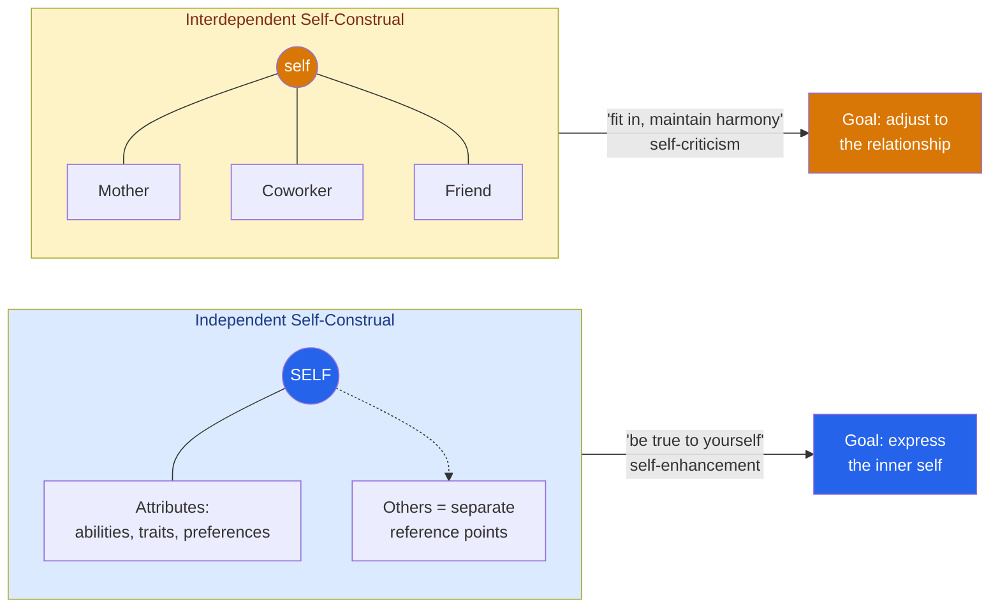

# 🪞 Culture and the Self

> [!abstract] TL;DR
> The "self" is not a cultural universal but a construction that varies across societies. Markus and Kitayama (1991) distinguished an **independent self-construal** — the self as a bounded, autonomous entity defined by internal attributes — from an **interdependent self-construal** — the self as fundamentally connected to others and defined by relationships and roles. This maps onto the broader **individualism–collectivism** dimension and reshapes how people motivate themselves, feel emotions, and explain behavior. It is not that one culture "has a self" and another does not; both are complete selves organized around different premises. Crucially, these are population-level tendencies, not fixed traits of every individual within a culture.

## Intuition — analogy FIRST

Think of the self like a word in a sentence.

In some languages the meaning of a word is carried mostly by the word itself; you can lift it out and it still means roughly the same thing. In others, meaning depends heavily on particles, context, and position — the same word shifts depending on the relationships around it. Neither language is "more complete"; they just locate meaning differently.

The **independent self** is like a word that carries its meaning internally: "I am creative, ambitious, honest" — stable attributes that travel with you into any room. The **interdependent self** is like a word whose meaning lives in its grammatical relations: "I am my mother's daughter, my team's newest member, my teacher's student" — the self is fully real, but its content is relational and context-sensitive. Ask someone with a strongly independent construal to "describe yourself" and you get traits; ask someone with a strongly interdependent construal and you more often get roles, memberships, and situations.

---

## How It Works — Two Models of the Self

## Key Concepts / Details

### The Markus & Kitayama Framework

**Hazel Markus and Shinobu Kitayama (1991)**, in their landmark *Psychological Review* paper, proposed that cultures differ in the **construal of the self, others, and the interdependence of the two**. This construal is not a superficial preference but a schema that organizes cognition, emotion, and motivation.

- **Independent self-construal**: the person is a bounded, unitary, stable entity whose behavior is organized by reference to *internal* attributes (traits, abilities, values). Culturally emphasized in many Western, especially North American, middle-class contexts.
- **Interdependent self-construal**: the person is connected, fluid, and context-dependent; behavior is organized by reference to the *thoughts, feelings, and actions of others* in the relationship. Culturally emphasized in many East Asian, South Asian, African, and Latin American contexts.

> [!note] Both selves are agentic
> The interdependent self is not "passive" or "without agency." It exercises agency *toward fitting in and maintaining valued relationships*, which requires enormous self-regulation. Reframing this as a deficit is a classic Western-centric error.

### Individualism vs Collectivism

The self-construal distinction operates within the broader cultural syndrome of **individualism vs collectivism**, developed extensively by **Harry Triandis**. Triandis added the orthogonal **horizontal–vertical** dimension (equality vs hierarchy), yielding four types.

| Type | Emphasis | Example self-statement |
|---|---|---|
| **Horizontal individualism** | Unique but equal | "I do my own thing" (e.g. Sweden, Australia) |
| **Vertical individualism** | Unique and competitive | "I want to be the best" (e.g. USA, UK) |
| **Horizontal collectivism** | Merged but equal | "The welfare of my group matters, we are the same" (e.g. Israeli kibbutz) |
| **Vertical collectivism** | Merged and hierarchical | "I sacrifice for my group and respect authority" (e.g. much of East Asia, India) |

Collectivism is best understood not as "no individuals" but as **prioritizing in-group goals** and defining the self through in-group membership. This distinction dissolves the caricature that collectivist societies are made of interchangeable people.

### Consequences for Motivation, Emotion, and Cognition

- **Motivation**: Independent selves are motivated by **self-enhancement** and consistency (protecting positive self-views); interdependent selves show more **self-criticism / self-improvement** motivation, focusing on shortcomings to better meet relational expectations (Heine et al., 1999). Choice motivates independent selves more when *self*-chosen; interdependent selves are often equally or more motivated when a trusted in-group member chose for them (Iyengar & Lepper, 1999).
- **Emotion**: Cultures differ in **ego-focused emotions** (pride, anger — affirming the independent self) vs **other-focused emotions** (sympathy, shame, feelings of connection). Ideal affect also differs (Tsai's work): high-arousal positive states (excitement) are more valued in many US contexts, low-arousal positive states (calm) in many East Asian contexts.
- **Cognition and attribution**: The **fundamental attribution error** — overweighting disposition and underweighting situation — is weaker and sometimes reversed in more interdependent contexts, which attend more to context and relationships (see [[Culture_and_Cognition]]).

### Cultural Variation in the Fundamental Attribution Error

**Morris and Peng (1994)** analyzed English- and Chinese-language newspaper coverage of the same murders. English-language accounts emphasized the *perpetrator's disposition* ("he had a bad temper"); Chinese-language accounts emphasized *situational and relational factors* ("he was recently isolated, had lost his job"). **Miller (1984)** found that Indian participants gave more situational explanations for behavior than Americans, and that this divergence *grew with age* — evidence the difference is culturally acquired, not innate.

> [!warning] Population tendencies, not stereotypes
> Every finding here describes a *shift in a distribution*, not a rule about individuals. There are highly interdependent Americans and highly independent Japanese. Treating a person as a walking average of their nationality is exactly the essentializing error cross-cultural psychology warns against.

## Real-World Notes

- **Management and teams**: Recognition practices that publicly single out one "star" performer can embarrass someone with an interdependent construal, who may experience it as separation from the team rather than reward.
- **Clinical psychology**: Therapeutic goals framed around "autonomy" and "individuation" can misfire when a client's wellbeing is grounded in fulfilling family roles; culturally responsive therapy adapts the model of healthy selfhood.
- **Marketing and messaging**: Advertising in more individualist markets stresses uniqueness and personal benefit; in more collectivist markets, family, belonging, and social approval. Han and Shavitt (1994) documented exactly this in US vs Korean magazine ads.
- **Education**: "Express your own opinion" classroom norms can advantage students socialized toward independent self-expression and disadvantage those socialized toward listening and harmony — a fairness issue, not an ability difference.

## Common Pitfalls

- **Equating interdependence with lack of self or agency** — the interdependent self is a full, active self; it simply locates agency in relationships and role fulfillment.
- **Treating culture as a fixed national trait** — self-construal is *primeable*: reminding anyone of their relationships (vs their traits) temporarily shifts construal (Trafimow, Triandis & Goto, 1991). Culture is a repertoire, not a cage.
- **Assuming West = individualist, East = collectivist, full stop** — there is huge within-nation variation by class, region, urbanization, and generation. Much US data comes specifically from middle-class contexts (see [[The_WEIRD_Problem]]).
- **Reading the dimension as a value judgment** — neither construal is more mature, healthy, or evolved. Framing one as the endpoint of development is ethnocentrism dressed as science.

## Related Concepts

- [[_MOC_Cross_Cultural_Psychology|↑ Section MOC]]
- [[The_WEIRD_Problem]] — Why most self-concept research samples an unusual, highly independent population
- [[Culture_and_Cognition]] — How self-construal extends into perception, attribution, and reasoning style
- [[Hofstede_Cultural_Dimensions]] — Individualism–collectivism as one of Hofstede's quantified national dimensions
- [[Acculturation_and_Identity]] — What happens to self-construal when a person lives across two cultures
- Cross-vault: [[Cognitive_Biases]] — The fundamental attribution error and self-serving bias, whose strength varies by culture
- Cross-vault: [[_MOC_Philosophy_Master|Philosophy]] — Philosophical debates over personal identity and the relational self

## Review Questions

1. A manager raised in a strongly independent culture praises one team member by name in front of the whole department and is surprised when that member seems uncomfortable. Using self-construal theory, explain what may have gone wrong and how the recognition could be reframed.
2. Explain how Morris and Peng's (1994) newspaper study and Miller's (1984) developmental findings *together* provide stronger evidence that attribution style is culturally learned than either study would alone.
3. Why is it a mistake to describe collectivist cultures as having "less individual identity"? Use Triandis's horizontal/vertical distinction to give a more accurate characterization.

## Sources

- Markus, H.R. & Kitayama, S. (1991). "Culture and the self: Implications for cognition, emotion, and motivation." *Psychological Review*, 98(2), 224–253
- Triandis, H.C. (1995). *Individualism and Collectivism*. Westview Press
- Morris, M.W. & Peng, K. (1994). "Culture and cause: American and Chinese attributions for social and physical events." *Journal of Personality and Social Psychology*, 67(6), 949–971
- Heine, S.J., Lehman, D.R., Markus, H.R. & Kitayama, S. (1999). "Is there a universal need for positive self-regard?" *Psychological Review*, 106(4), 766–794

#psychology #cross-cultural-psychology #self-construal #individualism-collectivism #attribution
